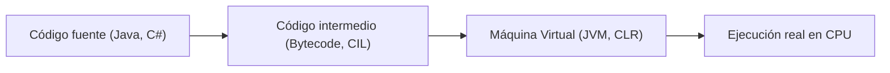

# 💻 2. Código fuente, objeto y ejecutable

---

## 2.1 Del código fuente al binario: fases del *toolchain*

!!! info "Idea básica"
    Los ordenadores solo entienden **código binario (0 y 1)**.  
    Por eso, un programa escrito en **lenguaje de alto nivel** (C, Java, Python…) necesita pasar por un **proceso de traducción** llamado *toolchain*.

---

## 2.2 Compilación, ensamblado y enlazado

- **Compilación**: traduce el código fuente a **código objeto** (más cercano al binario).  
- **Ensamblado**: convierte instrucciones en **código máquina** definitivo.  
- **Enlazado (link)**: une varios módulos y librerías en un único ejecutable.

!!! note "Enlazado estático vs dinámico"
    - **Estático**: el ejecutable incluye **todo dentro** (más pesado, independiente).  
    - **Dinámico**: el ejecutable llama a librerías externas (`.dll`, `.so`) en tiempo de ejecución (más ligero, depende de ellas).  

---

## 2.3 Código objeto y formatos comunes

- **Qué es:** el resultado de la compilación, aún **no ejecutable** por sí mismo.  
- **Extensiones habituales:** `.o` (Linux/Unix), `.obj` (Windows).  
- **Contiene:** instrucciones en binario + metadatos (símbolos, direcciones).  

---

## 2.4 Ejecutable y dependencias en tiempo de ejecución

- El **ejecutable** es el archivo que ya puedes **abrir y ejecutar** en tu sistema.  
- Puede depender de:
  - Librerías del sistema (ej.: `msvcrt.dll`, `libc.so`).  
  - Archivos de configuración.  
  - Recursos adicionales (imágenes, sonidos, bases de datos).

!!! warning "Error común"
    Pensar que el `.exe` contiene **todo lo necesario**.  
    En realidad, muchos programas **fallan** si falta alguna librería externa.  

---

## 2.5 Interpretado vs compilado vs JIT

- **Interpretado**: el código se **traduce y ejecuta al vuelo** (ej.: Python, JavaScript).  
  → Más lento, pero flexible.  
- **Compilado**: se traduce **antes de ejecutar** (ej.: C, C++).  
  → Más rápido, pero menos flexible.  
- **JIT (*Just-in-time*)**: mezcla ambos: compila “sobre la marcha” lo que más se usa (ej.: Java con la JVM, C# con .NET).  
  → Buen equilibrio entre rendimiento y portabilidad.  

---

## 2.6 Código intermedio y máquinas virtuales

!!! info "Idea clave"
    Algunos lenguajes no se traducen directamente a binario, sino a un **código intermedio** (bytecode).  
    Ese código se ejecuta dentro de una **máquina virtual (VM)**.

- **Java** → se compila a **bytecode** → la **JVM** lo interpreta/compila JIT.  
- **C# (.NET)** → se compila a **CIL** → la **CLR** lo ejecuta.  

!!! tip "AOT (Ahead-of-Time)"
    Significa compilar **antes de ejecutar**, evitando la traducción en tiempo real.  
    Ejemplo: GraalVM para Java.  

---

## 2.7 Empaquetado y distribución

Un programa no siempre se entrega como un simple archivo `.exe`. Puede distribuirse de varias formas:

- **Instaladores tradicionales**: `.msi`, `.exe` en Windows, `.deb`/`.rpm` en Linux.  
- **Bundling**: incluir todas las dependencias dentro del paquete. Ejemplo: apps portables.  
- **Contenedores**: usar Docker para que el programa siempre tenga el mismo entorno.  

!!! example "Ejemplo cotidiano"
    - Un videojuego en PC → instalador clásico con recursos y librerías.  
    - Una app en Android → archivo `.apk`.  
    - Un servicio web moderno → dentro de un contenedor Docker.  

---
