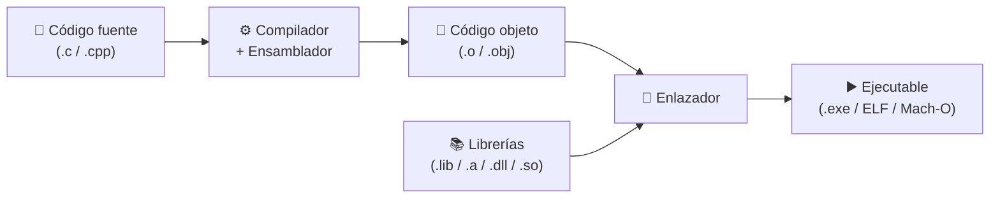
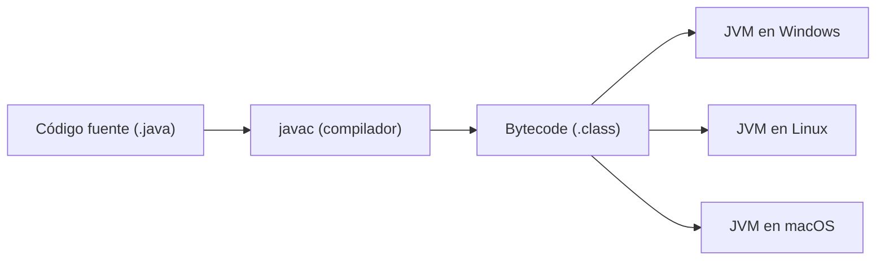
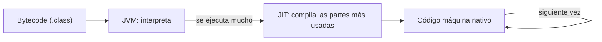

<a id="codigo"></a>

# 💻 2. Código fuente, objeto y ejecutable

{ type=application/pdf style="width:100%;min-height:80vh" }

!!!info "Descarga de diapositivas"
    [Descarga las diapositivas](diapositivas/codigo.pptx){target="_blank" rel="noopener"}

---

## 2.1 Del código fuente al binario: los tres modelos de traducción

Un ordenador solo entiende ceros y unos. Los lenguajes que usamos para programar (C, Java, Python…) son mucho más legibles para las personas, pero la CPU no los entiende directamente. Hace falta un proceso de traducción. Según el lenguaje, ese proceso puede seguir tres caminos distintos.

<div class="tabs-colored" markdown>

=== "⚡ Compilado (C, C++)"
    El compilador traduce **todo el programa de una vez** antes de ejecutarlo. El resultado es un ejecutable independiente con instrucciones binarias directamente entendibles por la CPU.

    ```mermaid
    flowchart LR
    SRC["✍️ Código fuente (.c, .cpp)"] --> COMP["⚙️ Compilador"]
    COMP --> OBJ["📄 Código objeto (.o, .obj)"]
    OBJ --> LINK["🔗 Enlazador"]
    LINK --> EXE["▶️ Ejecutable (.exe, ELF)"]
    ```

=== "📝 Interpretado (Python, JS)"
    No hay compilación previa. El intérprete lee el código fuente **línea a línea** en el momento de ejecutarlo, traduciendo y ejecutando cada instrucción sobre la marcha.

    ```mermaid
    flowchart LR
    SRC["✍️ Código fuente (.py, .js)"] --> INT["👩‍💻 Intérprete"]
    INT --> RUN["▶️ Ejecución directa"]
    ```

=== "⏱️ Híbrido con VM (Java, C#)"
    Compila primero a un **bytecode** (código intermedio, ni binario nativo ni código fuente). Una **máquina virtual** (JVM para Java, CLR para C#) lo ejecuta, usando un compilador JIT que convierte a código máquina las partes más usadas.

    ```mermaid
    flowchart LR
    SRC["✍️ Código fuente"] --> COMP["⚙️ Compilador"]
    COMP --> BYTE["📄 Bytecode (.class / CIL)"]
    BYTE --> VM["⚙️ Máquina Virtual (JVM / CLR)"]
    VM --> JIT["⏱️ JIT: compila lo más usado"]
    JIT --> RUN["▶️ Ejecución en CPU"]
    ```

</div>

---

## 2.2 El proceso compilado en detalle

Cuando un lenguaje compilado como C o C++ pasa de código fuente a ejecutable, no lo hace de un salto: hay varios pasos en cadena.

La **compilación** traduce el código fuente a **código objeto** (`.o` en Linux, `.obj` en Windows). Contiene instrucciones en binario, pero incompletas: sabe que va a llamar a funciones como `printf`, pero aún no sabe en qué dirección de memoria estará. Esas referencias quedan pendientes.

El **ensamblado** —normalmente integrado en el propio compilador— convierte esas instrucciones al formato exacto que entiende la CPU. En la práctica ocurre junto con la compilación en un solo paso.

El **enlazado** es el paso final: el enlazador (*linker*) toma todos los archivos objeto y las **librerías** necesarias —bloques de código ya compilado que el programa reutiliza, como las funciones matemáticas o de entrada/salida— y resuelve todas las referencias pendientes, produciendo el **ejecutable final**.


```mermaid
flowchart LR
  SRC["📝 Código fuente\n(.c / .cpp)"] --> COMP["⚙️ Compilador\n+ Ensamblador"]
  COMP --> OBJ["📄 Código objeto\n(.o / .obj)"]
  OBJ --> LINK["🔗 Enlazador"]
  LIB["📚 Librerías\n(.lib / .a / .dll / .so)"] --> LINK
  LINK --> EXE["▶️ Ejecutable\n(.exe / ELF / Mach-O)"]
```

El formato del ejecutable varía según el sistema operativo: `.exe` en Windows, **ELF** en Linux, **Mach-O** en macOS. Son formatos distintos, por eso un `.exe` de Windows no funciona directamente en Linux.

!!! note "Enlazado estático vs dinámico"
    - :material-package: **Estático** → el ejecutable incluye dentro todo el código de las librerías. Más grande, pero funciona solo.
    - :material-link: **Dinámico** → el ejecutable referencia librerías externas (`.dll` en Windows, `.so` en Linux) que deben estar instaladas en el sistema. Más ligero, pero puede fallar si no están.

!!! warning "El clásico error de las DLL"
    Si el programa fue enlazado dinámicamente y el equipo destino no tiene la versión correcta de una librería, falla al arrancar: *"no se encontró MSVCP140.dll"*. Por eso los instaladores suelen incluir redistribuibles de Visual C++ o similares.

---

## 2.3 Comparativa y cuándo elegir cada modelo

Imagina que tienes un libro en inglés y lo quieres en español. Un lenguaje **compilado** (C, C++) sería como contratar a un traductor que traduce todo el libro antes de publicarlo: el trabajo se hace una vez, y los lectores reciben el libro en español sin necesitar al traductor. Un lenguaje **interpretado** (Python) sería como un intérprete simultáneo que traduce frase a frase mientras alguien lee el original: flexible, pero el intérprete tiene que estar ahí cada vez. Un lenguaje **JIT** (Java) sería ese mismo intérprete, pero que memoriza las frases que más se repiten: las traduce al vuelo al principio, pero las más frecuentes acaban siendo tan rápidas como si ya estuvieran escritas.

| Tipo | Cómo funciona | Ejemplo | Ventajas | Inconvenientes |
|------|---------------|---------|----------|----------------|
| **Compilado** | Se traduce todo a código máquina antes de ejecutar | C, C++ | Muy rápido; el compilador puede optimizar | Hay que recompilar tras cada cambio; el binario solo funciona en un sistema concreto |
| **Interpretado** | El intérprete ejecuta el código línea a línea en tiempo real | Python, JavaScript | Flexible; multiplataforma; ciclo de desarrollo rápido | Más lento al ejecutar; necesita el intérprete instalado |
| **JIT (VM)** | Compila a bytecode; la VM lo traduce a binario en tiempo de ejecución | Java, C# | Portabilidad + buen rendimiento; se adapta a cada máquina | Necesita la VM instalada; arranque algo más lento |

### ¿Cuándo elegir cada uno?

La elección no depende de cuál sea "el mejor", sino de qué necesita el proyecto.

| | ⚡ Compilado (C/C++) | 📝 Interpretado (Python/JS) | ⏱️ JIT (Java/C#) |
|---|---|---|---|
| **Elige cuando…** | El rendimiento es crítico y el sistema destino es fijo | Necesitas desarrollar y cambiar rápido | Necesitas portabilidad y buen rendimiento a la vez |
| **Casos típicos** | Videojuegos, SO, drivers, firmware | Scripts, web, prototipos, ciencia de datos | Apps empresariales, Android, backend con carga |
| **Punto fuerte** | Velocidad de ejecución máxima | Ciclo editar-probar sin recompilar | Funciona en cualquier sistema con la VM |
| **A tener en cuenta** | Hay que recompilar tras cada cambio | Más lento en ejecución | Necesita la VM instalada |

!!! tip "Tu caso concreto"
    **DAW** → JavaScript en frontend, Java o PHP en backend.  
    **DAM** → Kotlin o Java para Android.  
    Saber por qué estos lenguajes se usan donde se usan te ayuda a entender las decisiones de diseño que encontrarás en los proyectos.

---

## 2.4 Máquinas virtuales y portabilidad del bytecode

Cuando compilas Java, el resultado no es un ejecutable para Windows, Linux o macOS: es un **bytecode**, un formato intermedio que cualquier sistema puede ejecutar si tiene instalada la **JVM** (Java Virtual Machine).

Piensa en un PDF. No importa si lo has creado en Windows, macOS o Linux: cualquier ordenador con un lector de PDF puede abrirlo. El PDF no es el documento original ni el binario de una máquina concreta, sino un formato intermedio universal. El bytecode de Java funciona igual.


```mermaid
flowchart LR
  SRC["Código fuente (.java)"] --> COMP["javac (compilador)"]
  COMP --> BYTE["Bytecode (.class)"]
  BYTE --> JVM_W["JVM en Windows"]
  BYTE --> JVM_L["JVM en Linux"]
  BYTE --> JVM_M["JVM en macOS"]
```

El mismo `.class` funciona en los tres sistemas. Esa es la promesa de Java: **"escribe una vez, ejecuta en cualquier parte"** (*Write Once, Run Anywhere*, WORA).

### ¿Cómo funciona el JIT?

Cuando la JVM arranca, interpreta el bytecode instrucción a instrucción. Pero si detecta que cierta parte del código se ejecuta muchas veces —un bucle muy repetido, por ejemplo— la compila a código máquina nativo. Las próximas veces que llegue a ese punto, ya va a velocidad de binario nativo.


```mermaid
flowchart LR
  B["Bytecode (.class)"] --> INT["JVM: interpreta"]
  INT -->|"se ejecuta mucho"| JIT["JIT: compila las partes más usadas"]
  JIT --> BIN["Código máquina nativo"]
  BIN -->|"siguiente vez"| BIN
```

Los dos ecosistemas principales que siguen este modelo son Java y C#:

<div class="tabs-colored" markdown>

=== "☕ Java / JVM"
    `javac` toma tu `.java` y genera un `.class` con el bytecode. La **JVM** lo ejecuta y el JIT optimiza las partes críticas. Disponible para Windows, Linux, macOS y multitud de dispositivos.

    Descarga la versión actual en [adoptium.net](https://adoptium.net)

=== "🔷 C# / CLR"
    El compilador de C# genera **CIL** (Common Intermediate Language), el equivalente al bytecode de Java. La **CLR** (Common Language Runtime), parte del ecosistema .NET, lo ejecuta con JIT. Las versiones modernas de .NET (Core y posteriores) son multiplataforma.

</div>

!!! tip "AOT — el camino contrario al JIT"
    El JIT compila en tiempo de ejecución, con un pequeño coste al arrancar. El **AOT** (Ahead-of-Time) compila todo antes de ejecutar, generando un binario nativo directamente. Se pierde portabilidad, pero se gana en velocidad de arranque y no se necesita la VM. Herramientas: **GraalVM** para Java, **NativeAOT** en .NET.

---

## 2.5 Empaquetado y distribución

Una vez compilado, hay que hacerle llegar el programa al usuario. La forma depende del tipo de programa y del sistema destino.

**Instaladores** es el método clásico: un archivo que al ejecutarse copia el programa, registra sus dependencias y crea accesos directos. En Windows son los `.exe` o `.msi`; en Linux los `.deb` (Ubuntu/Debian) o `.rpm` (Fedora/Red Hat). El instalador puede descargar e instalar las librerías necesarias durante el proceso.

**Bundling** consiste en empaquetar el programa junto con todas sus dependencias en un único paquete portable, sin necesitar instalación previa de librerías. **Electron** —el framework de VS Code o Discord— funciona así: incluye el motor de Chrome y Node.js dentro del propio instalador. Los paquetes son más grandes, pero funcionan en cualquier Windows/macOS/Linux sin configuración adicional.

**Contenedores** van un paso más allá: empaquetan no solo el programa y sus librerías, sino también el entorno completo (versión del SO, variables de sistema, configuración de red). **Docker** es la herramienta más usada. El programa se ejecuta exactamente igual en el portátil del desarrollador, en el servidor de pruebas y en producción.

| Método | Incluye | Cuándo usarlo |
|---|---|---|
| **Instalador** | Solo el programa (librerías aparte) | Apps de escritorio tradicionales |
| **Bundle** | Programa + todas las dependencias | Apps portables, multiplataforma |
| **Contenedor** | Programa + dependencias + entorno completo | Servicios web, despliegues en la nube |

!!! example "Ejemplos concretos"
    - 🎮 Videojuego en PC → instalador `.exe` que descarga DirectX si no está.
    - 📱 App Android → archivo `.apk` (Android Package): contiene el bytecode, recursos y todo lo necesario para instalar la app.
    - 🌐 Servicio web → contenedor Docker que el servidor descarga y arranca en segundos.

---

## 2.6 Compilar y ejecutar Java desde consola

En Java el proceso tiene dos pasos obligatorios y separados: primero **compilar** (convertir tu `.java` a bytecode) y luego **ejecutar** (arrancar la JVM con ese bytecode). No puedes saltarte ninguno, y cada uno tiene su propio comando.


```mermaid
flowchart LR
    A["📄 Hola.java\n(tú lo escribes)"]
    B["⚙️ javac Hola.java"]
    C["📦 Hola.class\n(bytecode generado)"]
    D["▶️ java Hola"]
    E["🖥️ Salida en pantalla"]

    A --> B --> C --> D --> E
```

---

### Paso 1 — Compilar con `javac`

`javac` es el compilador de Java. Lee tu archivo `.java`, comprueba que no haya errores de sintaxis y genera un archivo `.class` con el bytecode.

```bash
javac Hola.java
```

Si todo va bien, no imprime nada. El resultado es que aparece un nuevo archivo `Hola.class` en la misma carpeta:

```
📁 carpeta/
├── Hola.java     ← tu código fuente (sigue ahí)
└── Hola.class    ← bytecode generado por javac  ✅ nuevo
```

!!! warning "El nombre del archivo debe coincidir con la clase"
    Si tu clase se llama `public class Hola`, el archivo **tiene que llamarse** `Hola.java` (mayúsculas incluidas). Si no coinciden, `javac` da error antes de compilar nada:
    ```
    error: class Hola is public, should be declared in a file named Hola.java
    ```

---

### Paso 2 — Ejecutar con `java`

`java` arranca la JVM y le indica qué clase ejecutar. Se escribe el **nombre de la clase**, sin extensión.

```bash
java Hola
```

!!! warning "No escribas `java Hola.class`"
    Es el error más habitual. `java` espera el nombre de la clase, no el nombre del archivo con `.class` sino buscará una clase llamada literalmente `Hola.class` y fallará:
    ```
    Error: Could not find or load main class Hola.class
    ```

---

### Paquetes: cómo Java organiza el código en carpetas

En proyectos reales las clases se agrupan en **paquetes**, que son simplemente carpetas. Un paquete como `org.entornos` equivale a la ruta de carpetas `org/entornos/`. Java exige que la estructura de carpetas en disco coincida exactamente con la declaración `package` dentro del archivo.

Imagina este proyecto:

```
proyecto/               ← aquí abres la terminal
├── src/
│   └── org/
│       └── entornos/
│           └── App.java    ← primera línea: package org.entornos;
└── out/                ← aquí guardaremos los .class
```

Para compilar, te sitúas en la raíz del proyecto y usas `-d` para indicar dónde guardar el bytecode:

```bash
javac -d out src/org/entornos/App.java
```

Después de compilar, la carpeta `out/` tendrá la misma estructura que el paquete:

```
out/
└── org/
    └── entornos/
        └── App.class    ✅ generado automáticamente
```

Para ejecutar, usas `-cp` (*classpath*) para decirle a la JVM dónde buscar las clases, y el nombre completo de la clase incluyendo el paquete:

```bash
java -cp out org.entornos.App
```

!!! info "¿Qué es el classpath?"
    El classpath es la lista de lugares donde la JVM busca las clases cuando las necesita, igual que el sistema operativo tiene un PATH para buscar programas. Si no lo especificas, Java solo busca en la carpeta actual, y si tus `.class` están en otro sitio no los encontrará.

!!! warning "Error frecuente con paquetes"
    Ejecutar `java App` en lugar de `java org.entornos.App` cuando la clase tiene paquete declarado. La JVM busca `App.class` en la raíz del classpath, no lo encuentra donde está y falla:
    ```
    Error: Could not find or load main class App
    ```

---

### Librerías externas: el JAR

Cuando usas código de otra persona (una librería), normalmente te llega empaquetado en un archivo **JAR** (Java ARchive). Un JAR es básicamente un ZIP que contiene varios `.class` listos para usar. Para utilizarlo tienes que añadirlo al classpath, tanto al compilar como al ejecutar.

```
proyecto/
├── src/org/entornos/App.java
├── out/
└── libs/
    └── gson-2.10.jar    ← librería descargada
```

```bash
# Windows — el separador de classpath es punto y coma (;)
javac -cp out;libs/gson-2.10.jar  src/org/entornos/App.java -d out
java  -cp out;libs/gson-2.10.jar  org.entornos.App

# Linux / macOS — el separador es dos puntos (:)
javac -cp out:libs/gson-2.10.jar  src/org/entornos/App.java -d out
java  -cp out:libs/gson-2.10.jar  org.entornos.App
```

El classpath puede tener varias entradas separadas por el delimitador: `out` (donde están tus clases) y `libs/gson-2.10.jar` (la librería). Sin las dos, algo faltará.

!!! tip "El punto (`.`) como entrada del classpath"
    Si no usas `-d` y los `.class` quedan en la carpeta actual, añade `.` al classpath para que Java busque también ahí: `-cp .;libs/gson.jar` (Windows) o `-cp .:libs/gson.jar` (Linux).

!!! warning "Windows vs Linux/macOS"
    Confundir `;` con `:` en el classpath es uno de los errores más comunes al cambiar de sistema. Si ves un error extraño después de especificar el classpath, revisa primero el separador.

---

### Compilar varios archivos a la vez

Si el proyecto tiene varias clases que se usan entre sí, compílalas todas en el mismo comando. `javac` resuelve las dependencias entre ellas solo, pero para eso necesita verlas todas a la vez.

```bash
# Compilar dos clases en un solo comando
javac -d out src/org/entornos/util/Calculos.java src/org/entornos/App.java
```

Si las compilas por separado y una depende de la otra, `javac` no encontrará la clase que falta y dará un error de símbolo no reconocido.

---

### Resumen de comandos

| Situación | Compilar | Ejecutar |
|---|---|---|
| Un archivo, sin paquete | `javac Hola.java` | `java Hola` |
| Con paquete, salida en `out/` | `javac -d out src/.../App.java` | `java -cp out org.entornos.App` |
| Con librería JAR (Windows) | `javac -cp out;libs/x.jar ... -d out` | `java -cp out;libs/x.jar org.entornos.App` |
| Con librería JAR (Linux/Mac) | `javac -cp out:libs/x.jar ... -d out` | `java -cp out:libs/x.jar org.entornos.App` |

---
