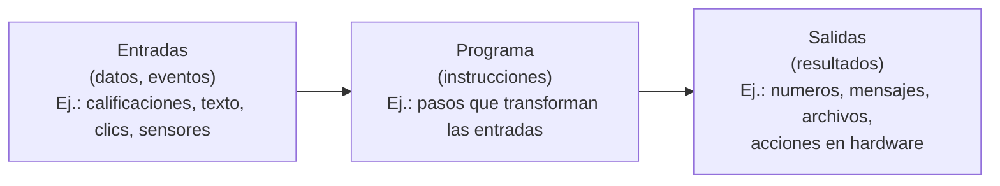
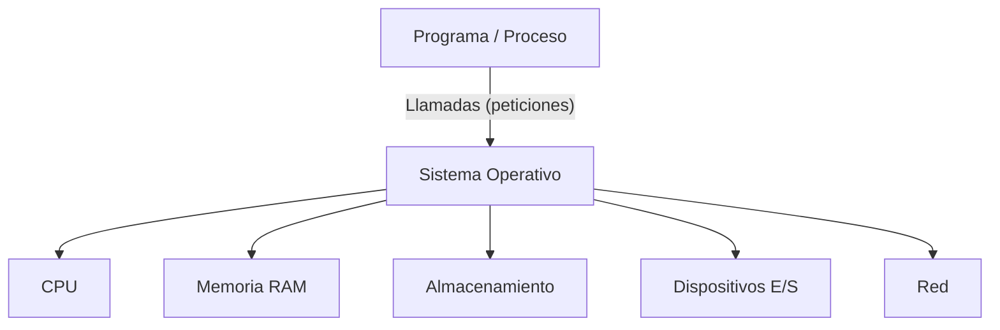

<a id="concepto"></a>

# 👨‍💻 1. Concepto de programa informático

{ type=application/pdf style="width:100%;min-height:80vh" }

!!!info "Descarga de diapositivas"
    [Descarga las diapositivas](diapositivas/concepto.pdf){target="_blank" rel="noopener"}


---

## 1.1 Definición y propósito

!!! info "Definición breve"
    Un **programa informático** es un conjunto **ordenado de instrucciones** que, al ejecutarse en un ordenador a través de su **sistema operativo**, transforma **entradas (datos)** en **salidas (resultados)** para resolver un **problema concreto**.

### ¿Para qué sirve?
- **Automatizar** tareas repetitivas.
- **Procesar y analizar** datos para obtener información útil.
- **Ofrecer servicios** (una web, una app, una API).
- **Controlar hardware** (impresoras, sensores, robots…).
- **Ayudar a tomar decisiones** (por ejemplo, calcular una media o recomendar contenidos).

### Cómo lo hace (Entrada → Proceso → Salida)
1. **Entrada**: llegan datos (lo que escribes, un archivo, un clic, una lectura de un sensor…).  
2. **Proceso**: el programa aplica sus **instrucciones** (el “cómo”).  
3. **Salida**: devuelve un **resultado** (un número, un mensaje, un documento, encender un LED…).
   


!!! example "Ejemplo: Nota media" 
    - **Entrada**: notas de 5 asignaturas (6, 7, 8, 5, 9).  
    - **Proceso**: sumar todo y dividir entre 5.  
    - **Salida**: media = 7,0.

### Conceptos clave
!!! note "Algoritmo vs. programa"
    - **Algoritmo**: procedimiento **finito**, **preciso** y **no ambiguo** que resuelve una **clase de problemas**.  
    - **Programa**: **implementación concreta** de un algoritmo en un **lenguaje** que un ordenador puede **ejecutar**.

### Ejemplo: encontrar el **máximo** de una lista
<div class="tabs-colored" markdown>

=== "Algoritmo (explicado) :material-lightbulb-on-outline:"
    **Problema.** Dada una lista de números, queremos **el mayor**.

    **Idea general.**  
    - Tomamos el **primer valor** como candidato a máximo.  
    - Recorremos la lista **de izquierda a derecha**.  
    - Si aparece un número **mayor** que el candidato, **lo sustituimos**.  
    - Al terminar, el candidato es el **máximo**.

    **Detalles importantes.**  
    - La lista debe tener **al menos un elemento**.  
    - Solo necesitamos **una variable** adicional.  
    - Una **comparación por elemento** → coste **lineal**.

=== "Programa en Java :material-code-tags:"
    ```java
    public class MaximoLista {
        public static int maximo(int[] a) {
            int max = a[0];                 // candidato inicial
            for (int i = 1; i < a.length; i++) {
                if (a[i] > max) {           // ¿hay un número mayor?
                    max = a[i];             // actualizamos el candidato
                }
            }
            return max;                     // al final, max es el mayor
        }

        public static void main(String[] args) {
            int[] numeros = {6, 7, 8, 5, 9};
            int max = maximo(numeros);
            System.out.println("Máximo = " + max); // -> 9
        }
    }
    ```
</div>

!!! warning "Errores habituales (a evitar)"
    - ❌ **Confundir datos de entrada con configuración del programa.**  
      Los **datos de entrada** son la información que el programa necesita para trabajar (ej.: números a sumar).  
      La **configuración** son ajustes fijos que cambian el comportamiento del programa (ej.: idioma de la aplicación).  
      → Si los mezclas, el programa puede dar resultados inesperados.  

    - ❌ **Pensar que un programa siempre tiene interfaz gráfica.**  
      Muchos programas funcionan **sin ventanas**: en consola, como scripts, o en segundo plano como **servicios**.  
      → Un programa no necesita “pantalla bonita” para ser útil.  

    - ❌ **Olvidar el papel del sistema operativo.**  
      El programa no controla el hardware de forma directa: hace **peticiones** al sistema operativo.  
      → Si el SO no gestionara CPU, memoria o disco, los programas chocarían entre sí y el sistema se colapsaría.  


## 1.2 Tipos de programas: sistemas, aplicaciones, utilidades y servicios

!!! info "Idea clave"
    Los programas informáticos se pueden **clasificar según su propósito**.  
    Esta clasificación ayuda a entender **qué papel cumple cada software** dentro de un ordenador o en la red.

---

### :material-cog: Programas de sistema
- **Qué son:** software que conecta y gestiona el hardware.  
- **Ejemplos:** sistemas operativos (Windows, Linux, macOS), drivers, firmware.  

!!! tip "Recuerda"
    Sin un sistema operativo, el resto de programas **no podrían ejecutarse**.

---

### :material-application:  Aplicaciones
- **Qué son:** programas diseñados para que el **usuario final** realice tareas concretas.  
- **Ejemplos:** navegador web, editor de texto, juego, app del tiempo, procesador de imágenes.  

---

### :material-hammer-wrench: Utilidades
- **Qué son:** programas de apoyo que **facilitan tareas técnicas** o ayudan a mantener el sistema.  
- **Ejemplos:** antivirus, compresores (WinRAR, 7zip), limpiadores de disco, monitores de red.  

---

### :material-server: Servicios
- **Qué son:** programas que **trabajan en segundo plano**, sin necesidad de que el usuario los abra manualmente.  
- **Ejemplos:** servidor web (Apache, Nginx), base de datos (MySQL, MongoDB), servicio de copias automáticas.  

!!! note "Importante"
    Un **servicio** no suele tener ventana ni icono.  
    Está “escuchando” peticiones (por ejemplo desde Internet) y responde cuando hace falta.

---

### :material-table: Resumen en tabla

| Tipo            | Para qué sirve                           | Ejemplos |
|-----------------|------------------------------------------|----------|
| **:material-cog: Sistema**     | Gestiona hardware y recursos             | Windows, Linux, drivers |
| **:material-application: Aplicación** | Ayuda al usuario a realizar tareas       | Word, Chrome, Minecraft |
| **:material-hammer-wrench: Utilidad**  | Facilita el mantenimiento técnico        | Antivirus, WinRAR |
| **:material-server: Servicio**        | Trabaja en segundo plano, atiende peticiones | Servidor web, base de datos |

---

### :material-chart-bubble: Esquema visual

<div class="only-light">
  
</div>

<div class="only-dark">
  
</div>

---

## 1.3 Programas y componentes del sistema: CPU, memoria, almacenamiento, E/S, red

!!! info "Idea clave"
    Un **programa** no habla directamente con el hardware.  
    Lo hace a través del **sistema operativo**, que actúa como **intermediario** y reparte los recursos.

---

### :material-cpu-64-bit: CPU (procesador)
- **Qué hace:** ejecuta las **instrucciones** del programa paso a paso.  
- **Ejemplo mental:** es como el **cerebro** del ordenador.  
- **Importante:** la velocidad de la CPU influye en la rapidez con que el programa responde.

---

### :material-memory: Memoria RAM
- **Qué hace:** guarda **temporalmente** datos e instrucciones mientras se usan.  
- **Ejemplo mental:** una **mesa de trabajo**: cuanto más grande, más cosas caben a la vez.  
- **Detalle:** cuando apagas el PC, la RAM se **borra**.

---

### :material-harddisk: Almacenamiento
- **Qué hace:** conserva la información **de forma permanente** (aunque apagues el ordenador).  
- **Ejemplo mental:** un **archivador** donde guardas documentos.  
- **Tipos:** discos duros (HDD), discos sólidos (SSD).  

---

### :material-usb: Entrada/Salida (E/S)
- **Qué hace:** permite la **comunicación con el exterior**.  
- **Ejemplos de entrada:** teclado, ratón, micrófono, cámara.  
- **Ejemplos de salida:** monitor, impresora, altavoces.  

---

### :material-access-point-network: Red
- **Qué hace:** conecta el ordenador con otros equipos para **compartir información**.  
- **Ejemplo mental:** como una **carretera** por la que circulan los datos.  
- **Ejemplo:** navegar por Internet, descargar un archivo, jugar en línea.  

---


### Esquema general


!!! example "Ejemplo cotidiano"
    Piensa en ver un vídeo en YouTube:  

    - CPU: procesa las instrucciones del reproductor.  
    - RAM: guarda los datos del vídeo en reproducción.  
    - Almacenamiento: puede guardar el vídeo descargado.  
    - E/S: la pantalla muestra imágenes, los altavoces reproducen sonido.  
    - Red: recibe los datos del vídeo desde Internet.  

---

