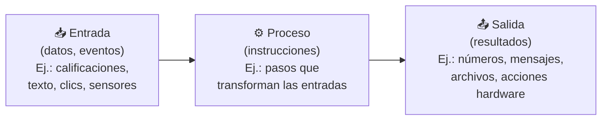
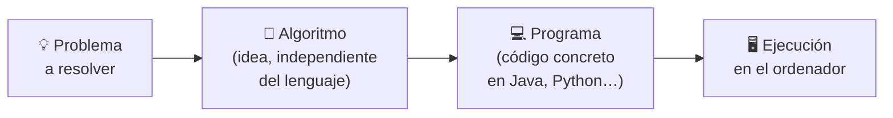
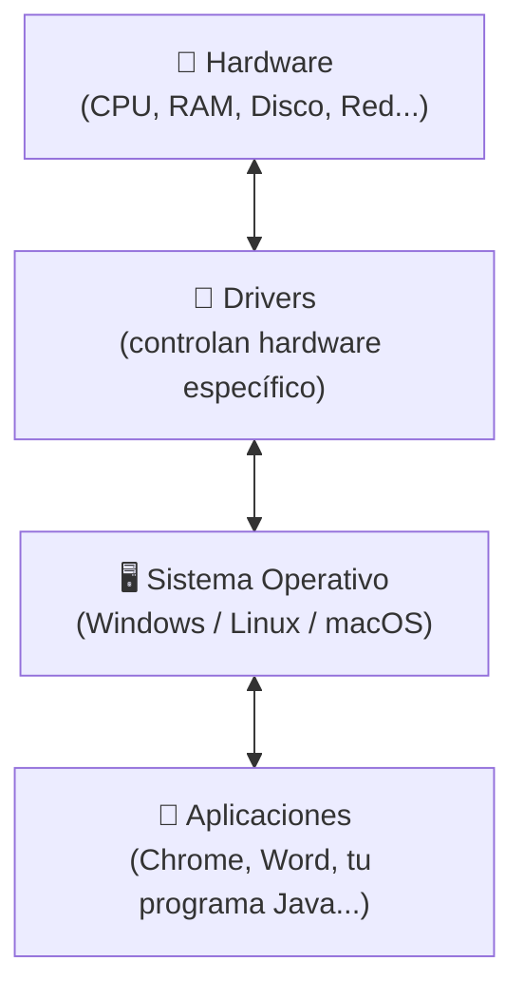
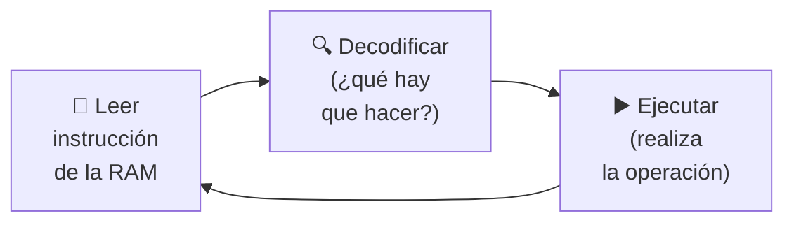
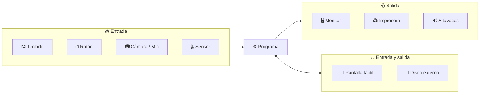
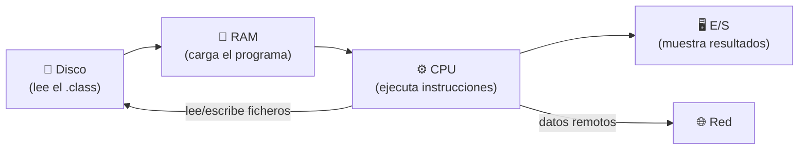

<a id="concepto"></a>

# 👨‍💻 1. Concepto de programa informático

{ type=application/pdf style="width:100%;min-height:80vh" }

!!!info "Descarga de diapositivas"
    [Descarga las diapositivas](diapositivas/concepto.pptx){target="_blank" rel="noopener"}

En DAW y DAM vas a pasar los próximos dos años escribiendo programas. Antes de empezar, vale la pena entender bien qué es exactamente un programa, cómo llega a ejecutarse y con qué partes del ordenador interactúa. Son conceptos que parecen obvios, pero la mayoría de los alumnos tienen ideas vagas sobre ellos, y eso crea confusión más adelante.

---

## 1.1 Definición y propósito

!!! info "Definición"
    Un **programa informático** es un conjunto **ordenado** de instrucciones que, al ejecutarse en un ordenador, **transforma datos de entrada en resultados útiles** para resolver un problema concreto.

Hay tres palabras clave en esa definición:

**Conjunto de instrucciones** — no es un único comando ni una fórmula: es una secuencia de pasos, cada uno diciéndole al ordenador exactamente qué hacer. Puede haber decenas o millones de instrucciones.

**Ordenado** — el orden importa. Si calculas la media antes de haber sumado las notas, el resultado es incorrecto. Si divides antes de leer el denominador, el programa falla. Buena parte de la dificultad de programar está en pensar la secuencia correcta.

**Transforma entradas en salidas** — todo programa recibe algo, hace algo con ello y devuelve algo. Sin excepción.

---

### El modelo Entrada → Proceso → Salida


```mermaid
flowchart LR
  A["📥 Entrada\n(datos, eventos)\nEj.: calificaciones,\ntexto, clics, sensores"]
    --> B["⚙️ Proceso\n(instrucciones)\nEj.: pasos que\ntransforman las entradas"]
    --> C["📤 Salida\n(resultados)\nEj.: números, mensajes,\narchivos, acciones hardware"]
```

<div class="tabs-colored" markdown>

=== "📥 Entrada"
    Todo lo que llega al programa desde fuera:

    - Lo que el usuario escribe en el teclado
    - Un archivo leído del disco
    - Un clic del ratón o un toque en pantalla
    - Una señal de un sensor
    - Una respuesta de una API externa

    El programa **no inventa sus datos**: los recibe.

=== "⚙️ Proceso"
    Las instrucciones que transforman la entrada:

    - Cálculos matemáticos
    - Comparaciones y decisiones (`if`, `switch`)
    - Bucles y repeticiones
    - Consultas a una base de datos
    - Llamadas a otros programas o servicios

    Aquí vive la **lógica** del programa.

=== "📤 Salida"
    El resultado que el programa produce:

    - Un número o mensaje en pantalla
    - Un archivo guardado en disco
    - Una petición enviada a otro sistema
    - Encender un LED o mover un motor
    - Una página web devuelta al navegador

    La salida puede ser para el usuario, para otro programa o para un dispositivo físico.

</div>

!!! example "Ejemplo: calcular la nota media"
    - **Entrada** → notas de 5 asignaturas: `6, 7, 8, 5, 9`
    - **Proceso** → sumar los cinco valores (35) y dividir entre 5
    - **Salida** → mostrar en pantalla `La nota media es 7,0`

    Si mañana las notas son distintas, la **entrada cambia** pero el **proceso** (el código) es el mismo. El programa sirve para cualquier conjunto de notas, no solo para ese.

!!! tip "Antes de escribir código, hazte siempre estas tres preguntas"
    1. ¿Qué datos recibo?
    2. ¿Qué tengo que hacer con ellos?
    3. ¿Qué resultado tengo que producir?

    Si no tienes las tres claras, la probabilidad de escribir código confuso o incorrecto es muy alta.

---

### Algoritmo vs. programa

Antes de escribir un programa tienes que diseñar el **algoritmo**: el procedimiento lógico que resuelve el problema, sin preocuparse todavía del lenguaje de programación.


```mermaid
flowchart LR
  A["💡 Problema\na resolver"] --> B["📝 Algoritmo\n(idea, independiente\ndel lenguaje)"]
  B --> C["💻 Programa\n(código concreto\nen Java, Python…)"]
  C --> D["🖥️ Ejecución\nen el ordenador"]
```

!!! tip "Analogía: la receta de cocina"
    La receta de un pastel es el **algoritmo**: los pasos son los mismos en español o en inglés, en horno de gas o eléctrico.  
    El texto concreto de esa receta escrito en español para un horno de gas con tiempos en minutos… eso sería el **programa**.

| | Algoritmo | Programa |
|---|---|---|
| **Qué es** | El procedimiento lógico | La traducción a un lenguaje concreto |
| **Depende del lenguaje** | ❌ No | ✅ Sí |
| **El ordenador lo ejecuta** | ❌ No directamente | ✅ Sí |
| **Ejemplo** | "Recorre la lista y quédate con el mayor" | El código Java de abajo |

!!! warning "Dos tipos de bug muy diferentes"
    Si tu programa falla, el error puede estar en el **algoritmo** (la lógica es incorrecta) o en la **implementación** (la lógica es correcta pero la has escrito mal). Son problemas distintos y se depuran de forma diferente. Saber distinguirlos te ahorrará horas.

---

### Ejemplo: encontrar el máximo de una lista

<div class="tabs-colored" markdown>

=== "💡 Algoritmo"
    **Problema:** dada una lista de números, encontrar el mayor.

    **Procedimiento paso a paso:**

    1. Toma el primer elemento y guárdalo como "candidato a máximo"
    2. Recorre el resto de la lista de izquierda a derecha
    3. Por cada elemento: ¿es mayor que el candidato actual?
        - **Sí** → ese elemento se convierte en el nuevo candidato
        - **No** → sigue adelante sin cambiar nada
    4. Al terminar, el candidato es el máximo

    **¿Por qué funciona?** En todo momento el candidato es el mayor de los elementos vistos hasta ese punto. Al recorrer toda la lista, el candidato es el mayor de todos.

=== "☕ Programa en Java"
    > Si aún no conoces Java, no te preocupes. Lo importante es ver cómo cada paso del algoritmo se convierte en una línea de código. Lee los comentarios.

    ```java
    public class MaximoLista {
        public static int maximo(int[] a) {
            int max = a[0];                       // candidato inicial: el primero
            for (int i = 1; i < a.length; i++) { // recorremos desde el segundo
                if (a[i] > max) {                 // ¿este supera al candidato actual?
                    max = a[i];                   // sí → nuevo candidato
                }
            }
            return max;                           // devolvemos el mayor encontrado
        }

        public static void main(String[] args) {
            int[] numeros = {6, 7, 8, 5, 9};
            System.out.println("Máximo = " + maximo(numeros)); // → Máximo = 9
        }
    }
    ```

    Fíjate en la correspondencia directa: el "candidato" es `max`, el "recorrer" es el `for`, la "comparación" es el `if`, la "sustitución" es `max = a[i]`.

</div>

!!! warning "Tres errores de concepto frecuentes"
    **1. Confundir datos de entrada con configuración.**  
    Los datos de entrada cambian en cada ejecución (las notas de cada alumno). La configuración son ajustes fijos del programa (el idioma, el número máximo de intentos). Mezclarlos hace el código confuso y difícil de mantener.

    **2. Creer que un programa necesita interfaz gráfica.**  
    Muchos programas funcionan solo en consola, como scripts, o en segundo plano. Durante el módulo escribirás muchos sin ventanas. Eso no los hace "menos programas".

    **3. Pensar que el programa controla el hardware directamente.**  
    Cuando tu código hace `System.out.println`, no está hablando con el monitor. Está llamando al sistema operativo, que gestiona los dispositivos. El programa trabaja sobre una capa de abstracción que ofrece el SO.

---

## 1.2 Tipos de programas

No todos los programas hacen lo mismo ni están pensados para el mismo público. Según su propósito se clasifican en cuatro tipos.

---

### :material-cog: Programas de sistema

Los programas de sistema son el software más cercano al hardware. Su función es **gestionar los recursos físicos** del ordenador y proporcionar una plataforma estable sobre la que puedan ejecutarse todos los demás programas.

El ejemplo más importante es el **sistema operativo** (Windows, Linux, macOS). Cuando enciendes el ordenador, lo primero que se carga es el SO. A partir de ahí, el SO se encarga de:

- Detectar el hardware disponible y cargarlo en memoria
- Decidir qué proceso tiene acceso a la CPU en cada momento
- Administrar la RAM para que varios programas puedan usarla sin pisarse
- Controlar el acceso al disco
- Ofrecer una API de llamadas al sistema que el resto del software puede usar


```mermaid
flowchart TD
  HW["🔧 Hardware\n(CPU, RAM, Disco, Red...)"]
  SO["🖥️ Sistema Operativo\n(Windows / Linux / macOS)"]
  D["🔌 Drivers\n(controlan hardware específico)"]
  A["📱 Aplicaciones\n(Chrome, Word, tu programa Java...)"]

  HW <--> D
  D <--> SO
  SO <--> A
```

Dentro de los programas de sistema también están:

- Los **drivers** — traducen las instrucciones genéricas del SO a los comandos específicos de un dispositivo concreto. Por eso al instalar una impresora nueva hay que instalar su driver: sin él, el SO no puede hablar con ella.
- El **firmware** — software grabado dentro del propio hardware (la BIOS/UEFI de la placa base, el software interno de un router o un SSD). Viene de fábrica; actualizarlo es una operación delicada.

!!! note ""
    El usuario final casi nunca interactúa directamente con los programas de sistema. Están ahí para que todo lo demás funcione.

---

### :material-application: Aplicaciones

Las aplicaciones son los programas que el usuario usa directamente para hacer algo concreto: escribir, navegar, editar fotos, jugar, gestionar una empresa.

Hay varios subtipos con implicaciones técnicas diferentes:

<div class="tabs-colored" markdown>

=== "🖥️ Escritorio"
    Se instalan en el ordenador y se ejecutan localmente.

    **Ejemplos:** Microsoft Word, IntelliJ IDEA, Photoshop, VLC, Minecraft.

    **Características:**  
    ✅ Acceso directo al sistema de archivos del usuario  
    ✅ Usan toda la potencia del hardware local  
    ✅ Funcionan sin conexión a internet  
    ❌ Hay que instalarlas y actualizarlas en cada equipo

=== "🌐 Web"
    Se ejecutan en un servidor; el usuario accede con el navegador.

    **Ejemplos:** Gmail, GitHub, campus virtual, cualquier tienda online.

    **Características:**  
    ✅ Accesibles desde cualquier dispositivo con navegador  
    ✅ No requieren instalación en el equipo del usuario  
    ❌ Requieren conexión a internet  
    ❌ Sin acceso al sistema de archivos local del usuario

=== "📱 Móvil"
    Se ejecutan en smartphones o tablets.

    **Ejemplos:** Instagram, Google Maps, la app de tu banco.

    **Características:**  
    ✅ Acceso a sensores del dispositivo (GPS, cámara, acelerómetro)  
    ✅ Notificaciones push  
    ❌ Pantalla pequeña y recursos más limitados  
    ❌ Hay que publicarlas en una tienda (Play Store / App Store)

</div>

!!! tip ""
    **DAW** → desarrollarás principalmente **aplicaciones web**. **DAM** → tu foco serán las **aplicaciones móviles**. En ambos casos, entender las diferencias entre tipos de aplicación tiene consecuencias técnicas reales en cómo las diseñas.

---

### :material-hammer-wrench: Utilidades

Las utilidades son programas de apoyo para tareas técnicas o de mantenimiento. No sirven para hacer el trabajo del día a día, sino para **cuidar o configurar el sistema**.

| Utilidad | Para qué sirve |
|---|---|
| Antivirus (interfaz gráfica) | Ver el estado del sistema, configurar análisis, eliminar amenazas |
| WinRAR / 7-Zip | Comprimir y descomprimir archivos |
| Administrador de Tareas | Ver procesos activos y consumo de recursos |
| GParted | Reorganizar particiones del disco |
| CCleaner | Limpiar archivos temporales y entradas de registro |

La línea entre "aplicación" y "utilidad" no siempre es nítida. Un editor de texto es una aplicación; el Editor del Registro de Windows también tiene interfaz gráfica pero es una utilidad. La diferencia está en el **propósito**: ¿hacer el trabajo, o cuidar el sistema?

---

### :material-server: Servicios

Un servicio es un programa que se ejecuta **en segundo plano**, sin interfaz gráfica, esperando que lleguen peticiones. No lo abres tú: lo inicia el sistema operativo al arrancar, y se queda corriendo sin que te enteres.

!!! example "Cómo funciona un servidor web"
    **XAMPP** es un paquete que instala de golpe Apache, MySQL y PHP en tu ordenador, listo para desarrollar. **Apache** es el servidor web más usado del mundo: un programa que sirve páginas web. **HTTP** (HyperText Transfer Protocol) es el "idioma" que usan el navegador y el servidor para hablar. Un **puerto** es como una puerta numerada dentro del ordenador: cada servicio escucha en un número de puerto concreto para que el SO sepa a quién entregar cada petición.

    Cuando instalas XAMPP y arrancas Apache, ocurre esto:

    ```mermaid
    sequenceDiagram
        participant N as 🌐 Navegador
        participant A as ⚙️ Apache (servicio)
        participant D as 💾 Disco

        N->>A: GET http://localhost/index.html
        A->>D: Lee index.html
        D-->>A: Contenido del archivo
        A-->>N: Respuesta HTTP 200 + HTML
        N->>N: Renderiza la página
    ```

    Apache está escuchando en el **puerto 80** sin que hayas abierto ninguna ventana. Cuando el navegador se conecta a `http://localhost`, Apache recibe la petición, busca el archivo, lo lee y lo devuelve. Todo en milisegundos.

Lo mismo ocurre con **MySQL** (base de datos, escucha en el puerto 3306): cuando tu código Java hace una consulta, se conecta a ese puerto, envía la consulta en SQL y recibe los resultados. MySQL no abre ninguna ventana ni pide que hagas nada: simplemente responde a las peticiones que llegan.

!!! note "¿Cuántos servicios tienes ahora mismo?"
    Abre el Administrador de Tareas → pestaña **Servicios**. Verás decenas de procesos activos aunque no hayas abierto ningún programa: el servicio de audio, el cliente de actualizaciones, el antivirus en segundo plano… Todos arrancaron al encender el ordenador y llevan corriendo desde entonces.

!!! tip "Relevancia en DAW/DAM"
    Las aplicaciones web que vas a desarrollar se despliegan como servicios en un servidor. Tu código no lo ejecuta un usuario haciendo doble clic: lo ejecuta un servidor que recibe peticiones HTTP las 24 horas y devuelve respuestas.

---

### Resumen de los cuatro tipos

| Tipo | Para qué sirve | ¿Quién lo usa? | Ejemplo |
|---|---|---|---|
| :material-cog: **Sistema** | Gestiona el hardware y los recursos | El propio SO y otros programas | Windows, driver gráfica, BIOS |
| :material-application: **Aplicación** | Permite al usuario realizar tareas | El usuario final | Chrome, Word, IntelliJ, Gmail |
| :material-hammer-wrench: **Utilidad** | Mantenimiento y configuración del sistema | El técnico o usuario avanzado | Antivirus, WinRAR, Adm. Tareas |
| :material-server: **Servicio** | Atiende peticiones en segundo plano | Otros programas o equipos remotos | Apache, MySQL, Windows Update |

### :material-chart-bubble: Esquema visual

<div class="only-light">
  
</div>

<div class="only-dark">
  
</div>

---

## 1.3 Programas y componentes del sistema

Cuando un programa se ejecuta, usa los recursos físicos del ordenador. Entender qué hace cada componente, y cómo interactúa con tu código, es esencial para escribir software que funcione bien y para diagnosticar problemas cuando algo va mal.

!!! info "Principio clave"
    Un programa **no accede directamente al hardware**. Si tu código Java quiere leer un archivo, no accede al disco por su cuenta: hace una petición al sistema operativo, que es quien tiene el control real. El SO actúa como árbitro entre todos los programas que están corriendo, evitando que se pisen unos a otros.

---

### :material-cpu-64-bit: CPU — el procesador

La CPU es quien ejecuta las instrucciones del programa. Cuando tu código recorre un bucle o evalúa un `if`, es la CPU quien realiza esas operaciones físicamente, a nivel de circuitos electrónicos.

La CPU trabaja con un ciclo básico que se repite sin parar:


```mermaid
flowchart LR
  A["📖 Leer\ninstrucción\nde la RAM"] --> B["🔍 Decodificar\n(¿qué hay\nque hacer?)"] --> C["▶️ Ejecutar\n(realiza\nla operación)"] --> A
```

Un procesador moderno hace este ciclo **miles de millones de veces por segundo** (expresado en GHz). Un procesador a 3 GHz realiza 3.000 millones de ciclos por segundo.

Los procesadores actuales tienen varios **núcleos** — son como varias CPUs independientes dentro del mismo chip, cada una capaz de ejecutar instrucciones por su cuenta. Un procesador de 8 núcleos puede realizar 8 tareas al mismo tiempo de verdad.

Cada núcleo ejecuta un **hilo** (secuencia de instrucciones): piensa en un hilo como una "línea de montaje" de instrucciones que avanza de forma independiente. Un programa puede tener uno o varios hilos corriendo a la vez. Si solo tiene uno, aunque el procesador tenga 8 núcleos, el programa solo usa uno de ellos.

!!! warning "Consecuencia práctica para el programador"
    Cada programa arranca con un **hilo principal** que gestiona la interfaz gráfica y responde a los clics del usuario. Si en ese hilo pones una operación pesada (recorrer un millón de registros, descargar un archivo grande), la aplicación se **congela** porque ese hilo está ocupado y no puede atender los eventos. La solución es mover ese trabajo a un **hilo secundario** independiente. Esto se llama programación concurrente y lo verás en módulos posteriores.

---

### :material-memory: Memoria RAM — la memoria principal

La RAM almacena el programa y sus datos **mientras se está ejecutando**. Cuando el SO carga un programa para ejecutarlo, lo copia del disco a la RAM. A partir de ese momento, la CPU trabaja directamente con la RAM, porque acceder a ella es **mucho más rápido** que acceder al disco.

!!! tip "Analogía: la mesa de trabajo"
    | | Analogía | Informática |
    |---|---|---|
    | 🗄️ Cajón | Donde guardas todo cuando terminas | Disco duro |
    | 🪑 Mesa | Donde tienes lo que usas ahora | RAM |
    | 📄 Documentos sobre la mesa | Lo que estás procesando | Datos en memoria |

    Cuanto más grande la mesa (más RAM), más cosas puedes tener abiertas a la vez. Cuando la mesa se llena, el SO empieza a usar el disco como RAM extra (**memoria virtual**): posible, pero muy lento. Es cuando el ordenador empieza a ir "a tirones".

La RAM es **volátil**: si apagas el ordenador o el programa termina, todo desaparece. Por eso, cuando un programa necesita guardar algo de forma permanente, tiene que escribirlo en el disco explícitamente.

!!! warning "Consecuencia práctica para el programador"
    Cada objeto que creas en Java ocupa espacio en la RAM. La JVM (Java Virtual Machine, el programa que ejecuta tu código Java) reserva una zona de memoria llamada ***heap*** donde viven todos los objetos que creas con `new`. Si cargas un millón de registros en memoria sin pensar, puedes consumir varios gigabytes. Si el programa supera la memoria disponible, lanza una excepción **`OutOfMemoryError`** y termina.

---

### :material-harddisk: Almacenamiento — el disco

El disco guarda la información de forma **permanente**: el código fuente, los `.class` compilados, la base de datos, los archivos de configuración, los logs (registros de lo que ha hecho el programa). Todo lo que necesita sobrevivir cuando se apaga el ordenador va aquí.

| | HDD (mecánico) | SSD SATA | SSD NVMe |
|---|---|---|---|
| **Tecnología** | Platos giratorios + cabezal | Chips flash (conector SATA) | Chips flash (conector PCIe, más rápido) |
| **Velocidad lectura** | ~100–150 MB/s | ~500 MB/s | ~3.000–7.000 MB/s |
| **Tiempo arranque SO** | 30–60 s | 10–15 s | 5–10 s |
| **Precio** | Barato | Medio | Más caro |

Una vez que el programa está en RAM, el disco **no participa** en la ejecución salvo que el programa lea o escriba archivos explícitamente. Por eso las operaciones de disco son un cuello de botella: son lentas comparadas con trabajar en RAM, y hacerlas dentro de un bucle rápido es una mala idea.

---

### :material-usb: Entrada/Salida (E/S)

Los dispositivos de E/S son todo lo que permite al programa comunicarse con el mundo exterior.


```mermaid
flowchart LR
  subgraph entrada["📥 Entrada"]
    K["⌨️ Teclado"]
    M["🖱️ Ratón"]
    C["📷 Cámara / Mic"]
    S["🌡️ Sensor"]
  end

  subgraph salida["📤 Salida"]
    MON["🖥️ Monitor"]
    PR["🖨️ Impresora"]
    SP["🔊 Altavoces"]
  end

  subgraph ambos["↔️ Entrada y salida"]
    T["📱 Pantalla táctil"]
    USB["💾 Disco externo"]
  end

  entrada --> PROG["⚙️ Programa"]
  PROG --> salida
  PROG <--> ambos
```

En programación, cada vez que usas `Scanner` para leer del teclado estás usando E/S de entrada. Cada vez que usas `System.out.println` estás usando E/S de salida.

!!! warning "Las operaciones de E/S son lentas"
    Mientras el programa espera que se complete una operación de E/S, la CPU está básicamente parada. Esto se llama **E/S bloqueante**.

    | Operación | Tiempo aproximado |
    |---|---|
    | Acceder a la RAM | ~100 nanosegundos |
    | Leer del disco SSD | ~100 microsegundos (1.000× más lento) |
    | Leer del disco HDD | ~10 milisegundos (100.000× más lento) |
    | Esperar respuesta de red local | ~1 milisegundo |
    | Esperar respuesta de servidor remoto | 50–200 milisegundos |
    | Esperar que el usuario escriba | segundos o más |

    En aplicaciones web con muchos usuarios simultáneos, este problema se resuelve con E/S asíncrona. Eso es materia de módulos más avanzados, pero es importante saber que existe.

---

### :material-access-point-network: Red

La red conecta el programa con otros equipos. Para un desarrollador web es el componente más relevante después de la CPU y la RAM.

Cuando un usuario abre tu aplicación web, el navegador envía una petición HTTP a través de la red hasta el servidor. El servidor procesa la petición (quizás consultando la base de datos) y devuelve una respuesta. Ese ciclo puede completarse en menos de 100 ms si todo va bien.

La red tiene dos características que la hacen diferente de otros componentes:

**Latencia** — el tiempo que tarda un dato en ir de un punto a otro:

| Trayecto | Latencia típica |
|---|---|
| Dentro de la misma máquina (`localhost`, el nombre que usa el SO para referirse a uno mismo) | < 1 ms |
| Servidor en el mismo *datacenter* (edificio con cientos de servidores) | 1–5 ms |
| Servidor en otro país (Europa-USA) | 80–150 ms |
| Servidor en otro continente | 200–400 ms |

Si tu código hace 50 llamadas de red en serie para construir una página, y cada una tarda 100 ms, el tiempo total es de 5 segundos. Eso es inaceptable para una aplicación web.

**Fiabilidad** — la red puede fallar. Un servidor puede estar caído, la conexión puede interrumpirse, una petición puede no llegar. A diferencia de la CPU o la RAM, la red falla de forma **intermitente e impredecible**. Por eso todo el código que usa la red tiene que gestionar errores: qué hago si no llega respuesta en 5 segundos, qué muestro al usuario si el servidor está caído.

---

### ¿Qué ocurre cuando ejecutas un programa?

Cuando escribes `java MediaNotas` en la terminal, todos los componentes entran en juego:


```mermaid
flowchart LR
  A["💾 Disco\n(lee el .class)"] --> B["🧠 RAM\n(carga el programa)"]
  B --> C["⚙️ CPU\n(ejecuta instrucciones)"]
  C --> D["🖥️ E/S\n(muestra resultados)"]
  C -->|datos remotos| E["🌐 Red"]
  C -->|lee/escribe ficheros| A
```

| Paso | Componente | Qué ocurre |
|---|---|---|
| 1 | 💾 **Disco** | El SO localiza `MediaNotas.class` y lo copia a la RAM |
| 2 | 🧠 **RAM** | El programa y sus datos quedan cargados en memoria |
| 3 | ⚙️ **CPU** | La JVM (Java Virtual Machine, el programa que interpreta el bytecode de Java) empieza a ejecutar instrucción a instrucción |
| 4 | 🖥️ **E/S (entrada)** | `Scanner` espera a que escribas en el teclado; la CPU se queda bloqueada |
| 5 | ⚙️ **CPU** | Calcula la media con los datos recibidos |
| 6 | 🖥️ **E/S (salida)** | `System.out.println` envía el resultado al monitor |

!!! example "Compruébalo tú mismo"
    Abre el **Administrador de Tareas** mientras tienes el navegador abierto con varias pestañas. Verás que el navegador:

    - Consume varios **cientos de MB de RAM** (las pestañas abiertas están en memoria)
    - Usa **CPU** de forma intermitente (cuando renderiza o ejecuta JavaScript)
    - Genera **actividad de red** cada vez que carga algo

    Todos esos recursos están siendo gestionados por el sistema operativo en tiempo real.

---
