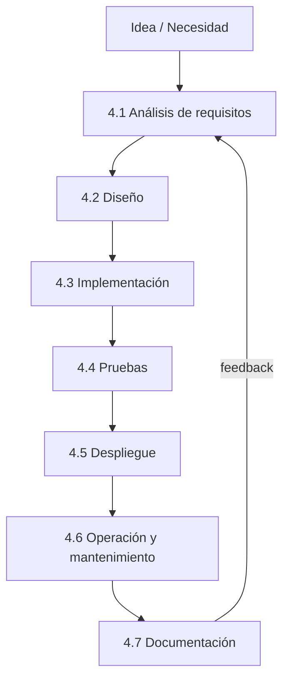
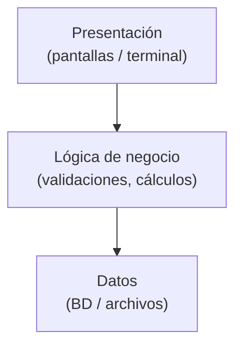
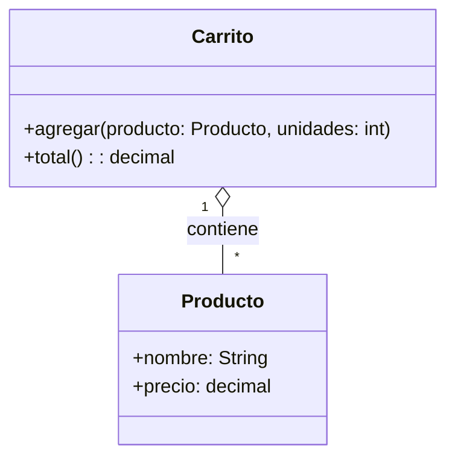
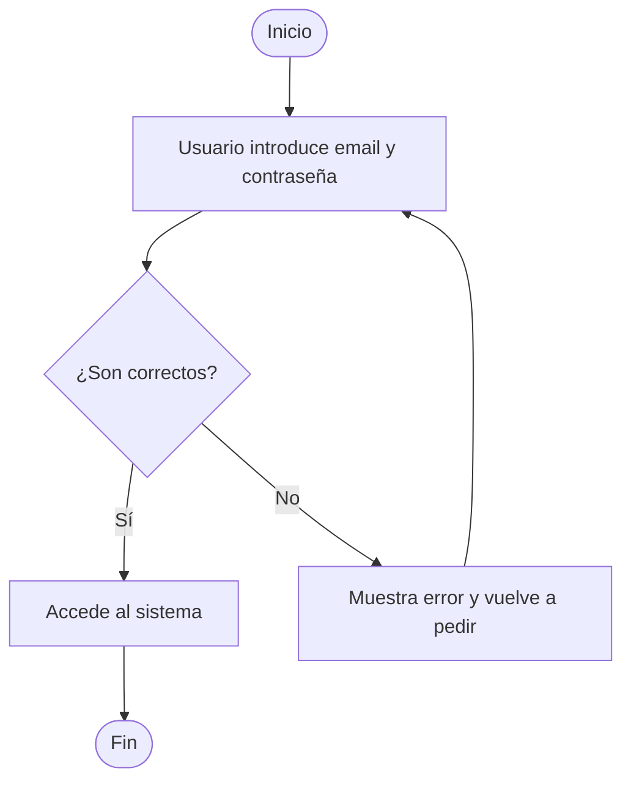
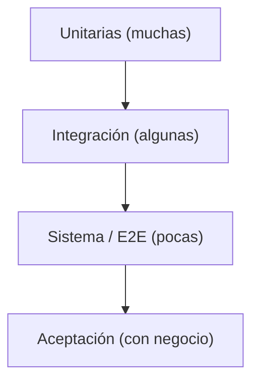
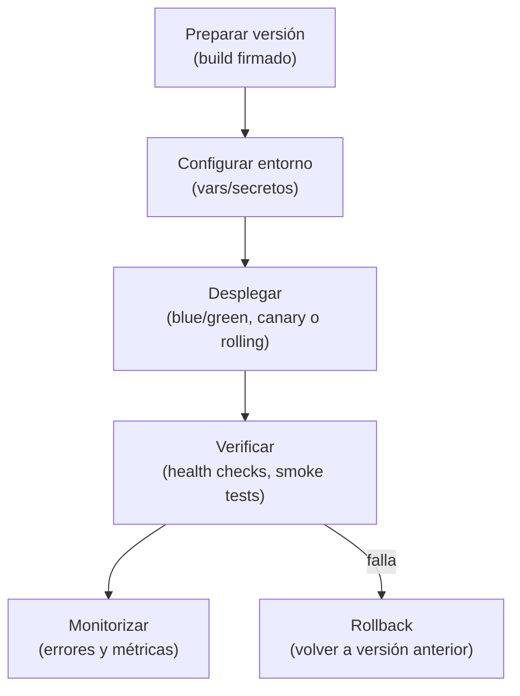
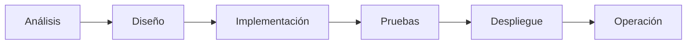
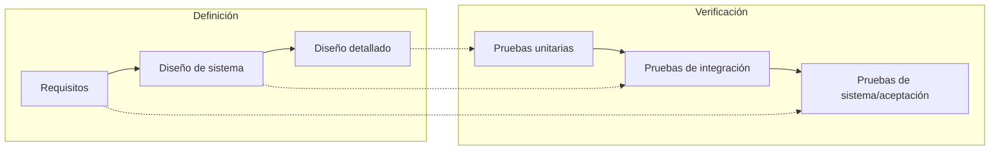
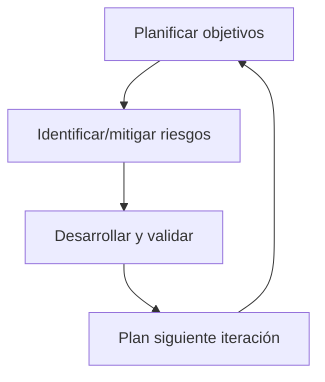

<a id="fases"></a>

# 🧭 4. Fases del desarrollo del software

{ type=application/pdf style="width:100%;min-height:80vh" }

!!!info "Descarga de diapositivas"
    [Descarga las diapositivas](diapositivas/fases.pdf){target="_blank" rel="noopener"}


---

## 🗺️ Visión general del ciclo

Antes de escribir código, un producto pasa por varias **fases conectadas**. Cada fase produce **salidas** (artefactos) que sirven de **entrada** a la siguiente. El ciclo no es completamente lineal: solemos **iterar** y volver atrás cuando aparecen cambios o nueva información.



> **Idea clave:** cada fase reduce la **incertidumbre** y mejora la **calidad** del resultado. El objetivo no es “cumplir etapas”, sino **entregar valor** con seguridad y previsibilidad.

---

## 4.1 Análisis de requisitos: funcionales / no funcionales; historias de usuario

El **análisis** transforma una necesidad en una lista de **condiciones verificables** que el software debe cumplir. Si esta fase es ambigua, todo lo posterior tambalea.

<div class="grid cards" markdown>
-   :material-flag-checkered: **Propósito**
    - Alinear **negocio ↔ equipo técnico**.
    - Acotar alcance, riesgos y dependencias.
    - Definir **criterios de éxito** medibles.

-   :material-account-group: **Cuándo**
    - Al inicio de cada **iteración** o **proyecto**.
    - Antes de decisiones de arquitectura.
</div>

### ✅ Requisitos **funcionales** (¿qué debe hacer?)
Describen las **funciones** del sistema: pantallas, reglas, flujos, validaciones…  
**Ejemplo:** “El sistema permite **registrar** usuarios con email y contraseña”.

### ⚙️ Requisitos **no funcionales** (¿cómo debe ser?)
Definen **calidades y restricciones**: rendimiento, seguridad, accesibilidad, escalabilidad, cumplimiento legal (RGPD), usabilidad…  
**Ejemplo:** “El inicio de sesión debe responder en **< 300 ms** para el 95% de peticiones”.

### ✍️ Historias de usuario: qué son, cuándo y para qué
Una **historia de usuario** es una forma **ligera** de capturar una necesidad desde la perspectiva del usuario. Se usan en enfoques **ágiles** para **planificar**, **priorizar** y **probar** funcionalidades. Se redactan al inicio y se **refinan** (grooming) continuamente.

**Formato recomendado**
> **Como** _tipo de usuario_, **quiero** _objetivo_, **para** _beneficio_.  
> **Criterios de aceptación** (Given/When/Then) para verificar la historia.

**Ejemplo**
```gherkin
Historia: Recuperación de contraseña
  Como cliente
  Quiero restablecer mi contraseña
  Para recuperar acceso si la olvido

Criterios de aceptación:
  Given estoy en "Olvidé mi contraseña"
  When introduzco mi email y confirmo
  Then recibo un enlace de recuperación válido 30 minutos
```

!!! tip "Calidad de historias (INVEST)"
    - **I**ndependiente · **N**egociable · **V**aliosa · **E**stimable · **S**imple · **T**estable

!!! info "Entradas → Salidas"
    - **Entradas:** objetivos de negocio, restricciones, normativa, *stakeholders*.
    - **Salidas:** requisitos priorizados, historias con criterios, *mockups* y flujo de alto nivel.

---

## 4.2 Diseño: arquitectura, patrones, diagramas UML (clases, casos de uso, actividad)

!!! info "¿Qué es el diseño?"
    Es el **puente** entre *lo que queremos* (requisitos) y *cómo lo construiremos* (código).  
    Sirve para **dividir el problema en piezas**, **acordar cómo encajan** y **evitar sorpresas** cuando programemos.

### 🎯 Objetivos del diseño 
- **Elegir** cómo vamos a **organizar** el programa (en una pieza o por capas).
- **Diseñar diagramas** (qué datos hay, qué pasos sigue un flujo).
- **Escribir** 2–3 decisiones clave (y por qué), para recordarlas después.

---

### 🏗️ Arquitectura 
Piensa en “**la forma**” de la aplicación. Empezaremos con **tres** modelos fáciles:

<div class="grid cards" markdown>
-   :material-package-variant-closed: **Una sola pieza (monolito)**
    - Todo va **junto** en una misma aplicación.
    - ✅ Fácil de arrancar y entender.
    - 💡 Útil para **proyectos pequeños** o primeras prácticas.
-   :material-layers: **Por capas (3 capas)**
    - **Presentación** (lo que se ve) → **Lógica** (reglas) → **Datos** (base de datos/archivos).
    - ✅ Ordena el código y separa responsabilidades.
    - 💡 Típico en **apps web** o de escritorio sencillas.
-   :material-vector-triangle: **Varias piezas que hablan (servicios)**
    - La app se divide en **varias partes** que se envían **mensajes**.
    - ✅ Escala bien si crece mucho.
    - ⚠️ **Más avanzado**: no lo necesitamos para empezar.
</div>

Diagrama simple de **tres capas**:



---


### 📐 UML para elaborar diagramas
UML son **diagramas simples** que nos permiten documentar el software. Usaremos **solo** lo esencial:

**1) Clases (qué datos hay y cómo se relacionan)**



- **Producto** tiene **nombre** y **precio**.  
- **Carrito** puede **agregar** productos y calcular el **total**.

**2) Actividad (los pasos de un flujo)**

- Representa **decisiones** y **bucles** (intento de login).

**3) Casos de uso (quién usa qué)**

- Lista sencilla: *“Registrar”, “Iniciar sesión”, “Añadir al carrito”, “Pagar”*.  
- **Actor**: quién lo hace (Cliente, Admin).  
- 💡 No hace falta dibujar ahora; con **títulos y actores** ya aclaramos el alcance.

---

### 🧾 ¿Qué entrego al acabar el diseño (mínimo útil)?
- Los **diagramas elaborados**.  
- Las **decisiones** tomadas: “Usaremos 3 capas porque…”, “La lógica de compra va aparte…”.  

!!! tip "Pista para tus primeros ejercicios"
    - Empieza **en monolito** y **tres capas** (Presentación/Lógica/Datos).  
    - Dibuja **solo** lo que necesitas para ponerte de acuerdo.  
    - Si dudas, prioriza **claridad** frente a “técnicas avanzadas”.

!!! info "Entradas → Salidas"
    - **Entradas:** requisitos priorizados e historias; restricciones y normativa; objetivos de calidad (rendimiento, seguridad, etc.).
    - **Salidas:** diagramas UML mínimos; decisiones registradas (ADR); contratos de API/datos; prototipos o *mockups* acordados.

---

## 4.3 Implementación: estilos de código, revisiones

**Objetivo:** convertir el diseño en **código que funciona** y que cualquier compañero pueda **leer y mantener**.

!!! info "¿Qué es la implementación?"
    Es el paso donde tomamos los requisitos y el diseño y los transformamos en **archivos fuente** (por ejemplo, `.java`) que el ordenador puede **compilar y ejecutar**. No es solo “hacer que funcione”: también importa que el código sea **claro, coherente y seguro**.

---

### 🧭 Principios mínimos de buena implementación

1. **Claridad por encima de “ingenio”**  

    - Nombres que expliquen **qué hacen**: `calcularTotalPedido`, `precioConIVA`.  
    - Evita abreviaturas crípticas.

2. **Una función, una responsabilidad**  

    - Si una función hace muchas cosas, **divídela** en partes más pequeñas con buenos nombres.

3. **No te repitas (DRY)**  

    - Si copias y pegas código, probablemente necesitas una **función reutilizable**.

4. **Comentarios con intención (el “por qué”)**  

    - No comentes lo obvio; explica decisiones o reglas de negocio.

5. **Manejo básico de errores**  

    - Comprueba entradas (p. ej., división por cero) y da **mensajes útiles**.

6. **Consistencia de estilo** 

    - Misma indentación, llaves y espacios en todo el proyecto.  
    - Si es posible, usa formateador (p. ej., *Checkstyle/Spotless* en Java).

---

### ✏️ Ejemplos breves en Java

**Nombres que cuentan una historia**
```java
// ❌ Poco claro
double r = f(p, i);

// ✅ Claro
double totalConImpuestos = calcularTotalPedido(precio, iva);
```

**Una función, una responsabilidad**
```java
// ❌ Mezcla validaciones, cálculos y notificaciones
void procesar(Pedido p) { /* muchas cosas aquí */ }

// ✅ Separa tareas con nombres claros
void procesar(Pedido p) {
    validar(p);
    double total = calcularTotal(p);
    guardar(p, total);
    notificarCliente(p);
}
```

**Comentarios que explican el porqué**
```java
// Evitamos dividir por cero: si b es 0 devolvemos 0 por política de negocio
int dividir(int a, int b) {
    return (b == 0) ? 0 : a / b;
}
```

---

!!! info "Entradas → Salidas"
    - **Entradas:** requisitos claros y un diseño sencillo (qué módulos habrá y cómo se comunican).
    - **Salidas:** código legible que compila y se ejecuta; instrucciones mínimas de cómo ejecutar; casos de uso básicos probados (aunque sea manualmente).

---

## 4.4 Pruebas: unitarias, integración, sistema, aceptación; TDD/BDD

Las **pruebas** son experimentos controlados que hacemos al software para **detectar errores pronto**, mantener la **calidad** y poder **cambiar con confianza**.

!!! info "Idea clave"
    Probar no es “desconfiar del código”, es **aprender rápido** si algo funciona como esperamos. Cuanto **antes** pruebas, **más barato** es corregir.

---

### 🧱 La “pirámide” de pruebas 



 - **Más** pruebas **unitarias** que de integración, y **muy pocas** E2E.  
- Las unitarias son **rápidas** y **baratas**; las E2E son **lentas** y **frágiles**.

---

### 🧪 Tipos de prueba (con ejemplos sencillos)

<div class="grid cards" markdown>

-   :material-function-variant: **Unitarias**  
    **¿Qué prueban?** Una **función** o **clase** aislada.  
    **Ejemplo:** comprobar que `calcularTotal(10, 21%)` devuelve `12.1`.  
    **Objetivo:** detectar fallos **locales** rápido.  

-   :material-call-merge: **Integración**  
    **¿Qué prueban?** El **encaje** entre piezas (función + base de datos, servicio + API, etc.).  
    **Ejemplo:** guardar un pedido y **leerlo** después desde la BD de pruebas.  
    **Objetivo:** verificar **contratos** y entradas/salidas reales.  

-   :material-web: **Sistema / E2E**  
    **¿Qué prueban?** El **flujo completo** como lo ve el usuario.  
    **Ejemplo:** “comprar” un producto: login → carrito → pagar → confirmación.  
    **Objetivo:** comprobar que **todo junto** funciona.  

-   :material-account-check: **Aceptación (UAT)**  
    **¿Qué prueban?** Que se cumplen los **requisitos** acordados con negocio.  
    **Ejemplo:** “Como cliente, puedo **restablecer contraseña** en menos de 30 min”.  
    **Objetivo:** validar valor para el **usuario**.
</div>

!!! tip "Cuándo ejecutar"
    - Cada vez que cambies código.  
    - Antes de entregar una tarea.  
    - Siempre que arregles un bug (añade una prueba que lo **reproduzca**).

---

### 🔁 TDD: pensar con pruebas primero

**TDD (Test‑Driven Development)** propone este ciclo muy corto:

1. **Red** → escribe una prueba **pequeña** que **falle** (todavía no hay código).
2. **Green** → escribe el **mínimo** código para que **pase**.
3. **Refactor** → mejora el diseño, sin romper lo que ya pasa.

!!! example "Mini‑ejemplo mental"
    1) Prueba: “`suma(2,3)` debe devolver `5`” → **falla**.  
    2) Implemento `suma(a,b)` → **pasa**.  
    3) Limpio nombres y casos borde → siguen **en verde**.

---

### 🧾 BDD: comportamientos en lenguaje común

**BDD (Behavior‑Driven Development)** describe comportamientos con un lenguaje cercano al negocio. Se usa a menudo para **aceptación**.

**Formato Gherkin (ejemplo):**
```gherkin
Feature: Recuperar contraseña
  Scenario: Enlace válido
    Given estoy en "Olvidé mi contraseña"
    When introduzco mi email y confirmo
    Then recibo un enlace válido durante 30 minutos
```

- **Given**: contexto inicial. **When**: acción. **Then**: resultado esperado.

---

### ✅ Buenas prácticas para principiantes

- **Una idea por prueba** y nombres **claros** (qué esperas que pase).  
- Prepara **datos propios** en cada prueba (no dependas de los de otra).  
- Evita depender de **Internet** o servicios externos en unitarias.  
- Si algo es difícil de probar, **divide** el problema en piezas más pequeñas.  
- Cuando encuentres un bug, **primero** escribe la prueba que lo reproduce.

!!! warning "Errores típicos"
    - Demasiadas pruebas E2E y **pocas** unitarias → feedback lento.  
    - Pruebas que dependen del **orden** o comparten **estado** → resultados impredecibles.  
    - “Aprobar” a mano sin criterios → la próxima persona no sabrá qué validar.

---

### 🧰 Herramientas (por si las necesitas más adelante)

- **Java**: JUnit (unitarias/integ.), Cucumber (BDD), Selenium (E2E web).  
- **JavaScript**: Jest/Testing Library (unit), Cypress/Playwright (E2E).  
- **Python**: pytest (unit/integr.).

> No es necesario instalarlas para entender este apartado; son **referencias** para cuando empieces a automatizar.

---

!!! info "Entradas → Salidas"
    - **Entradas:** requisitos y criterios de aceptación; código fuente y cambios propuestos; datos de prueba controlados; entorno de pruebas preparado.
    - **Salidas:** lista de pruebas ejecutadas y su resultado (verde/rojo); notas de defectos detectados y cómo se corrigieron; evidencias (capturas/logs) si se piden en la entrega.

---

## 4.5 Despliegue: on-prem, nube, móvil; *release management*

Llevar el software desde “listo para usar” hasta “en manos de los usuarios” **de forma segura** y con **plan de vuelta atrás**.

---

### 🌍 Modalidades de despliegue (visión rápida)

| Modalidad | ¿Dónde vive tu app? | Ventajas claras | A tener en cuenta |
|---|---|---|---|
| **On-premises** | En **tu** propio servidor o CPD | Control total, datos “en casa” | Coste y tareas de sistema: backups, parches, monitorización |
| **Nube (IaaS/PaaS/FaaS)** | En proveedores (AWS, Azure, GCP…) | Elasticidad, servicios gestionados, pago por uso | Dependes del proveedor, costes si crece sin control |
| **Móvil (Android/iOS)** | En **tiendas** (Play/App Store) | Distribución masiva y actualizaciones guiadas | Firmas, revisiones de tienda, tiempos de aprobación |

!!! tip "Ejemplos típicos"
    - **Web estática**: HTML/CSS/JS en un hosting/CDN.  
    - **Backend**: API desplegada en un servicio gestionado (por ejemplo, una máquina virtual o “App Service”).  
    - **Escritorio**: instalador firmado y actualizaciones automáticas.  
    - **Móvil**: APK/IPA firmado y subido a tienda.

---

### 🚦 Estrategias de *release* 

#### 1) Blue/Green (Azul/Verde)
Imagina que tienes **dos copias** del mismo sistema: una es la **azul** (la que usan los usuarios ahora) y otra es la **verde** (vacía, lista para probar la nueva versión).  
Actualizas la **verde** y la pruebas. Si todo va bien, **cambias el tráfico** de azul → verde.

**Ventajas**

- Cambio casi **instantáneo**.
- Si hay fallos, **vuelves** a la azul y listo.

**Cuándo usarlo**

- Cuando necesitas un cambio rápido y seguro.
- Tienes recursos para mantener **dos copias** del sistema.

---

#### 2) Canary (Canario)
Publicas la versión nueva a un **% pequeño** de usuarios (ej.: 5%). Si todo bien, subes al 20%, 50%… hasta el 100%.

**Ventajas**

- **Riesgo bajo**: si algo falla, afecta a poca gente.
- Ves **problemas reales** pronto.

**Cuándo usarlo**

- Cuando puedes dividir a tus usuarios por grupos.
- Quieres observar **comportamiento real** con poco riesgo.

---

#### 3) Rolling (Despliegue gradual)
Tienes varias “copias” del sistema funcionando. Las vas **actualizando una a una**.  
Mientras actualizas una, las demás siguen atendiendo a los usuarios.

**Ventajas**

- Evita **cortes** de servicio.
- No necesitas dos entornos completos (como en Blue/Green).

**Cuándo usarlo**

- Cuando tu sistema tiene **varias instancias** (más de una máquina/contendor).
- No te importa que el proceso tarde un poco más.

---

### Versionado SemVer (3 números que lo dicen todo)
Las versiones suelen tener tres números: **MAJOR.MINOR.PATCH** (por ejemplo, `2.4.7`).

- **MAJOR** (**2**.x.x): cambios **grandes** que pueden **romper compatibilidad** con versiones anteriores.
- **MINOR** (x.**4**.x): **funciones nuevas** que no rompen lo anterior.
- **PATCH** (x.x.**7**): **arreglos** de errores o mejoras pequeñas.

!!! example "Ejemplos rápidos"
    - `1.3.5 → 1.3.6`: arreglaste un bug (**PATCH**).  
    - `1.3.6 → 1.4.0`: añadiste una función (**MINOR**).  
    - `1.4.0 → 2.0.0`: cambió algo importante y hay que adaptar el uso (**MAJOR**).

!!! tip "Buenas prácticas"
    - Acompaña cada versión con un **changelog** (lista de cambios).
    - Ten a mano un **plan de vuelta atrás** (rollback) por si algo sale mal.
    - Prueba la versión **antes** de darla a todos (canary o entorno verde).

---

#### ✅ Resumen 
- **Blue/Green**: dos copias; cambias de una a otra rápidamente.  
- **Canary**: primero pocos usuarios, luego todos.  
- **Rolling**: actualizas poco a poco, sin parar el servicio.  
- **SemVer**: `MAJOR.MINOR.PATCH` para que todos entiendan el tamaño del cambio.

---

### 🔄 Flujo simple de un despliegue



---

### ✅ Lista de comprobación (antes / durante / después)

**Antes**

- Configuración y **secretos** preparados (sin subirlos al repo).  
- **Copia de seguridad** y/o plan de migración de BD.  
- **Notas de versión** y cambios destacados (*changelog*).  

**Durante**

- Activar **mantenimiento** si aplica (mensaje claro al usuario).  
- Ejecutar **smoke tests**: entrar, crear algo, listar, borrar (lo mínimo).  
- Revisar **health checks** y logs de arranque.

**Después**

- Vigilar **errores** y **métricas** (latencia, tasa de error) los primeros minutos.  
- Confirmar **funcionalidades clave** con un recorrido corto.  
- Comunicar finalización y **próximos pasos** (por ejemplo, cuándo se hará el siguiente despliegue).

---

### 🧯 Rollback (plan de vuelta atrás)

!!! info "Opciones comunes"
    - **Volver de Blue a Green** (o al revés).  
    - **Reinstalar** la **versión anterior** empaquetada.  
    - **Deshacer migraciones** (si son reversibles) o tener **backup** para restaurar.  
    - Desactivar cambios con **feature flags** (si los usas). Las feature flags son **interruptores en el código** que te permiten encender o apagar una funcionalidad sin volver a desplegar. Si la novedad da **problemas, apagas** solo esa parte y el resto del sistema sigue funcionando. Además, puedes **probarla con un % de usuarios primero y ampliarlo si todo va bien** (las flags suelen controlarse por configuración o un servicio remoto).

!!! warning "Errores frecuentes"
    - Hacer un despliegue **sin** plan de rollback.  
    - Olvidar la **base de datos** en el plan (migraciones irreversibles).  
    - No comprobar **configuraciones** por entorno (producción ≠ desarrollo).

---

!!! info "Entradas → Salidas"
    - **Entradas:** build aprobado, configuración/secretos, instrucciones de despliegue.
    - **Salidas:** versión publicada; *changelog*/notas; rollback verificado y métricas iniciales revisadas.

---

## 🛠️ 4.6 Operación y mantenimiento: *logging*, métricas, *tracing*, observabilidad

---

Una vez que el software está en producción, el trabajo **no termina**: hay que **vigilarlo**, **resolver incidencias** y **mejorarlo**. A esto lo llamamos **operación y mantenimiento**. El objetivo es que las personas usuarias **reciban un buen servicio** (rápido, disponible y seguro) y que el equipo pueda **detectar problemas a tiempo**.

---

### 👀 Observabilidad: ver lo que pasa por dentro

**Observabilidad** es la capacidad de **entender** qué ocurre en el sistema usando sus señales. Nos apoyamos en **cuatro** tipos de señales principales:

#### 1) Logs (registros)
- **Qué son:** mensajes de texto que el sistema escribe cuando pasa algo (inicio, error, dato procesado…).  
- **Para qué sirven:** reconstruir lo ocurrido ante un problema.  
- **Buenas prácticas:** niveles (`debug`, `info`, `warn`, `error`) y formato consistente (idealmente **estructurado/JSON**).

```json
{"nivel":"error","mensaje":"No se pudo guardar el pedido","pedidoId":1234,"causa":"timeout"}
```

#### 2) Métricas
- **Qué son:** números que se miden a intervalos (por ejemplo, **tiempo de respuesta**, **nº de errores**, **usuarios activos**).  
- **Tipos comunes:** contadores (suben), *gauges* (suben/bajan), histogramas (distribución de tiempos).  
- **Ejemplos útiles:**  

    - Latencia media y **p95** (el 95% de peticiones son más rápidas que X ms).  
    - Errores por minuto.  
    - Uso de CPU/RAM.

#### 3) *Tracing* distribuido
- **Qué es:** seguimiento de una **misma petición** cuando pasa por varios servicios (A → B → C).  
- **Para qué sirve:** localizar **dónde** se pierde tiempo o **dónde** falla.  
- **Truco práctico:** añade un **ID de correlación** a cada petición y **propágalo** entre servicios.

#### 4) Eventos / perfiles
- **Eventos:** señales de cosas concretas que han ocurrido (ej.: “pedido_creado”).  
- **Perfiles:** mediciones internas para diagnosticar rendimiento (*profiling*). Útiles cuando algo va **lento** y no sabemos por qué.

!!! tip "Resumen rápido"
    - **Logs** para **narrar** lo que pasó.  
    - **Métricas** para **medir** salud y tendencias.  
    - **Traces** para **seguir** una petición compleja.  
    - **Eventos/perfiles** para **diagnosticar** detalles.

---

### 🛠️ Operativa del día a día

#### SLI / SLO (objetivos de servicio)

- **SLI** (indicador): cómo medimos la calidad (p. ej., *disponibilidad*, *latencia*).  
- **SLO** (objetivo): el valor que promete el servicio (p. ej., **99.9%** de disponibilidad mensual o **p95 < 300 ms**).  
- **¿Por qué importan?** Porque guían **qué vigilar** y **cuándo alertar**.

#### Alertas (solo cuando toca)

- **Accionables**: si salta, alguien **sabe qué hacer**.  
- Basadas en **SLO**: alertar por **impacto a la persona usuaria**, no por cualquier pico técnico.  
- **Evita** duplicar alertas; agrupa y silencia cuando hay mantenimiento planificado.

#### Runbooks y post‑mortems

- **Runbook**: guía paso a paso para **resolver** una incidencia (qué mirar, comandos, plan B).  
- **Post‑mortem**: análisis **sin culpas** tras un incidente; causas, impacto y **acciones de mejora**.

#### Mantenimiento preventivo

- **Copias de seguridad** verificadas, **parches** de seguridad al día, limpieza de **logs** antiguos y **rotación** de claves/secretos cuando aplique.

---

### 🔎 Ejemplos de “qué mirar” en una web sencilla

- **Disponibilidad:** % de peticiones que responden **200/OK**.  
- **Rendimiento:** tiempo de respuesta **medio** y **p95**.  
- **Errores:** nº de **5xx** por minuto y su causa más común.  
- **Experiencia:** tiempo de carga de la **página principal**.  

!!! warning "Señales de alarma"
    - Subida brusca de **5xx** o de **latencia p95**.  
    - Más **reintentos** de lo normal hacia un servicio externo.  
    - Uso de **CPU/RAM** al 90% sostenido.

---

!!! info "Entradas → Salidas"
    - **Entradas:** versión desplegada, configuración y *dashboards* iniciales.
    - **Salidas:** alertas configuradas; paneles útiles; *runbooks*; acciones de mejora y parches aplicados.

---

## 4.7 Documentación y gestión del conocimiento

La documentación reduce la dependencia de personas clave, acelera el **onboarding**, baja el coste de mantenimiento y facilita la **toma de decisiones**. No es un “extra”: es parte del producto.

---

### 🎯 Objetivos 
- **Encontrable**: cualquier persona localiza lo que necesita en < 2 minutos.
- **Actualizada**: cada cambio relevante en código/proceso viene con su actualización de docs.
- **Accionable**: guía pasos concretos (no solo teoría).
- **Consistente**: misma voz, estructura y convenciones.
- **Trazable**: saber **quién** cambió **qué** y **por qué** (historial y versión).

---

### 🧱 Mínimo viable de documentación (MVD)
Mantén siempre estos básicos al día en el repositorio principal:

1) **README** (1 página)

- Qué es, arquitectura, cómo ejecutar/desarrollar, cómo probar, cómo desplegar en dev.
- Enlaces al resto de documentación.

2) **Guía de Contribución** (`CONTRIBUTING.md`)

- Flujo de ramas/PRs, estilo de código, cómo correr linter y tests, etiqueta de commits.

3) **Decisiones (ADR)** (`/docs/adr/`)

- Cada decisión técnica relevante, con fecha, contexto, opción elegida y consecuencias.

4) **API y contratos**

- **OpenAPI**/JSON Schema y ejemplos ejecutables (curl/HTTPie).
- Matriz de compatibilidad y política de versionado (SemVer).

5) **Operación**

- **Runbooks** (cómo actuar ante incidentes comunes), **checklists** de despliegue/rollback y **SLO/SLI**.

---

### 🧾 ADR: plantilla breve
```
# ADR-XXX: Título
Fecha: YYYY-MM-DD
Estado: Propuesto | Aprobado | Obsoleto | Reemplazado por ADR-YYY

## Contexto
Problema / fuerzas en conflicto (breve).

## Opciones consideradas
- Opción A
- Opción B
- Opción C

## Decisión
Opción elegida y por qué.

## Consecuencias
Impactos positivos/negativos, riesgos, seguimiento.
```

---

!!! info "Entradas → Salidas"
    - **Entradas:** código y procesos actuales; decisiones recientes; SLO/SLI definidos; estándares de estilo.
    - **Salidas:** documentación mencionada.

---

## ✅ Checklist rápida por fase

??? tip "Abrir checklist"
    **Análisis**  

    - Requisitos claros, medibles y priorizados (MoSCoW/INVEST).  
    - Historias con criterios verificables y glosario.

    **Diseño**  

    - Arquitectura justificada (ADR).  
    - UML mínimo actualizado; contratos de API.

    **Implementación** 

    - Estilo automático; PRs pequeños; commits atómicos.  
    - Revisiones con checklist y cobertura mínima acordada.

    **Pruebas**  

    - Pirámide equilibrada; datos de prueba controlados.  
    - BDD/TDD cuando aplique.

    **Despliegue**  

    - Estrategia (blue/green, canary, rolling) y rollback probado.

    **Operación**  

    - SLI/SLO definidos; alertas; dashboards; runbooks.  
    - Post-mortems con acciones de mejora.

    **Documentación** 
     
    - README, ADR, API, guías; DoD incluye actualización de docs.

---

## 🗂️ Tabla resumen: Entradas → Salidas por fase

| Fase | Entradas (clave) | Salidas (clave) |
|---|---|---|
| **4.1 Análisis** | Objetivos de negocio; restricciones; normativa; *stakeholders* | Requisitos priorizados; historias con criterios; *mockups*; flujo alto nivel |
| **4.2 Diseño** | Requisitos e historias; restricciones; objetivos de calidad | Diagramas UML mínimos; ADR; contratos API/datos; prototipos |
| **4.3 Implementación** | Requisitos claros; diseño acordado | Código legible y ejecutable; guía de ejecución; casos básicos probados |
| **4.4 Pruebas** | Criterios de aceptación; código y cambios; datos de prueba; entorno | Resultados de pruebas; defectos y correcciones; evidencias |
| **4.5 Despliegue** | Build aprobado; configuración/secretos; instrucciones | Versión publicada; *changelog*/notas; rollback verificado; métricas iniciales |
| **4.6 Operación** | Versión desplegada; configuración; *dashboards* | Alertas configuradas; paneles; *runbooks*; mejoras y parches |
| **4.7 Documentación** | Código/procesos; decisiones; SLO/SLI; estándares | Documentación MVD publicada y versionada (README, ADR, API, operación) |


## 📚 4.8 Metodologías de ciclo de vida 

---

Este apartado resume los **principales enfoques** para organizar las fases del desarrollo. No sustituyen a las fases vistas (análisis → diseño → implementación → pruebas → despliegue → operación → documentación), sino que **ordenan cómo iteramos, entregamos y controlamos el riesgo**.

!!! tip "Idea clave"
    Elige el modelo según **incertidumbre**, **riesgo**, **regulación** y **necesidad de feedback**. Puedes combinar enfoques (modelos **híbridos**).

---

### 💧 Cascada (Waterfall)

**Secuencial**: cada fase se completa antes de pasar a la siguiente.



**Ventajas**

- Claridad de **entregables** y **fechas**.
- Útil con **requisitos muy estables** y en **entornos regulados**.

**Riesgos**

- **Feedback tardío**; cambios costosos.
- Puede ocultar supuestos hasta muy tarde.

**Cuándo**: software con **alto grado de certeza**, contratos cerrados, normativa estricta.

---

### ✅ Modelo en V

Extiende cascada con **trazabilidad entre fases y pruebas**: cada etapa de definición tiene su **pareja de verificación**.



**Ventajas**: planificación de pruebas desde el principio, **trazabilidad** clara.

**Cuándo**: sectores **críticos** (automoción, aeroespacial, sanitario) o exigencia formal de **verificación/validación**.

---

### 🧱 Incremental

Se entrega el producto en **bloques funcionales** (incrementos) que **suman valor**.

**Ventajas**

- Valor **temprano** y priorizable.
- Reduce el riesgo de “gran entrega final”.

**Riesgos**

- Puede acumular **deuda de arquitectura** si no se piensa a medio plazo.

**Cuándo**: alcance grande que puede **partirse en funcionalidades**.

---

### 🔁 Iterativo

Se repiten ciclos completos (**analizar→diseñar→construir→probar**) para **refinar** el mismo producto.

**Diferencia con incremental**: 

- **Incremental** = añado **nuevas piezas**.
- **Iterativo** = **mejora** la **misma pieza** en vueltas sucesivas.

**Cuándo**: requisitos **difusos** o descubrimiento de UX.

---

### 🌀 Espiral (Boehm)

Ciclos que **ponen el riesgo en el centro**. En cada vuelta: 1) **objetivos** y alternativas, 2) **análisis de riesgos** y mitigación (prototipos), 3) **desarrollo y validación**, 4) **planificación** de la siguiente vuelta.



**Ventajas**: gestión **explícita** de riesgos; combina prototipado y entregas.

**Riesgos**: complejidad de gestión; requiere experiencia.

**Cuándo**: proyectos **innovadores** o de **alto riesgo** técnico/negocio.

---

### ⚡ Enfoques ágiles (Scrum, Kanban, XP)

Los veremos en la última parte del tema.

---


