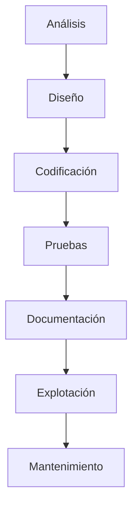

## 4. 🛠 Fases del desarrollo del software

### 📌 Resumen de fases

- **Análisis**: Requisitos del cliente
- **Diseño**: Arquitectura del software
- **Codificación**: Programación del sistema
- **Pruebas**: Validación del funcionamiento
- **Documentación**: Manuales y guías
- **Explotación**: Puesta en marcha
- **Mantenimiento**: Evolución y corrección

---