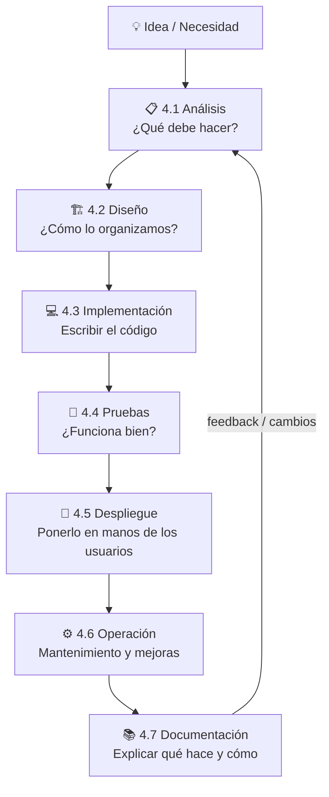
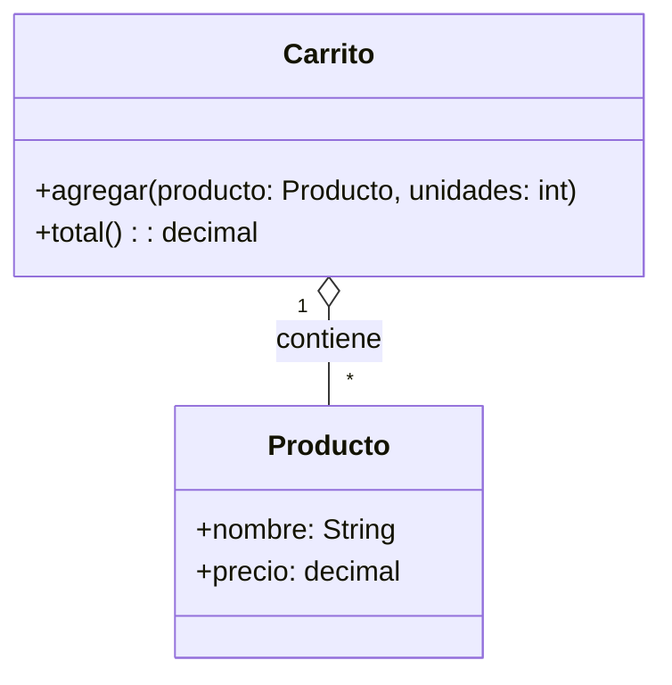
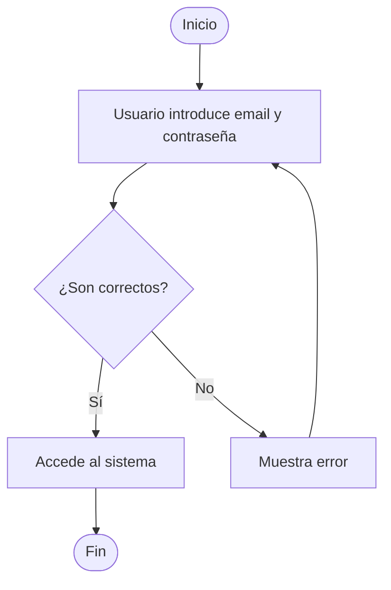
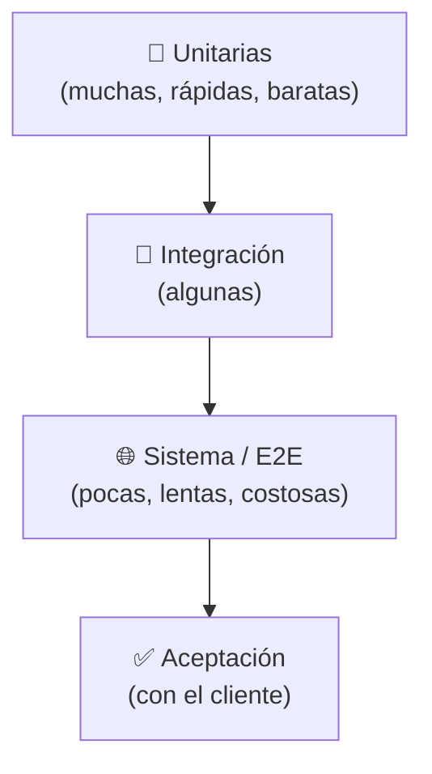
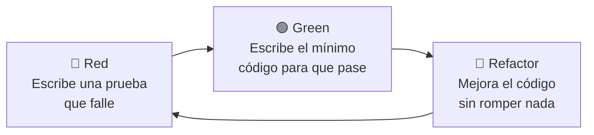
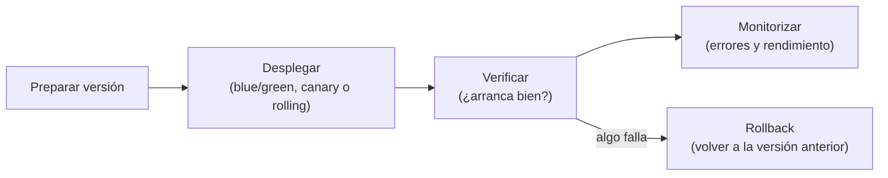
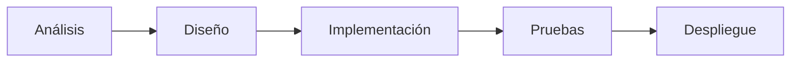
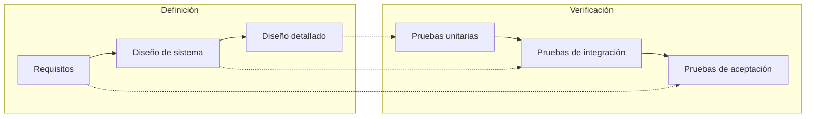
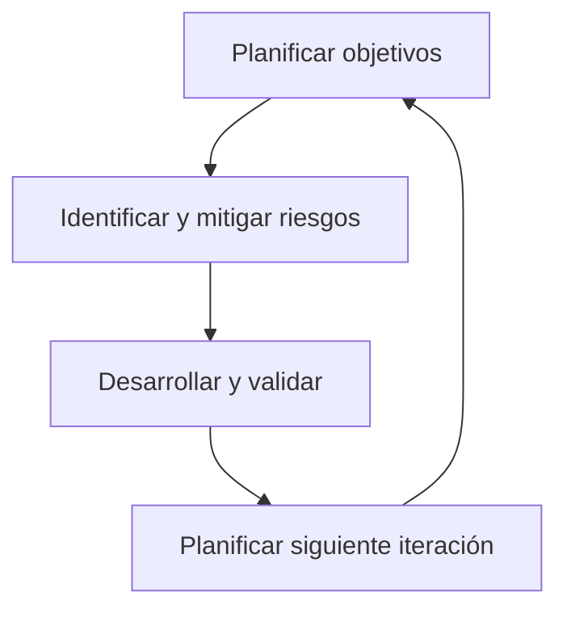

<a id="fases"></a>

# 🧭 4. Fases del desarrollo del software

{ type=application/pdf style="width:100%;min-height:80vh" }

!!!info "Descarga de diapositivas"
    [Descarga las diapositivas](diapositivas/fases.pptx){target="_blank" rel="noopener"}

---

## Visión general del ciclo

Desarrollar software no es solo sentarse a programar. Antes hay que entender qué se necesita, pensar cómo organizarlo, implementarlo, probarlo, entregarlo a los usuarios y mantenerlo funcionando. Cada una de estas actividades forma una **fase**, y la salida de una es la entrada de la siguiente.


```mermaid
flowchart TB
  A["💡 Idea / Necesidad"] --> B["📋 4.1 Análisis\n¿Qué debe hacer?"]
  B --> C["🏗️ 4.2 Diseño\n¿Cómo lo organizamos?"]
  C --> D["💻 4.3 Implementación\nEscribir el código"]
  D --> E["🧪 4.4 Pruebas\n¿Funciona bien?"]
  E --> G["🚀 4.5 Despliegue\nPonerlo en manos de los usuarios"]
  G --> H["⚙️ 4.6 Operación\nMantenimiento y mejoras"]
  H --> I["📚 4.7 Documentación\nExplicar qué hace y cómo"]
  I -->|"feedback / cambios"| B
```

!!! note "Por qué existen estas fases"
    Imagina que te piden construir una casa. Si empiezas a poner ladrillos antes de tener un plano, cuando llegue el fontanero ya no podrá pasar la tubería donde tiene que ir. El software pasa lo mismo: cada euro que cuesta arreglar un error en producción habría costado mucho menos si se hubiera detectado antes. Las fases existen para detectar problemas cuando todavía son baratos de resolver.

| Fase | Pregunta clave | Resultado típico |
|---|---|---|
| Análisis | ¿Qué debe hacer el sistema? | Lista de requisitos, historias de usuario |
| Diseño | ¿Cómo lo organizamos? | Diagramas, decisiones de arquitectura |
| Implementación | ¿Cómo lo codificamos? | Código fuente revisado |
| Pruebas | ¿Funciona como se espera? | Informes de prueba, bugs corregidos |
| Despliegue | ¿Cómo lo entregamos? | Versión publicada |
| Operación | ¿Sigue funcionando? | Métricas, alertas, parches |
| Documentación | ¿Cómo lo explicamos? | README, guías, comentarios |

---

## 4.1 Análisis de requisitos

El **análisis** transforma una necesidad en una lista de condiciones verificables que el software debe cumplir. Si esta fase queda poco clara, los problemas aparecen en la implementación o, peor aún, cuando el programa ya está en manos de los usuarios.

En esta fase participan los **stakeholders** —las personas interesadas en el proyecto: el cliente, los usuarios finales, el equipo técnico, dirección…— y el objetivo es que todos acaben con la misma imagen de lo que hay que construir.

### Requisitos funcionales y no funcionales

Los **requisitos funcionales** describen qué debe hacer el sistema: pantallas, flujos, validaciones, reglas de negocio.

> Ejemplo: *"El sistema permite registrar usuarios con email y contraseña."*

Los **requisitos no funcionales** describen cómo debe ser: rendimiento, seguridad, accesibilidad, cumplimiento legal.

> Ejemplo: *"El inicio de sesión debe responder en menos de 300 ms para el 95% de las peticiones."*

### Historias de usuario

Una **historia de usuario** es una forma sencilla de capturar una necesidad desde el punto de vista de quien va a usar el sistema. Se usan en entornos ágiles para planificar y priorizar funcionalidades, y se escriben con este formato:

> **Como** *tipo de usuario*, **quiero** *objetivo*, **para** *beneficio*.

A cada historia se le añaden **criterios de aceptación** —condiciones concretas que deben cumplirse para considerar la historia terminada— usando el formato Given/When/Then:

```gherkin
Historia: Recuperación de contraseña
  Como cliente
  Quiero restablecer mi contraseña
  Para recuperar acceso si la olvido

Criterios de aceptación:
  Given estoy en "Olvidé mi contraseña"
  When introduzco mi email y confirmo
  Then recibo un enlace de recuperación válido durante 30 minutos
```

!!! tip "¿Qué hace una buena historia? — INVEST"
    Una historia bien escrita cumple seis criterios:

    | Letra | Significa | Qué implica |
    |---|---|---|
    | **I** | Independiente | No depende de otra historia para poder desarrollarse |
    | **N** | Negociable | El cómo puede cambiar; el qué también, si hay razón |
    | **V** | Valiosa | Aporta algo concreto al usuario o al negocio |
    | **E** | Estimable | El equipo puede calcular cuánto cuesta hacerla |
    | **S** | Simple | Cabe en una iteración; si no, hay que partirla |
    | **T** | Testable | Tiene criterios de aceptación verificables |

!!! info "Entradas → Salidas"
    - **Entradas:** objetivos del proyecto, restricciones, normativa aplicable, necesidades de los usuarios.
    - **Salidas:** lista de requisitos priorizados, historias con criterios de aceptación, bocetos (*mockups* —representaciones visuales rápidas de cómo quedará la interfaz—) y flujo general de la aplicación.

---

## 4.2 Diseño: arquitectura, patrones y diagramas UML

!!! info "¿Qué es el diseño?"
    Es el puente entre *lo que queremos* (requisitos) y *cómo lo construiremos* (código). Sirve para dividir el problema en piezas, acordar cómo encajan y evitar sorpresas cuando programemos.

### Arquitectura

La arquitectura define la forma general de la aplicación: cómo se divide, qué piezas hay y cómo se comunican. Para empezar, con tres modelos es suficiente:

<div class="tabs-colored" markdown>

=== "📦 Monolito"
    Todo el código vive en una sola aplicación. Es el punto de partida natural para proyectos pequeños o primeras prácticas: fácil de arrancar, de entender y de desplegar.

    **Cuándo usarlo:** proyectos pequeños, primeras prácticas, equipos de una o dos personas.

=== "🗂️ Tres capas"
    El código se divide en tres niveles con responsabilidades distintas:

    - **Presentación** — lo que el usuario ve (pantallas, formularios).
    - **Lógica** — las reglas del negocio y los cálculos.
    - **Datos** — el acceso a la base de datos o a archivos.

    ```mermaid
    flowchart TB
      UI["Presentación\n(pantallas / formularios)"]
      LOG["Lógica de negocio\n(validaciones, cálculos)"]
      DAT["Datos\n(base de datos / archivos)"]
      UI --> LOG --> DAT
    ```

    **Cuándo usarlo:** aplicaciones web o de escritorio de tamaño medio; es la arquitectura más habitual en los proyectos de DAW y DAM.

=== "🔗 Servicios"
    La aplicación se divide en varias piezas independientes que se comunican entre sí enviándose mensajes. Escala bien cuando el sistema crece mucho, pero añade complejidad que no es necesaria para empezar.

    **Cuándo usarlo:** sistemas grandes con equipos independientes. No lo necesitarás en los primeros proyectos.

</div>

### Diagramas UML

UML (*Unified Modeling Language*) es un conjunto de tipos de diagramas estándar para documentar software. Usaremos solo los más útiles:

**Diagrama de clases — qué datos hay y cómo se relacionan**


```mermaid
classDiagram
  class Carrito {
    +agregar(producto: Producto, unidades: int)
    +total(): decimal
  }
  class Producto {
    +nombre: String
    +precio: decimal
  }
  Carrito "1" o-- "*" Producto : contiene
```

**Diagrama de actividad — los pasos de un flujo**


```mermaid
flowchart TD
  S([Inicio]) --> A[Usuario introduce email y contraseña]
  A --> B{¿Son correctos?}
  B -- Sí --> C[Accede al sistema]
  B -- No --> D[Muestra error]
  D --> A
  C --> E([Fin])
```

**Casos de uso — quién hace qué**
Una lista sencilla de acciones y actores ya es suficiente para el alcance: *"Registrar (Cliente)", "Iniciar sesión (Cliente)", "Ver pedidos (Admin)"*. No hace falta un diagrama formal para empezar.

!!! tip "Para tus primeros proyectos"
    Empieza siempre en monolito con tres capas. Dibuja solo lo que necesitas para ponerte de acuerdo con el equipo. Si dudas, prioriza claridad frente a técnicas avanzadas.

!!! info "Entradas → Salidas"
    - **Entradas:** requisitos e historias, restricciones, objetivos de calidad.
    - **Salidas:** diagramas UML mínimos, decisiones de arquitectura documentadas, bocetos acordados.

---

## 4.3 Implementación

**Objetivo:** convertir el diseño en código que funciona y que cualquier compañero pueda leer y mantener. No es solo "que compile": también importa que el código sea claro, coherente y fácil de cambiar.

### Principios básicos

<div class="tabs-colored" markdown>

=== "📖 Claridad"
    Escribe código para la persona que lo leerá después (que muchas veces serás tú mismo seis meses más tarde). Los nombres de variables y funciones deben explicar qué hacen sin necesidad de comentarios.

    ```java
    // ❌ Poco claro
    double r = f(p, i);

    // ✅ Claro
    double totalConImpuestos = calcularTotalPedido(precio, iva);
    ```

=== "🎯 Una responsabilidad"
    Cada función debe hacer una sola cosa. Si una función hace validaciones, cálculos y envía emails a la vez, es muy difícil de probar y de cambiar sin romper algo.

    ```java
    // ❌ Mezcla demasiadas cosas
    void procesar(Pedido p) { /* valida + calcula + guarda + notifica */ }

    // ✅ Cada función tiene su tarea
    void procesar(Pedido p) {
        validar(p);
        double total = calcularTotal(p);
        guardar(p, total);
        notificarCliente(p);
    }
    ```

=== "🔁 No te repitas (DRY)"
    Si copias y pegas el mismo bloque de código en varios sitios, cuando haya que cambiarlo tendrás que buscarlo y cambiarlo en todos. La solución es extraerlo a una función reutilizable.

=== "💬 Comentarios útiles"
    No comentes lo que el código ya dice. Comenta el *porqué*: decisiones, reglas de negocio, restricciones que no son obvias.

    ```java
    // Evitamos dividir por cero: si b es 0 devolvemos 0 por política de negocio
    int dividir(int a, int b) {
        return (b == 0) ? 0 : a / b;
    }
    ```

=== "🎨 Estilo consistente"
    Misma indentación, llaves y espacios en todo el proyecto. Si trabajas en equipo, un formateador automático (como *Checkstyle* en Java) evita discusiones y errores.

</div>

!!! info "Entradas → Salidas"
    - **Entradas:** requisitos claros y diseño acordado.
    - **Salidas:** código que compila y se ejecuta, instrucciones mínimas de cómo arrancarlo, casos básicos probados manualmente.

---

## 4.4 Pruebas

Las pruebas son comprobaciones sistemáticas que hacemos al software para detectar errores pronto y poder hacer cambios sin miedo a romper lo que ya funciona. Probar no es "desconfiar del código": es aprender rápido si algo funciona como esperamos. Cuanto antes pruebas, más barato es corregir.

### La pirámide de pruebas

La idea es sencilla: muchas pruebas rápidas y baratas en la base, pocas pruebas lentas y costosas arriba. Si la pirámide está al revés (más pruebas de sistema que unitarias), el feedback es lento y los fallos tardan en detectarse.


```mermaid
flowchart TB
  U["🧱 Unitarias\n(muchas, rápidas, baratas)"]
  I["🔗 Integración\n(algunas)"]
  S["🌐 Sistema / E2E\n(pocas, lentas, costosas)"]
  A["✅ Aceptación\n(con el cliente)"]
  U --> I --> S --> A
```

### Tipos de prueba

<div class="tabs-colored" markdown>

=== "🧱 Unitarias"
    Prueban una sola función o clase de forma aislada. Son las más rápidas y las más fáciles de escribir y mantener.

    **Ejemplo:** comprobar que `calcularTotal(10, 0.21)` devuelve `12.1`.

    **Herramientas:** JUnit (Java), Jest (JavaScript), pytest (Python).

=== "🔗 Integración"
    Prueban el encaje entre piezas: una función con su base de datos, un servicio con una API externa. Verifican que los contratos entre partes se cumplen.

    **Ejemplo:** guardar un pedido en la base de datos de pruebas y leerlo después para comprobar que se guardó bien.

=== "🌐 Sistema / E2E"
    Prueban el flujo completo tal como lo ve el usuario, de principio a fin.

    **Ejemplo:** "comprar" un producto: login → añadir al carrito → pagar → ver confirmación.

    **Herramientas:** Selenium, Cypress, Playwright.

=== "✅ Aceptación"
    Verifican que el sistema cumple los requisitos acordados con el cliente. Se basan directamente en los criterios de aceptación de las historias de usuario.

    **Ejemplo:** *"Como cliente, puedo restablecer mi contraseña y recibir el enlace en menos de 5 minutos."*

</div>

### TDD: escribir la prueba antes que el código

**TDD** (*Test-Driven Development*) propone un ciclo muy corto que invierte el orden habitual: primero escribes la prueba, luego el código mínimo para que pase, y luego limpias.


```mermaid
flowchart LR
  R["🔴 Red\nEscribe una prueba\nque falle"] --> G["🟢 Green\nEscribe el mínimo\ncódigo para que pase"]
  G --> RF["🔵 Refactor\nMejora el código\nsin romper nada"]
  RF --> R
```

La ventaja es que al terminar tienes el código y las pruebas a la vez, y el diseño suele ser más simple porque solo escribes lo que la prueba necesita.

### BDD: describir comportamientos en lenguaje común

**BDD** (*Behavior-Driven Development*) describe el comportamiento esperado en un lenguaje que tanto el equipo técnico como el cliente pueden entender. Se usa sobre todo para las pruebas de aceptación.

```gherkin
Feature: Recuperar contraseña
  Scenario: Enlace válido
    Given estoy en "Olvidé mi contraseña"
    When introduzco mi email y confirmo
    Then recibo un enlace válido durante 30 minutos
```

!!! warning "Errores frecuentes en pruebas"
    - Demasiadas pruebas E2E y pocas unitarias → el feedback tarda mucho.
    - Pruebas que dependen del orden de ejecución → resultados impredecibles.
    - Cuando encuentras un bug, escribe primero la prueba que lo reproduce, luego corrígelo.

!!! info "Entradas → Salidas"
    - **Entradas:** criterios de aceptación, código a probar, datos de prueba controlados.
    - **Salidas:** resultados de las pruebas, lista de bugs detectados y corregidos.

---

## 4.5 Despliegue

Desplegar es llevar el software desde "listo en el repositorio" hasta "en manos de los usuarios" de forma segura y con un plan de vuelta atrás si algo falla.

### Dónde puede vivir tu aplicación

| Modalidad | Dónde se ejecuta | Ventajas | A tener en cuenta |
|---|---|---|---|
| **Servidor propio** (*on-premises*) | En máquinas que tú o tu empresa gestionáis físicamente | Control total, datos sin salir de la empresa | Tú te encargas de todo: actualizaciones, backups, seguridad |
| **Nube** | En servidores de un proveedor externo (AWS, Azure, Google Cloud…) | Pagas solo lo que usas; escala fácil | Dependes del proveedor; los costes pueden subir si no se controlan |
| **Tienda móvil** | Play Store (Android) o App Store (iOS) | Distribución masiva y actualizaciones automáticas | La tienda revisa la app antes de publicarla; puede tardar días |

### Estrategias de publicación

Cuando tienes una versión nueva lista, no siempre conviene dársela a todos los usuarios de golpe. Existen tres estrategias habituales para reducir el riesgo:

| Estrategia | Cómo funciona | Ventaja principal | Cuándo usarla |
|---|---|---|---|
| **Blue/Green** | Mantienes dos entornos idénticos (azul = actual, verde = nueva versión). Cuando la versión verde está lista, cambias el tráfico de golpe. | Si algo falla, vuelves al entorno azul en segundos | Cambios grandes donde quieres poder revertir rápido |
| **Canary** | Publicas la nueva versión solo a un porcentaje pequeño de usuarios (p. ej., el 5%). Si va bien, amplías gradualmente hasta el 100%. | Los errores afectan a muy poca gente | Cuando quieres observar el comportamiento real antes de publicar del todo |
| **Rolling** | Actualizas las instancias del servidor una a una. Mientras una se actualiza, las demás siguen funcionando. | No hay corte de servicio | Sistemas con varias instancias en paralelo |

### Versionado con SemVer

Las versiones suelen tener tres números: **MAJOR.MINOR.PATCH** (por ejemplo, `2.4.7`).

- **MAJOR** → cambio que rompe compatibilidad con versiones anteriores.
- **MINOR** → función nueva que no rompe nada.
- **PATCH** → arreglo de un bug.

!!! example "Ejemplos rápidos"
    - `1.3.5 → 1.3.6` → arreglaste un bug (**PATCH**).
    - `1.3.6 → 1.4.0` → añadiste una función nueva (**MINOR**).
    - `1.4.0 → 2.0.0` → cambiaste algo que obliga a los usuarios a adaptar su código (**MAJOR**).

### Flujo típico de un despliegue


```mermaid
flowchart LR
  P["Preparar versión"] --> D["Desplegar\n(blue/green, canary o rolling)"]
  D --> V["Verificar\n(¿arranca bien?)"]
  V --> M["Monitorizar\n(errores y rendimiento)"]
  V -->|"algo falla"| R["Rollback\n(volver a la versión anterior)"]
```

!!! warning "Antes de desplegar, comprueba siempre"
    - Los datos de configuración (contraseñas, URLs de base de datos) están en el entorno destino, **no en el código**.
    - Tienes una copia de seguridad de la base de datos si vas a hacer cambios en su estructura.
    - Sabes cómo volver atrás si algo sale mal.

!!! info "Entradas → Salidas"
    - **Entradas:** versión aprobada, configuración del entorno, instrucciones de despliegue.
    - **Salidas:** versión publicada, lista de cambios, plan de vuelta atrás verificado.

---

## 4.6 Operación y mantenimiento

Una vez que el software está en producción, el trabajo no termina: hay que vigilarlo, resolver problemas y mejorarlo con el tiempo. El objetivo es que los usuarios reciban un servicio fiable y que el equipo detecte los problemas antes de que los noten los usuarios.

### Observar qué está pasando

Para saber si el sistema funciona bien sin tener que estar mirando la pantalla todo el tiempo, se recogen señales automáticas:

<div class="tabs-colored" markdown>

=== "📋 Logs"
    Los **logs** son mensajes de texto que la aplicación escribe mientras funciona: "usuario X inició sesión", "error al guardar el pedido 1234", "proceso iniciado". Son el primer sitio donde mirar cuando algo falla.

    Es importante clasificarlos por nivel de gravedad:

    | Nivel | Cuándo usarlo |
    |---|---|
    | `DEBUG` | Información detallada para desarrollo; no en producción |
    | `INFO` | Eventos normales: inicio, cierre, acciones del usuario |
    | `WARN` | Algo raro que no ha roto nada pero merece atención |
    | `ERROR` | Algo ha fallado y hay que actuar |

    ```json
    {"nivel": "error", "mensaje": "No se pudo guardar el pedido", "pedidoId": 1234}
    ```

=== "📊 Métricas"
    Las **métricas** son números que se miden a intervalos regulares: cuántas peticiones por segundo recibe el servidor, cuánto tarda en responder, cuántos errores se producen por minuto.

    Las más útiles para empezar:

    - **Tiempo de respuesta** — ¿cuánto tarda el servidor en responder?
    - **Tasa de errores** — ¿qué porcentaje de peticiones falla?
    - **Uso de CPU y memoria** — ¿el servidor está al límite?

    Estas métricas se suelen mostrar en un panel (*dashboard*) que el equipo puede consultar en cualquier momento.

=== "🚨 Alertas"
    Una **alerta** es una notificación automática que se dispara cuando una métrica supera un umbral preocupante. Por ejemplo: "si la tasa de errores sube por encima del 5%, avisa al equipo".

    Para que las alertas sean útiles tienen que ser **accionables**: cuando salta una, alguien sabe exactamente qué tiene que hacer. Un equipo con demasiadas alertas que nadie entiende acaba por ignorarlas todas.

    Los **runbooks** —guías paso a paso que explican cómo responder ante una incidencia concreta— ayudan a que cualquier persona del equipo pueda actuar sin depender de quien lo creó.

</div>

### Tipos de mantenimiento

No todo el mantenimiento es urgente. Hay cuatro tipos:

| Tipo | Cuándo ocurre | Ejemplo |
|---|---|---|
| **Correctivo** | Cuando se detecta un bug en producción | Arreglar un error que hace que la app cierre sola |
| **Adaptativo** | Cuando cambia el entorno externo | Actualizar la app porque Android lanzó una nueva versión |
| **Perfectivo** | Para mejorar el rendimiento o la usabilidad | Reducir el tiempo de carga de una pantalla |
| **Preventivo** | Para evitar problemas futuros | Actualizar dependencias con vulnerabilidades conocidas |

!!! warning "Señales de que algo va mal"
    - Subida brusca de errores en los logs.
    - El tiempo de respuesta aumenta progresivamente sin causa aparente.
    - El uso de memoria no para de crecer (posible *memory leak* — pérdida de memoria: el programa reserva memoria pero nunca la libera).

!!! info "Entradas → Salidas"
    - **Entradas:** versión desplegada, logs y métricas iniciales.
    - **Salidas:** alertas configuradas, panel de monitorización, mejoras y parches aplicados.

---

## 4.7 Documentación

La documentación reduce la dependencia de personas clave, facilita que alguien nuevo entienda el proyecto rápido (*onboarding* — el proceso de incorporación de una persona nueva al equipo) y baja el coste de mantenimiento. No es un "extra": es parte del producto.

### Qué documentar como mínimo

**README** — el punto de entrada de cualquier proyecto. Debe responder a: ¿qué hace este programa?, ¿cómo lo instalo?, ¿cómo lo ejecuto?, ¿cómo lo pruebo?

**Comentarios en el código** — no para explicar qué hace el código (los nombres ya lo hacen), sino para explicar *por qué* se tomó una decisión concreta o qué restricción hay que recordar.

```java
// Usamos precio sin IVA aquí porque el descuento se aplica antes de impuestos
// (ver requisito RF-14 del documento de análisis)
double precioConDescuento = precio * (1 - descuento);
```

**Registro de decisiones** — cuando el equipo toma una decisión técnica importante (elegir una base de datos, un framework, una arquitectura), conviene anotar qué se eligió y por qué. Así, meses después, nadie se pregunta "¿y por qué lo hicimos así?".

Un formato sencillo basta:

```
Decisión: usamos PostgreSQL como base de datos
Fecha: 2024-03-15
Motivo: necesitamos transacciones ACID y el equipo ya tiene experiencia con SQL
Alternativas descartadas: MongoDB (no teníamos experiencia), SQLite (no escala)
```

**Guía de contribución** — si más de una persona trabaja en el proyecto, un documento corto que explique cómo hacer cambios, cómo nombrar ramas, cómo pasar las pruebas antes de entregar.

!!! tip "La regla del nuevo compañero"
    Una buena forma de comprobar si la documentación es suficiente: ¿podría una persona que empieza hoy en el equipo poner el proyecto en marcha en menos de una hora siguiendo solo lo que está escrito? Si la respuesta es no, falta documentación.

!!! info "Entradas → Salidas"
    - **Entradas:** código y procesos actuales, decisiones tomadas durante el proyecto.
    - **Salidas:** README actualizado, comentarios útiles en el código, registro de decisiones importantes.

---

## Checklist rápida por fase

??? tip "Abrir checklist"
    **Análisis**
    - Requisitos claros, medibles y priorizados.
    - Historias con criterios de aceptación verificables.

    **Diseño**
    - Arquitectura justificada y documentada.
    - Diagramas UML mínimos acordados con el equipo.

    **Implementación**
    - Nombres claros, funciones con una sola responsabilidad.
    - Revisión de código antes de integrar.

    **Pruebas**
    - Pirámide equilibrada: más unitarias que E2E.
    - Datos de prueba controlados y aislados.

    **Despliegue**
    - Estrategia de publicación elegida y plan de vuelta atrás preparado.
    - Configuración del entorno separada del código.

    **Operación**
    - Logs, métricas y alertas configuradas.
    - Runbook para las incidencias más probables.

    **Documentación**
    - README completo y actualizado.
    - Decisiones importantes registradas.

---

## Tabla resumen: Entradas → Salidas por fase

| Fase | Entradas | Salidas |
|---|---|---|
| **4.1 Análisis** | Objetivos, restricciones, necesidades de los usuarios | Requisitos priorizados, historias con criterios, bocetos |
| **4.2 Diseño** | Requisitos, restricciones, objetivos de calidad | Diagramas UML, decisiones de arquitectura, bocetos acordados |
| **4.3 Implementación** | Requisitos claros, diseño acordado | Código legible y ejecutable, instrucciones de arranque |
| **4.4 Pruebas** | Criterios de aceptación, código, datos de prueba | Resultados, bugs detectados y corregidos |
| **4.5 Despliegue** | Versión aprobada, configuración del entorno | Versión publicada, lista de cambios, plan de vuelta atrás |
| **4.6 Operación** | Versión desplegada, métricas iniciales | Alertas, panel de monitorización, mejoras y parches |
| **4.7 Documentación** | Código y decisiones actuales | README, comentarios, registro de decisiones |

---

## 4.8 Modelos de ciclo de vida

Las fases anteriores (análisis → diseño → implementación → pruebas → despliegue → operación → documentación) siempre están presentes. Lo que cambia según el modelo es **el orden en que se recorren**, **cuándo se entrega algo al usuario** y **cómo se gestionan los cambios**.

### Cascada

Las fases se completan en orden, una detrás de otra, sin volver atrás.


```mermaid
flowchart LR
  A[Análisis] --> B[Diseño] --> C[Implementación] --> D[Pruebas] --> E[Despliegue]
```

**Cuándo funciona bien:** requisitos muy estables desde el principio, proyectos con contrato cerrado, entornos regulados donde hay que documentar cada paso.

**Riesgo principal:** si el cliente cambia de idea a mitad del proyecto, o si los requisitos no estaban bien definidos, el coste de corregirlo es muy alto porque ya se ha construido sobre una base incorrecta.

---

### Modelo en V

Extiende la cascada añadiendo una fase de pruebas correspondiente a cada fase de definición. El lado izquierdo define; el lado derecho verifica.


```mermaid
flowchart LR
  subgraph Definición
    A1[Requisitos] --> A2[Diseño de sistema] --> A3[Diseño detallado]
  end
  subgraph Verificación
    B3[Pruebas unitarias] --> B2[Pruebas de integración] --> B1[Pruebas de aceptación]
  end
  A3 -.-> B3
  A2 -.-> B2
  A1 -.-> B1
```

**Cuándo usarlo:** sectores donde el fallo tiene consecuencias graves (automoción, sanidad, aeroespacial) y se exige documentar la trazabilidad entre requisitos y pruebas.

---

### Incremental e iterativo

Estos dos modelos se confunden con frecuencia porque los dos repiten ciclos, pero la diferencia es importante:

| | Incremental | Iterativo |
|---|---|---|
| **Qué se repite** | Se añaden funcionalidades nuevas en cada ciclo | Se mejora la misma funcionalidad en cada ciclo |
| **Analogía** | Construir la casa habitación a habitación | Hacer un boceto, luego un plano, luego el plano definitivo |
| **Resultado de cada ciclo** | Una pieza nueva que suma al producto anterior | Una versión mejorada de lo que ya había |

**Cuándo usar incremental:** el proyecto es grande pero se puede partir en funcionalidades independientes que entregan valor por separado.

**Cuándo usar iterativo:** los requisitos son difusos al principio y se van descubriendo a medida que el usuario ve el producto.

---

### Espiral

Organiza el desarrollo en ciclos donde el **análisis de riesgos** es el centro de cada vuelta. En cada iteración: se definen objetivos, se identifican y mitigan los riesgos principales, se desarrolla y valida, y se planifica la siguiente vuelta.


```mermaid
flowchart TD
  P[Planificar objetivos] --> R[Identificar y mitigar riesgos]
  R --> D[Desarrollar y validar]
  D --> N[Planificar siguiente iteración]
  N --> P
```

**Cuándo usarlo:** proyectos innovadores con mucha incertidumbre técnica, donde no se sabe bien qué puede salir mal y hay que ir descubriéndolo. Es más complejo de gestionar que los modelos anteriores.

---

### Enfoques ágiles

Los veremos en detalle en el siguiente apartado del tema.

---

### Comparativa de modelos

| Modelo | Ritmo de entrega | Gestión del cambio | Mejor para |
|---|---|---|---|
| **Cascada** | Una entrega al final | Costoso, hay que rediseñar | Requisitos fijos, contratos cerrados |
| **Modelo en V** | Una entrega al final, con verificación formal | Costoso | Sectores regulados, seguridad crítica |
| **Incremental** | Entregas parciales funcionales | Moderado entre incrementos | Proyectos grandes divisibles en partes |
| **Iterativo** | Versiones sucesivas mejoradas | Bien tolerado | Requisitos difusos que se clarifican con el uso |
| **Espiral** | Ciclos con prototipos | Bien gestionado si hay experiencia | Proyectos de alto riesgo técnico |
| **Ágil** | Entregas frecuentes (semanas) | Alta, es su punto fuerte | Proyectos donde el cliente necesita feedback rápido |
