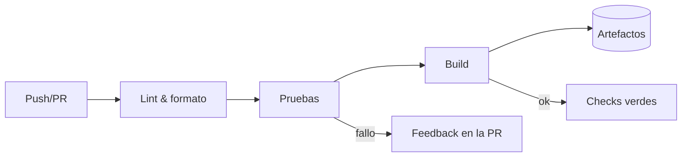

# 🧰 5. Herramientas y procesos de construcción

{ type=application/pdf style="width:100%;min-height:80vh" }

!!!info "Descarga de diapositivas"
    [Descarga las diapositivas](diapositivas/herramientas.pdf){target="_blank" rel="noopener"}

Estas herramientas ayudan a pasar de **código** a **programa que funciona**, a mantener la **calidad** y a **colaborar** sin romper nada.

---

## 5.1 ✍️ Editores e IDEs (qué son y para qué)

- **Editor de código**: para **escribir y navegar** por el código con resaltado, autocompletado y extensiones.  
- **IDE (Entorno Integrado)**: además del editor, incluye **ejecución**, **depuración**, **pruebas** e integración profunda con el lenguaje.

**Comparativa rápida**

| 🧩 Aspecto | 🖊️ Editor de código | 🧠 IDE |
|---|---|---|
| Enfoque | Ligero y flexible | Suite completa para un lenguaje/stack |
| Funciones | Edición, autocompletado, extensiones | Build, debug, pruebas, refactorizaciones |
| Conviene cuando | Varios lenguajes, proyectos pequeños/mixtos | Proyectos medianos/grandes, tooling avanzado |

!!! tip "Buenas prácticas"
    - Abre siempre la **carpeta raíz** del proyecto.  
    - Activa **formato al guardar** y usa un formateador.  
    - Define **tareas/scripts** del proyecto (build, test, lint).  
    - Añade **`.editorconfig`** al repositorio para un estilo consistente.

---

## 5.2 🧭 Control de versiones (Git): ideas clave

!!! info "¿Qué es Git?"
    Un sistema que guarda el **historial** del proyecto y permite trabajar en **ramas** de forma segura.

- **Commit**: “foto” de los cambios con un **mensaje claro** (qué y por qué).  
- **Branch (rama)**: línea de trabajo paralela para experimentar sin romper lo estable.  
- **Merge**: unir lo hecho en una rama con la principal tras **revisión**.  

**Flujos habituales**
- **GitHub Flow** → `main` estable → rama → revisión → unión.  
- **GitFlow** → añade ramas de `release` y `hotfix` para equipos/proyectos más formales.

!!! tip "Mensajes útiles"
    Prefiere commits **pequeños y frecuentes** con mensajes concretos.

---

## 5.3 🧱 Sistemas de construcción y gestores de dependencias

- **Construcción (build)**: transforma el código en algo **ejecutable o instalable** (binario, paquete, app).  
- **Dependencias**: bibliotecas externas que el proyecto **necesita** y se declaran en archivos de configuración.

**Matriz orientativa**

| Lenguaje | Construcción | Gestor de dependencias | Archivos habituales |
|---|---|---|---|
| C/C++ | Make / CMake | — | `Makefile`, `CMakeLists.txt` |
| Java | Maven / Gradle | Maven/Gradle | `pom.xml`, `build.gradle` |
| JavaScript/Node | Scripts de proyecto | npm / pnpm | `package.json` |
| Python | Scripts de proyecto | pip / poetry | `requirements.txt`, `pyproject.toml` |

!!! tip "Evita el “en mi PC funciona”"
    - Centraliza tareas en **scripts del proyecto** para que se ejecuten igual en todos los equipos.  
    - Fija versiones cuando sea posible (lockfiles).

---

## 5.4 ✅ Calidad de código: conceptos básicos

!!! info "Cuatro piezas que se complementan"
    - **Linter**: detecta errores comunes y **malas prácticas**.  
    - **Formateador**: aplica un **estilo uniforme** automáticamente.  
    - **Análisis estático**: encuentra problemas **sin ejecutar** el programa.  
    - **Cobertura de pruebas**: % del código que ejecutan las **pruebas automáticas**.

**Por qué importa**  

- Facilita leer y mantener.  
- Reduce errores repetitivos.  
- Da **confianza** al cambiar (si hay pruebas y métricas).

!!! tip "Chequeos recomendados"
    Ejecuta **formato → linter → pruebas** en ese orden. Es rápido y evita sorpresas.

---

## 5.5 🐞 Depuración y 📈 perfilado

- **Depuración (debug)**: ejecutar paso a paso, **inspeccionar variables** y entender el flujo real.  
- **Perfilado (profiling)**: medir **tiempo** y **memoria** para localizar cuellos de botella.

!!! example "En la práctica"
    1) Coloca un **punto de ruptura** cerca del fallo.  
    2) Reproduce el caso y observa valores/condiciones.  
    3) Si es rendimiento, **mide antes de cambiar** y comprueba el impacto.

---

## 5.6 🧩 Entornos y configuración: variables y *secrets*

- **Entornos**: *desarrollo*, *pruebas*, *producción* (mismo código, **valores distintos**).  
- **Variables de entorno**: pares clave/valor que la app lee al arrancar.  
- **Secrets**: credenciales **sensibles** (no deben guardarse en el repositorio).  
- **Archivos `.env`**: opción local para variables (se excluyen del repositorio).

!!! warning "Reglas sencillas"
    - Nunca publiques **secrets**.  
    - Valida la **configuración** al inicio (si falta algo, falla de forma explícita).  
    - Evita **valores codificados** en el programa.

---

## 5.7 🧱📦 Contenedores y virtualización (Docker)

!!! info "¿Qué problema resuelven?"
    Evitan el clásico “en mi ordenador funciona”. Un contenedor lleva tu app **junto con todo lo que necesita** (sistema base, librerías, runtime) para ejecutarse igual en cualquier máquina.

**Conceptos clave**

- **Imagen**: *plantilla* de solo lectura con tu app y sus dependencias. Es una **receta** versionada (p. ej., `miapp:1.0`).  
- **Contenedor**: **instancia en ejecución** de una imagen. Como un **tupper** creado a partir de la receta: puedes abrir, usar y borrar sin afectar a la imagen.  
- **Registry**: almacén donde **publicas** y desde donde **descargas** imágenes (Docker Hub, GHCR…).  

**Flujo típico (alto nivel)**

1. **Definir** cómo se construye la imagen (`Dockerfile`).  
2. **Construir** y **etiquetar** la imagen (`miapp:1.0`).  
3. **Ejecutar** la imagen como contenedor (variables, puertos).  
4. **(Opcional) Publicar** en un *registry* para compartir o desplegar.

**Ventajas principales**

- **Reproducibilidad**: mismo entorno en desarrollo, pruebas y producción.  
- **Aislamiento**: dependencias sin “ensuciar” el sistema anfitrión.  
- **Rapidez**: arranque/parada en segundos; capas cacheadas al construir.  

**Contenedores vs. máquinas virtuales (idea rápida)**

| Característica | Contenedor | Máquina virtual |
|---|---|---|
| ⏱️ Arranque | Segundos | Decenas de segundos/minutos |
| 📦 Tamaño | Ligero (MB–cientos de MB) | Pesado (GB) |
| 🔒 Aislamiento | A nivel de proceso (kernel compartido) | Kernel propio (aislamiento más fuerte) |
| 🧰 Uso típico | Empaquetar apps/servicios | Emular sistemas completos |

**Cuándo tiene sentido** 

- Proyectos con **múltiples servicios** (web + base de datos + caché).  
- **Equipos** (todas las personas ejecutan la misma imagen).  
- **Despliegues** (empaquetar y publicar una versión concreta de la app).

---

## 5.8 🤖 Automatización de tareas y CI

!!! info "Objetivo"
    Que los pasos importantes (formato, análisis, pruebas, build) se hagan **siempre igual** y **automáticamente**, reduciendo errores y acelerando el feedback.

**Piezas que se complementan** 

- **Scripts**: comandos con nombre dentro del proyecto (`build`, `test`, `lint`, `format`).  
- **Hooks de Git**: reglas que se ejecutan **antes/después** de ciertas acciones (p. ej., *pre-commit* para pasar linter y pruebas rápidas **antes** de confirmar).  
- **CI (Integración Continua)**: un servicio que, en cada *push* o *pull request*, **clona el repo** y ejecuta los **scripts** (lint, pruebas, build…).

**Pipeline típico (orden recomendado)**

1. **Chequeos rápidos** → formato y linter.  
2. **Pruebas** → unitarias e integración (con umbral mínimo de cobertura).  
3. **Build** → generar artefacto (binario/paquete/contenedor).  
4. **(Opcional) Publicación** → *registry* o pre‑release.  
5. **(Opcional) Análisis** → seguridad de dependencias, licencias.

!!! tip "Consejos prácticos"
    - Mantén los scripts **cortos y autoexplicativos** (`test`, `build`, `lint`, `format`, `start`).  
    - Ejecuta primero lo **rápido** (lint) y luego lo **costoso** (pruebas, build).  
    - Gestiona secretos de CI en el **almacén de secretos** del proveedor (no en el repo).  
    - **Cachea** dependencias para acelerar la ejecución.

---

## 🗂️ Tabla resumen

| Tema | ¿Qué es? | ¿Para qué sirve? |
|---|---|---|
| ✍️ Editores/IDEs | Herramientas para escribir y gestionar código | Producir y comprender código con ayudas |
| 🧭 Control de versiones | Historial, ramas y fusiones | Trabajar en equipo sin perder cambios |
| 🧱 Construcción/Dependencias | Proceso y bibliotecas del proyecto | Obtener ejecutables y traer librerías externas |
| ✅ Calidad | Linter, formateador, análisis, cobertura | Mantener estilo, detectar fallos, medir pruebas |
| 🐞/📈 Depuración/Perfilado | Seguimiento y medición de la ejecución | Encontrar errores y cuellos de botella |
| 🧩 Entornos/Config | Valores por entorno y secretos | Cambiar comportamiento sin tocar el código |
| 📦 Contenedores | Imágenes y contenedores aislados | Ejecutar igual en cualquier sitio |
| 🤖 Automatización/CI | Scripts, hooks y verificación en servidor | Estandarizar pasos y detectar problemas pronto |

---
