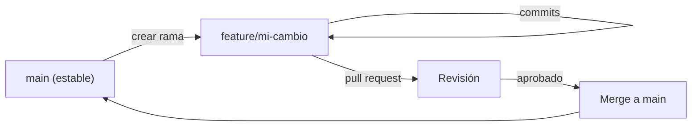
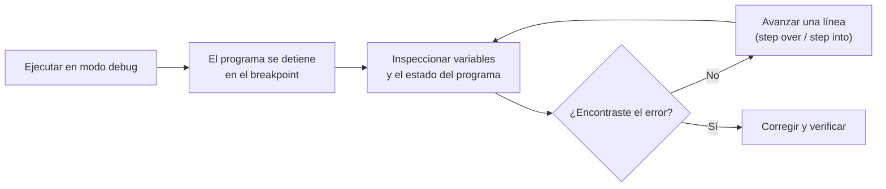
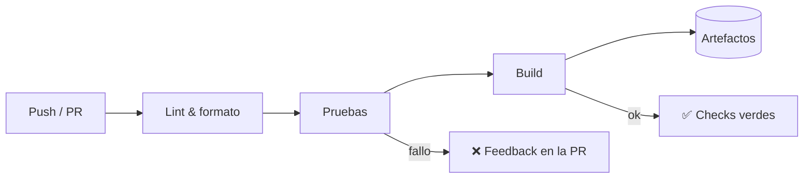

<a id="herramientas"></a>

# 🧰 5. Herramientas y procesos de construcción

{ type=application/pdf style="width:100%;min-height:80vh" }

!!!info "Descarga de diapositivas"
    [Descarga las diapositivas](diapositivas/herramientas.pptx){target="_blank" rel="noopener"}

Estas herramientas ayudan a pasar de **código** a **programa que funciona**, a mantener la **calidad** y a **colaborar** sin romper nada.

---

## 5.1 ✍️ Editores e IDEs

Un **editor de código** es la herramienta donde escribes el código. Un **IDE** (Integrated Development Environment, entorno integrado de desarrollo) es un editor al que le han añadido todo lo demás: ejecutar, depurar, refactorizar, gestionar dependencias…

La diferencia práctica: con un editor escribes y luego cambias de herramienta para compilar o depurar. Con un IDE, todo está en el mismo sitio.

**Comparativa rápida**

| Aspecto | Editor de código | IDE |
|---|---|---|
| Peso y velocidad | Ligero, arranca rápido | Más pesado, carga el proyecto al abrir |
| Funciones | Edición, autocompletado, extensiones | Build, debug, pruebas, refactorizaciones integradas |
| Conviene cuando | Varios lenguajes, proyectos pequeños o scripts | Proyectos medianos/grandes con un lenguaje principal |
| Ejemplos | **VS Code**, Sublime Text, Vim | **IntelliJ IDEA** (Java/Kotlin), **Eclipse** (Java), **PyCharm** (Python) |

!!! example "Situación típica"
    Estás empezando con Java. Podrías usar VS Code con extensiones, pero IntelliJ IDEA te avisa de errores mientras escribes, te genera getters/setters automáticamente, y te permite depurar sin salir del editor. Para proyectos Java/Kotlin de cierto tamaño, un IDE ahorra mucho tiempo.

!!! tip "Buenas prácticas"
    - Abre siempre la **carpeta raíz** del proyecto, no un archivo suelto.
    - Activa **formato al guardar** para mantener el código limpio sin pensar.
    - Define **tareas del proyecto** (build, test, lint) en el propio proyecto para que todos las usen igual.

---

## 5.2 🧭 Control de versiones (Git)

!!! info "¿Qué problema resuelve?"
    Sin Git, si trabajas en equipo y dos personas tocan el mismo archivo, una sobreescribe los cambios de la otra. Y si rompes algo, no hay forma de volver atrás. Git guarda el **historial completo** del proyecto y permite trabajar en **ramas paralelas** sin pisarse.

Piensa en Git como un historial de guardados de videojuego: en cualquier momento puedes volver a un punto anterior, o explorar un camino alternativo sin perder el original.

### Conceptos básicos

- **Repositorio**: la carpeta del proyecto con todo su historial. Puede ser local (tu ordenador) o remoto (GitHub, GitLab…).
- **Commit**: una "foto" del proyecto en un momento concreto, con un mensaje que explica qué cambió y por qué.
- **Branch (rama)**: una línea de trabajo paralela. Puedes crear una rama para desarrollar una feature sin tocar `main`.
- **Merge**: unir una rama de vuelta a `main` una vez revisada y aprobada.
- **Pull Request (PR)**: solicitud de revisión antes de hacer el merge. El equipo revisa los cambios y da el visto bueno.

### Flujo habitual (GitHub Flow)


```mermaid
flowchart LR
  M["main (estable)"] -->|crear rama| F["feature/mi-cambio"]
  F -->|commits| F
  F -->|pull request| R["Revisión"]
  R -->|aprobado| MG["Merge a main"]
  MG --> M
```

1. `main` siempre está en estado estable (funciona y está probado).
2. Creas una rama para cada tarea o feature.
3. Haces commits pequeños y con mensajes claros.
4. Abres un Pull Request para que alguien revise.
5. Una vez aprobado, se fusiona a `main`.

### `.gitignore`: qué no debe entrar al repositorio

El archivo `.gitignore` le dice a Git qué archivos debe ignorar. Sin él, es fácil subir accidentalmente cosas que no deberían estar: contraseñas, carpetas enormes generadas automáticamente o archivos de configuración personal del editor.

Regla sencilla: **si Git puede regenerarlo, ignóralo**.

```gitignore
# Carpeta de compilación de Java (se regenera con mvn package)
target/

# Dependencias de Node (se regeneran con npm install)
node_modules/

# Variables de entorno locales con contraseñas (¡nunca al repo!)
.env

# Archivos de configuración personal del IDE
.idea/
*.iml
```

!!! warning "Errores habituales"
    - Trabajar directamente en `main` sin ramas → si algo falla, contaminas el código estable.
    - Commits gigantes con mensaje "cambios" → imposible entender qué pasó después.
    - No hacer pull antes de empezar → conflictos evitables.
    - Subir el archivo `.env` con contraseñas al repositorio → **problema grave de seguridad**.

!!! tip "Mensajes de commit"
    Un buen mensaje describe **qué** cambió y **por qué**, no el **cómo** (eso ya lo dice el código):
    - ✅ `Añadir validación de email en el formulario de registro`
    - ❌ `cambios`, `fix`, `wip`

---

## 5.3 🧱 Sistemas de construcción y gestores de dependencias

Cuando un proyecto crece, compilar a mano (`javac Fichero.java`) ya no escala. Un **sistema de construcción** automatiza todo el proceso: compila, pasa los tests, empaqueta y genera el artefacto final con un solo comando.

Un **gestor de dependencias** se encarga de descargar las librerías externas que usa tu proyecto, en la versión exacta que necesitas. Sin él, tendrías que descargar cada JAR o librería a mano y actualizar a mano cuando sale una versión nueva.

!!! example "Ejemplo con Maven (Java)"
    En el archivo `pom.xml` declaras qué necesitas:
    ```xml
    <dependency>
        <groupId>org.junit.jupiter</groupId>
        <artifactId>junit-jupiter</artifactId>
        <version>5.10.0</version>
        <scope>test</scope>
    </dependency>
    ```
    Maven descarga JUnit automáticamente. Para compilar y pasar tests: `mvn test`. Para generar el JAR final: `mvn package`.

**Matriz orientativa**

| Lenguaje | Sistema de construcción | Gestor de dependencias | Archivo de configuración |
|---|---|---|---|
| Java | Maven / Gradle | Maven Central / JitPack | `pom.xml` / `build.gradle` |
| JavaScript/Node | npm scripts / Vite | npm / pnpm / yarn | `package.json` |
| Python | — / tox | pip / poetry | `requirements.txt` / `pyproject.toml` |
| C/C++ | Make / CMake | vcpkg / Conan | `Makefile` / `CMakeLists.txt` |

!!! tip "Centraliza las tareas"
    Define comandos estándar (`build`, `test`, `lint`) en el archivo de configuración del proyecto. Así todos los miembros del equipo ejecutan exactamente lo mismo, sin depender de configuraciones locales.
    Esto evita el clásico "en mi PC funciona".

---

## 5.4 ✅ Calidad de código

Un código puede funcionar y aun así ser difícil de leer, de mantener o de cambiar sin romper cosas. Con el tiempo, si nadie controla la calidad, el proyecto se convierte en algo que nadie quiere tocar porque no sabe qué va a romper. Las herramientas de calidad detectan esos problemas de forma automática, antes de que lleguen a producción.

<div class="grid cards" markdown>

-   :material-magnify: **Linter**

    Analiza el código en busca de **errores comunes** y **malas prácticas** sin ejecutarlo.
    Ejemplo: avisar de variables declaradas pero nunca usadas, o de comparaciones que siempre son falsas.

    Java: **Checkstyle**, **PMD** / JS: **ESLint** / Python: **flake8**, **pylint**

-   :material-format-align-left: **Formateador**

    Aplica un **estilo uniforme** al código automáticamente (indentación, espacios, llaves…).
    Con un formateador, el código de todo el equipo tiene el mismo aspecto, aunque cada uno tenga sus preferencias.

    Java: **Spotless** / JS: **Prettier** / Python: **Black**

-   :material-shield-search: **Análisis estático**

    Va más allá del linter: busca **vulnerabilidades de seguridad**, dependencias obsoletas o bugs sutiles.
    Ejemplo: detectar que estás concatenando cadenas con datos del usuario directamente en una consulta SQL (inyección SQL).

    Ejemplos: **SonarQube**, **Semgrep**, **Snyk**

-   :material-percent: **Cobertura de pruebas**

    Mide qué **porcentaje del código** se ejecuta cuando corren las pruebas automáticas.
    Una cobertura del 80% significa que el 20% del código nunca se prueba. No es una métrica perfecta, pero da una pista de zonas sin tests.

    Ejemplos: **JaCoCo** (Java), **Istanbul/nyc** (JS), **coverage.py** (Python)

</div>

!!! tip "Orden recomendado"
    Ejecuta en este orden: **formato → linter → pruebas**. El formato y el linter son rápidos (segundos); las pruebas pueden tardar más. Si algo falla en el linter, no tiene sentido esperar a que acaben todas las pruebas.

---

## 5.5 🐞 Depuración

Cuando un programa no se comporta como esperas, el primer instinto es llenar el código de `System.out.println` para ver qué pasa. Funciona para casos simples, pero con un **depurador** (*debugger*) puedes pausar la ejecución en cualquier punto, inspeccionar el valor de cada variable en ese momento exacto, y avanzar línea a línea para ver exactamente dónde se tuerce la lógica.

### Cómo funciona un depurador


```mermaid
flowchart LR
  A["Ejecutar en modo debug"] --> B["El programa se detiene\nen el breakpoint"]
  B --> C["Inspeccionar variables\ny el estado del programa"]
  C --> D{¿Encontraste el error?}
  D -- No --> E["Avanzar una línea\n(step over / step into)"]
  E --> C
  D -- Sí --> F["Corregir y verificar"]
```

### Los tres controles que usarás siempre

| Acción | Qué hace |
|---|---|
| **Step over** (F8 en IntelliJ) | Ejecuta la línea actual y para en la siguiente. Si hay una llamada a función, la ejecuta completa sin entrar dentro. |
| **Step into** (F7) | Si la línea llama a una función, entra dentro de ella para verla paso a paso. |
| **Resume** (F9) | Continúa la ejecución hasta el siguiente breakpoint (o hasta que termina el programa). |

### Paso a paso: depurar en IntelliJ

1. **Coloca un breakpoint** haciendo clic en el margen izquierdo de la línea donde quieres detener la ejecución. Aparece un punto rojo.
2. **Arranca en modo debug** con el botón del insecto 🐛 (o `Shift+F9`). El programa se ejecuta hasta el breakpoint y se detiene.
3. En el panel inferior verás las **variables locales** con sus valores actuales. Comprueba si son los que esperas.
4. Usa **Step over** para ir línea a línea y observar cómo cambian los valores.
5. Si una llamada a función parece sospechosa, usa **Step into** para entrar en ella.
6. Cuando encuentres el error, corrígelo, quita el breakpoint y vuelve a ejecutar.

!!! tip "Buenas prácticas al depurar"
    - Pon el breakpoint **justo antes** del punto donde crees que algo falla, no al principio del programa.
    - Antes de depurar, escribe en un papel cuál es el valor que esperas ver en cada variable. Si no coincide, ahí está el error.
    - Un `println` en producción es un olvido esperando ocurrir. El depurador no deja rastro en el código.

!!! note "Perfilado"
    Cuando el programa funciona pero va lento, existe otra técnica llamada **perfilado** (*profiling*): medir cuánto tiempo tarda cada parte del código para encontrar los cuellos de botella. Es una herramienta avanzada que no necesitarás en primero, pero conviene saber que existe.

---

## 5.6 🧩 Entornos y configuración

La misma aplicación suele ejecutarse en al menos tres situaciones distintas, cada una con una configuración diferente:

| Entorno | Dónde | Para qué |
|---|---|---|
| **Desarrollo** (`dev`) | Tu ordenador | Programar y probar localmente |
| **Pruebas** (`staging`) | Un servidor de pruebas | Validar antes de publicar; puede contener datos ficticios |
| **Producción** (`prod`) | El servidor real | Lo que usan los usuarios reales; no se toca sin control |

El código es el mismo en los tres entornos. Lo que cambia son los **valores de configuración**: la URL de la base de datos, las contraseñas, la dirección del servidor de correo…

### Variables de entorno y el archivo `.env`

Una **variable de entorno** es un par clave-valor que la aplicación lee al arrancar, sin que el valor esté escrito en el código. Así puedes cambiar el comportamiento sin tocar el código ni volver a compilar.

El archivo `.env` es un fichero de texto plano donde se guardan esas variables para el entorno de desarrollo local. **Nunca debe subirse al repositorio** porque puede contener contraseñas.

```dotenv
# .env — solo en tu ordenador, nunca al repositorio
DB_HOST=localhost
DB_PORT=5432
DB_NAME=miapp_dev
DB_PASSWORD=contraseña_local_solo_desarrollo

# En producción, estas mismas variables tienen otros valores
# configurados directamente en el servidor
```

El código lee esas variables sin conocer su valor concreto:

```java
// En el código: lee la variable de entorno, no el valor hardcodeado
String host = System.getenv("DB_HOST");
```

!!! warning "Reglas básicas"
    - **Nunca** escribas contraseñas directamente en el código (hardcoded).
    - Añade `.env` al `.gitignore` para que Git lo ignore siempre.
    - Si falta una variable necesaria al arrancar, el programa debe fallar con un mensaje claro, no intentar continuar con un valor vacío.

---

## 5.7 🧱📦 Contenedores y virtualización (Docker)

!!! info "¿Qué problema resuelven?"
    Evitan el clásico "en mi ordenador funciona". Un contenedor lleva tu app **junto con todo lo que necesita** (sistema base, librerías, runtime) para ejecutarse igual en cualquier máquina.

**Conceptos clave**

- **Imagen**: plantilla de solo lectura con tu app y sus dependencias. Es una receta versionada (p. ej., `miapp:1.0`).
- **Contenedor**: instancia en ejecución de una imagen. Como un tupper creado a partir de la receta: puedes abrir, usar y borrar sin afectar a la imagen.
- **Registry**: almacén donde publicas y desde donde descargas imágenes (Docker Hub, GHCR…).

**Flujo típico**

1. **Definir** cómo se construye la imagen (`Dockerfile`).
2. **Construir** y **etiquetar** la imagen (`miapp:1.0`).
3. **Ejecutar** la imagen como contenedor (variables, puertos).
4. **(Opcional) Publicar** en un *registry* para compartir o desplegar.

**Contenedores vs. máquinas virtuales**

| Característica | Contenedor | Máquina virtual |
|---|---|---|
| ⏱️ Arranque | Segundos | Decenas de segundos / minutos |
| 📦 Tamaño | Ligero (MB – cientos de MB) | Pesado (GB) |
| 🔒 Aislamiento | A nivel de proceso (kernel compartido) | Kernel propio (aislamiento más fuerte) |
| 🧰 Uso típico | Empaquetar apps y servicios | Emular sistemas completos |

**Cuándo tiene sentido**

- Proyectos con múltiples servicios (web + base de datos + caché).
- Equipos: todas las personas ejecutan la misma imagen.
- Despliegues: empaquetar y publicar una versión concreta de la app.

---

## 5.8 🤖 Automatización de tareas y CI

!!! info "Objetivo"
    Que los pasos importantes (formato, análisis, pruebas, build) se hagan **siempre igual** y **automáticamente**, reduciendo errores y acelerando el feedback.

**Piezas que se complementan**

- **Scripts**: comandos con nombre dentro del proyecto (`build`, `test`, `lint`, `format`).
- **Hooks de Git**: reglas que se ejecutan antes o después de ciertas acciones. Por ejemplo, un hook *pre-commit* puede pasar el linter y las pruebas rápidas **antes** de que el commit se confirme, impidiendo subir código que no cumple el estándar.
- **CI (Integración Continua)**: un servicio en la nube que, en cada *push* o *pull request*, clona el repositorio y ejecuta automáticamente todos los checks.

**Pipeline típico (orden recomendado)**


```mermaid
flowchart LR
  A[Push / PR] --> B[Lint & formato]
  B --> C[Pruebas]
  C --> D[Build]
  D --> E[(Artefactos)]
  C -->|fallo| X[❌ Feedback en la PR]
  D -->|ok| Y[✅ Checks verdes]
```

### Ejemplo real: GitHub Actions

GitHub Actions es el sistema de CI más habitual en proyectos que usan GitHub. Se configura con un archivo `.yml` dentro de la carpeta `.github/workflows/`. Este ejemplo ejecuta las pruebas de un proyecto Java con Maven cada vez que se abre o actualiza una Pull Request:

```yaml
# .github/workflows/ci.yml
name: CI

on:
  push:
    branches: [main]
  pull_request:           # se ejecuta en cada PR

jobs:
  build:
    runs-on: ubuntu-latest   # la máquina que usará GitHub para ejecutarlo

    steps:
      - uses: actions/checkout@v4          # descarga el código del repo

      - name: Configurar Java 17
        uses: actions/setup-java@v4
        with:
          java-version: '17'
          distribution: 'temurin'

      - name: Compilar y pasar pruebas
        run: mvn test                       # el mismo comando que usarías en local
```

Cuando alguien abre una Pull Request, GitHub ejecuta este workflow automáticamente. Si `mvn test` falla, la PR queda marcada en rojo y no se puede fusionar hasta que se corrija.

!!! tip "Consejos prácticos"
    - Mantén los scripts cortos y autoexplicativos (`test`, `build`, `lint`, `format`, `start`).
    - Ejecuta primero lo rápido (lint) y luego lo costoso (pruebas, build).
    - Gestiona los secretos de CI en el almacén de secretos del proveedor (no en el repo).
    - Cachea las dependencias para acelerar las ejecuciones sucesivas.

---

## 🗂️ Tabla resumen

| Tema | ¿Qué es? | ¿Para qué sirve? |
|---|---|---|
| ✍️ Editores/IDEs | Herramientas para escribir y gestionar código | Producir y comprender código con ayudas integradas |
| 🧭 Control de versiones | Historial, ramas y fusiones | Trabajar en equipo sin perder cambios |
| 🧱 Construcción/Dependencias | Proceso y bibliotecas del proyecto | Obtener ejecutables y traer librerías externas |
| ✅ Calidad | Linter, formateador, análisis, cobertura | Mantener estilo, detectar fallos, medir pruebas |
| 🐞 Depuración | Pausar y explorar la ejecución | Encontrar errores sin tocar el código |
| 🧩 Entornos/Config | Valores por entorno y secretos | Cambiar comportamiento sin tocar el código |
| 📦 Contenedores | Imágenes y contenedores aislados | Ejecutar igual en cualquier máquina |
| 🤖 Automatización/CI | Scripts, hooks y verificación en servidor | Estandarizar pasos y detectar problemas pronto |
