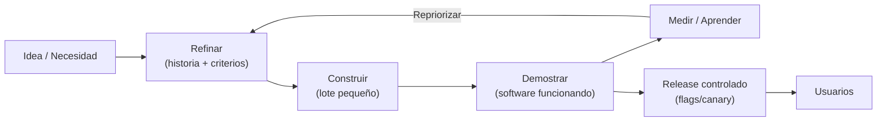
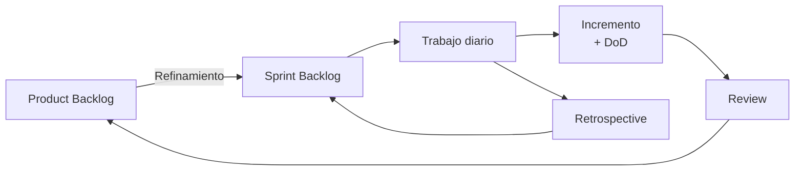
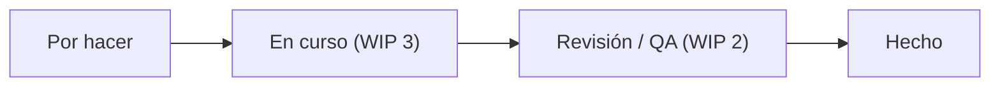
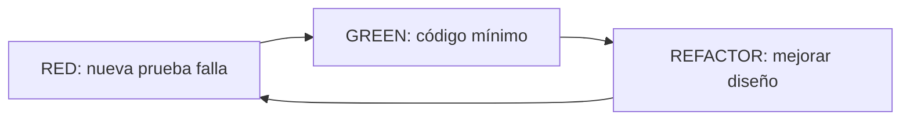
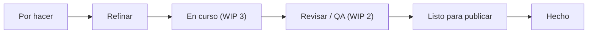

<a id="metodologias"></a>

# 🚀 6. Metodologías ágiles

---

## 🧠 6.1 Manifiesto Ágil 

> **Resumen en una frase:** Agilidad = **personas**, **software funcionando**, **colaboración** y **adaptación al cambio** para entregar **valor temprano y continuo**.

### 🎯 Los 4 valores (con hábitos concretos)

<div class="grid cards" markdown>
-   :material-account-group: **Personas e interacciones** → *mejor feedback y decisiones más rápidas*
    - **Haz:** dailies para **planificar el día**, *pair programming*, canales abiertos.
    - **Evita:** handoffs innecesarios, “manda un correo y ya”.

-   :material-check-circle-outline: **Software funcionando** → *progreso visible*
    - **Haz:** demos **quincenales**, *feature flags*, MVP (Producto Mínimo Viable).
    - **Evita:** documentación eterna sin nada que probar.

-   :material-handshake-outline: **Colaboración con el cliente** → *alineación de valor*
    - **Haz:** **refinamiento** con *stakeholders*, criterios de aceptación conjuntos.
    - **Evita:** contratos rígidos que ignoran datos de uso.

-   :material-swap-horizontal: **Respuesta al cambio** → *decidir con información reciente*
    - **Haz:** re-priorizar por **impacto/medición** cada semana.
    - **Evita:** “seguimos el plan aunque ya no tenga sentido”.
</div>

---

### 🔁 De idea a valor: ciclo ágil con feedback



*Cada vuelta reduce incertidumbre y evita invertir en la dirección equivocada.*

---

### 🧩 Los 12 principios, agrupados para recordar mejor

??? tip "Entrega temprana y frecuente (1, 3, 7)"
    1) Satisfacer al cliente con **entregas tempranas y frecuentes**.  
    3) Entregar **software funcionando** a menudo (semanas, no meses).  
    7) Medir el progreso por **software funcionando**.

??? note "Colaboración y aprendizaje continuo (2, 4, 6, 11, 12)"
    2) Aceptar **cambios** incluso tarde.  
    4) Negocio y desarrollo **juntos** a diario.  
    6) Conversación **cara a cara** (o remoto equivalente).  
    11) Equipos **autoorganizados**.  
    12) **Inspección y adaptación** periódicas (retros).

??? info "Calidad y sostenibilidad (5, 8, 9, 10)"
    5) Personas **motivadas** y confiables.  
    8) Ritmo **sostenible**.  
    9) **Excelencia técnica** y buen diseño.  
    10) **Simplicidad**: maximizar el **trabajo no hecho**.

---

### ✅ Aplicar los valores: Do vs Don’t

| Situación | ✅ En ágil | ❌ Antipatrón |
|---|---|---|
| Definir alcance | Historias **pequeñas** con criterios | Documento grande “cerrado” |
| Planificación | Roadmap **Now/Next/Later** + capacidad | Fechas fijas ignorando capacidad |
| Progreso | **Demo** con software funcionando | % completado “a ojo” |
| Cambios | Repriorizar por **datos/impacto** | Ignorar resultados “porque el contrato” |
| Calidad | **TDD**, revisión, DoD | “Probamos al final” |

---

## 🧩 6.2 Scrum: roles, artefactos, eventos; DoR/DoD

**Scrum** es un marco ligero para **resolver problemas complejos** entregando en **iteraciones con objetivo**.


{ type=application/pdf style="width:100%;min-height:80vh" }

!!!info "Descarga de diapositivas"
    [Descarga las diapositivas](scrum.pdf){target="_blank" rel="noopener"}


### 👥 Roles
- **Product Owner (PO):** define **Product Goal**, prioriza el **Product Backlog** y maximiza valor.  
- **Scrum Master (SM):** **facilita** Scrum, elimina **impedimentos** y promueve mejora.  
- **Equipo de desarrollo:** **multidisciplinar y autoorganizado**, construye el **Incremento**.

### 📦 Artefactos
- **Product Backlog (PB):** lista **ordenada por valor** (historias, épicas, bugs).  
- **Sprint Backlog (SB):** selección para el sprint + **Sprint Goal** + plan.  
- **Incremento:** suma de PB **terminado** al final del sprint y potencialmente **liberable**.

> **Transparencia:** cada artefacto incluye **medidas de calidad** (DoD) y, opcionalmente, métricas de previsibilidad (p. ej., *forecast*).

### 🗓️ Eventos (time-boxes típicos con sprint de 2 semanas)
- **Sprint (2 semanas):** contenedor de todo lo demás.  
- **Sprint Planning (≈ 4 h):** qué (objetivo), por qué (valor) y cómo (plan inicial).  
- **Daily Scrum (15 min):** sincronización y plan del día (**no** es reporte al jefe).  
- **Sprint Review (≈ 2 h):** mostrar **Incremento** y **adaptar** el PB con *stakeholders*.  
- **Retrospective (≈ 1.5 h):** mejora del **proceso**, **personas** y **herramientas**.  
- **Refinement (actividad continua):** detallar PB (no es evento formal en la guía).



### ✅ DoR / DoD (Definition of Ready / Definition of Done)

- **DoR (lista para entrar al sprint):**  

    - Historia **clara** (Como/Quiero/Para), **criterios de aceptación**, **valor** entendido, **estimación** aproximada, dependencias visibles.

- **DoD (terminado de verdad):** 

    - Código **mergeado**, **tests** pasados, **revisión** realizada, **documentación** mínima actualizada, desplegable (**incremento potencialmente liberable**).

> **Tip:** DoR/DoD son **políticas del equipo**; revísalas cuando la realidad cambie.

---

## 🧷 6.3 Kanban

**Kanban** gestiona el **flujo** de trabajo y mejora la **capacidad de entrega** con **políticas explícitas** y límites **WIP** (Work In Progress).



### Reglas mínimas
- **Visualiza** el flujo (tablero simple **To-Do / En curso / Revisar / Hecho**).  
- Define **políticas** de movimiento entre columnas.  
- **Limita WIP** (máximo de tareas simultáneas por columna/equipo).


---

## 🛠️ 6.4 XP: TDD, *pair programming*, refactorización continua

> **Idea clave:** XP = **excelencia técnica** para **cambiar con seguridad**: tests primero, código simple, revisiones constantes y entregas pequeñas.

### 🔩 Prácticas esenciales (de un vistazo)
<div class="grid cards" markdown>
-   :material-test-tube: **TDD (Test-Driven Development)**
    - Escribe una **prueba que falla** → código **mínimo** → **refactor** sin romper.
    - Beneficio: **diseño limpio** y **feedback** rápido.

-   :material-account-multiple: **Pair programming**
    - Dos personas, un teclado: **Driver** (teclea) / **Navigator** (piensa estrategia).
    - Alterna roles y usa **Ping-Pong TDD** (test ↔ código).

-   :material-wrench: **Refactorización continua**
    - Mejora **nombres**, **duplicidades** y **acoplamientos** **sin** cambiar comportamiento.
    - Apoya en tests para moverte **con seguridad**.

-   :material-source-branch-refresh: **Integración continua (CI)**
    - **Commits pequeños** → build + **tests** + **análisis estático** siempre verdes.
    - Evita ramas largas; integra **a diario**.

-   :material-source-repository-multiple: **Propiedad colectiva**
    - El código es del **equipo** (no de una persona). Estándares, *lint*, **DoD**.
</div>

---

### 🔁 TDD en 10 segundos

**Mini‑ejemplo (Java)**  
_Primero la prueba (roja) → luego el código (verde) → por último, refactor._
```java
// RED: test falla
@Test void totalConIVA() {
  assertEquals(121.0, Precio.conIVA(100.0, 0.21));
}

// GREEN: implementación mínima
class Precio {
  static double conIVA(double base, double iva) { return base * (1 + iva); }
}

// REFACTOR: nombres y redondeo
static double conIVA(double base, double iva) {
  return Math.round(base * (1 + iva) * 100.0) / 100.0;
}
```

---

### 👥 Modos de *pair programming*
- **Driver/Navigator:** alterna cada 15–20 min o por test.
- **Ping‑Pong TDD:** A escribe test → B lo hace pasar → B escribe test → A lo hace pasar…
- **Strong‑Style:** quien **tiene la idea, no teclea** (obliga a explicar el diseño).
- **Mob (3+):** útil en piezas complejas; temporizador y turnos cortos.

!!! tip "Consejos prácticos"
    - Acuerda un **estilo de commits** (atómicos, mensaje claro).
    - Usa un **timer** para los relevos (p. ej., 15 min).
    - Checklist breve de **revisión** al cerrar la sesión de *pair*.

---

## ♻️ 6.5 Lean Software Development y *waste*

> **Idea clave:** Lean = **eliminar desperdicio**, **aprender rápido** y **optimizar el sistema de extremo a extremo** para entregar **valor continuo**.

### 🧭 Principios Lean (aterrizados a software)
<div class="grid cards" markdown>
-   :material-delete-empty: **Eliminar desperdicio**
    - Quita lo que **no aporta valor** al usuario (colas, burocracia, re-trabajo).

-   :material-shield-check: **Calidad desde el origen**
    - Tests automatizados, *linters*, *pairing* y *CI*; “**para la línea**” si falla (*andon*).

-   :material-autorenew: **Aprender y mejorar**
    - Entregas pequeñas + métricas → *feedback* rápido → ajuste del plan.

-   :material-timer-sand: **Decidir tarde, entregar pronto**
    - Mantén opciones abiertas y **compromete** cuando hay datos; *feature flags* y *canary*.

-   :material-account-heart: **Respeto por las personas**
    - Equipos **multifuncionales** y autonomía para mejorar el flujo.

-   :material-vector-polyline: **Optimizar el todo**
    - Mira el **flujo end-to-end** (no sólo “mi módulo”). 
</div>

---

### 🗺️ Mapa de flujo de valor (Value Stream)
Identifica **pasos**, **esperas** y **cuellos de botella** desde la idea hasta *Hecho*.

*Objetivo:* **reducir esperas** y **limitar WIP** donde se acumula trabajo.

---

### 🗑️ Los 7 desperdicios (y cómo cazarlos)
| Desperdicio (Lean) | En software | Señal de alarma | Contra‑medida rápida |
|---|---|---|---|
| **Trabajo parcialmente hecho** | Ramas eternas, *features* a medias | Mucho “En curso” | **WIP** bajo, *feature flags*, entregas pequeñas |
| **Funcionalidad extra** | Oro molido que nadie usa | Uso bajo de nuevas *features* | Descubrir primero (MVP), medir adopción |
| **Reaprendizajes/transferencias** | Handoffs innecesarios | Muchas idas y vueltas | Equipos **multifuncionales**, DoR claro |
| **Cambios de tarea** | Multitarea | Context switching alto | Lotes pequeños, foco por **sprint/kanban** |
| **Esperas** | Aprobaciones, entornos, terceros | Tareas “bloqueadas” | Políticas explícitas, *self‑service* de entornos |
| **Defectos** | Bugs y retrabajo | Alto % de retrabajo | TDD, *shift‑left* (QA temprano) |
| **Procesos extra** | Burocracia que no añade valor | Mucho papeleo | Simplificar *workflow*, automatizar |
| **Talento infrautilizado** *(añadido común en software)* | Personas sin voz | Ideas se pierden | Retro efectiva, Kaizen con acciones |


## 🧰 6.6 Herramientas ágiles: tableros y *roadmaps*

> **Objetivo:** que el **tablero** haga fluir el trabajo (reglas claras, límites de trabajo y métricas) y que el **roadmap** sea una **brújula de resultados** (qué impacto buscamos), no una lista de tareas.

---

### 🗂️ Tableros (cuándo usar cada uno)
**Jira**  

-  **Útil para:** equipos **grandes** o con procesos formales.  
- **Ventajas:** permisos detallados, estados a medida, automatizaciones.  

**Trello**  

-  **Útil para:** **equipos pequeños**, formación y proyectos ligeros.  
-  **Ventajas:** muy **visual** y fácil de empezar; listas y checklists.  

**GitHub Projects**  

-  **Útil si ya usas GitHub para el código.** Conecta tareas con **issues** (incidencias) y **pull requests** (solicitudes de cambio).  
-  **Ventajas:** trazabilidad técnica natural; vistas por **tabla**, **tablero** y **cronograma**.  

---

### 🧱 Plantilla de columnas (sirve en cualquier herramienta)
- `Por hacer → Refinar → En curso (WIP n) → Revisar/QA (WIP m) → Listo para publicar → Hecho`


*Pista:* deja visibles los **límites WIP** (cuántas tarjetas caben) y revisa cuellos de botella cada semana.

**Políticas claras (ejemplo mínimo)**  

- A **En curso** ⇒ hay **capacidad libre** y la tarjeta cumple **DoR** (está entendida y acotada).  
- A **Revisar/QA** ⇒ hay **pull request**, **pruebas en verde** y *lint* pasado.  
- A **Listo para publicar** ⇒ validación funcional hecha + notas de versión.  
- A **Hecho** ⇒ cumple **DoD** (fusionado, probado, documentación mínima, *flag* si aplica).


---

### 📊 Métricas que debería “emitir” tu tablero
- **Lead time** (desde que se **pide** algo hasta **Hecho**).  
- **Cycle time** (desde que **empieza** hasta **Hecho**).  
- **Throughput** (cuántas tarjetas se terminan por semana).  
- **% de tarjetas bloqueadas** y **tiempo bloqueado**.  
- **CFD** (*Cumulative Flow Diagram* = diagrama de flujo acumulado) para ver estabilidad.

!!! tip "Rutina semanal (15’): revisión de salud del flujo"
    - Mira el **CFD**, columnas con **WIP alto**, motivos de **bloqueo** y acordad **1 acción** de mejora.

---
### 🗺️ Roadmaps (de resultados, no de tareas)

> **Qué es:** un *roadmap* dice **qué resultado queremos lograr** y **cómo sabremos que lo logramos**.  
> **Qué NO es:** una lista fija de tareas con fechas rígidas.

#### Outcomes vs. tareas (por qué importa)
| Enfoque | ¿Cómo suena? | Problema | Mejor opción |
|---|---|---|---|
| **Tareas** | “Implementar Bizum y Apple Pay” | Puedes hacerlas y **no mover** la aguja | |
| **Outcomes (resultados)** | “Subir la **tasa de pago** un +10%” | Te obliga a medir si **mejoró** lo que importa | ✅

#### Formato simple: Now / Next / Later
- **Now (Ahora):** lo que **ya** estamos intentando. 1-3 resultados como máximo.  
- **Next (Siguiente):** lo que haremos **después** si lo de Now va bien o termina.  
- **Later (Más tarde):** ideas que **no son prioridad** hoy.

> Así evitas sobrecargar y no prometes fechas que luego cambian.

#### ¿Qué pongo exactamente en un outcome?

- **Resultado (outcome):** qué queremos mejorar (claro y medible).  
- **Señal de éxito:** el **número/umbral** que dice “lo logramos”.  
- **Ideas a probar:** 2-3 posibles **caminos** (aún no son tareas detalladas).

**Ejemplo de outcome**

- **Resultado:** “Reducir el **tiempo de compra p95** a < **3 s**.”  
  - **Qué es p95:** el 95% de las compras tarda **menos** de ese tiempo. Es una forma de medir **experiencia real** (no solo el promedio).  
- **Señal de éxito:** “p95 < **3 s** durante 2 semanas seguidas.”  
- **Ideas a probar:** “simplificar validaciones”, “precargar datos”, “checkout en 1 paso”.

---

#### Plantilla de *roadmap* 

| Horizonte | Resultado (outcome) | Señal de éxito | Ideas a probar |
|---|---|---|---|
| **Now (Ahora)** | Reducir **p95 checkout** | p95 < 3 s | Simplificar validaciones; precarga; “pago en un paso” |
| **Next (Siguiente)** | Subir **tasa de pago** | +10% conversión | Bizum/Apple Pay; recordatorio carrito |
| **Later (Más tarde)** | Aumentar **valor por sesión** | +15% ticket medio | Recomendaciones; packs de productos |

> **Conversión:** de cada 100 personas que intentan pagar, cuántas lo consiguen.

---

#### Ejemplo completo 

**Roadmap**

- **Now:** “Checkout en 1 paso” para bajar p95 < 3 s.
- **Next:** “Añadir Bizum/Apple Pay” para subir conversión +10%.
- **Later:** “Recomendaciones automáticas” para subir ticket medio +15%.

**Cómo se traduce al tablero**

- Tarjeta 1: “Reducir campos del formulario” (criterios claros, pruebas).  
- Tarjeta 2: “Precarga de dirección desde perfil”.  
- Tarjeta 3: “Medir p95 tras cambios” (añadir métrica).

Si p95 baja de 4.2 s → 3.1 s pero **no** < 3 s, decides:

- **Seguir** con otra idea (p. ej., “validaciones en cliente”), o  
- **Parar** y pasar al outcome siguiente si el beneficio ya es suficiente.

---

#### Ejemplo alternativo (app interna de soporte)

**Outcome Now:** “Bajar el **tiempo de resolución** de tickets de 3 días a **2 días**.”  
**Señal:** media ≤ 2 días durante 1 mes.  
**Ideas:** plantilla de respuestas; mejor filtro de prioridad; formación de 1 h para agentes.

**En el tablero:**  

- Tarjeta 1: “Crear plantillas de respuesta”.  
- Tarjeta 2: “Nueva cola ‘Alta prioridad’”.  
- Tarjeta 3: “Informe semanal de tiempos por agente”.

---

### 🔗 Conexión tablero ↔ roadmap

- Cada **resultado** del *roadmap* se **rompe** en tarjetas pequeñas con **criterios de aceptación**.  
- El **tablero** muestra el **flujo** (WIP, bloqueos, avance).  
- El **roadmap** recoge **decisiones**: ¿seguimos con esta idea?, ¿paramos?, ¿cambiamos de enfoque?

**Ritual simple (mensual)**

1) Mira los **números** (p95, conversión, tiempo de resolución…).  
2) Decide por outcome: **seguir / cambiar / parar**.  
3) Actualiza **Now / Next / Later**.  
4) Crea/archiva **tarjetas** según lo decidido.

---
