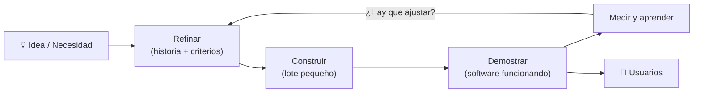
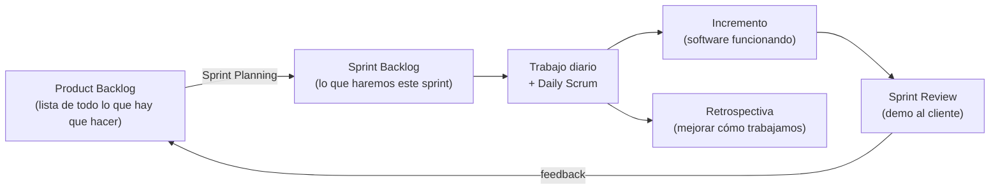
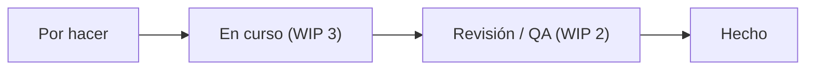
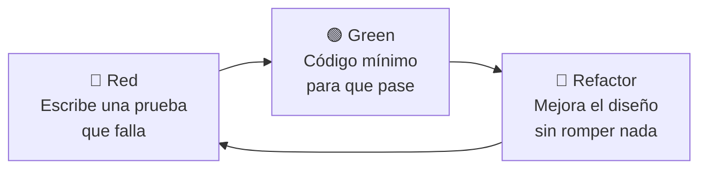
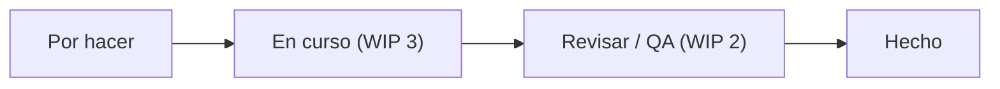

<a id="metodologias"></a>

# 🚀 6. Metodologías ágiles

{ type=application/pdf style="width:100%;min-height:80vh" }

!!!info "Descarga de diapositivas"
    [Descarga las diapositivas](diapositivas/metodologias.pptx){target="_blank" rel="noopener"}

Las **metodologías ágiles** son una forma moderna de organizar el trabajo en equipo para desarrollar software. Su objetivo es **entregar valor al usuario rápidamente**, **adaptarse al cambio** y **mejorar continuamente** mediante ciclos cortos de trabajo y retroalimentación constante.

No son un conjunto rígido de reglas. Son más bien una **forma de pensar y trabajar en equipo**: priorizas lo que aporta valor, lo entregas pronto, ves qué funciona y ajustas el rumbo.

!!! note "¿Por qué surgieron?"
    Antes de los años 2000 dominaban los métodos en cascada: análisis completo → diseño completo → implementación completa → pruebas. El problema era que el cliente no veía nada hasta el final, los requisitos cambiaban pero el plan no, y los proyectos acababan entregando tarde, con más coste y sin resolver lo que realmente se necesitaba. En 2001, un grupo de desarrolladores redactó el **Manifiesto Ágil** como alternativa.

---

## 6.1 Manifiesto Ágil

> **Resumen en una frase:** Agilidad = **personas**, **software funcionando**, **colaboración** y **adaptación al cambio** para entregar algo útil cuanto antes y seguir mejorándolo.

El Manifiesto Ágil define cuatro valores fundamentales. Cada uno compara dos cosas que importan, pero indica cuál tiene más peso cuando hay que elegir:

<div class="grid cards" markdown>

-   :material-account-group: **Personas e interacciones** sobre procesos y herramientas

    El equipo que se comunica bien resuelve los problemas más deprisa que el que sigue el proceso al pie de la letra sin hablar entre sí.

    **En la práctica:** reuniones diarias breves, trabajo en parejas, decisiones tomadas por quien está más cerca del problema.

-   :material-check-circle-outline: **Software funcionando** sobre documentación exhaustiva

    Un programa que funciona te dice más sobre si vas por el buen camino que cien páginas de especificaciones.

    **En la práctica:** demos frecuentes al cliente, entregas pequeñas pero reales, medir el progreso por lo que está hecho y funciona.

-   :material-handshake-outline: **Colaboración con el cliente** sobre negociación de contratos

    Un contrato cierra el alcance en el momento de menos información. La colaboración permite ajustar el rumbo cuando se aprende más sobre el problema.

    **En la práctica:** el cliente participa activamente, ayuda a definir los criterios de aceptación y ve el producto en cada iteración.

-   :material-swap-horizontal: **Respuesta al cambio** sobre seguir un plan

    El plan se hace con la información disponible al principio, que siempre es la más incompleta. Si la realidad cambia, el plan debe cambiar también.

    **En la práctica:** re-priorizar según lo que se aprende en cada entrega; no es un fallo, es el sistema funcionando bien.

</div>

### Ciclo ágil: de idea a entrega


```mermaid
flowchart LR
  A["💡 Idea / Necesidad"] --> B["Refinar\n(historia + criterios)"]
  B --> C["Construir\n(lote pequeño)"]
  C --> D["Demostrar\n(software funcionando)"]
  D --> E["Medir y aprender"]
  E -->|"¿Hay que ajustar?"| B
  D --> R["👤 Usuarios"]
```

Cada vuelta sirve para comprobar si vamos bien antes de avanzar demasiado. Si descubres que algo no funciona en la segunda iteración, el daño es pequeño; si lo descubres en el mes diez, es enorme.

### Ejemplo: cómo funciona el ciclo

Imagina un equipo desarrollando una **app de recetas de cocina**:

- En la **primera iteración** (dos semanas) crean la pantalla principal y el buscador básico.
- Los usuarios la prueban y dicen que prefieren **filtrar por ingredientes** que ya tienen en casa.
- En la **siguiente iteración** el equipo prioriza ese filtro y lo implementa.
- Así, con cada vuelta, el producto se adapta a lo que la gente realmente necesita.

Si hubieran tardado seis meses en construir todo antes de enseñarlo, habrían descubierto ese problema cuando ya era muy costoso de cambiar.

### Los 12 principios

El Manifiesto Ágil se acompaña de doce principios que desarrollan los valores. Se pueden agrupar en tres ideas:

| Grupo | Principios | Idea central |
|---|---|---|
| **Entrega temprana y frecuente** | 1, 3, 7 | Mostrar resultados reales pronto y con frecuencia |
| **Colaboración y aprendizaje** | 2, 4, 6, 11, 12 | Comunicación constante y mejora continua del equipo |
| **Calidad y ritmo sostenible** | 5, 8, 9, 10 | Equipos motivados, código de calidad y un ritmo que se pueda mantener |

??? tip "Ver los 12 principios completos"
    **Entrega temprana y frecuente**
    1. Satisfacer al cliente con entregas tempranas y frecuentes.
    3. Entregar software funcionando a menudo (semanas, no meses).
    7. Medir el progreso por software funcionando.

    **Colaboración y aprendizaje continuo**
    2. Aceptar cambios incluso tarde en el desarrollo.
    4. Negocio y desarrollo trabajan juntos a diario.
    6. La conversación cara a cara (o equivalente remoto) es la forma más eficiente de comunicarse.
    11. Los mejores equipos son autoorganizados.
    12. El equipo reflexiona periódicamente sobre cómo mejorar y ajusta su comportamiento.

    **Calidad y ritmo sostenible**
    5. Rodea al equipo de personas motivadas y confía en ellas.
    8. El desarrollo ágil promueve un ritmo sostenible indefinidamente.
    9. La atención continua a la excelencia técnica y al buen diseño mejora la agilidad.
    10. Simplicidad: maximizar el trabajo no hecho es esencial.

---

## 6.2 Scrum

**Scrum** es el marco ágil más utilizado. Organiza el trabajo en **iteraciones de longitud fija** llamadas *sprints* (normalmente dos semanas), con un objetivo claro para cada una. Al final de cada sprint hay algo entregable: no un diseño, no un documento, sino **software que funciona**.

La idea es sencilla: en lugar de planificar todo durante meses y entregar al final, planificas dos semanas, entregas algo real, aprendes y replanteas la siguiente.


```mermaid
flowchart LR
  PB["Product Backlog\n(lista de todo lo que hay que hacer)"] -->|"Sprint Planning"| SB["Sprint Backlog\n(lo que haremos este sprint)"]
  SB --> DEV["Trabajo diario\n+ Daily Scrum"]
  DEV --> INC["Incremento\n(software funcionando)"]
  INC --> REV["Sprint Review\n(demo al cliente)"]
  REV -->|"feedback"| PB
  DEV --> RETRO["Retrospectiva\n(mejorar cómo trabajamos)"]
```

### Roles

Scrum define tres roles, no más. Añadir más jerarquía suele romper la autoorganización.

| Rol | Responsabilidad principal |
|---|---|
| **Product Owner** | Decide *qué* se construye y en *qué orden* según el valor que aporta al usuario |
| **Scrum Master** | Facilita el proceso, elimina obstáculos y ayuda al equipo a mejorar |
| **Equipo de desarrollo** | Decide *cómo* se construye; multidisciplinar y autoorganizado |

### Artefactos

Los artefactos son las tres "listas" que mantiene el equipo:

- **Product Backlog**: la lista de todo lo que se quiere construir, ordenada por valor. Nunca está terminada: se ajusta continuamente según lo que se aprende.
- **Sprint Backlog**: lo que el equipo se compromete a hacer durante el sprint actual, más el objetivo del sprint.
- **Incremento**: el resultado del sprint. Debe ser algo que funciona y que el cliente podría usar si se decidiera publicar.

### Eventos

Cinco eventos estructuran el trabajo dentro de cada sprint:

| Evento | Duración típica | Para qué sirve |
|---|---|---|
| **Sprint** | 2 semanas | Contenedor de todo lo demás; tiene un objetivo concreto |
| **Sprint Planning** | ≈ 4 horas | El equipo elige qué hará este sprint y cómo lo abordará |
| **Daily Scrum** | 15 minutos | Sincronización diaria: qué hice ayer, qué haré hoy, qué me bloquea |
| **Sprint Review** | ≈ 2 horas | Demo al cliente: el equipo muestra lo que ha construido y recoge feedback |
| **Retrospectiva** | ≈ 1.5 horas | El equipo mejora *cómo trabaja*, no qué construye |

!!! warning "El Daily Scrum no es un reporte"
    No es una reunión donde cada persona le dice al jefe lo que ha hecho. Es una sincronización entre compañeros para coordinarse y detectar bloqueos. Si alguien lleva dos días bloqueado con un problema, el Daily es el momento de pedirlo.

### Definition of Done (DoD)

La **Definition of Done** (definición de terminado) es el acuerdo del equipo sobre qué significa que una tarea *está realmente terminada*. Evita el "yo lo he hecho pero no está integrado/probado/documentado".

Un DoD típico para un proyecto de clase podría ser:

- El código está integrado en la rama principal.
- Las pruebas automáticas pasan.
- Otro compañero ha revisado el código.
- El README o la documentación mínima está actualizada.

> Si algo no cumple el DoD, no se cuenta como terminado en el Sprint Review.

---

## 6.3 Kanban

**Kanban** no organiza el trabajo en iteraciones fijas como Scrum. En su lugar, gestiona un **flujo continuo** de tareas: cuando terminas una, empiezas la siguiente. Es útil cuando el trabajo llega de forma irregular o cuando el equipo necesita flexibilidad para cambiar prioridades sin esperar al siguiente sprint.

!!! note "El nombre"
    "Kanban" viene del japonés y significa literalmente **"tarjeta visual"**. Su origen está en la fábrica de Toyota, que usaba tarjetas físicas para controlar cuánto trabajo había en cada fase de la cadena de montaje y evitar que se acumulara en un punto.

### El tablero Kanban

La herramienta central es el **tablero**: muestra el estado de todas las tareas de un vistazo. Cada tarea es una tarjeta que se mueve de izquierda a derecha a medida que avanza.


```mermaid
graph LR
  T["Por hacer"] --> E["En curso (WIP 3)"]
  E --> R["Revisión / QA (WIP 2)"]
  R --> H["Hecho"]
```

### Tres reglas esenciales

**1. Visualizar el flujo**

Todo el equipo debe poder ver el proceso completo: qué hay pendiente, qué se está haciendo y qué está bloqueado. Si la columna "Revisión" está llena, el equipo puede pausar nuevas tareas y ayudar a revisar antes de empezar algo nuevo.

**2. Definir políticas claras por columna**

Cada columna tiene reglas explícitas sobre cuándo una tarea puede avanzar:

- *"Una tarea pasa a Revisión solo si las pruebas unitarias están completas."*
- *"Solo el responsable de QA puede mover tarjetas a Hecho."*

Sin estas reglas, "En curso" acaba significando cosas distintas para cada persona del equipo.

**3. Limitar el WIP (Work In Progress)**

El límite WIP indica cuántas tareas pueden estar activas a la vez en cada columna. La idea es **terminar lo que hay en marcha antes de empezar algo nuevo**.

- `En curso (WIP 3)` → el equipo no puede tener más de 3 tareas en esa fase a la vez.
- Si ya hay 3, no se empieza una nueva hasta que se termine alguna.

!!! tip "Por qué funciona"
    La multitarea constante fragmenta la atención y ralentiza todo. Limitar el WIP fuerza al equipo a centrarse y hace que el trabajo avance más rápido hacia "Hecho".

### Métricas de flujo

Kanban no tiene fechas fijas de entrega, pero mide el rendimiento del equipo con tres indicadores:

| Métrica | Qué mide |
|---|---|
| **Lead Time** | Tiempo total desde que se pide algo hasta que está Hecho |
| **Cycle Time** | Tiempo desde que se *empieza* una tarea hasta que se termina |
| **Throughput** | Número de tareas completadas por semana |

Con estos datos el equipo detecta dónde se acumula el trabajo y mejora progresivamente.

---

## 6.4 XP (Extreme Programming)

**XP** es una metodología ágil centrada en la **excelencia técnica**. Mientras Scrum se ocupa de cómo organizar el equipo y el trabajo, XP se ocupa de cómo escribir el código: con pruebas primero, en parejas, integrando frecuentemente y mejorando continuamente el diseño.

La idea de fondo es que si las prácticas técnicas son sólidas, el equipo puede cambiar el código con confianza y a cualquier ritmo.

<div class="grid cards" markdown>

-   :material-test-tube: **TDD (Test-Driven Development)**

    Escribe primero la prueba que debe pasar, luego el código mínimo para que pase, y luego mejora el diseño sin romper nada. Así siempre tienes pruebas y el código tiende a ser más simple.

    Ver el ciclo completo en la sección de [pruebas](fases.md#44-pruebas).

-   :material-account-multiple: **Pair programming**

    Dos personas, un teclado. Una teclea (*driver*), la otra piensa en el diseño y detecta errores (*navigator*). Los roles se alternan cada 15-20 minutos. Al ir de dos, los errores se detectan en el momento y el conocimiento del código se distribuye entre el equipo.

-   :material-wrench: **Refactorización continua**

    Mejorar el código sin cambiar su comportamiento: renombrar variables, eliminar duplicados, simplificar funciones. Se hace en pequeños pasos después de que las pruebas pasen, no en grandes reescrituras. Las pruebas son la red de seguridad que permite moverse con confianza.

-   :material-source-branch-refresh: **Integración continua**

    Commits pequeños y frecuentes. En cada integración, se compila, se pasan las pruebas y se analiza el código automáticamente. Si algo falla, se arregla de inmediato. Las ramas longevas son el enemigo: cuanto más tiempo vive una rama, más difícil es integrarla.

-   :material-source-repository-multiple: **Propiedad colectiva del código**

    El código es del equipo, no de la persona que lo escribió. Cualquiera puede mejorar cualquier parte. Esto requiere estándares de código compartidos y que el formateador y el linter sean los árbitros del estilo.

</div>

### El ciclo TDD


```mermaid
flowchart LR
  R["🔴 Red\nEscribe una prueba\nque falla"] --> G["🟢 Green\nCódigo mínimo\npara que pase"]
  G --> F["🔵 Refactor\nMejora el diseño\nsin romper nada"]
  F --> R
```

**Ejemplo en Java** — primero la prueba (roja), luego el código mínimo (verde), luego el refactor:

```java
// 🔴 RED: el test falla porque la clase no existe aún
@Test
void totalConIVA() {
    assertEquals(121.0, Precio.conIVA(100.0, 0.21));
}

// 🟢 GREEN: implementación mínima para que el test pase
class Precio {
    static double conIVA(double base, double iva) {
        return base * (1 + iva);
    }
}

// 🔵 REFACTOR: añadimos redondeo sin romper el test
static double conIVA(double base, double iva) {
    return Math.round(base * (1 + iva) * 100.0) / 100.0;
}
```

---

## 6.5 Lean Software Development

**Lean** adapta al desarrollo de software los principios que Toyota aplicó a la fabricación: identificar qué aporta valor al cliente y eliminar todo lo que no lo hace. En software, "desperdicio" no son piezas defectuosas, sino tiempo y esfuerzo que no llegan a manos del usuario.

La idea clave es sencilla: **cada vez que algo tarda, se espera, se repite o se construye sin que nadie lo pida, es desperdicio**. Reducirlo libera tiempo para lo que importa.

### Principios Lean aplicados al software

| Principio | Qué significa en la práctica |
|---|---|
| **Eliminar desperdicio** | Quita burocracia, aprobaciones innecesarias, funciones que nadie usa |
| **Calidad desde el origen** | Detectar y corregir problemas cuanto antes, no al final; pruebas automatizadas desde el primer día |
| **Aprender rápido** | Entregas pequeñas + retroalimentación real → ajustas el rumbo antes de invertir demasiado |
| **Decidir tarde, entregar pronto** | No tomes decisiones irreversibles antes de tener información; entrega algo pequeño que te dé datos reales |
| **Respetar a las personas** | Los equipos con autonomía y confianza encuentran mejores soluciones que los equipos microdirigidos |
| **Optimizar el sistema completo** | No optimices solo "tu parte"; lo que importa es el tiempo total desde que se pide algo hasta que llega al usuario |

### Los desperdicios más comunes en software

| Desperdicio | Cómo se manifiesta | Cómo reducirlo |
|---|---|---|
| **Trabajo a medias** | Ramas que llevan semanas abiertas, funciones a medias que nadie usa todavía | Commits frecuentes, entregas pequeñas |
| **Funcionalidad extra** | Construir algo que nadie ha pedido aún "por si acaso" | Construir solo lo que hay en el backlog priorizado |
| **Esperas** | Esperar aprobación, esperar que otro módulo esté listo, esperar que el entorno se configure | Automatizar, políticas claras, entornos *self-service* |
| **Defectos y retrabajo** | Bugs que vuelven de producción, código que hay que reescribir | TDD, revisiones de código, pruebas automáticas |
| **Cambios de tarea** | Un desarrollador con seis tareas "en curso" a la vez | Limitar el WIP; terminar antes de empezar |

!!! tip "Lean y Kanban se complementan"
    Lean define la filosofía (eliminar desperdicio, optimizar el flujo). Kanban es una herramienta práctica para aplicarla: el tablero te muestra dónde se acumula el trabajo y los límites WIP te obligan a terminarlo antes de añadir más.

---

## 6.6 Herramientas: tableros digitales

Un tablero digitaliza el flujo de trabajo de Kanban o Scrum y lo hace accesible a todo el equipo, en remoto y desde cualquier dispositivo. Las tres herramientas más habituales son:

<div class="tabs-colored" markdown>

=== "🟦 Jira"
    La herramienta estándar en equipos profesionales. Permite configurar flujos de trabajo a medida, gestionar permisos por rol y conectar tareas con versiones del software.

    **Cuándo usarla:** equipos medianos o grandes con procesos formales, o cuando el proyecto requiere trazabilidad entre tareas y versiones.

    **Curva de aprendizaje:** alta. Es potente pero compleja de configurar.

=== "🟩 Trello"
    Tablero visual muy sencillo basado en listas y tarjetas. Cada tarjeta puede tener checklists, fechas límite y archivos adjuntos. No requiere configuración para empezar.

    **Cuándo usarla:** proyectos pequeños, equipos que empiezan con Kanban, trabajos personales o de clase.

    **Curva de aprendizaje:** mínima. En diez minutos tienes un tablero funcionando.

=== "🐙 GitHub Projects"
    Tablero integrado directamente en GitHub. Cada tarjeta puede vincularse a un *issue* (tarea o bug registrado en el repositorio) o a una *pull request*, lo que da trazabilidad directa entre el tablero y el código.

    **Cuándo usarla:** cuando ya usas GitHub para el código. Es la opción más natural para proyectos de desarrollo: la misma plataforma gestiona código y tareas.

    **Curva de aprendizaje:** baja si ya conoces GitHub.

</div>

### Estructura de columnas recomendada


```mermaid
flowchart LR
  T["Por hacer"] --> E["En curso (WIP 3)"]
  E --> Q["Revisar / QA (WIP 2)"]
  Q --> H["Hecho"]
```

Esta estructura funciona tanto para Kanban como para el tablero de un Sprint de Scrum. Ajusta el WIP según el tamaño del equipo: una cifra habitual es **una tarea activa por persona** en la columna "En curso".

### Políticas de columna (ejemplo)

Define cuándo una tarjeta puede moverse a la siguiente columna. Sin reglas escritas, cada persona interpreta el tablero a su manera:

| Columna | Condición para entrar |
|---|---|
| **En curso** | Hay capacidad libre y la tarea está bien descrita (se sabe qué hacer y cuándo estará terminada) |
| **Revisar / QA** | El código está hecho, las pruebas pasan y hay una Pull Request abierta |
| **Hecho** | La PR está fusionada, la tarea cumple el DoD y está desplegada o lista para serlo |

!!! tip "Revisión semanal del tablero (15 minutos)"
    Una vez a la semana, el equipo mira el tablero juntos: ¿hay tarjetas atascadas? ¿alguna columna está desbordada? ¿alguna tarea lleva demasiado tiempo en "En curso"? Una acción concreta de mejora por semana es más que suficiente para ir mejorando el flujo.
