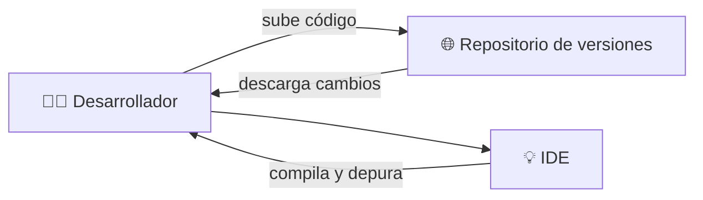

# 👨‍💻 Entornos de desarrollo

!!! warning "Lectura recomendada"
    Este documento es solo un **resumen visual y explicativo** del tema.  
    El **documento completo en PDF** contiene información más detallada, ejemplos paso a paso e instrucciones de instalación que **deben leerse y estudiarse** para comprender el contenido en profundidad.

{ type=application/pdf style="width:100%;min-height:80vh" }

!!!info "Documento de teoría"
    [Abrir documento completo en PDF](entornos-de-desarrollo.pdf){target="_blank" rel="noopener"}

---

## ¿Qué es un entorno de desarrollo?

!!! info "Idea clave"
    Un **entorno de desarrollo integrado (IDE)** es una aplicación que reúne en un solo lugar todas las herramientas necesarias para **diseñar, codificar, compilar, depurar y mantener software**.

### Componentes fundamentales
- 📝 **Editor de texto**: permite escribir y modificar código fuente.
- ⚙️ **Compilador**: traduce el código fuente a un lenguaje ejecutable.
- 🐞 **Depurador**: detecta y corrige errores en tiempo real.
- 🧩 **Control de versiones**: gestiona cambios y versiones del código.
- 🖥️ **Diseñador gráfico (GUI)**: facilita la creación de interfaces de usuario.

Estos elementos cooperan dentro del IDE para **automatizar tareas** y **reducir errores** durante el desarrollo.

---

## Herramientas y extensiones

!!! note "Herramientas destacadas en un IDE"
    - **Coloreado de sintaxis**: mejora la legibilidad del código.  
    - **Autocompletado**: sugiere palabras clave y métodos.  
    - **Depuración paso a paso**: muestra el estado del programa mientras se ejecuta.  
    - **Refactorización**: permite reorganizar el código sin alterar su comportamiento.  
    - **Plugins o extensiones**: amplían las funciones del IDE.

Ejemplo: en IntelliJ IDEA o Eclipse se pueden instalar complementos para trabajar con nuevos lenguajes, bases de datos o sistemas de control de versiones.

---

## Personalización y configuración

!!! tip "Adaptar el IDE a tus necesidades"
    Los IDE se pueden configurar para mejorar la productividad del programador.  
    Es posible cambiar el **tema visual**, los **atajos de teclado**, la **fuente del editor** o las **ventanas de herramientas**.  
    En IntelliJ, por ejemplo, se accede a la configuración mediante `Ctrl + Alt + S`.

Además, se pueden guardar **perfiles de depuración y compilación** personalizados para distintos proyectos.

---

## Criterios para elegir un IDE

!!! info "Factores principales de elección"
    1. **Sistema operativo**: elige un IDE compatible con tu entorno (Windows, Linux, macOS).  
    2. **Lenguaje y framework**: cada IDE está especializado en unos lenguajes concretos.  
    3. **Herramientas integradas**: valora si ofrece depurador, control de versiones o diseñador gráfico.  
    4. **Disponibilidad y precio**: existen alternativas gratuitas (Eclipse, NetBeans, IntelliJ Community).  

Ejemplo: para desarrollar en **Java bajo Linux**, puedes optar por **Eclipse**, **NetBeans** o **IntelliJ IDEA**, todos gratuitos en su versión básica.

---

## Uso básico de un IDE

!!! note "Funcionalidades básicas"
    - Crear proyectos y clases.  
    - Editar código fuente con resaltado de sintaxis.  
    - Compilar y ejecutar programas directamente.  
    - Depurar errores paso a paso.  
    - Sincronizar con repositorios de código (Git, SVN…).  

---

## Instalación de un entorno de desarrollo

!!! example "Instalación típica: IntelliJ IDEA"
    1. **Descargar Java (JRE o JDK)** desde [java.com](https://www.java.com/es/download/).  
    2. **Descargar IntelliJ IDEA** desde [jetbrains.com/idea](https://www.jetbrains.com/idea).  
    3. Ejecutar el instalador y seguir los pasos del asistente.  
    4. Crear un nuevo proyecto “Hola Mundo” para verificar la instalación.

!!! tip "Licencia educativa"
    JetBrains ofrece licencias gratuitas para **estudiantes y docentes** a través de su programa académico:  
    [https://www.jetbrains.com/es-es/community/education/#students](https://www.jetbrains.com/es-es/community/education/#students)

---

## Otros entornos populares

| IDE | Desarrollador | Características principales | Sitio oficial |
|-----|----------------|-----------------------------|----------------|
| **Eclipse** | Fundación Eclipse | Muy extensible mediante plugins; multiplataforma. | [eclipse.org/downloads](https://www.eclipse.org/downloads/) |
| **NetBeans** | Apache | Código abierto, soporte para Java SE/EE, PHP y HTML5. | [netbeans.apache.org](https://netbeans.apache.org/download/index.html) |
| **IntelliJ IDEA** | JetBrains | Finalización inteligente, refactorización avanzada y gran asistencia al programador. | [jetbrains.com/idea](https://www.jetbrains.com/idea) |

---

## Comparativa entre IDEs de Java

| Criterio | Eclipse | NetBeans | IntelliJ IDEA |
|-----------|----------|-----------|----------------|
| **Licencia** | Libre (EPL) | Libre (Apache) | Gratuito / Pago |
| **Lenguajes** | Java, C/C++, Python… | Java, PHP, HTML5… | Java, Kotlin, más plugins |
| **Plugins** | Muy abundantes | Menos cantidad | Alta calidad |
| **Facilidad de uso** | Media | Alta | Muy alta |
| **Rendimiento** | Medio | Medio | Alto |

!!! summary "Conclusión general"
    - **Eclipse**: ideal para grandes proyectos y desarrollos empresariales.  
    - **NetBeans**: excelente opción educativa y para principiantes.  
    - **IntelliJ IDEA**: destaca por su interfaz moderna y productividad.

