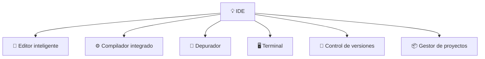
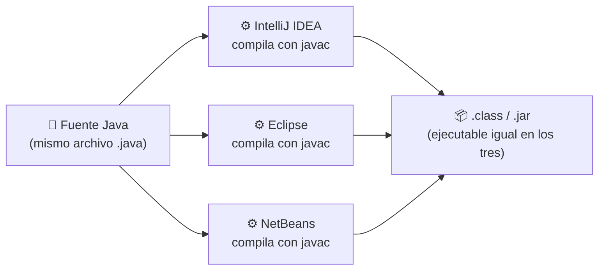
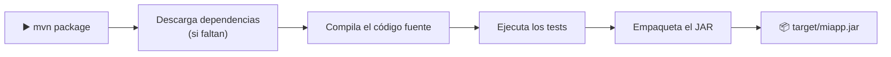

<a id="entornos"></a>

# 🛠️ Entornos Integrados de Desarrollo

{ type=application/pdf style="width:100%;min-height:80vh" }

!!!info "Descarga de diapositivas"
    [Descarga las diapositivas](diapositivas/tema2-entornos-integrados.pptx){target="_blank" rel="noopener"}

---

## 1. ¿Qué es un IDE?

Cuando escribes código, la herramienta más simple que puedes usar es un editor de texto plano como el Bloc de notas. Funciona, pero te obliga a cambiar constantemente de programa: escribes en el editor, compilas desde el terminal, depuras con otra herramienta. Un **IDE** (del inglés *Integrated Development Environment*, entorno integrado de desarrollo) reúne todo eso en una sola aplicación.

!!! info "Idea clave"
    Un IDE es un programa que integra en un mismo lugar el editor de código, el compilador, el depurador y otras herramientas de apoyo al desarrollo. El objetivo es que el programador no tenga que salir de la aplicación para ninguna tarea habitual del ciclo de trabajo.

La diferencia práctica se nota en cosas concretas: si escribes `System.out.prtinln` en IntelliJ, el IDE te subraya el error en rojo antes de que intentes compilar. En el Bloc de notas, te enterarías solo al ejecutar el programa y ver que falla.

### Componentes de un IDE

Un IDE completo tiene varios módulos que trabajan juntos:

| Componente | Función |
|---|---|
| **Editor de código** | Donde se escribe el código fuente. Incluye resaltado de sintaxis, autocompletado y detección de errores mientras escribes. |
| **Compilador / Intérprete** | Traduce el código fuente al formato que puede ejecutar la máquina o la máquina virtual. En Java: `javac`. |
| **Depurador** | Permite pausar la ejecución en cualquier punto, inspeccionar variables y avanzar línea a línea para encontrar errores. |
| **Terminal integrado** | Una consola dentro del propio IDE para ejecutar comandos sin salir. |
| **Gestión de proyectos** | Organiza los archivos del proyecto, gestiona dependencias externas y configura el proceso de construcción. |
| **Control de versiones** | Integración con Git para hacer commits, ver el historial y gestionar ramas sin salir del IDE. |
| **Diseñador gráfico** | En algunos IDEs, permite diseñar interfaces de usuario de forma visual (arrastrar y soltar componentes). |


```mermaid
flowchart TD
    IDE["💡 IDE"]
    IDE --> E["📝 Editor inteligente"]
    IDE --> C["⚙️ Compilador integrado"]
    IDE --> D["🐞 Depurador"]
    IDE --> T["🖥️ Terminal"]
    IDE --> G["🌿 Control de versiones"]
    IDE --> P["📦 Gestor de proyectos"]
```

### Editor de código vs. IDE

No todo el mundo usa un IDE. Hay programadores que prefieren un editor de código ligero como **VS Code** o **Vim**. La diferencia es de grado, no de tipo:

| Aspecto | Editor de código | IDE |
|---|---|---|
| Velocidad de arranque | Rápido (segundos) | Más lento (carga el proyecto) |
| Consumo de memoria | Bajo | Medio-alto |
| Funciones integradas | Básicas + extensiones | Completas de serie |
| Curva de aprendizaje | Baja | Media |
| Conviene cuando | Scripts, varios lenguajes, proyectos pequeños | Proyectos medianos/grandes con un lenguaje principal |

!!! example "Situación típica"
    Estás desarrollando una aplicación Java de tamaño medio. IntelliJ IDEA te detecta errores mientras escribes, te genera constructores y getters automáticamente, y te permite depurar sin salir del editor. Para Java, un IDE ahorra horas de trabajo a la semana frente a un editor básico.

---

## 2. Tipos de entornos: propietarios y libres

Los IDEs se pueden clasificar según su modelo de licencia. Esta distinción importa en la práctica porque afecta al coste, a la posibilidad de modificar el software y a las condiciones de uso.

Un **IDE propietario** es desarrollado por una empresa que mantiene el control sobre el código fuente. El usuario no puede modificarlo ni redistribuirlo, y normalmente hay que pagar una licencia para usarlo en entornos profesionales.

Un **IDE libre** (o de código abierto) distribuye su código fuente bajo una licencia que permite estudiarlo, modificarlo y redistribuirlo. Generalmente es gratuito, aunque puede haber versiones de pago con funciones adicionales.

<div class="tabs-colored" markdown>

=== "IDEs propietarios"

    !!! warning "Propietario: el código fuente no es público"
        El fabricante controla el software. Puedes usarlo, pero no modificarlo ni ver cómo funciona por dentro. En entornos profesionales suele requerir pagar una licencia.

    | IDE | Empresa | Usos principales |
    |---|---|---|
    | **IntelliJ IDEA Ultimate** | JetBrains | Java, Kotlin, frameworks web empresariales |
    | **Visual Studio** | Microsoft | C#, .NET, C++, desarrollo Windows |
    | **Xcode** | Apple | Swift, Objective-C, apps iOS/macOS |
    | **WebStorm** | JetBrains | JavaScript, TypeScript, Node.js |

    Estos IDEs suelen ofrecer la mejor integración con sus plataformas, soporte técnico oficial y funciones avanzadas. El coste puede ser un obstáculo, aunque muchos tienen licencias educativas gratuitas.

=== "IDEs libres"

    !!! success "Libre: código abierto y gratuito"
        El código fuente está disponible para cualquiera: puedes estudiarlo, modificarlo y redistribuirlo. En la práctica, esto significa que son gratuitos y que hay una comunidad activa detrás de su desarrollo.

    | IDE | Licencia | Usos principales |
    |---|---|---|
    | **Eclipse** | EPL (Eclipse Public License) | Java, C/C++, PHP, extensible con plugins |
    | **NetBeans** | Apache License 2.0 | Java SE/EE, PHP, HTML5 |
    | **IntelliJ IDEA Community** | Apache License 2.0 | Java, Kotlin (sin funciones empresariales) |
    | **VS Code** | MIT (binarios: Microsoft) | Multiplataforma, requiere extensiones |
    | **PyCharm Community** | Apache License 2.0 | Python |

    Son la opción habitual en entornos educativos y proyectos personales. En empresas también se usan, aunque los propietarios dominan en equipos grandes con soporte y garantías contractuales.

</div>

!!! tip "Licencias educativas"
    JetBrains ofrece licencias gratuitas de todos sus IDEs profesionales para estudiantes y docentes mientras dure su vinculación con un centro educativo. Esto incluye IntelliJ IDEA Ultimate, PyCharm, WebStorm y otros. Merece la pena solicitarla.

---

## 3. Instalación de un entorno de desarrollo

Instalar un IDE es en general sencillo, pero hay que hacer las cosas en orden.

### Requisitos previos

Antes de instalar el IDE, puede ser necesario instalar el **runtime o SDK** del lenguaje que vas a usar. Un *runtime* es el entorno que necesita el programa para ejecutarse en la máquina —piensa en él como el motor que arranca el código—. Un *SDK* (*Software Development Kit*) es el runtime más las herramientas de desarrollo: el compilador, el empaquetador, etc.

Para Java, el requisito previo es el **JDK** (Java Development Kit). Sin él, el IDE no puede compilar ni ejecutar código Java.


```mermaid
flowchart LR
    JDK["1. Instalar JDK"] --> IDE["2. Instalar el IDE"]
    IDE --> CONF["3. Configurar el JDK en el IDE"]
    CONF --> PROY["4. Crear proyecto de prueba"]
    PROY --> OK["✅ Entorno listo"]
```

### Proceso de instalación genérico

1. **Descarga el instalador** desde el sitio oficial del IDE. Elige la versión correcta para tu sistema operativo (Windows, macOS, Linux) y arquitectura (x86_64 o ARM).
2. **Ejecuta el instalador** y sigue el asistente. Presta atención a la carpeta de instalación y a las opciones adicionales (asociar extensiones de archivo, añadir al PATH…).
3. **Configura el SDK o runtime** que usará el IDE. En IntelliJ, al crear un proyecto nuevo te pide la ruta del JDK. Si no lo has instalado antes, puedes descargarlo desde el propio IDE.
4. **Crea un proyecto de prueba** — por ejemplo, un "Hola mundo" — y compílalo. Si funciona, la instalación es correcta.

!!! warning "Versiones de JDK"
    No todos los JDK son iguales. Oracle JDK es propietario (gratuito solo para uso personal/educativo). **Eclipse Temurin** (de la Fundación Adoptium) es la alternativa libre más usada y recomendada. Para este módulo usaremos **Java 17 LTS** (versión de soporte a largo plazo).

### Instaladores alternativos: gestores de paquetes

En entornos Linux y macOS es habitual instalar IDEs y runtimes a través de un gestor de paquetes —un programa que descarga, instala y actualiza software desde repositorios centralizados. Esto facilita la actualización y la gestión de versiones.

```bash
# Ejemplo: instalar IntelliJ IDEA Community en Ubuntu con snap
sudo snap install intellij-idea-community --classic

# Instalar el JDK en Debian/Ubuntu
sudo apt install openjdk-17-jdk
```

En Windows, **Winget** o **Chocolatey** cumplen un rol similar. En macOS, **Homebrew** es el más habitual.

---

## 4. Módulos, plugins y extensiones

La mayor parte de los IDEs no vienen con todo instalado de serie. En su lugar, tienen un **sistema de plugins** (también llamados *módulos*, *extensiones* o *complementos*) que permite añadir funcionalidades adicionales cuando se necesitan.

Esto tiene sentido: un IDE que incluyera soporte para todos los lenguajes, frameworks y herramientas existentes pesaría gigas y estaría lleno de funciones que nunca usarías. Los plugins permiten que el IDE sea ligero por defecto y que cada desarrollador lo adapte a su flujo de trabajo.

### ¿Qué puede añadir un plugin?

- Soporte para un lenguaje que el IDE no incluye de serie.
- Integración con un framework concreto (Spring, Django, Angular…).
- Herramientas de calidad de código (linters, formateadores).
- Temas visuales y fuentes.
- Conectores con servicios externos (Jira, Docker, bases de datos…).

### Gestión de plugins en IntelliJ IDEA

En IntelliJ, los plugins se gestionan desde `File → Settings → Plugins` (o `IntelliJ IDEA → Settings` en macOS). Desde ahí puedes:

- **Buscar e instalar** plugins del marketplace oficial de JetBrains.
- **Desactivar** plugins que no usas para que el IDE arranque más rápido.
- **Desinstalar** plugins que ya no necesitas.
- **Actualizar** los plugins instalados cuando hay nuevas versiones.

!!! example "Ejemplo: añadir soporte para Kotlin"
    IntelliJ IDEA Community ya incluye el plugin de Kotlin de serie. Pero si usas Eclipse, necesitarás instalar el plugin **Kotlin Eclipse** desde el marketplace de Eclipse para poder compilar y depurar código Kotlin.

!!! tip "No instales todo lo que encuentres"
    Cada plugin añadido consume memoria y puede ralentizar el IDE. Instala solo lo que vayas a usar activamente. Si probarás algo puntualmente, desactívalo cuando termines en lugar de dejarlo instalado y olvidado.

### Gestión de plugins en Eclipse

En Eclipse, los plugins se instalan a través de `Help → Eclipse Marketplace` o `Help → Install New Software`, indicando la URL del repositorio del plugin. La filosofía es la misma: el IDE base es ligero y cada usuario añade lo que necesita.

---

## 5. Personalización del entorno

Un IDE que usas durante horas al día merece que lo adaptes a tu forma de trabajar. Hay cuatro áreas principales de personalización.

### 5.1 Tema visual y fuente

El tema controla los colores del editor y de toda la interfaz. Los IDEs modernos incluyen un tema claro y uno oscuro de serie, y permiten instalar temas adicionales como plugins.

La fuente del editor es igual de importante: una **fuente monoespaciada** —donde todos los caracteres tienen el mismo ancho— hace que el código se alinee correctamente. Las más populares son **JetBrains Mono**, **Fira Code** (con ligaduras que combinan `->` en un solo carácter visual) e **IBM Plex Mono**.

!!! tip "¿Claro u oscuro?"
    No hay una respuesta universal. El tema oscuro reduce la fatiga visual en entornos con poca luz; el claro funciona mejor con mucha luz ambiental. Prueba ambos y quédate con el que te canse menos después de dos horas seguidas.

### 5.2 Atajos de teclado

Los atajos de teclado son la diferencia entre un programador que trabaja con fluidez y uno que está constantemente buscando opciones en menús. Los IDEs permiten cambiar cualquier atajo y crear los propios.

| Atajo (IntelliJ) | Acción |
|---|---|
| `Ctrl + Space` | Autocompletado |
| `Ctrl + Alt + L` | Reformatear código |
| `Shift + F10` | Ejecutar |
| `Shift + F9` | Depurar |
| `Ctrl + Z` / `Ctrl + Shift + Z` | Deshacer / Rehacer |
| `Alt + Enter` | Sugerencia de corrección rápida |
| `Ctrl + Click` | Ir a la definición de una clase o método |
| `Ctrl + Shift + F` | Buscar en todo el proyecto |

!!! tip "Aprende 5 atajos a la vez"
    No intentes memorizar 50 atajos de golpe. Elige los 5 que más tiempo te harían ahorrar y úsalos conscientemente durante una semana hasta que sean automáticos. Luego añade 5 más.

### 5.3 Estilo de codificación

El **estilo de codificación** define cómo se formatea el código automáticamente: cuántos espacios de indentación, dónde van las llaves, si las líneas tienen un máximo de caracteres… Los IDEs permiten configurar estas reglas y aplicarlas automáticamente al guardar o al reformatear.

Esto importa sobre todo cuando trabajas en equipo: si cada persona usa un estilo diferente, los commits de Git mezclan cambios de lógica con cambios de formato, y el historial se vuelve difícil de leer. Si todo el equipo usa el mismo estilo configurado en el proyecto, el código tiene el mismo aspecto sin importar quién lo haya escrito.

En Java hay dos guías de estilo muy extendidas: **Google Java Style** y la de **Oracle/Sun**. IntelliJ permite importar una configuración de estilo como archivo XML para que todo el equipo use exactamente las mismas reglas sin tener que configurarlo a mano.

### 5.4 Plantillas de código (*Live Templates*)

Las **plantillas de código** son fragmentos predefinidos que se expanden al escribir una abreviatura. Por ejemplo, en IntelliJ, escribir `sout` y pulsar Tab inserta automáticamente `System.out.println()`. Puedes crear tus propias plantillas para bloques de código que repites frecuentemente.

---

## 6. Actualización del entorno

Los IDEs se actualizan con regularidad. Las actualizaciones pueden traer nuevas funciones, mejoras de rendimiento, soporte para nuevas versiones de lenguajes o correcciones de errores. Gestionarlas bien evita sorpresas.

### Tipos de actualización

La mayoría de los IDEs modernos distinguen entre varios **canales de actualización**:

| Canal | Estabilidad | Para quién |
|---|---|---|
| **Stable / Release** | Alta — pasa por todas las fases de prueba | Uso diario, proyectos en producción |
| **EAP** (*Early Access Program*) | Media — versiones pre-release con funciones nuevas | Usuarios que quieren probar novedades |
| **Nightly** | Baja — compilaciones automáticas del código en desarrollo | Contribuidores al IDE |

Para el trabajo habitual, usa siempre el canal estable. Los canales EAP o Nightly son para explorar, no para trabajar.

### Actualización automática en IntelliJ

IntelliJ comprueba actualizaciones al arrancar y muestra una notificación cuando hay una nueva versión disponible. Puedes configurar el canal desde `File → Settings → Appearance & Behavior → System Settings → Updates`.

!!! warning "Actualiza con cabeza"
    Antes de actualizar el IDE en mitad de un proyecto importante, comprueba que los plugins críticos que usas son compatibles con la nueva versión. En IntelliJ Marketplace puedes ver qué versiones soporta cada plugin. Si alguno no es compatible todavía, espera unos días a que lo actualicen.

### Actualización de plugins

Los plugins se actualizan de forma independiente al IDE. IntelliJ notifica cuando hay actualizaciones pendientes en `File → Settings → Plugins`. Actualizar los plugins regularmente corrige errores y mantiene la compatibilidad con las versiones nuevas del IDE.

---

## 7. Edición de programas

El editor de un IDE moderno va mucho más allá de colorear texto. Estas son las funciones que más tiempo ahorran en el día a día.

### Autocompletado inteligente

El autocompletado sugiere completaciones basándose en el contexto: no solo las palabras que empiezan por lo que has escrito, sino las que *tienen sentido* en ese punto del código según los tipos de variables y los métodos disponibles.

En IntelliJ, `Ctrl + Space` activa el autocompletado básico. `Ctrl + Shift + Space` activa el autocompletado *inteligente*, que filtra las sugerencias por tipo esperado.

### Detección de errores en tiempo real

El IDE analiza el código mientras escribes y marca los errores antes de compilar. Hay dos niveles:

- **Errores de compilación**: el código es sintácticamente incorrecto (falta un paréntesis, un tipo no coincide…). Aparecen en rojo.
- **Advertencias**: el código es válido pero hay algo sospechoso (variable no usada, posible `NullPointerException`…). Aparecen en amarillo.

Pulsar `Alt + Enter` sobre un error o advertencia muestra las correcciones rápidas que propone el IDE, que en muchos casos te aplica el arreglo automáticamente.

### Refactorización

**Refactorizar** es reestructurar el código para mejorar su calidad interna sin cambiar lo que hace externamente. Los IDEs incluyen refactorizaciones automáticas que hacen los cambios en todos los archivos afectados a la vez, evitando errores de copiar-pegar.

| Refactorización | Qué hace |
|---|---|
| **Rename** | Cambia el nombre de una variable, clase o método en todos los sitios donde se usa. |
| **Extract Method** | Saca un bloque de código a un método nuevo con el nombre que indiques. |
| **Extract Variable** | Convierte una expresión en una variable con nombre. |
| **Move** | Mueve una clase a otro paquete actualizando todos los imports automáticamente. |
| **Inline** | Lo contrario de Extract: sustituye el uso de una variable o método por su contenido. |

!!! tip "Usa siempre las refactorizaciones del IDE"
    Renombrar una clase a mano (buscar-reemplazar en todos los archivos) es propenso a errores: puedes renombrar cosas que no deberías o dejar alguna referencia sin cambiar. El IDE hace los cambios de forma segura porque entiende la estructura del código, no solo el texto.

---

## 8. Generación de ejecutables

Uno de los criterios del RA2 es ser capaz de generar ejecutables en distintas situaciones. Hay dos escenarios principales.

### 8.1 Distintos lenguajes en el mismo IDE

Un IDE como IntelliJ IDEA (con los plugins adecuados) puede compilar y ejecutar proyectos en varios lenguajes desde la misma aplicación. No es necesario tener un IDE diferente para cada lenguaje.

| Lenguaje | Plugin necesario en IntelliJ Community |
|---|---|
| Java | Incluido de serie |
| Kotlin | Incluido de serie |
| Python | Python Community Edition (plugin oficial de JetBrains) |
| JavaScript / TypeScript | JavaScript and TypeScript (incluido en Ultimate; plugin en Community) |
| SQL | Database Tools and SQL (incluido en Ultimate) |

Para cada lenguaje, el proceso es el mismo: configurar el intérprete o SDK correspondiente en la configuración del proyecto, y después compilar/ejecutar normalmente.

### 8.2 El mismo código fuente con distintos IDEs

El mismo archivo `.java` se puede compilar y ejecutar desde Eclipse, NetBeans o IntelliJ sin modificarlo. Los IDEs no guardan el código fuente en un formato propietario: son archivos de texto plano estándar.

Lo que sí cambia entre IDEs son los **archivos de proyecto** (la configuración interna del IDE, que se guarda en carpetas como `.idea/`, `.project`, `nbproject/`…). Esos archivos no forman parte del código fuente y no deberían subirse al repositorio si el equipo usa IDEs distintos.


```mermaid
flowchart LR
    SRC["📄 Fuente Java\n(mismo archivo .java)"]
    SRC --> A["⚙️ IntelliJ IDEA\ncompila con javac"]
    SRC --> B["⚙️ Eclipse\ncompila con javac"]
    SRC --> C["⚙️ NetBeans\ncompila con javac"]
    A --> JAR["📦 .class / .jar\n(ejecutable igual en los tres)"]
    B --> JAR
    C --> JAR
```

El resultado es el mismo `.class` o `.jar` porque los tres IDEs llaman al mismo compilador de Java (`javac`) con los mismos archivos fuente.

!!! warning "Los archivos de proyecto no son código"
    Añade al `.gitignore` las carpetas de configuración del IDE (`.idea/`, `.classpath`, `.project`, `nbproject/`, `*.iml`) para que los compañeros que usen un IDE diferente no vean conflictos al actualizar el repositorio.

---

## 9. Herramientas y automatización

Compilar a mano un proyecto con decenas de archivos y librerías externas sería lento y propenso a errores. Para eso existen las **herramientas de construcción** (*build tools*): programas que automatizan todo el proceso de compilación, descarga de dependencias y empaquetado. Los IDEs se integran con ellas para que puedas lanzar todo con un botón.

### Herramientas de construcción para Java

| Herramienta | Descripción | Archivo de configuración |
|---|---|---|
| **Maven** | Gestiona dependencias y define el proceso de compilación mediante un archivo XML. Tiene una estructura de carpetas fija que todos los proyectos Maven comparten. | `pom.xml` |
| **Gradle** | Parecido a Maven pero más flexible. Usa un lenguaje de scripting (Groovy o Kotlin) en lugar de XML puro. Suele ser más rápido en proyectos grandes. | `build.gradle` |
| **Ant** | El más antiguo de los tres. Basado en XML pero sin gestión de dependencias propia. Ya casi no se usa en proyectos nuevos. | `build.xml` |

En IntelliJ y NetBeans, al importar un proyecto Maven o Gradle el IDE lee el archivo de configuración y descarga las dependencias automáticamente. También ejecuta las tareas (`compile`, `test`, `package`) directamente desde la interfaz del IDE.

### Tareas habituales automatizadas


```mermaid
flowchart LR
    CMD["▶️ mvn package"]
    CMD --> DEP["Descarga dependencias\n(si faltan)"]
    DEP --> COMP["Compila el código fuente"]
    COMP --> TEST["Ejecuta los tests"]
    TEST --> PKG["Empaqueta el JAR"]
    PKG --> OUT["📦 target/miapp.jar"]
```

Con un solo comando (`mvn package` o `gradle build`), el proyecto se compila, se prueban y se empaqueta. Esto es especialmente útil cuando hay que reproducir el proceso en otro ordenador o en un servidor de integración continua.

### Automatización dentro del IDE

Los IDEs también permiten definir **configuraciones de ejecución** (*Run Configurations*): configuraciones guardadas que especifican qué clase ejecutar, con qué argumentos, qué variables de entorno usar… Puedes tener varias configuraciones para distintas situaciones (ejecutar en modo desarrollo, ejecutar los tests, ejecutar un servidor local) y cambiar entre ellas con un clic.

---

## 10. Comparativa de entornos

Conocer las diferencias entre los IDEs principales es uno de los contenidos del RA2. La siguiente tabla resume las características más relevantes para el trabajo con Java.

| Criterio | Eclipse | NetBeans | IntelliJ IDEA Community |
|---|---|---|---|
| **Desarrollador** | Fundación Eclipse | Apache | JetBrains |
| **Licencia** | EPL (libre) | Apache 2.0 (libre) | Apache 2.0 (libre) |
| **Lenguajes principales** | Java, C/C++, PHP, más plugins | Java SE/EE, PHP, HTML5 | Java, Kotlin |
| **Gestión de plugins** | Marketplace + Update Sites | Plugin Manager | JetBrains Marketplace |
| **Build tools** | Maven, Gradle, Ant (con plugins) | Maven, Gradle, Ant (integrados) | Maven, Gradle (integrados) |
| **Depurador** | Completo | Completo | Muy completo |
| **Facilidad de uso** | Media (interfaz más compleja) | Alta (buena para aprender) | Muy alta (interfaz moderna) |
| **Rendimiento** | Medio | Medio | Alto |
| **Personalización** | Alta (muy extensible) | Media | Alta |
| **Mejor para** | Proyectos empresariales grandes | Aprendizaje, Java EE | Productividad diaria |

### Características comunes a todos los IDEs

Independientemente del IDE que uses, todos comparten un conjunto de funciones básicas:

- Editor con resaltado de sintaxis y autocompletado.
- Compilación y ejecución integradas.
- Depurador con breakpoints y seguimiento de variables.
- Integración con Git.
- Sistema de plugins o extensiones.
- Gestión de proyectos y dependencias.

### Lo que los diferencia

- **Detección de errores mientras escribes**: IntelliJ es notablemente más preciso. Las sugerencias que da cuando algo está mal son más útiles y menos ruidosas.
- **Velocidad**: Eclipse se ralentiza más en proyectos grandes. NetBeans e IntelliJ aguantan mejor.
- **Aspecto y comodidad**: IntelliJ tiene la interfaz más moderna. Eclipse y NetBeans llevan más años y en algunas pantallas se nota.
- **Para qué sirve cada uno**: si estás aprendiendo Java desde cero, NetBeans tiene la curva de aprendizaje más suave. Para trabajar en proyectos Java reales del día a día, IntelliJ Community es la mejor opción libre.

!!! example "Ejemplo: el mismo proyecto en tres IDEs"
    Tienes un proyecto Java con Maven. Puedes abrirlo en Eclipse con `File → Import → Maven → Existing Maven Projects`, en NetBeans con `File → Open Project` (detecta el `pom.xml` automáticamente) y en IntelliJ con `File → Open` (también detecta Maven). Los tres IDEs leen el mismo `pom.xml` y descargan las mismas dependencias. El código compila igual en los tres.
