<a id="casos"></a>

# 📝 Técnicas de diseño de casos de prueba

{ type=application/pdf style="width:100%;min-height:80vh" }

!!!info "Descarga de diapositivas"
    [Descarga las diapositivas](diapositivas/casos.pdf){target="_blank" rel="noopener"}

---

## 1. Por qué no se puede probar "todo"

Probar un programa exhaustivamente —con absolutamente todas las combinaciones de entrada posibles— es, en la práctica, imposible. Un programa que suma dos números del 0 al 99 ya tiene 10.000 combinaciones válidas, sin contar entradas inválidas. En cuanto el software crece un poco, ese número se vuelve astronómico.

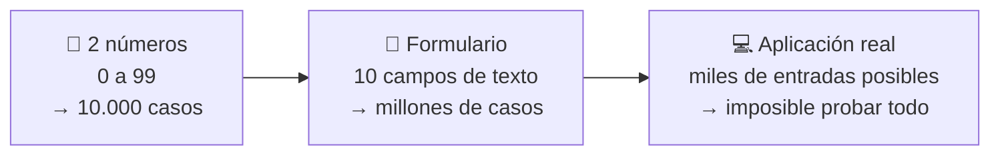

La idea central del diseño de casos de prueba es elegir un conjunto **representativo** que equilibre la confianza en detectar errores y el uso razonable de tiempo y recursos. Existen dos grandes enfoques: la **caja blanca**, que mira el código por dentro, y la **caja negra**, que solo mira las entradas y salidas.

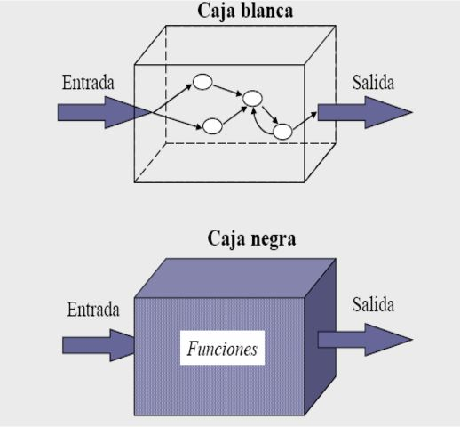

---

## 2. Pruebas de caja blanca

!!! info "Idea clave"
    Las pruebas de caja blanca se centran en la estructura interna del programa: sus rutas lógicas, sus condiciones y sus bucles. Se llaman así porque el probador tiene acceso al código fuente y lo examina directamente.

<div class="tabs-colored" markdown>

=== "🛣️ Rutas y condiciones"
    - **Rutas de ejecución**: qué caminos puede tomar el programa según las condiciones del código.
    - **Condiciones y decisiones**: que todas las ramas de un `if` o un `switch` se evalúan correctamente.
    - **Bucles**: si se ejecutan el número de veces esperado, y qué pasa si no se ejecutan ninguna.

=== "📊 Cobertura"
    La **cobertura del código** mide qué porcentaje del programa se ha probado realmente:

    | Métrica | Qué mide |
    |---|---|
    | **Cobertura de sentencias** | ¿Se ejecutó cada línea al menos una vez? |
    | **Cobertura de condiciones** | ¿Se evaluaron todos los valores posibles de cada condición? |
    | **Cobertura de rutas** | ¿Se probaron todas las combinaciones de caminos? |

=== "⚖️ Ventajas e inconvenientes"
    | ✅ A favor | ❌ En contra |
    |---|---|
    | Detecta errores de lógica interna que las pruebas funcionales pasarían por alto | Exige conocer el código a fondo |
    | Identifica código innecesario o redundante | Consume más tiempo que la caja negra |
    | Permite revisar cómo se gestionan entradas y salidas | En sistemas grandes, probar todas las rutas puede ser impracticable |

</div>

### 2.1 La técnica del camino básico

Una de las formas más sistemáticas de aplicar la caja blanca es la **técnica del camino básico**, que identifica todas las rutas independientes de un programa para asegurar que se cubre su lógica interna.

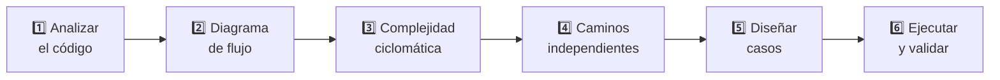

La **complejidad ciclomática** se calcula con la fórmula `M = E − N + 2`, donde `E` es el número de aristas y `N` el número de nodos del grafo de flujo. El resultado indica cuántos caminos independientes hay —y cuántos casos de prueba se necesitan como mínimo para cubrir toda la lógica.

!!! example "Ejemplo: técnica del camino básico sobre `calcularTotalConDescuento`"

    El método recibe un array de precios y aplica un 20 % de descuento a los que superen 50 €.

    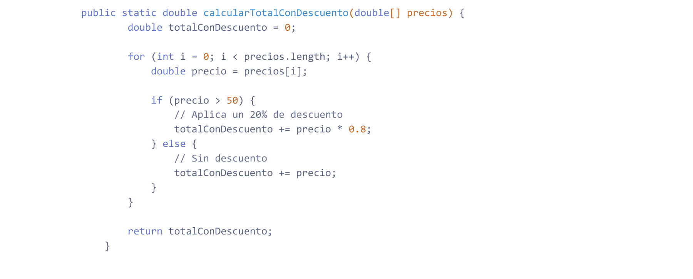{ style="width: auto; max-width: 100%;" }

    **Paso 1 — Analizar el código.** Lo primero es identificar las estructuras de control que determinan los posibles caminos: el `for` recorre el array y el `if/else` bifurca la ejecución según el precio de cada elemento.

    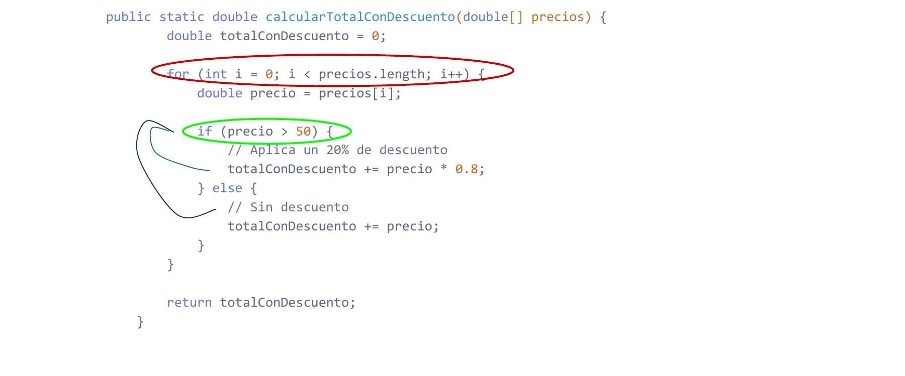{ style="width: auto; max-width: 100%;" }

    **Paso 2 — Diagrama de flujo de control.** A cada punto de decisión o acción relevante se le asigna un nodo (A–G). El grafo resultante tiene 7 nodos y 8 aristas; la arista de G a B representa la vuelta al inicio del bucle.

    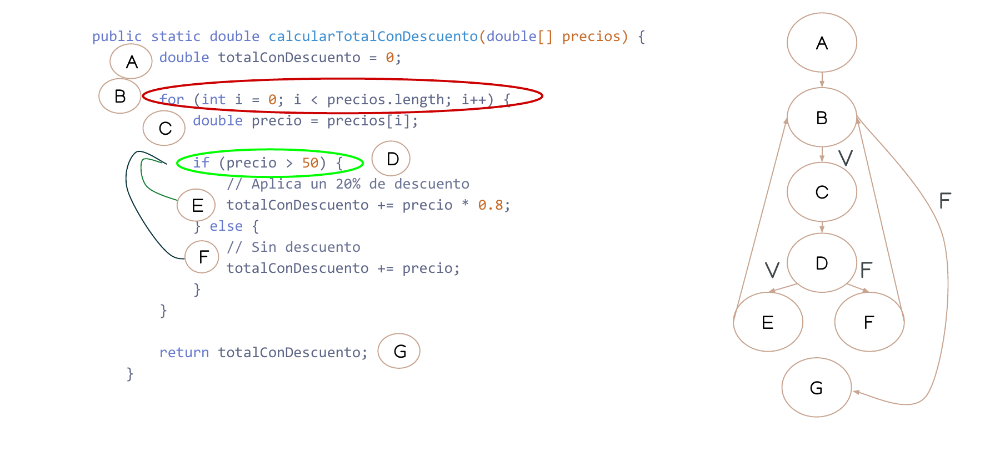{ style="width: auto; max-width: 100%;" }

    **Paso 3 — Complejidad ciclomática.** Con el grafo listo, se aplica la fórmula `M = E − N + 2`, donde E es el número de aristas y N el de nodos. En este caso `M = 8 − 7 + 2 = 3`: hay 3 caminos distintos posibles, así que hacen falta como mínimo 3 casos de prueba para cubrir toda la lógica del método.

    **Paso 4 — Caminos independientes.** Los tres caminos que recorren el grafo de forma independiente son:

    | Camino | Recorrido | Descripción |
    |---|---|---|
    | **C1** | A → B → G | Array vacío: el `for` no itera |
    | **C2** | A → B → C → D → E → G | Bucle itera, `precio > 50` → se aplica descuento |
    | **C3** | A → B → C → D → F → G | Bucle itera, `precio ≤ 50` → sin descuento |

    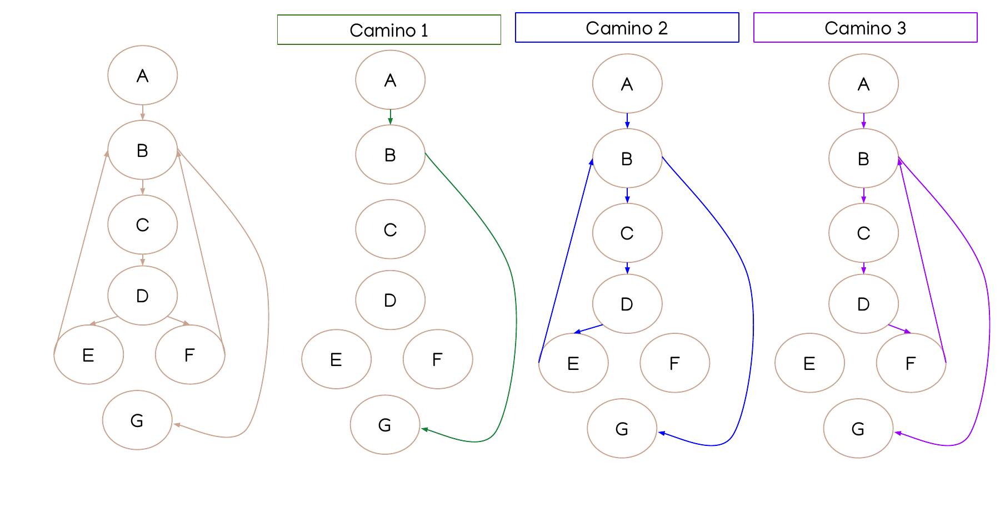{ style="width: auto; max-width: 100%;" }

    **Paso 5 — Diseñar los casos de prueba.** Un caso por camino es suficiente para cubrir toda la lógica del método:

    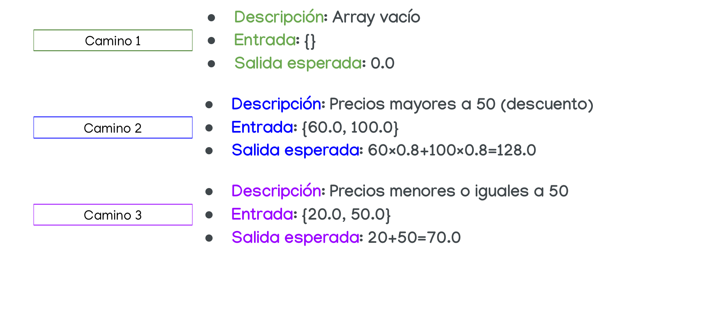{ style="width: auto; max-width: 100%;" }

    **Paso 6 — Ejecutar y validar.** La consola confirma que los tres casos producen exactamente el resultado esperado.

    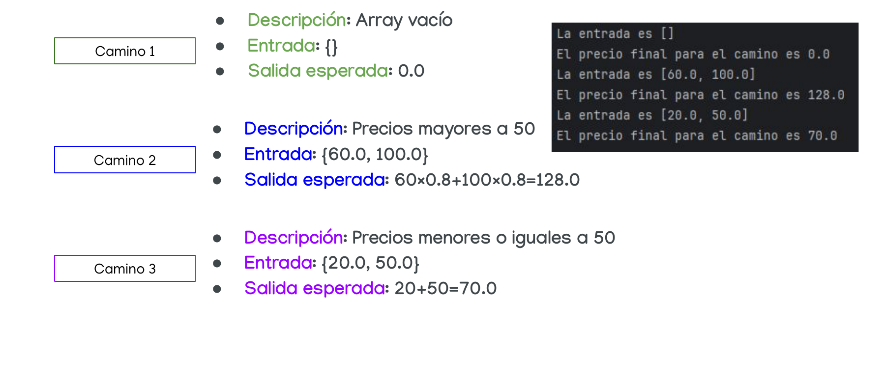{ style="width: auto; max-width: 100%;" }

!!! tip "Ver el ejemplo de `contarLetras` con diagramas en la sección 4"
    En la [sección 4 — Caja blanca](#4-ejemplos-resueltos) tienes un segundo ejemplo resuelto completo con imágenes del grafo de flujo y la salida en consola.

!!! info "Caja blanca — vídeo explicativo"
    [📺 Ver explicación de caja blanca](https://www.youtube.com/watch?v=O6Cg4ing5bo&t=1s){target="_blank" rel="noopener"}

---

## 3. Pruebas de caja negra

!!! info "Idea clave"
    Las pruebas de caja negra evalúan el comportamiento del software a partir de sus especificaciones, entradas y salidas, **sin mirar cómo está implementado por dentro**. La prueba de caja negra no es una alternativa a la caja blanca, sino un enfoque complementario que intenta descubrir diferentes tipos de errores.

Este tipo de pruebas permite encontrar:

- Funciones incorrectas o ausentes.
- Errores de interfaz.
- Errores en estructuras de datos o en accesos a bases de datos externas.
- Errores de rendimiento.
- Errores de inicialización y terminación.

Los casos de prueba se diseñan atendiendo a las **especificaciones del problema**, sin importar los detalles internos del programa.

!!! info "Caja negra — vídeo explicativo"
    [📺 Ver explicación de caja negra](https://www.youtube.com/watch?v=pAVc6SY__cA){target="_blank" rel="noopener"}

Hay tres técnicas principales:

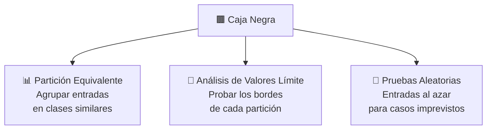

### 3.1 Partición equivalente (PE)

Esta técnica divide las posibles entradas en **clases de equivalencia**: grupos de valores que, en teoría, deberían comportarse igual frente al programa. En vez de probar todos los valores de una clase, basta con probar **uno representativo** de cada una.

El proceso tiene tres pasos:

1. **Identificar las clases de equivalencia** tomando cada condición de entrada y aplicando las directrices de la tabla siguiente.
2. **Definir la tabla de clases**, asignando un identificador único a cada clase (numeradas) y separando las válidas de las inválidas.
3. **Definir los casos de prueba**: un caso que cubra tantas clases válidas como sea posible, y un caso por cada clase inválida (las clases inválidas se cubren de una en una para aislar el error).

**Directrices para determinar las clases según el tipo de entrada:**

| Tipo de entrada | Nº clases válidas | Nº clases inválidas |
|---|---|---|
| Rango de valores, ej. `[20..30]` | 1: un valor dentro del rango (p. ej. 25) | 2: uno por debajo y otro por encima (15 y 40) |
| Conjunto finito de valores, ej. `{2, 4, 6, 8}` | 1: un valor del conjunto (p. ej. 4) | 2: uno fuera por debajo y otro por encima (1 y 10) |
| Condición booleana (T/F), ej. "debe ser una letra" | 1: un valor que la cumple ("j") | 1: un valor que no la cumple ("?") |
| Conjunto de valores admitidos, ej. `{opción1, opción2, opción3}` | tantas como valores admitidos (3 en el ejemplo) | 1: un valor no admitido |

!!! example "Validar la edad de un usuario (18 a 65 años)"

    ```mermaid
    flowchart LR
      A["❌ Inválido\n(menor de 18)\nej. 6"] --> B["✅ Válido\n(18 a 65)\nej. 33"] --> C["❌ Inválido\n(mayor de 65)\nej. 82"]
    ```

    Bastan **3 casos** (uno por clase) en lugar de probar todos los valores posibles.

!!! tip "Ver ejemplos resueltos completos"
    En la [sección 4 — Caja negra](#4-ejemplos-resueltos) puedes ver la PE aplicada paso a paso sobre tres ejemplos distintos: admisión por porcentaje (rango), admisión por nota (conjunto de opciones) y calculadora (múltiples entradas).

### 3.2 Análisis de valores límite (AVL)

Los errores de programación suelen concentrarse justo en los **límites** de las clases de equivalencia: un `<` que debería ser `<=`, un índice que se sale por uno... Esta técnica complementa a la PE probando específicamente esos bordes. Se aplica cuando el tipo de entrada es un rango de valores o un conjunto finito.

El proceso es el mismo que en PE, pero las clases se definen según estos criterios:

| Tipo de entrada | Nº clases válidas en el límite | Nº clases inválidas junto al límite |
|---|---|---|
| Rango de valores, ej. `[20..30]` | 4: los dos extremos y los valores adyacentes dentro (20, 21, 29, 30) | 2: justo por debajo y por encima del rango (19 y 31) |
| Conjunto finito de valores, ej. `{2, 4, 6, 8}` | 4: mínimo, máximo y sus adyacentes dentro del conjunto (2, 4, 6, 8) | 2: justo por debajo y por encima del conjunto (1 y 9) |

!!! example "Mismo caso: edad entre 18 y 65 años"

    ```mermaid
    flowchart LR
      A["❌ 17\n(justo fuera)"] --> B["✅ 18\n(límite inferior)"] --> C["✅ 19\n(adyacente)"]
      D["✅ 64\n(adyacente)"] --> E["✅ 65\n(límite superior)"] --> F["❌ 66\n(justo fuera)"]
    ```

    Estos **6 valores** son mucho más propensos a sacar a la luz un error de "uno de más o uno de menos" que un valor cualquiera del centro del rango.

!!! warning "Cuándo NO aplicar AVL"
    El AVL solo tiene sentido cuando la entrada es un rango numérico o un conjunto finito ordenado. Si la entrada es un conjunto de opciones de texto como `{"apto", "no apto"}`, no hay límites numéricos que analizar y esta técnica no se aplica.

### 3.3 Pruebas aleatorias

Cuando no se sigue ningún patrón concreto, se pueden generar entradas al azar para intentar descubrir errores en combinaciones que no se hubieran ocurrido al diseñar casos "a mano".

!!! example "Calculadora con cuatro operaciones"
    Para una calculadora que acepta dos números y una operación (+, −, ×, ÷), se podrían generar combinaciones aleatorias como: 25 y 5 con `+`, −12 y 0 con `÷` (candidato para detectar si el programa controla la división por cero), 9 y −3 con `×`, o 100 y 50 con `−`.

---

## 4. Ejemplos resueltos

Aquí tienes los ejemplos completos de caja blanca y caja negra, documentados paso a paso siguiendo el mismo proceso que se aplica en las actividades.

---

!!! example "⬜ Caja blanca — `contarLetras`"

    El método recibe un array de caracteres y una letra, y devuelve cuántas veces aparece esa letra en el array.

    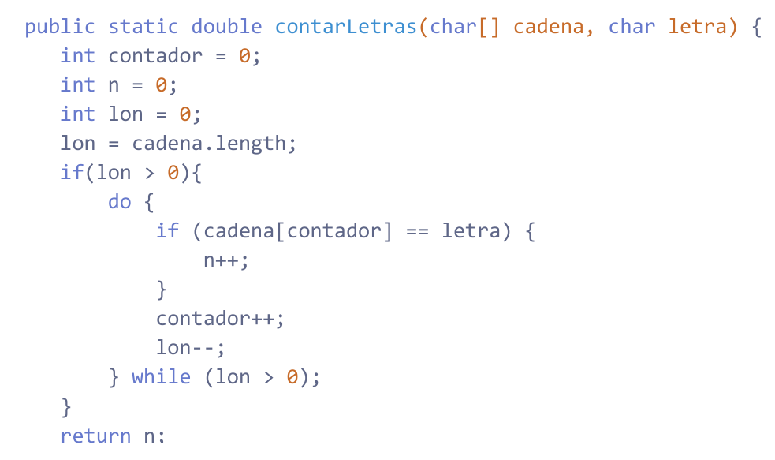{ style="width: auto; max-width: 100%;" }

    **Paso 1 — Analizar el código.** Lo primero es leer el código e identificar qué estructuras de control tiene: un `if` que comprueba si la cadena tiene elementos, y un `do-while` que la recorre con otro `if` interno que cuenta coincidencias. Cada estructura de control va a generar bifurcaciones en el grafo, así que hay que localizarlas todas antes de continuar.

    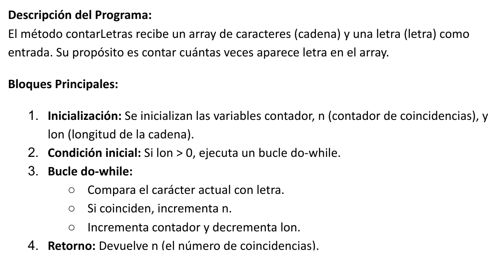{ style="width: auto; max-width: 100%;" }

    **Paso 2 — Diagrama de flujo de control.** Se asigna un número a cada punto relevante del código (nodo) y se dibujan las aristas que conectan un nodo con el siguiente. La arista de retorno del `do-while` (de nodo 6 a nodo 3) es importante: representa la vuelta al inicio del bucle y es la que añade un camino independiente más al grafo.

    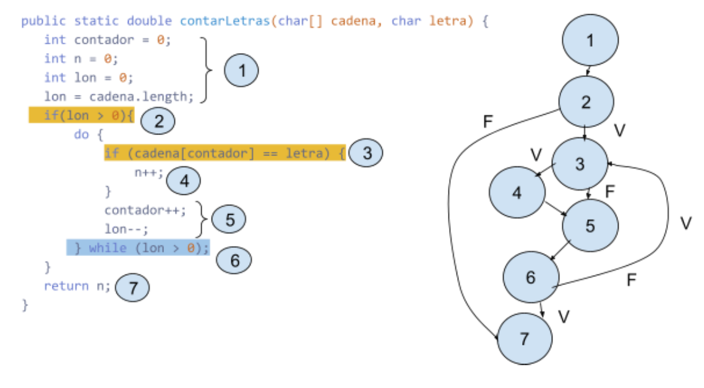{ style="width: auto; max-width: 100%;" }

    **Paso 3 — Complejidad ciclomática.** Con el grafo listo, se aplica la fórmula `M = E − N + 2`. El resultado no es solo un número: indica exactamente cuántos casos de prueba se necesitan como mínimo para ejecutar todas las rutas lógicas del método al menos una vez.

    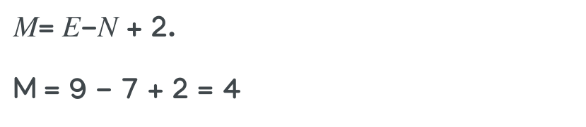{ style="width: auto; max-width: 100%;" }

    M = 4, así que necesitamos 4 caminos independientes y un caso de prueba para cada uno.

    **Paso 4 — Caminos independientes.** Se listan los 4 caminos que recorren el grafo sin repetir rutas ya cubiertas. Cada camino representa una situación diferente de ejecución: cadena vacía, bucle con coincidencia, bucle sin coincidencia, y bucle con varias iteraciones.

    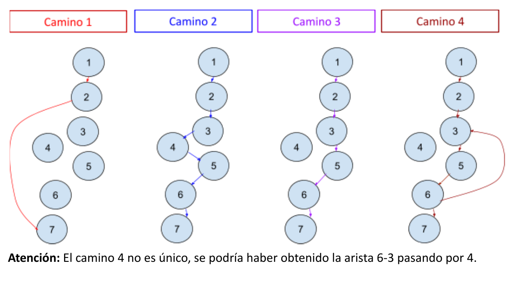{ style="width: auto; max-width: 100%;" }

    **Paso 5 — Diseñar los casos de prueba.** Para cada camino se elige una entrada concreta que fuerce a pasar por ese camino y se anota la salida que debe producir. Si alguien ejecuta estos 4 casos y todos pasan, ha ejercitado toda la lógica del método.

    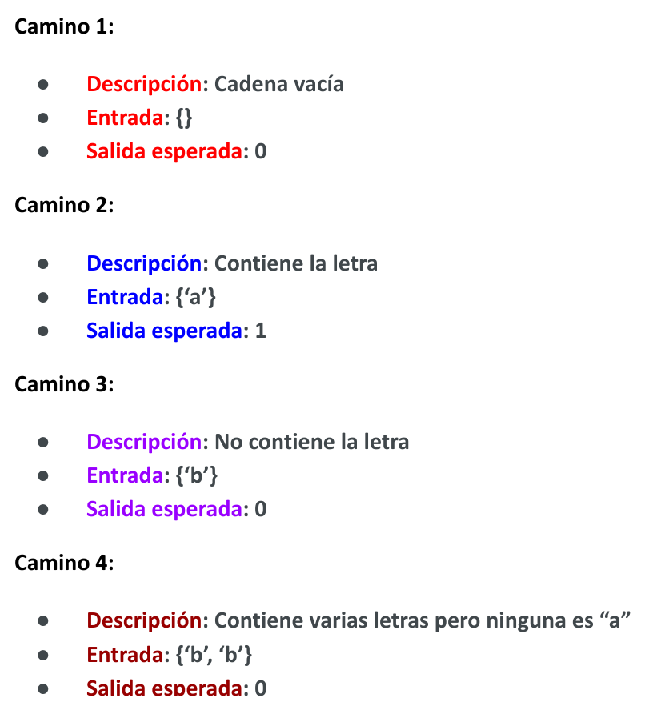{ style="width: auto; max-width: 100%;" }

    **Paso 6 — Ejecutar y validar.** Se corre el código con las entradas diseñadas y se comprueba que la salida real coincide con la esperada. Si hay alguna discrepancia, hay un defecto en ese camino.

    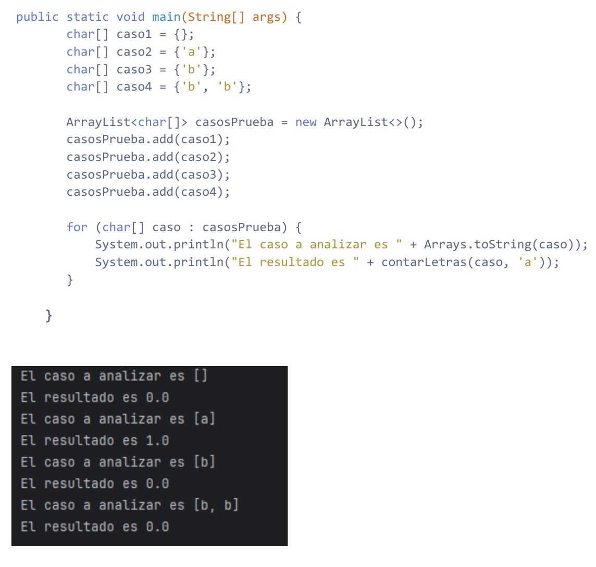{ style="width: auto; max-width: 100%;" }

---

!!! example "🟫 Caja negra — Ejemplo 1: admisión por porcentaje"

    **Especificación:** Una universidad admite estudiantes si su porcentaje de aciertos está entre el 50 % y el 90 %, ambos inclusive. Por debajo de 50 → NO admitido; por encima de 90 → NO admitido.

    #### Técnica de Partición Equivalente

    La especificación define un rango numérico para una sola entrada. Todo valor dentro del rango pertenece a la misma clase válida; lo que queda por encima y por debajo forman cada uno su propia clase inválida.

    | Entrada | Tipo de datos | Nº clases válidas | Nº clases inválidas |
    |---|---|---|---|
    | porcentaje | rango de valores `[50..90]` | 1 | 2 |

    Las clases se etiquetan con números para poder referenciarlas en la tabla de casos de prueba.

    | Condición | Clases válidas | Clases no válidas |
    |---|---|---|
    | porcentaje | (1) valor dentro de `[50..90]` | (2) valor por debajo de `[50..90]`<br>(3) valor por encima de `[50..90]` |

    Un representante por clase es suficiente. Si el código trata bien a un valor del rango, los tratará bien a todos; si falla con un valor fuera del rango, fallará con cualquier otro de esa misma clase inválida.

    | Caso de prueba | Clases válidas | Clases inválidas | Salida |
    |---|---|---|---|
    | porcentaje = 65 | (1) | | SI |
    | porcentaje = 33 | | (2) | NO |
    | porcentaje = 99 | | (3) | NO |

    #### Análisis de Valores Límite

    PE confirma que el sistema funciona "en el interior" del rango, pero los errores de programación suelen estar en los bordes: usar `<` cuando debería ser `<=`, o comparar con 49 en lugar de 50. AVL pone el foco exactamente ahí, dividiendo el rango en cuatro subclases según la distancia al límite.

    | Entrada | Tipo de datos | Nº clases válidas | Nº clases inválidas |
    |---|---|---|---|
    | porcentaje | rango de valores | 4 | 2 |

    | Condición | Clases válidas | Clases no válidas |
    |---|---|---|
    | porcentaje | (1) valor mínimo del rango<br>(2) mínimo+1<br>(3) valor máximo del rango<br>(4) máximo−1 | (5) mínimo−1<br>(6) máximo+1 |

    Los seis casos comprueban los dos extremos del rango (50 y 90), los valores inmediatamente adyacentes dentro (51 y 89) e inmediatamente fuera (49 y 91). Si todos estos pasan, casi con seguridad el código compara los límites correctamente.

    | Caso de prueba | Clases válidas | Clases inválidas | Salida |
    |---|---|---|---|
    | porcentaje = 50 | (1) | | SI |
    | porcentaje = 51 | (2) | | SI |
    | porcentaje = 90 | (3) | | SI |
    | porcentaje = 89 | (4) | | SI |
    | porcentaje = 49 | | (5) | NO |
    | porcentaje = 91 | | (6) | NO |

---

!!! example "🟫 Caja negra — Ejemplo 2: admisión por nota"

    **Especificación:** El campo `nota` acepta únicamente los valores `"apto"` y `"no apto"`. Cualquier otro valor es un error.

    #### Técnica de Partición Equivalente

    Aquí la entrada no es un rango sino un conjunto discreto de valores. Cada valor válido forma su propia clase: aunque "apto" y "no apto" ambos son aceptados, el sistema los procesa de forma diferente (uno admite, otro rechaza), así que no pertenecen a la misma clase.

    | Entrada | Tipo de datos | Nº clases válidas | Nº clases inválidas |
    |---|---|---|---|
    | nota | conjunto de valores admitidos `{apto, no apto}` | 2 | 1 |

    | Condición | Clases válidas | Clases no válidas |
    |---|---|---|
    | nota | (1) valor `"apto"`<br>(2) valor `"no apto"` | (3) otro valor no admitido |

    Con conjuntos nominales se prueba cada valor válido por separado. Para lo inválido basta un solo representante, ya que cualquier valor fuera del conjunto debería producir el mismo error.

    | Caso de prueba | Clases válidas | Clases inválidas | Salida |
    |---|---|---|---|
    | nota = "apto" | (1) | | SI |
    | nota = "no apto" | (2) | | NO |
    | nota = "otro" | | (3) | error |

    #### Análisis de Valores Límite

    !!! warning "AVL no aplicable aquí"
        No se puede realizar esta prueba, ya que el tipo de entrada no es ni un rango de valores ni un conjunto finito numérico, sino un conjunto de cadenas de texto. El AVL solo tiene sentido cuando hay un orden numérico sobre el que identificar bordes.

---

!!! example "🟫 Caja negra — Ejemplo 3: calculadora"

    **Especificación:** Una calculadora acepta dos números enteros positivos entre 1 y 999 (inclusive) y un operador del conjunto `{+, −, /, *}`. Devuelve un número si los datos son correctos y `error` si no lo son.

    #### Técnica de Partición Equivalente

    Hay tres entradas independientes y hay que analizar cada una por separado. Los dos números son rangos (misma estructura, mismas clases); el operador es un conjunto de valores nominales donde cada valor válido forma su propia clase, porque la calculadora ejecuta código diferente para cada operación.

    | Entrada | Tipo de datos | Nº clases válidas | Nº clases inválidas |
    |---|---|---|---|
    | numero | rango `[1..999]` | 1 | 2 |
    | numero2 | rango `[1..999]` | 1 | 2 |
    | operador | conjunto `{+, −, /, *}` | 4 | 1 |

    | Condición | Clases válidas | Clases no válidas |
    |---|---|---|
    | numero | (1) valor dentro del rango, ej. 30 | (7) fuera por debajo, ej. −4<br>(8) fuera por arriba, ej. 2000 |
    | numero2 | (2) valor dentro del rango, ej. 30 | (9) fuera por debajo, ej. −19<br>(10) fuera por arriba, ej. 1002 |
    | operador | (3) `+`<br>(4) `−`<br>(5) `/`<br>(6) `*` | (11) otro valor, ej. `?` |

    Los cuatro operadores válidos requieren un caso cada uno. Los nueve casos cubren todas las clases: cuatro para los operadores, cinco para las entradas numéricas inválidas (dos por número más el operador inválido).

    | Caso de prueba | Clases válidas | Clases inválidas | Salida |
    |---|---|---|---|
    | 12, 6, + | 1, 2, 3 | | Número |
    | 12, 6, − | 1, 2, 4 | | Número |
    | 12, 6, / | 1, 2, 5 | | Número |
    | 12, 6, * | 1, 2, 6 | | Número |
    | −4, 5, + | | 7 | error |
    | 1002, 5, + | | 8 | error |
    | 6, −5, + | | 9 | error |
    | 6, 1222, + | | 10 | error |
    | 6, 5, ? | | 11 | error |

    #### Análisis de Valores Límite

    AVL solo tiene sentido en las entradas numéricas, donde existe un orden. El operador ya está cubierto con PE (no tiene bordes numéricos que explorar). Para cada número se identifican cuatro subclases de límite: el mínimo exacto, el valor justo por encima, el máximo exacto y el valor justo por debajo.

    | Entrada | Tipo de datos | Nº clases válidas | Nº clases inválidas |
    |---|---|---|---|
    | numero | rango `[1..999]` | 4 | 2 |
    | numero2 | rango `[1..999]` | 4 | 2 |
    | operador | conjunto `{+, −, /, *}` | 4 | 1 |

    | Condición | Clases válidas | Clases no válidas |
    |---|---|---|
    | numero | (1) mínimo 1<br>(2) mínimo+1 = 2<br>(3) máximo 999<br>(4) máximo−1 = 998 | (13) fuera por debajo, 0<br>(14) fuera por arriba, 1000 |
    | numero2 | (5) mínimo 1<br>(6) mínimo+1 = 2<br>(7) máximo 999<br>(8) máximo−1 = 998 | (15) fuera por debajo, 0<br>(16) fuera por arriba, 1000 |
    | operador | (9) `+`<br>(10) `−`<br>(11) `/`<br>(12) `*` | (17) otro valor, `?` |

    En cada caso combinamos los límites de `numero` y `numero2` al mismo tiempo para aprovechar los casos. Los cuatro primeros cubren todos los bordes válidos; los cinco siguientes prueban que los valores justo fuera del rango producen error.

    | Caso de prueba | Clases válidas | Clases inválidas | Salida |
    |---|---|---|---|
    | 1, 1, + | 1, 5, 9 | | Número |
    | 2, 2, − | 2, 6, 10 | | Número |
    | 999, 999, / | 3, 7, 11 | | Número |
    | 998, 998, * | 4, 8, 12 | | Número |
    | 0, 1, + | | 13 | error |
    | 1000, 1, + | | 14 | error |
    | 1, 0, + | | 15 | error |
    | 1, 1000, + | | 16 | error |
    | 1, 1, ? | | 17 | error |

