<a id="depuracion"></a>

# 🐞 Depuración

{ type=application/pdf style="width:100%;min-height:80vh" }

!!!info "Descarga de diapositivas"
    [Descarga las diapositivas](diapositivas/depuracion.pdf){target="_blank" rel="noopener"}

---

## 1. ¿Qué es depurar?

Cuando un programa no hace lo que debería, la forma más lenta de encontrar el problema es ir añadiendo `System.out.println` por todo el código para ver qué valor tiene cada variable. La depuración es la alternativa profesional: consiste en ejecutar el programa de forma controlada, deteniéndolo en el punto que decidas, para observar y modificar su estado mientras está en marcha. La herramienta que hace esto posible es el **depurador** (*debugger*), integrado en cualquier IDE serio.

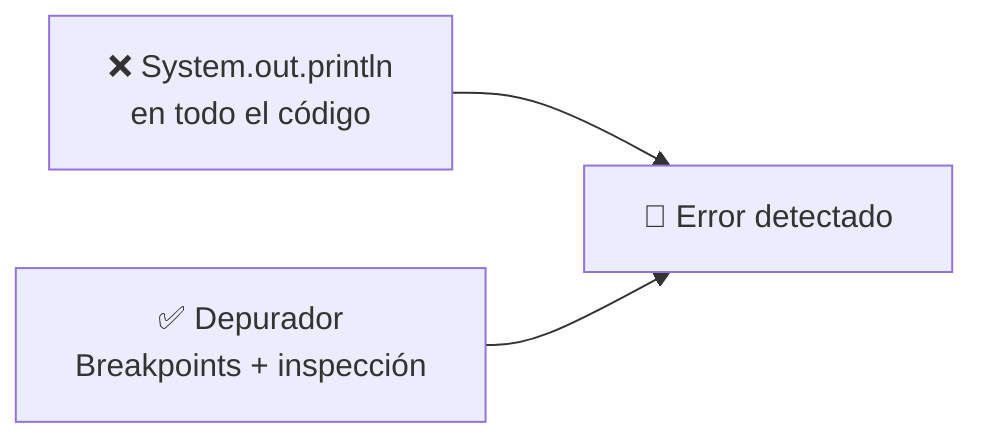

!!! example "Un error que solo se ve en ejecución"
    ```java
    public class Main {
        public static void main(String[] args) {
            int[] numbers = {1, 2, 3, 4, 5};
            int sum = 0;

            for (int i = 0; i <= numbers.length; i++) {
                sum += numbers[i];
            }

            System.out.println("La suma de los números es: " + sum);
        }
    }
    ```

    Al ejecutarlo aparece:

    ```
    Exception in thread "main" java.lang.ArrayIndexOutOfBoundsException:
    Index 5 out of bounds for length 5
        at activities.Main.main(Main.java:9)
    ```

    El programa compila sin problema: el error es de lógica, no de sintaxis. La condición `i <= numbers.length` permite que `i` llegue a valer 5, pero el array solo tiene índices del 0 al 4. Debería ser `i < numbers.length`. Para encontrar este tipo de error sin adivinarlo a ojo, lo lógico es depurar paso a paso y observar qué vale `i` en cada vuelta del bucle.

---

## 2. Iniciar el depurador en IntelliJ

Depurar una aplicación de consola en IntelliJ se puede hacer de tres formas:

<div class="tabs-colored" markdown>

=== "🖱️ Clic en el margen"
    Haz clic en el área de números de línea (la zona gris a la izquierda del código) y selecciona **Debug 'Main'**.

=== "📋 Menú Run"
    Ve a **Run → Debug 'Main'**.

=== "⌨️ Atajo de teclado"
    Pulsa **Shift + F9**.

</div>

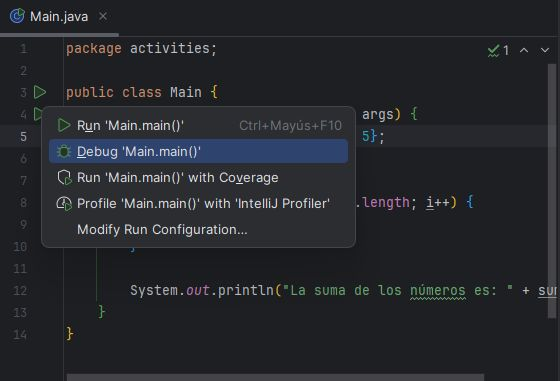

!!! warning "Sin breakpoints no pasa nada distinto"
    Si lanzas el depurador sin haber definido ningún punto de interrupción, el programa se ejecuta exactamente igual que con Run normal, de principio a fin, sin detenerse. Para que la depuración tenga sentido, hace falta marcar al menos un punto donde el programa se pare.

---

## 3. Puntos de interrupción (breakpoints)

Un **breakpoint** es una marca en una línea de código que le dice al depurador: "detén aquí la ejecución". Se añade haciendo clic en el margen izquierdo, junto al número de línea (aparece una bola roja y la línea se resalta), o con el atajo **Ctrl + F8**. Se quita haciendo clic otra vez sobre la bola roja.

![Breakpoint añadido en la línea sum += numbers[i], marcada en rojo](img/debug-breakpoint-anadido.png)

Cuando el programa llega a un breakpoint, se detiene y se abre la ventana **Debug** en la parte inferior del IDE. Desde ahí puedes:

- Visualizar los valores de las variables en ese instante.
- Ejecutar el programa paso a paso, línea a línea.
- Ver qué método ha llamado a cuál para llegar hasta ese punto.

### 3.1 Tipos de breakpoints

No todos los breakpoints se comportan igual. IntelliJ distingue varios tipos según qué hace que se active la parada:

| Tipo | Se activa cuando… |
|---|---|
| **De línea** | La ejecución llega a la línea de código donde se colocó. Es el más habitual. |
| **De método** | El programa entra o sale de un método concreto. Útil para comprobar condiciones de entrada/salida sin buscar la línea exacta. |
| **Field Watchpoint** (de campo) | Se lee o se modifica un atributo de instancia. Sirve para detectar quién está cambiando una variable de objeto sin que lo esperes. |
| **De excepción** | Se lanza una excepción concreta, aunque no esté directamente en tu código. Se configura desde **Run → View Breakpoints** (`Ctrl + Shift + F8`). |

!!! example "Breakpoint de excepción"
    ```java
    public class SimpleDebugExample {
        private static int multiplicacion;

        public static void main(String[] args) {
            for (int i = 0; i < 10; i++) {
                multiplicacion = multiply(i, 2);
            }

            try {
                int divisionResult = divide(10, 0);
            } catch (ArithmeticException e) {
                System.out.println("Excepción capturada: " + e.getMessage());
            }
        }

        public static int multiply(int a, int b) { return a * b; }
        public static int divide(int a, int b)   { return a / b; }
    }
    ```

    Un breakpoint de excepción sobre `ArithmeticException` detendría el programa justo en la línea `return a / b;`, antes de que el `catch` la capture, permitiéndote ver el estado exacto en el momento del fallo.

<div class="tabs-colored" markdown>

=== "🔵 Breakpoint de método"

    Se coloca directamente sobre la firma del método (aquí, `multiply`) y permite elegir si se activa al entrar, al salir, o ambos.

    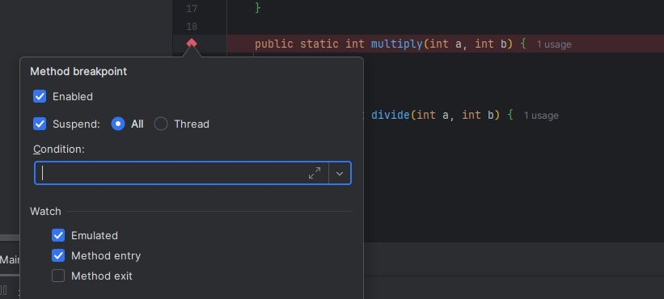

=== "👁️ Field Watchpoint"

    Se coloca sobre la declaración de un atributo (aquí, `multiplicacion`) y se activa cada vez que se lee o se escribe ese campo, sin importar desde qué método.

    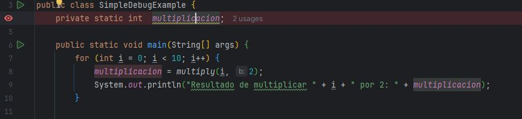

=== "⚡ Breakpoint de excepción"

    Se configura desde la ventana de Breakpoints marcando "Any exception" (o una excepción concreta), y se activa en el instante exacto en que se lanza.

    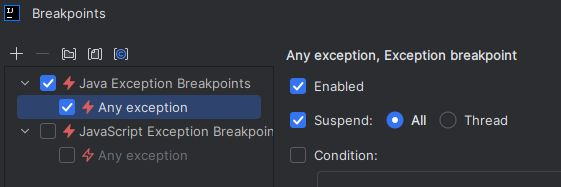

</div>

### 3.2 Configuraciones avanzadas

Desde la ventana **View Breakpoints** (`Ctrl + Shift + F8`) cada breakpoint se puede ajustar con condiciones adicionales, en lugar de limitarse a "parar siempre que llegue aquí":

| Configuración | Para qué sirve |
|---|---|
| **Condition** | El breakpoint solo se activa si una expresión se cumple (p. ej. `i == 2`), en vez de en todas las iteraciones. |
| **Evaluate and log** | En lugar de detener el programa, escribe un mensaje en consola cada vez que pasa por ahí. |
| **Remove once hit** | El breakpoint se borra solo después de activarse una vez; ideal para inspeccionar un evento puntual. |
| **Disable until hitting the following breakpoint** | Permanece inactivo hasta que se alcanza otro breakpoint indicado. |
| **Instance filters** | Solo se activa para una instancia concreta de una clase. |
| **Class filters** | Restringe la activación a una clase concreta. |
| **Pass count** | Se activa solo después de haberse alcanzado un número determinado de veces. |
| **Caller filters** | Se activa solo si el código fue invocado desde un método concreto. |

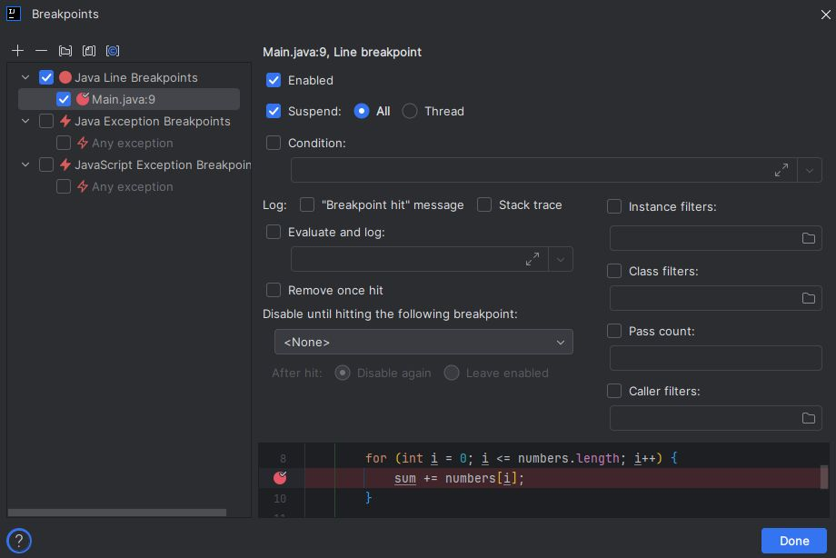

!!! example "Condición: detener solo cuando i vale 2"
    Sobre el breakpoint de la línea `sum += numbers[i];`, se marca la casilla **Condition** y se escribe `i == 2`. El programa solo se detendrá en la iteración en la que `i` valga exactamente 2, ignorando el resto.

    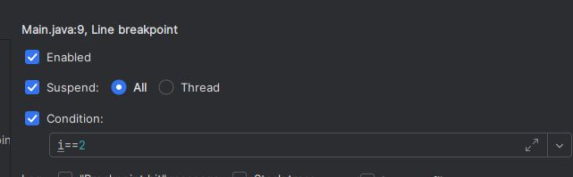

!!! example "Evaluate and log: registrar sin detener"
    Activando **Evaluate and log** con el mensaje `"El valor actual de i es: " + i` y desmarcando **Suspend**, el programa no se detiene nunca, pero la consola muestra ese mensaje cada vez que pasa por el breakpoint.

    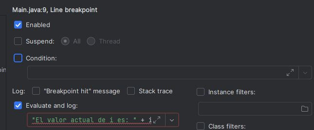

    El resultado en consola muestra el valor de `i` en cada vuelta del bucle, hasta que el programa lanza la excepción al salirse del array:

    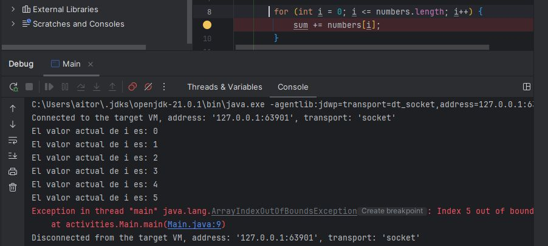

---

## 4. Inspeccionar y modificar el programa en marcha

Retomando el ejemplo de la suma del array, si colocas un breakpoint en la línea `sum += numbers[i];`, cada vez que el bucle llegue ahí el programa se detendrá y podrás examinar en la pestaña **Variables**:

- **`i`**: el índice actual del bucle.
- **`numbers[i]`**: el valor del elemento que se está sumando.
- **`sum`**: el acumulado hasta ese momento.

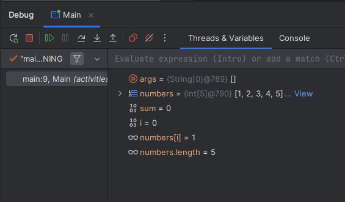

El depurador no es solo de lectura. Puedes también modificar el estado del programa en marcha:

<div class="tabs-colored" markdown>

=== "✏️ Modificar variables en caliente"
    Haciendo clic derecho sobre `sum` y seleccionando **Set Value...** puedes cambiar su valor en caliente (por ejemplo, ponerlo a 50) y seguir ejecutando para ver cómo afecta ese cambio al resultado final, sin tocar ni una línea del código fuente.

    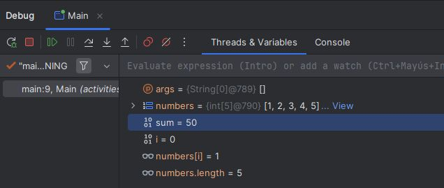

=== "👁️ Watches: vigilar expresiones"
    Si quieres vigilar el valor de una expresión más compleja que una sola variable, como `sum + numbers[i]`, puedes añadirla con **+ New Watch...** en la ventana de depuración: se recalculará automáticamente en cada parada.

    ![Watch con la expresión sum + numbers[i] mostrando su valor actual](img/debug-watch.png)

</div>

---

## 5. Avanzar paso a paso

Una vez detenido en un breakpoint, estos son los movimientos básicos para recorrer el programa:

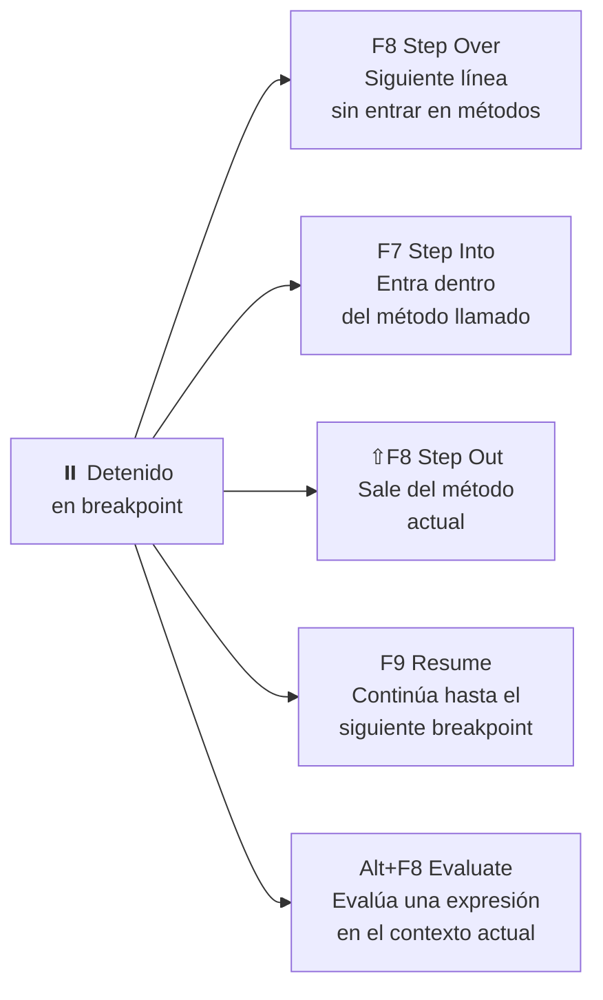

| Acción | Atajo | Qué hace |
|---|---|---|
| **Step Over** | F8 | Avanza a la siguiente línea sin entrar en los métodos que se llamen. |
| **Step Into** | F7 | Igual que Step Over, pero si la línea llama a un método propio, entra dentro de él. |
| **Step Out** | Shift + F8 | Sale del método actual y vuelve al punto desde donde se le llamó. |
| **Resume Program** | F9 | Reanuda la ejecución normal hasta el siguiente breakpoint (o hasta el final). |
| **Evaluate Expression** | Alt + F8 | Evalúa cualquier expresión en el contexto actual o reasigna una variable. |

---

## 6. La pila de llamadas

La pestaña **Frames** de la ventana Debug muestra la **pila de llamadas** (*call stack*): la secuencia de métodos que se han ido llamando unos a otros hasta llegar al punto donde está detenido el programa.

!!! example "Leyendo la pila de llamadas"
    ```java
    public class Main {
        public static void main(String[] args) {
            int[] numbers = {1, 2, 3, 4, 5};
            int sum = 0;
            for (int i = 0; i <= numbers.length; i++) {
                sum += suma(sum, numbers[i]);
            }
            System.out.println("La suma de los números es: " + sum);
        }

        public static int suma(int a, int b) { return a + b; }
    }
    ```

    Si el breakpoint está dentro de `suma()`, la pila mostrará algo como `suma() ← main()`: indica que estás dentro de `suma`, y que quien la llamó fue `main`. Haciendo clic en cualquier línea de la pila, el IDE te lleva directamente a ese punto exacto del código.

    ```mermaid
    flowchart BT
      M["main() — línea 6"] --> S["suma() — línea 11\n← estás aquí"]
    ```

    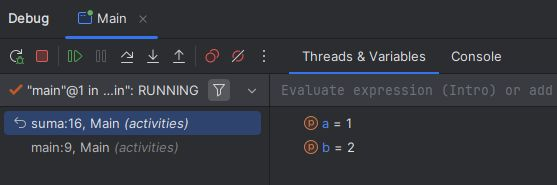

---

## 7. Desactivar todos los breakpoints a la vez

Si tienes varios breakpoints colocados pero por un momento quieres ejecutar el programa sin que ninguno te interrumpa —sin necesidad de borrarlos uno a uno—, el botón **Mute Breakpoints** de la ventana Debug los desactiva todos temporalmente. Al volver a pulsarlo, se reactivan tal y como estaban.

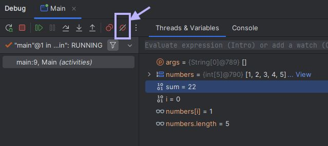
