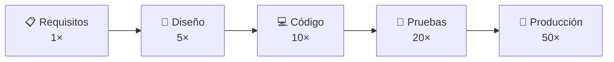
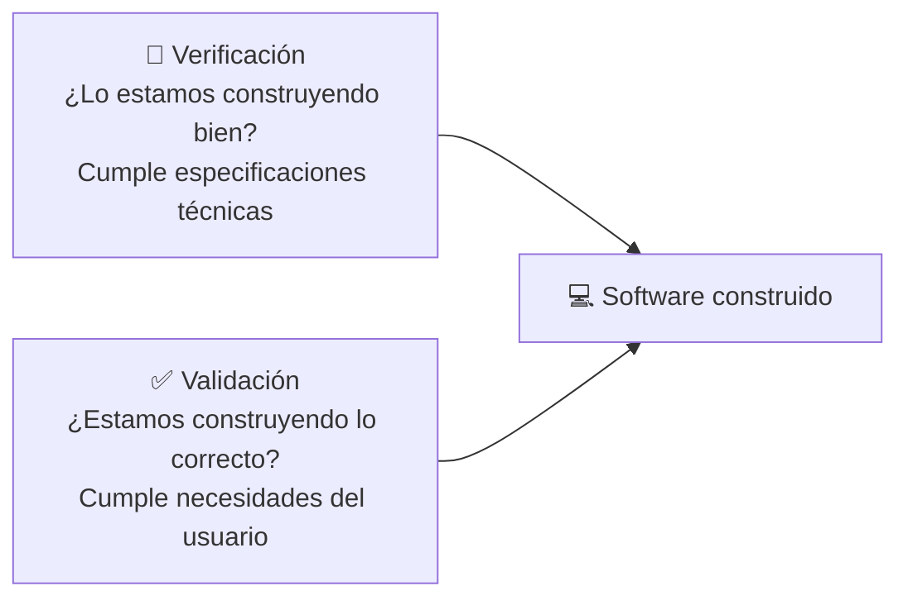
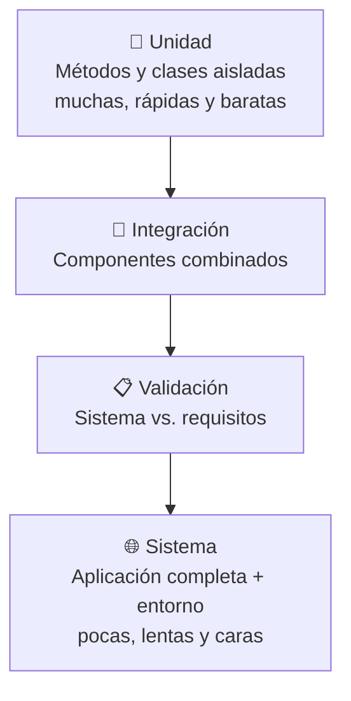

# 🧪 Pruebas de software

{ type=application/pdf style="width:100%;min-height:80vh" }

!!!info "Descarga de diapositivas"
    [Descarga las diapositivas](diapositivas/pruebas.pptx){target="_blank" rel="noopener"}

---

## 1. ¿Qué es una prueba de software?

!!! info "Idea clave"
    Una prueba de software es la ejecución controlada de un programa con el objetivo de detectar defectos: comprobar si cumple los requisitos especificados y si se comporta como se espera de él.

> *"La prueba de programas puede utilizarse para mostrar la presencia de errores, pero nunca para demostrar su ausencia."*  
> — Edgar Dijkstra

La frase resume algo importante: pasar las pruebas no significa que el programa esté libre de fallos, solo que **esas pruebas concretas no han encontrado ninguno**. El objetivo real no es demostrar que el programa es perfecto, sino reducir al mínimo los fallos que llegan al usuario.

!!! warning "Error de concepto frecuente"
    Probar el software no significa comprobar que las funcionalidades van bien **una vez terminada la implementación**. Las pruebas deben hacerse en distintas etapas del desarrollo y no se limitan a la funcionalidad: también evalúan rendimiento, seguridad, usabilidad y compatibilidad.

---

## 2. ¿Por qué cuesta tanto detectar un error tarde?

El coste de arreglar un fallo depende de cuándo se descubre. Cuanto más tarde aparece, más trabajo hay que deshacer y rehacer.

Un error en producción puede costar hasta **50 veces más** de solucionar que el mismo error detectado en la fase de requisitos. Por eso las pruebas no son un trámite al final: representan entre el **30 % y el 50 %** del coste total del proyecto.

!!! tip "Regla práctica"
    Un error de diseño —como olvidar un campo clave en la base de datos— puede obligar a rehacer tareas que ya se daban por cerradas. Detectarlo a tiempo es, literalmente, más barato.

---

## 3. Recomendaciones de G.J. Myers

G.J. Myers, autor de referencia en pruebas de software, recogió una serie de ideas que a menudo se pasan por alto cuando alguien prueba su propio código por primera vez. No son reglas formales, sino hábitos que marcan la diferencia entre probar bien y probar para cumplir el expediente.

| Recomendación | En qué consiste |
|---|---|
| **Definir resultados esperados** | Cada caso de prueba debe indicar de antemano qué resultado se espera; la discrepancia entre lo esperado y lo obtenido señala el defecto. |
| **Separación de roles** | El programador no debería probar su propio código: otra persona detecta errores más fácilmente porque no comparte los mismos puntos ciegos. |
| **Inspección minuciosa** | Hay que revisar con atención los resultados; ignorar un síntoma raro "porque seguro que no es nada" es la forma más común de dejar pasar un defecto real. |
| **Amplitud en los datos** | Probar con datos válidos **y** con datos inválidos, para cubrir tanto el caso esperado como el inesperado. |
| **Doble enfoque** | Comprobar que el software hace lo que debería, pero también que **no** hace lo que no debería (efectos secundarios no deseados). |
| **Documentar los casos** | Guardar los casos de prueba para poder repetirlos más adelante, en vez de improvisarlos y desecharlos. |
| **Asumir que hay defectos** | Partir de la base de que siempre existen errores y dedicar recursos suficientes a buscarlos. |
| **Concentración de defectos** | Los errores tienden a agruparse: si encuentras uno en una zona del código, es probable que haya más cerca. |
| **Creatividad** | Probar bien es una tarea creativa, no mecánica; requiere ingenio para encontrar el mayor número de defectos con los recursos disponibles. |

---

## 4. Verificación y validación

Al probar software se realizan dos tareas distintas que se confunden con facilidad:

!!! example "La metáfora de la casa"
    **Verificación** → revisar durante la construcción que los planos se siguen al pie de la letra: ¿los muros tienen la altura especificada?, ¿la instalación eléctrica cumple la normativa?

    **Validación** → preguntarle al propietario, una vez construida, si la casa cumple sus expectativas: ¿las habitaciones tienen el tamaño que necesitaba?

    Un software puede estar perfectamente **verificado** y aun así **no validar**, si la especificación no recogía lo que el cliente realmente quería.

---

## 5. Niveles de prueba

Las pruebas se organizan en niveles según qué parte del sistema se está comprobando. Se suelen representar como una pirámide: en la base están las más numerosas, rápidas y baratas; en la cima, las más costosas y escasas.

| Nivel | Qué comprueba |
|---|---|
| **Unidad** | Que un método o clase funciona de forma aislada |
| **Integración** | Que los componentes combinados respetan el diseño |
| **Validación** | Que el sistema completo cumple los requisitos definidos |
| **Sistema** | El funcionamiento global, incluyendo red, otros sistemas, etc. |

La idea de la pirámide es que no todas las pruebas son iguales de costosas: conviene tener muchas pruebas unitarias (baratas, rápidas, fáciles de automatizar) y pocas pruebas de sistema (lentas, caras, difíciles de repetir). Concentrar demasiados esfuerzos en el nivel más alto es un error habitual en proyectos que no tienen cultura de pruebas.

---

## 6. Tipos de pruebas

Más allá del nivel, las pruebas se clasifican según qué aspecto evalúan. Aquí tienes las más habituales agrupadas por categoría:

=== "⬜ Caja negra y caja blanca"

    | Tipo | Qué evalúa |
    |---|---|
    | **Funcional (caja negra)** | Entradas y salidas del programa, sin mirar el código interno. |
    | **Estructural (caja blanca)** | La estructura interna del programa y sus rutas de ejecución. |

    Las técnicas concretas —partición equivalente, análisis de valores límite, camino básico— se desarrollan en [Técnicas de diseño de casos de prueba](casos.md).

=== "⚡ Rendimiento"

    | Tipo | Qué evalúa |
    |---|---|
    | **De carga** | Comportamiento con el volumen de peticiones esperado: usuarios concurrentes, transacciones por segundo. |
    | **De estrés** | Resistencia del sistema en condiciones extremas, aumentando la carga hasta que falla. |
    | **De estabilidad** | Si la aplicación soporta carga continuada sin fugas de memoria ni pérdida de rendimiento. |
    | **De picos** | Cómo reacciona ante cambios bruscos en el número de usuarios. |

=== "🔁 Otras"

    | Tipo | Qué evalúa |
    |---|---|
    | **Aleatorias** | Genera casos a partir de modelos estadísticos para descubrir fallos en escenarios imprevisibles. |
    | **De regresión** | Que los cambios recientes no han roto funcionalidades que antes funcionaban correctamente. |

!!! warning "Las pruebas de regresión son críticas"
    Cada vez que cambias código para añadir una función o corregir un error, corres el riesgo de romper algo que antes funcionaba. Automatizar las pruebas de regresión —y ejecutarlas con cada cambio— es la única forma de detectar esto a tiempo.

---

## 7. Documentación de incidencias

Encontrar un defecto no es el final del proceso: hay que **documentarlo** para que alguien pueda reproducirlo, entenderlo y solucionarlo sin investigarlo desde cero. A esto se le llama **incidencia** (también *bug report* o *issue*).

!!! info "Idea clave"
    Una incidencia bien documentada permite reproducir el error sin depender de quien lo encontró. Si la documentación es vaga ("a veces falla"), el tiempo ahorrado al detectarlo se pierde después intentando averiguar qué pasó exactamente.

Un informe de incidencia útil incluye, como mínimo:

| Campo | Qué debe recoger |
|---|---|
| **Descripción** | Qué ocurre, en una frase clara |
| **Pasos para reproducir** | La secuencia exacta de acciones que provocan el fallo |
| **Resultado esperado vs. obtenido** | Qué debería pasar y qué pasa realmente |
| **Entorno** | Sistema operativo, versión del programa, datos de entrada relevantes |
| **Severidad / prioridad** | No todos los errores son igual de urgentes |

Para entender la diferencia entre un informe útil y uno que no lo es, compara estos dos:

=== "❌ Informe vago"

    **Descripción:** El login a veces no funciona.  
    **Pasos:** Entrar y logarse.  
    **Resultado:** No entra.  

    Este informe no sirve para nada. "A veces" no es reproducible. "No entra" no dice si hay un mensaje de error, si redirige a otro sitio o si simplemente no ocurre nada. Quien recibe esto tiene que empezar a investigar desde cero.

=== "✅ Informe útil"

    **Descripción:** El formulario de login acepta la contraseña incorrecta si se introduce un espacio al final.  
    **Pasos para reproducir:**
    1. Ir a `http://localhost:8080/login`
    2. Introducir usuario: `admin`
    3. Introducir contraseña: `1234 ` (con un espacio al final)
    4. Pulsar "Entrar"

    **Resultado esperado:** Mensaje de error "Credenciales incorrectas".  
    **Resultado obtenido:** Acceso concedido al panel de administración.  
    **Entorno:** Windows 11, Chrome 124, versión de la app: 2.3.1.  
    **Severidad:** Alta — permite acceso no autorizado.

    Con este informe, cualquier desarrollador del equipo puede reproducir el error en menos de un minuto.

En el día a día esto no se escribe en un documento suelto, sino en una herramienta de seguimiento como **Jira** (la misma que ya visteis en el Tema 1 para historias de usuario) o **GitHub Issues**, donde cada incidencia queda registrada, asignada y con su estado de resolución visible para todo el equipo.

!!! tip "Esto ya lo has practicado"
    Cuando en la actividad de depuración rellenas la tabla con el error encontrado, los pasos seguidos en el depurador, las capturas y el código corregido, estás documentando una incidencia real. La estructura es exactamente la misma que la de un informe de bug profesional.
