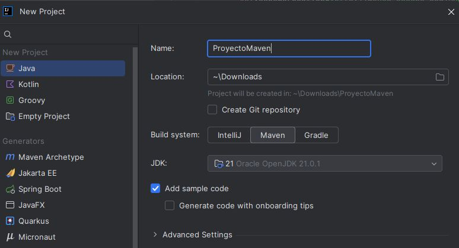
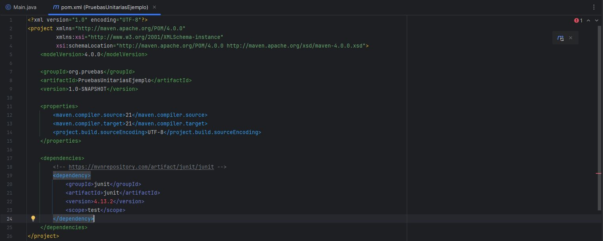
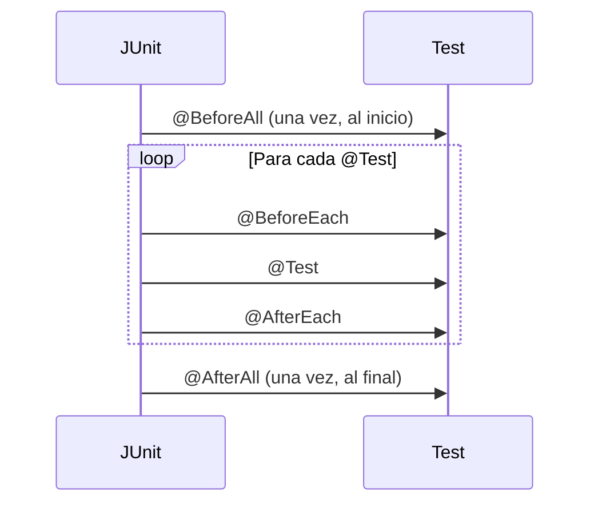
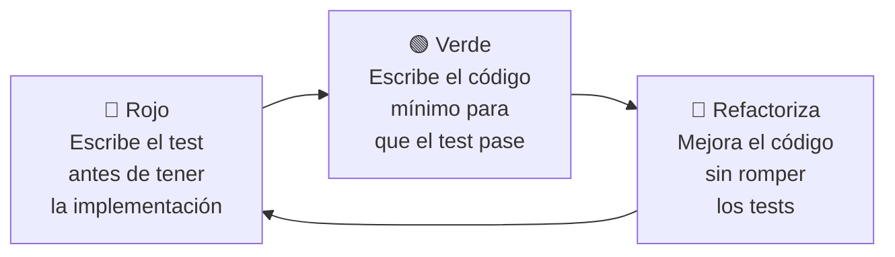
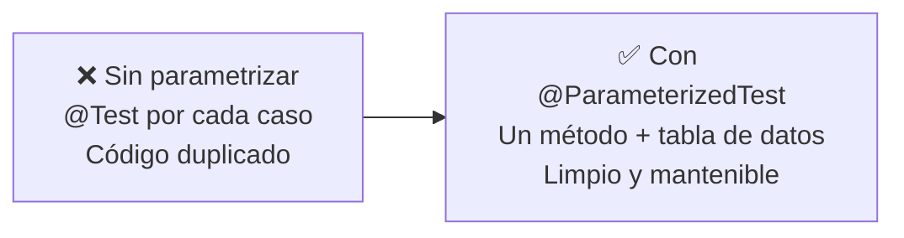
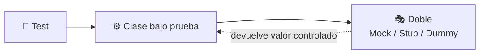

<a id="unitarias"></a>

# 🧩 Pruebas unitarias

{ type=application/pdf style="width:100%;min-height:80vh" }

!!!info "Descarga de diapositivas"
    [Descarga las diapositivas](diapositivas/unitarias.pdf){target="_blank" rel="noopener"}

---

## 1. ¿Qué son las pruebas unitarias?

!!! info "Idea clave"
    Una prueba unitaria verifica el correcto funcionamiento de un módulo individual del código —normalmente un método o una clase— de forma aislada, antes de comprobar cómo se integra con el resto del sistema.

Para que una prueba unitaria cumpla su función debe ser:

| Característica | Qué significa en la práctica |
|---|---|
| **Automatizable** | Se ejecuta sin intervención manual, no "lo pruebo a mano cada vez" |
| **Completa** | Cubre la mayor cantidad posible de código, no solo el camino feliz |
| **Reutilizable** | No sirve solo para una ejecución puntual; se puede volver a correr cuando se quiera |
| **Independiente** | El resultado de una prueba no debe depender de que se haya ejecutado otra antes |
| **Profesional** | Se documenta y se cuida con la misma calidad que el código de producción |

Las pruebas unitarias traen ventajas claras a medida que el proyecto crece:

- **Confianza al modificar**: cualquier cambio que rompa algo se detecta enseguida.
- **Seguridad antes de integrar**: se sabe que cada pieza funciona antes de combinarlas.
- **Documentación viva**: los tests muestran cómo se espera que se use cada unidad de código.
- **Separación de interfaz e implementación**: se puede cambiar cómo funciona algo por dentro sin tocar los tests si el comportamiento externo no cambia.
- **Localización de errores**: se depura la unidad problemática en aislamiento, sin revisar todo el sistema a la vez.

---

## 2. JUnit

**JUnit** es el framework de pruebas unitarias más usado en Java. Permite comprobar que cada unidad de código se comporta como se espera y es una pieza habitual del desarrollo ágil y de **TDD** (*Test-Driven Development*, desarrollo guiado por pruebas —escribir primero el test y después la implementación que lo satisface—). Se integra con Maven o Gradle para automatizar su ejecución dentro de la integración continua.

Algunos conceptos clave antes de escribir el primer test:

| Concepto | Qué es |
|---|---|
| **Prueba unitaria** | Verifica una funcionalidad concreta de forma aislada |
| **Assert** | Instrucción que comprueba si el comportamiento obtenido coincide con el esperado |
| **Anotación** | Marca el papel que juega cada método dentro del ciclo de vida de la prueba |
| **Clase de prueba** | Agrupa los métodos de test relacionados con una misma clase de producción |

### 2.1 Configuración básica con Maven

Para usar JUnit necesitas crear un **proyecto Maven** —una herramienta de construcción que gestiona por ti la estructura de carpetas, la descarga de librerías externas y la compilación del proyecto—. Sin Maven tendrías que descargar los JARs de JUnit a mano, copiarlos a una carpeta y decirle tú mismo al compilador dónde encontrarlos. Maven automatiza todo eso.

Al crear el proyecto en IntelliJ con Maven como *build system*, el IDE genera automáticamente esta estructura de carpetas:

```
mi-proyecto/
├── pom.xml                  ← configuración del proyecto
└── src/
    ├── main/java/           ← código de producción (tu aplicación)
    └── test/java/           ← tests (aquí irán tus clases de prueba)
```



El archivo `pom.xml` (*Project Object Model*) es el corazón del proyecto Maven: describe el proyecto, su versión de Java y las **dependencias** —librerías externas que el proyecto necesita y que Maven descargará automáticamente desde Internet al construirlo—.

#### ¿Qué es una dependencia?

Imagina que quieres usar JUnit. Sin Maven tendrías que ir a la web de JUnit, descargar el JAR, guardarlo en alguna carpeta y añadirlo manualmente al classpath cada vez. Con Maven basta con declarar que lo necesitas en el `pom.xml`: Maven lo busca en **Maven Central** —el repositorio público donde se publican casi todas las librerías Java— y lo descarga solo.

Para encontrar la dependencia correcta, entra en [mvnrepository.com](https://mvnrepository.com){target="_blank" rel="noopener"} (o directamente en [search.maven.org](https://search.maven.org){target="_blank" rel="noopener"}), busca la librería y copia el bloque XML que aparece bajo la pestaña *Maven*. Para JUnit 5, el bloque que hay que añadir dentro de `<dependencies>` en el `pom.xml` es:

```xml
<dependency>
    <groupId>org.junit.jupiter</groupId>    <!-- organización que publica la librería -->
    <artifactId>junit-jupiter</artifactId>  <!-- nombre del módulo concreto -->
    <version>5.11.4</version>               <!-- versión que Maven descargará -->
    <scope>test</scope>                     <!-- solo disponible al compilar y ejecutar tests -->
</dependency>
```

El `<scope>test</scope>` le dice a Maven que esta librería solo hace falta durante las pruebas: no se incluirá en el JAR final de la aplicación. Si omites el scope, la librería se añade también al código de producción, que no es lo que queremos.

Tras pegar la dependencia en el `pom.xml`, IntelliJ muestra un icono de Maven en el margen del editor. Al hacer clic, Maven descarga la librería y la deja disponible en el proyecto.



### 2.2 Ciclo de vida de las anotaciones

Las anotaciones de JUnit controlan **cuándo** se ejecuta cada método. El orden es importante para preparar y limpiar el entorno de prueba correctamente:



| Anotación | Cuándo se ejecuta |
|---|---|
| `@Test` | Marca un método como una prueba |
| `@BeforeEach` | Antes de cada prueba individual |
| `@AfterEach` | Después de cada prueba individual |
| `@BeforeAll` | Una sola vez, al principio de toda la suite de pruebas |
| `@AfterAll` | Una sola vez, al final de toda la suite |

### 2.3 Los asserts principales

| Método | Comprueba que… |
|---|---|
| `assertEquals(esperado, obtenido)` | ambos valores son iguales |
| `assertTrue(condicion)` | la condición es verdadera |
| `assertFalse(condicion)` | la condición es falsa |
| `assertNull(objeto)` | el objeto es `null` |
| `assertNotNull(objeto)` | el objeto no es `null` |
| `assertThrows(TipoExcepcion.class, () -> { ... })` | el código del lambda lanza esa excepción concreta |

### 2.4 TDD — Desarrollo guiado por pruebas

En el desarrollo normal escribes primero el código y luego los tests. **TDD** (*Test-Driven Development*) invierte ese orden: primero escribes un test que falla, luego escribes el mínimo código necesario para que pase, y finalmente mejoras el código sin romper los tests. El ciclo se repite para cada nueva funcionalidad.



La ventaja de TDD no es solo tener tests: es que el diseño del código mejora porque lo piensas desde el punto de vista de quien lo va a usar, no de quien lo va a implementar. Si algo resulta difícil de testear, probablemente está mal diseñado.

!!! tip "Recuerda"
    El test debe fallar antes de escribir la implementación. Si el test pasa desde el principio, o está mal escrito, o la funcionalidad ya existía. Un test en verde sin haber implementado nada no aporta nada.

---

## 3. Tests parametrizados

Cuando se quiere probar el mismo método con varios conjuntos de datos distintos, escribir un `@Test` por cada combinación lleva a duplicar mucho código. Los **tests parametrizados** resuelven esto ejecutando un único método de prueba varias veces, una por cada conjunto de datos.



La anotación principal es `@ParameterizedTest`, que se combina con una fuente de datos:

| Fuente | Cuándo usarla |
|---|---|
| `@ValueSource` | Una lista de valores de un mismo tipo |
| `@CsvSource` | Varias columnas de datos separadas por comas, directamente en el código |
| `@CsvFileSource` | Los datos se leen desde un archivo CSV externo |
| `@MethodSource` | Un método aparte genera los datos, útil cuando son más complejos |

!!! example "De varios @Test repetidos a un solo test parametrizado"

    Partiendo de esta clase:

    ```java
    public class Calculadora {
        public int sumar(int a, int b) {
            if (a < 0 || b < 0) {
                throw new IllegalArgumentException("No números negativos");
            }
            return a + b;
        }
    }
    ```

    Sin parametrizar, cada caso necesita su propio assert (o tests separados):

    ```java
    @Test
    void testSumarCasoValido() {
        assertEquals(5, calculadora.sumar(2, 3));
        assertEquals(7, calculadora.sumar(3, 4));
    }

    @Test
    void testSumarConNumeroNegativo() {
        assertThrows(IllegalArgumentException.class, () -> calculadora.sumar(-1, 3));
        assertThrows(IllegalArgumentException.class, () -> calculadora.sumar(3, -4));
    }
    ```

    Parametrizando con `@CsvSource`, cada fila se ejecuta como una llamada independiente:

    ```java
    @ParameterizedTest
    @CsvSource({
        "2, 3, 5",
        "3, 4, 7"
    })
    void testSumarCasosValidos(int a, int b, int esperado) {
        assertEquals(esperado, calculadora.sumar(a, b));
    }

    @ParameterizedTest
    @CsvSource({
        "-1, 3",
        "3, -4"
    })
    void testSumarConNumerosNegativos(int a, int b) {
        assertThrows(IllegalArgumentException.class, () -> calculadora.sumar(a, b));
    }
    ```

    O, si solo se necesita un parámetro por caso, `@ValueSource` es más directo:

    ```java
    @ParameterizedTest
    @ValueSource(ints = {2, 4, 6, 8})
    void testEsParConNumerosValidos(int numero) {
        assertTrue(validador.esPar(numero));
    }

    @ParameterizedTest
    @ValueSource(ints = {-2, -4, -6})
    void testEsParConNumerosNegativos(int numero) {
        assertThrows(IllegalArgumentException.class, () -> validador.esPar(numero));
    }
    ```

---

## 4. Dobles de prueba

Hay casos en los que probar una clase implica, sin querer, probar también sus dependencias: una base de datos, un servicio web, un archivo externo... Eso complica la prueba y mezcla responsabilidades. Los **dobles de prueba** son objetos que sustituyen esas dependencias reales dentro del test.

El objetivo es aislar la unidad que se quiere probar:



| Tipo | Qué hace |
|---|---|
| **Mock** | Objeto "falso" que simula el comportamiento de una dependencia real: se define qué debe devolver cada método y se puede verificar si se llamó y con qué parámetros. |
| **Stub** | Versión simplificada de una dependencia que se limita a devolver datos predefinidos, sin la lógica de verificación de un mock. |
| **Dummy** | Objeto sin funcionalidad real, que solo existe porque el código lo necesita para ejecutarse (por ejemplo, un parámetro obligatorio que no influye en el resultado de la prueba). |

### 4.1 Mocks con Mockito

**Mockito** es la librería más usada en Java para crear mocks. Se añade como dependencia de tipo test en el `pom.xml`:

```xml
<dependency>
    <groupId>org.mockito</groupId>
    <artifactId>mockito-core</artifactId>
    <version>5.15.2</version>
    <scope>test</scope>
</dependency>
```

!!! example "Por qué un servicio necesita un mock de su dependencia"
    Supongamos esta clase:

    ```java
    public class Calculadora {
        public int sumar(int a, int b)        { return a + b; }
        public int multiplicar(int a, int b)  { return a * b; }
    }
    ```

    Y un servicio que la usa internamente:

    ```java
    public class CalculadoraService {
        private Calculadora calculadora;

        public CalculadoraService(Calculadora calculadora) {
            this.calculadora = calculadora;
        }

        public int dobleDeLaSuma(int a, int b) {
            int suma = calculadora.sumar(a, b);
            return calculadora.multiplicar(suma, 2);
        }
    }
    ```

    Si probamos `dobleDeLaSuma()` sin mock, estamos probando dos cosas a la vez: la lógica de `CalculadoraService` **y** la implementación real de `Calculadora`. Si `Calculadora` tuviera un error, el test de `CalculadoraService` fallaría aunque el servicio estuviera bien escrito, haciendo muy difícil saber dónde está el problema real.

    Usando un mock de `Calculadora`, controlamos exactamente qué devuelve cada método, y el test solo depende de la lógica del propio servicio.

    ```java
    import org.junit.jupiter.api.Test;
    import static org.junit.jupiter.api.Assertions.assertEquals;
    import static org.mockito.Mockito.*;

    class CalculadoraServiceTest {

        @Test
        void testDobleDeLaSuma() {
            // Paso 1: crear el mock (objeto falso que sustituye a Calculadora real)
            Calculadora mockCalculadora = mock(Calculadora.class);

            // Paso 2: configurar qué devuelve cada método cuando se lo llamemos
            when(mockCalculadora.sumar(2, 3)).thenReturn(5);
            when(mockCalculadora.multiplicar(5, 2)).thenReturn(10);

            // Paso 3: instanciar el servicio pasándole el mock, no el objeto real
            CalculadoraService servicio = new CalculadoraService(mockCalculadora);

            // Paso 4: ejecutar el método que queremos probar
            int resultado = servicio.dobleDeLaSuma(2, 3);

            // Paso 5: comprobar que el resultado es el esperado
            assertEquals(10, resultado);
        }
    }
    ```

!!! tip "El cocinero y sus herramientas"
    Imagina que quieres evaluar las habilidades de un cocinero (`CalculadoraService`) que usa ciertas herramientas (`Calculadora`). Si quieres juzgar solo al cocinero, no tiene sentido usar herramientas defectuosas de verdad: le das herramientas simuladas que sabes que funcionan perfectamente, y así te concentras en evaluar lo que él hace. Eso es exactamente lo que hace un mock dentro de una prueba unitaria.
