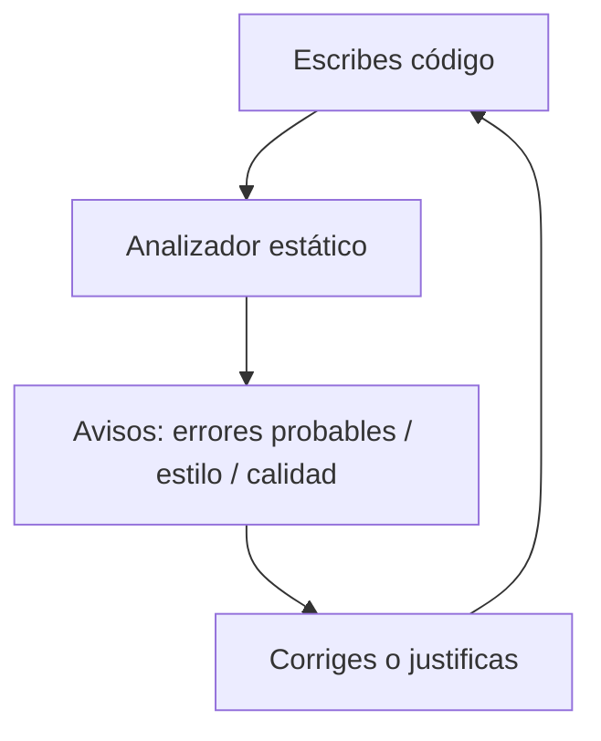

<a id="analizadores"></a>

# 🔎 3. Analizadores de código: revisión estática y configuración

{ type=application/pdf style="width:100%;min-height:80vh" }

!!!info "Descarga de diapositivas"
    [Descarga las diapositivas](diapositivas/analizadores.pdf){target="_blank" rel="noopener"}

---

## 🎯 Idea clave

Un **analizador de código** es una herramienta que revisa el código para detectar:

- **errores probables** (bugs típicos),
- **malas prácticas**,
- problemas de **estilo** y **mantenibilidad**,
- y a veces problemas de **rendimiento** o **seguridad básica**,

sin ejecutar el programa. A esto se le llama **análisis estático**.

> Te ayuda a “ver” problemas antes de compilar/ejecutar y a mantener una calidad consistente en el proyecto.

---

## 🧠 ¿Qué es la revisión estática?

La **revisión estática** (static analysis) consiste en analizar el código fuente:

- leyendo estructuras (clases, métodos, variables),
- revisando patrones comunes de error,
- comprobando reglas de estilo,
- calculando métricas simples (por ejemplo, métodos demasiado largos).



---

## ✅ ¿Por qué se usan en proyectos reales?

<div class="grid cards" markdown>
-   :material-shield-check-outline: **Prevención de bugs**
    - Detectan fallos típicos antes de ejecutar

-   :material-format-paint: **Estilo uniforme**
    - Todo el equipo sigue las mismas reglas

-   :material-wrench-outline: **Mantenibilidad**
    - Código más fácil de leer y modificar

-   :material-source-branch: **Trabajo en equipo**
    - Menos discusiones: “lo decide la regla”
</div>

---

## 🧾 Qué tipos de problemas detectan

### 1) Errores probables (bugs típicos)

Ejemplos:

- variables que pueden ser `null`
- condiciones redundantes
- comparaciones peligrosas
- código que nunca se ejecuta

```java
String rol = null;

// ❌ Puede lanzar NullPointerException
if (rol.equals("ADMIN")) {
    System.out.println("Es admin");
}

// ✅ Forma segura (evita NPE)
if ("ADMIN".equals(rol)) {
    System.out.println("Es admin");
}
```

---

### 2) Código muerto o innecesario

```java
int x = 10;
x = 10; // redundante
System.out.println(x);
```

Un analizador puede avisar de asignaciones redundantes, variables sin uso, etc.

---

### 3) Estilo y convenciones

Ejemplos:

- nombres mal formados,
- llaves, indentación,
- longitud de línea,
- imports innecesarios.

Esto no suele “romper” el programa, pero mejora la lectura y consistencia.

---

### 4) Complejidad y mantenibilidad

Ejemplos:

- métodos demasiado largos,
- demasiados `if`/`else`,
- duplicación de código.

!!! tip "Señal típica"
    Si un método tiene 80–100 líneas, probablemente necesita refactorización.

---

## 🧰 Herramientas habituales (Java)

En entornos Java, es común ver:

- **Inspections del IDE** (por ejemplo, IntelliJ: warnings y sugerencias).
- **Checkstyle**: reglas de estilo y convenciones.
- **PMD**: malas prácticas y calidad.
- **SpotBugs** (antes FindBugs): bugs típicos por patrones.

!!! info "Importante"
    El IDE ya incluye muchas inspecciones útiles. Las herramientas externas suelen integrarse en el proyecto (y a veces en CI).

---

## 🛠️ Analizadores dentro del IDE (IntelliJ)

En IntelliJ, lo normal es:

- avisos en el editor (subrayado, bombilla),
- inspecciones por archivo o proyecto,
- sugerencias de refactor.

### Acciones típicas

- Aplicar un *quick fix* (solución rápida).
- Ejecutar inspecciones del proyecto.
- Revisar advertencias por severidad.

!!! tip "Buena práctica"
    No aceptes *quick fixes* “a ciegas”. Entiende qué cambia y por qué.

---

## ⚙️ Configuración: qué se puede ajustar

Los analizadores se configuran para adaptarlos al proyecto. Lo habitual:

<div class="grid cards" markdown>
-   :material-alert: **Severidad**
    - Error / Warning / Info
    - Priorizar lo importante

-   :material-filter-outline: **Reglas activas**
    - Activar/desactivar comprobaciones
    - Elegir qué reglas se aplican

-   :material-folder-remove-outline: **Exclusiones**
    - No analizar `build/`, `target/`, código generado
    - Evitar “ruido” innecesario

-   :material-file-document-outline: **Estándar del proyecto**
    - Reglas compartidas (config en repo)
    - Misma configuración para todo el equipo
</div>

---

## 🧪 Ejemplo: una regla típica y su intención

### Regla: “evitar números mágicos”

```java
// ❌ Antes: nadie sabe qué significa 8
if (password.length() < 8) {
    System.out.println("Contraseña corta");
}

// ✅ Después: intención clara
final int MIN_PASSWORD_LENGTH = 8;
if (password.length() < MIN_PASSWORD_LENGTH) {
    System.out.println("Contraseña corta");
}
```

---

## ✅ Cómo trabajar con avisos sin volverte loco

1. **Prioriza**:

    - primero errores probables,
    - luego warnings,
    - y por último estilo.

2. **Reduce ruido**:

    - excluye carpetas que no deben analizarse,
    - desactiva reglas que no aplican al proyecto (con criterio).

3. **Acordad reglas en equipo**:

    - lo ideal es que la configuración esté en el repositorio.

!!! warning "Antipatrón"
    Ignorar todos los avisos porque “molestan”.  
    Mejor tener pocos avisos bien elegidos que cien avisos inútiles.

---

!!! info "Recordatorio: SonarQube (antes SonarLint)"
    En el tema de entornos de desarrollo instalamos y usamos el plugin SonarLint en IntelliJ como ejemplo de plugin útil.

    Es un **ejemplo de analizador estático**:

    - marca avisos directamente en el editor (**bugs probables**, **malas prácticas** y **código mejorable**),
    - propone *quick fixes*,
    - y ayuda a mantener un estilo y calidad más constantes en el proyecto.

    **Idea importante:** SonarLint (y herramientas similares) no “arreglan el programa por ti”; te dan **señales** para que tú decidas si:

    - corriges el problema,
    - refactorizas,
    - o justificas por qué en ese caso no aplica.