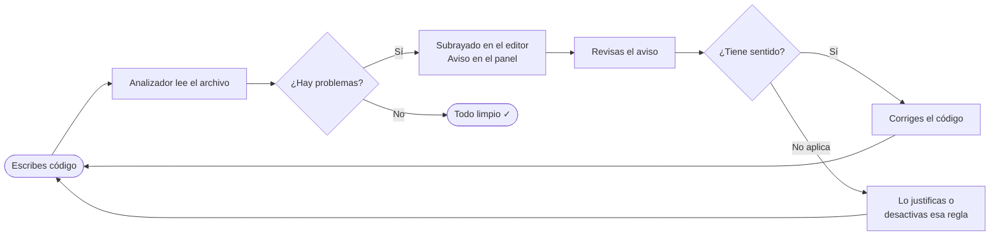
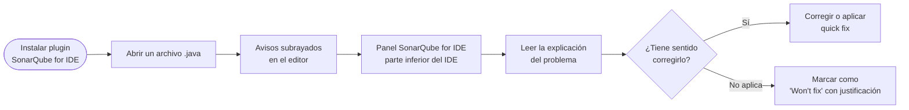

<a id="analizadores"></a>

# 🔎 4. Analizadores de código: revisión estática y configuración

{ type=application/pdf style="width:100%;min-height:80vh" }

!!!info "Descarga de diapositivas"
    [Descarga las diapositivas](diapositivas/analizadores.pdf){target="_blank" rel="noopener"}

---

## Idea clave

!!! info "¿Qué es un analizador de código?"
    Un analizador de código lee tu código fuente y detecta problemas **sin ejecutar el programa**. A esto se le llama **análisis estático**: busca errores típicos, malas prácticas y problemas de calidad mirando el texto del código, igual que un corrector ortográfico pero para lógica de programación.

La clave es que actúa **antes** de que ejecutes nada. No espera a que el programa falle en tiempo de ejecución para avisarte — te dice en el momento en que escribes "esto huele mal".

---

## ¿Por qué se usan en proyectos reales?

Imagina que trabajas en un equipo de cinco personas. Cada una tiene su propio estilo: unos ponen llaves en la misma línea, otros en la siguiente; unos nombran las variables en inglés, otros en español; unos comprueban si algo es `null` antes de usarlo, otros no. Sin ninguna regla común, el código se convierte en un puzzle difícil de leer.

Los analizadores resuelven eso: definen reglas objetivas que se aplican igual para todos, y avisan cuando alguien las rompe.

<div class="grid cards" markdown>
-   :material-shield-check-outline: **Prevención de bugs**

    Detectan fallos típicos antes de ejecutar — un NPE o un recurso sin cerrar aparece subrayado antes de que el programa arranque.

-   :material-format-paint: **Estilo uniforme**

    Todo el equipo sigue las mismas reglas. No hay debates de "cómo se nombran las variables": lo decide la regla.

-   :material-wrench-outline: **Mantenibilidad**

    Código más fácil de leer y modificar. Un método de 200 líneas con 15 `if` anidados es difícil de cambiar sin romper algo.

-   :material-source-branch: **Integración con CI/CD**

    En empresas, el análisis se ejecuta automáticamente al hacer un *push* y puede bloquear un *merge* si hay problemas graves.
</div>

---

## Qué tipos de problemas detectan

Los analizadores agrupan sus avisos por tipo. Entender la diferencia ayuda a priorizar qué corregir primero:

| Tipo | Qué busca | Ejemplo |
|------|-----------|---------|
| **Bug probable** | Patrones que casi siempre causan un error en tiempo de ejecución | Llamar a un método sobre una variable que puede ser `null` |
| **Código muerto** | Código que nunca se ejecuta o asignaciones redundantes | Variable que se asigna pero nunca se lee |
| **Mala práctica** | Construcciones que funcionan pero son frágiles o confusas | Comparar strings con `==` en vez de `.equals()` |
| **Estilo** | Convenciones de formato y nomenclatura | Nombre de clase en minúscula, línea demasiado larga |
| **Complejidad** | Métodos o clases demasiado complejos para mantenerse | Método de 100 líneas con 10 condiciones anidadas |

### Ejemplo real: bug probable

El error más frecuente en Java es la **NullPointerException** (NPE): intentar usar una variable que no apunta a ningún objeto (`null`). El programa compila sin problemas, pero explota en tiempo de ejecución cuando llega a esa línea. El analizador lo detecta antes de que lo ejecutes:

```java
String rol = null;

// ❌ Lanza NullPointerException: se llama a equals() sobre null
if (rol.equals("ADMIN")) {
    System.out.println("Es admin");
}

// ✅ Forma segura: el literal no puede ser null, así que no explota
if ("ADMIN".equals(rol)) {
    System.out.println("Es admin");
}
```

El analizador detecta que `rol` puede ser `null` en el momento de la llamada y te avisa antes de que el programa llegue a ejecutar esa línea.

### Ejemplo real: número mágico

```java
// ❌ Antes: ¿por qué 8? ¿es el mínimo de caracteres? ¿una longitud máxima?
if (password.length() < 8) {
    System.out.println("Contraseña corta");
}

// ✅ Después: la intención queda clara
final int MIN_PASSWORD_LENGTH = 8;
if (password.length() < MIN_PASSWORD_LENGTH) {
    System.out.println("Contraseña corta");
}
```

---

## Cómo funciona el ciclo de análisis

El analizador no es algo que se ejecuta una vez al terminar — está activo mientras escribes:


```mermaid
flowchart LR
    A([Escribes código]) --> B[Analizador lee el archivo]
    B --> C{¿Hay problemas?}
    C -- Sí --> D[Subrayado en el editor\nAviso en el panel]
    C -- No --> E([Todo limpio ✓])
    D --> F[Revisas el aviso]
    F --> G{¿Tiene sentido?}
    G -- Sí --> H[Corriges el código]
    G -- No aplica --> I[Lo justificas o\ndesactivas esa regla]
    H --> A
    I --> A
```

La parte importante es el rombo del final: **un aviso no es una orden**. Es una pregunta. A veces el analizador se equivoca o la regla no aplica a tu caso concreto — entonces la justificas o la desactivas, con criterio.

---

## Herramientas habituales en Java

En el ecosistema Java hay varias herramientas de análisis. No son excluyentes — en proyectos de empresa se usan varias a la vez, cada una con su función:

| Herramienta | Punto fuerte | Cuándo usarla |
|---|---|---|
| **IntelliJ Inspections** | NPE probables, código muerto, simplificaciones automáticas | Siempre: ya viene integrada, sin instalar nada |
| **SonarQube for IDE** | Bugs, seguridad y malas prácticas con explicación detallada | En clase y en proyectos: plugin gratuito, muy completo |
| **Checkstyle** | Convenciones de estilo: nombres, longitud de línea, imports | Cuando el equipo quiere estilo uniforme en un fichero de reglas compartido |
| **PMD** | Malas prácticas de diseño: código duplicado, complejidad, variables sin usar | Para analizar calidad de diseño más allá del estilo |
| **SpotBugs** | Bugs por patrones: comparaciones peligrosas, recursos sin cerrar | Cuando se quiere detectar errores reales, no solo estilo |

!!! tip "Para el día a día en clase"
    Con **IntelliJ Inspections** y **SonarQube for IDE** tienes más que suficiente. Las otras tres aparecen en proyectos de empresa integradas en el pipeline de CI/CD — las verás cuando hagas prácticas en empresa.

---

## Cómo se ven los avisos en IntelliJ

IntelliJ marca los problemas de varias formas sin que tengas que hacer nada — están ahí en cuanto abres un archivo:

<div class="tabs-colored" markdown>

=== "Editor principal"

    - **Subrayado amarillo** → warning (posible problema, no siempre un error)
    - **Subrayado rojo** → error probable o error de compilación
    - Al situar el cursor encima aparece una descripción del aviso

=== "Barra lateral derecha"

    La barra de scroll a la derecha muestra **marcas de color** en miniatura que indican en qué línea del archivo hay problemas, sin tener que desplazarte.

    Útil cuando el archivo tiene muchos avisos: ves de un vistazo dónde están concentrados.

=== "Esquina superior derecha"

    Un **icono de estado** resume el archivo entero:

    - 🟢 Verde → sin avisos
    - 🟡 Amarillo → hay warnings
    - 🔴 Rojo → hay errores probables

    Haz clic en él para navegar entre los problemas del archivo.

=== "Code → Inspect Code"

    Para analizar todo el proyecto de una vez:

    **Code → Inspect Code** → se abre un diálogo donde eliges el ámbito (archivo, módulo o proyecto completo) y el perfil de inspección.

    El resultado es el panel **Inspection Results**, agrupado por categoría, con todos los avisos del ámbito seleccionado.

</div>

### Aplicar correcciones rápidas

Cuando hay un aviso, puedes pedirle al IDE que lo corrija automáticamente:

1. Sitúa el cursor en la línea subrayada.
2. Pulsa `Alt + Enter` (Windows/Linux) o `Option + Enter` (Mac).
3. Aparece un menú con una o varias opciones de corrección (*quick fix*).
4. Elige la que corresponda y el IDE modifica el código.

!!! warning "No apliques quick fixes a ciegas"
    Lee qué va a cambiar antes de aceptarlo. Algunos arreglos automáticos son perfectos; otros cambian el comportamiento del programa de formas que no esperabas. Si no entiendes lo que propone, mejor corrígelo a mano.

---

## Configuración: qué se puede ajustar

Los analizadores no vienen en modo "todo o nada" — se pueden configurar para que encajen con el proyecto:

<div class="tabs-colored" markdown>

=== "Severidad"

    Cada regla tiene un nivel de gravedad:

    - **Error** → problema serio, lo más probable es que cause un bug
    - **Warning** → posible problema, merece revisión
    - **Info** → sugerencia de mejora, no urgente

    Puedes cambiar la severidad de cada regla según el criterio del equipo.

=== "Reglas activas"

    Puedes activar o desactivar reglas concretas. Si una regla genera muchos falsos positivos en tu tipo de proyecto, se desactiva — con criterio, no por comodidad.

=== "Exclusiones"

    Las carpetas `build/`, `target/` o código generado automáticamente no deben analizarse: no tiene sentido corregir código que la herramienta ha generado sola. Se excluyen en la configuración.

=== "Config compartida"

    En proyectos de equipo, la configuración del analizador va en un fichero dentro del repositorio (por ejemplo, `checkstyle.xml` o `sonar-project.properties`). Así todos trabajan con las mismas reglas, sin que cada uno configure el IDE por su cuenta.

</div>

!!! warning "Antipatrón"
    Ignorar todos los avisos porque "molestan". Si el analizador genera ruido constante que nadie mira, deja de ser útil. Mejor tener 10 reglas bien elegidas que producen avisos reales, que 200 reglas que nadie lee.

---

## SonarQube for IDE

**SonarQube for IDE** (conocido hasta 2024 como **SonarLint**) es el plugin de análisis estático más completo para IntelliJ. Es gratuito, open-source, y funciona directamente en el editor sin necesidad de configurar ningún servidor.

Lo que lo diferencia de las inspecciones nativas de IntelliJ es la **calidad de las explicaciones**: por cada aviso, SonarQube for IDE muestra por qué es un problema, qué riesgo tiene y cómo corregirlo — no solo un mensaje críptico.

### Dos modos de uso

<div class="tabs-colored" markdown>

=== "Standalone Mode (en clase)"

    El plugin analiza el código directamente en el IDE, **sin conectarse a ningún servidor**.

    - Detecta bugs, malas prácticas y problemas de seguridad en Java, Python, JS, TypeScript y más de 20 lenguajes.
    - Muestra los avisos en el panel inferior y en el editor.
    - Completamente gratuito, sin cuenta necesaria.

    Es el modo que usarás en clase.

=== "Connected Mode (en empresa)"

    El plugin se conecta a un **servidor SonarQube** (o SonarCloud) del equipo.

    - Todos comparten las mismas reglas configuradas en el servidor.
    - El IDE sincroniza automáticamente las reglas y las exclusiones del proyecto.
    - Los avisos del IDE coinciden con los del pipeline de CI/CD.

    Esto es lo que encontrarás en prácticas en empresa o proyectos colaborativos.

</div>

### Flujo de uso en Standalone Mode


```mermaid
flowchart LR
    A([Instalar plugin\nSonarQube for IDE]) --> B[Abrir un archivo .java]
    B --> C[Avisos subrayados\nen el editor]
    C --> D[Panel SonarQube for IDE\nparte inferior del IDE]
    D --> E[Leer la explicación\ndel problema]
    E --> F{¿Tiene sentido\ncorregirlo?}
    F -- Sí --> G[Corregir o aplicar\nquick fix]
    F -- No aplica --> H[Marcar como\n'Won't fix' con justificación]
```

### Instalar el plugin

1. Ve a **File → Settings → Plugins** (o **IntelliJ IDEA → Settings → Plugins** en Mac).
2. Busca **SonarQube for IDE** en el Marketplace.
3. Instala y reinicia el IDE.

A partir de ahí funciona automáticamente: abre cualquier archivo y el panel inferior muestra los avisos del archivo activo.

!!! tip "¿Ves SonarLint en tutoriales?"
    Si buscas ayuda en internet, la mayoría de tutoriales, vídeos y respuestas de Stack Overflow aún usan el nombre **SonarLint** — es el mismo plugin, renombrado en 2024. Las instrucciones son válidas.

---

## Cómo gestionar los avisos sin agobiarte

Cuando abres un proyecto por primera vez y el analizador muestra 47 avisos, la reacción natural es ignorarlos todos. Hay una forma mejor:

**1. Clasifica por severidad, no por orden de aparición**

Empieza por los errores probables (rojo), luego warnings (amarillo), y deja el estilo para el final. Un NullPointerException potencial es más urgente que una línea de 85 caracteres.

**2. Distingue "el código está mal" de "la regla no aplica aquí"**

No todos los avisos son correcciones obligatorias. Si el analizador avisa de algo que en tu contexto concreto no es un problema real, puedes desactivar esa regla o marcar el aviso como "Won't fix" con una breve justificación.

**3. Reduce el ruido desde el principio**

Excluye las carpetas que no deberían analizarse (`target/`, `build/`, código generado). Si el analizador avisa de 30 problemas en código generado que no tocas, estás perdiendo la señal entre el ruido.

**4. Acuerda las reglas en equipo**

Si trabajas con más personas, lo más eficiente es tener la configuración en el repositorio. Así nadie trabaja con reglas distintas ni se sorprende cuando el CI rechaza un merge que en su IDE parecía limpio.
