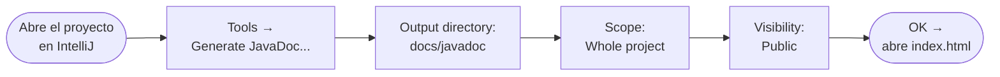

<a id="documentacion"></a>

# 📝 3. Documentación de código: comentarios y Javadoc

{ type=application/pdf style="width:100%;min-height:80vh" }

!!!info "Descarga de diapositivas"
    [Descarga las diapositivas](diapositivas/documentacion.pptx){target="_blank" rel="noopener"}

---

## Idea clave

!!! info "¿Para qué sirve documentar?"
    La documentación sirve para que otra persona — o tú mismo dentro de dos meses — pueda entender **qué hace** el código, **cómo se usa** y **por qué** se tomaron ciertas decisiones.

En Java la documentación tiene dos formas que se complementan:

| | Comentario `//` o `/* */` | Javadoc `/** */` |
|---|---|---|
| **Para qué** | Aclarar una decisión o un caso especial | Describir clases y métodos públicos |
| **Quién lo lee** | El desarrollador que toca ese fichero | Cualquiera que use la clase desde fuera |
| **Lo genera el IDE** | No | Sí — se puede exportar a HTML |
| **Cuándo usarlo** | Cuando el *por qué* no es obvio | En toda la API pública del proyecto |

---

## ¿Por qué documentar?

Documentar no es solo ser ordenado. Tiene consecuencias directas en el día a día del desarrollo:

<div class="grid cards" markdown>
-   :material-account-multiple: **Trabajo en equipo**

    Sin documentación, cada nuevo compañero tiene que leer el código entero para entender qué hace cada parte.

-   :material-timer-outline: **Ahorra tiempo**

    Un comentario de una línea puede evitar 20 minutos de análisis a quien retoma el código.

-   :material-bug-check-outline: **Evita errores**

    Las reglas de negocio y las restricciones quedan explícitas, no enterradas en la lógica.

-   :material-book-open-variant: **Facilita el mantenimiento**

    Cuando algo falla, saber *por qué* está así acelera el diagnóstico.
</div>

---

## 3.1 Comentarios: cuándo sí y cuándo no

Un buen comentario explica algo que el código no puede decir por sí solo. Si el nombre del método ya lo dice todo, el comentario sobra.

La clave es preguntarse: ¿este comentario dice algo que el código no puede decir solo? Si la respuesta es no, sobra.

<div class="tabs-colored" markdown>

=== "✅ Comentarios útiles"

    Explican el **por qué**: una decisión, una regla de negocio, un caso especial que no se deduce del código.

    ```java
    // Aplicamos IVA reducido por normativa (productos básicos)
    double totalConIVA = total * IVA_REDUCIDO;
    ```

    ```java
    // Si el usuario está bloqueado, no permitimos login
    // aunque la contraseña sea correcta
    if (user.isBlocked()) return LoginResult.BLOCKED;
    ```

=== "❌ Comentarios que sobran"

    Solo repiten lo que el nombre ya dice. No añaden información.

    ```java
    // Incrementa i
    i++;
    ```

    ```java
    // Devuelve el total
    return total;
    ```

</div>

!!! tip "Regla práctica"
    Si el comentario solo repite lo que ya dice el nombre del método o la variable, en vez de comentar, mejora el nombre.

---

## ¿Qué documentar primero en un proyecto?

No todo necesita el mismo nivel de documentación. Antes de ponerse a comentar método por método, vale la pena saber qué tiene más impacto real:

<div class="grid cards" markdown>
-   :material-file-document-outline: **README (nivel proyecto)**

    Qué es el proyecto, cómo ejecutarlo, cómo pasar los tests. Es lo primero que ve cualquiera que llega al repositorio.

-   :material-api: **Puntos de entrada**

    Métodos públicos, controladores, endpoints. Lo que otros van a llamar sin ver la implementación.

-   :material-alert-circle-outline: **Reglas de negocio**

    Validaciones, descuentos, permisos, casos especiales. Lo que no es evidente leyendo el código.

-   :material-wrench-outline: **Decisiones no obvias**

    "Esto está así porque X" — lo que alguien podría cambiar sin darse cuenta de que rompe algo.
</div>

---

## El README: la primera documentación del proyecto

El fichero `README.md` es lo primero que ve cualquiera que llega a un proyecto. No hace falta que sea largo, pero sí útil. Una estructura mínima es suficiente para empezar:

```markdown
# Nombre del proyecto

Descripción breve: qué hace y para qué sirve.

## Cómo ejecutar

1. Abre el proyecto en IntelliJ.
2. Ejecuta `Main.java` (o el punto de entrada del proyecto).

## Cómo pasar los tests

Desde IntelliJ: clic derecho en la carpeta `test` → Run All Tests.
O desde terminal: `mvn test`

## Notas
- Requiere Java 17 o superior.
- La base de datos se inicializa automáticamente al arrancar.
```

!!! tip "Regla práctica"
    Si alguien que no conoce el proyecto puede ejecutarlo en 5 minutos leyendo solo el README, el README es bueno.

---

## 3.2 Javadoc: qué es y para qué sirve

Javadoc es el formato estándar de Java para documentar **clases y métodos públicos**. A diferencia de un comentario normal, Javadoc tiene una estructura concreta que el IDE entiende: al pasar el ratón sobre un método, IntelliJ muestra la documentación directamente. Además, se puede generar una **web HTML** con toda la documentación del proyecto de forma automática.

Se escribe con `/** ... */` y combina una descripción en texto libre con **etiquetas** que estructuran la información.

### Etiquetas más habituales

Las etiquetas no son obligatorias todas a la vez — usa solo las que aporten información real.

| Etiqueta | Dónde | Para qué |
|---|---|---|
| `@author` | clase | autor o responsable |
| `@version` | clase | versión del componente |
| `@since` | clase | desde qué versión existe |
| `@param` | método | describe cada parámetro de entrada |
| `@return` | método | qué devuelve (y en qué casos) |
| `@throws` | método | cuándo lanza una excepción |
| `@deprecated` | cualquiera | si ya no se recomienda usar, y qué usar en su lugar |

!!! tip "Buena práctica"
    Si `@version` no se usa en tu proyecto, no lo pongas "por decorar". Un Javadoc con etiquetas vacías o inventadas es peor que no tenerlo.

---

### Javadoc en una clase

```java
/**
 * Servicio de cálculo de precios para pedidos.
 * Aplica reglas simples de descuento y validaciones básicas.
 *
 * Uso típico: se llama desde la capa de servicio para obtener el total a pagar.
 *
 * @author Aitor
 * @version 1.0
 * @since 2026-02
 */
public class PriceService {

    private static final double PREMIUM_FACTOR = 0.90;

    public double calculateTotal(double unitPrice, int units, boolean premium) {
        if (unitPrice < 0 || units < 0) {
            throw new IllegalArgumentException("unitPrice y units deben ser >= 0");
        }
        double total = unitPrice * units;
        return premium ? total * PREMIUM_FACTOR : total;
    }
}
```

Lo que vale la pena documentar en una clase es su **responsabilidad** (qué hace y qué no), las reglas importantes que aplica, y cómo encaja en el proyecto.

---

### Javadoc en un método

```java
/**
 * Calcula el precio final de un pedido.
 *
 * @param unitPrice precio por unidad (debe ser >= 0)
 * @param units     cantidad de unidades (debe ser >= 0)
 * @param premium   indica si se aplica descuento premium
 * @return precio final calculado (nunca negativo)
 * @throws IllegalArgumentException si unitPrice o units son negativos
 */
public static double calculateTotal(double unitPrice, int units, boolean premium) {
    if (unitPrice < 0 || units < 0) {
        throw new IllegalArgumentException("unitPrice y units deben ser >= 0");
    }
    double total = unitPrice * units;
    if (premium) {
        total *= 0.90;
    }
    return total;
}
```

### Cuándo NO usar Javadoc

Javadoc es útil para la API pública del proyecto. En estos casos no merece la pena:

- Métodos privados muy cortos y con nombre claro.
- Código que cambia frecuentemente (la documentación se queda desactualizada rápido).
- Getters y setters triviales sin lógica especial.

---

## 3.3 Generar documentación HTML desde IntelliJ

Una de las ventajas de Javadoc es que puedes generar una web HTML con toda la documentación del proyecto directamente desde IntelliJ, sin instalar nada extra.

!!! info "Qué obtienes"
    Una carpeta con archivos `.html` que puedes abrir con el navegador. La página principal es `index.html`.

### Cómo hacerlo



### Problemas típicos

- **Tildes o ñ mal generadas**: revisa que el proyecto usa UTF-8 como encoding.
- **Faltan clases**: comprueba el *Scope* — puede que no estés generando todo el proyecto.
- **Sale demasiado**: reduce la visibilidad a *Public* o limita a un solo paquete.

??? info "Si usas Maven o Gradle"
    **Maven:**
    ```bash
    mvn javadoc:javadoc
    ```
    La salida se genera en `target/site/apidocs/`.

    **Gradle:**
    ```bash
    ./gradlew javadoc
    ```
    La salida va a `build/docs/javadoc/`.

---

## Checklist de documentación

Antes de dar por terminado un método o clase, repasa estas preguntas:

??? tip "Abrir checklist"

    **Comentarios**

    - [ ] ¿El comentario explica el *por qué*, no el *qué*?
    - [ ] ¿Hay algún caso especial o regla de negocio que no sea evidente en el código?

    **Javadoc en métodos públicos**

    - [ ] ¿He descrito qué hace el método en una frase?
    - [ ] ¿He indicado restricciones de entrada importantes (`null`, rangos, formato)?
    - [ ] ¿He documentado `@return` si no es evidente?
    - [ ] ¿He puesto `@throws` si el método puede lanzar una excepción?

    **General**

    - [ ] ¿La documentación coincide con lo que hace el código ahora mismo?
    - [ ] ¿El README permite ejecutar el proyecto sin preguntar a nadie?
