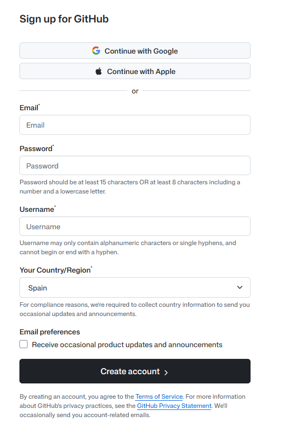
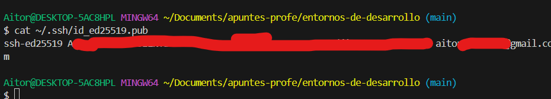
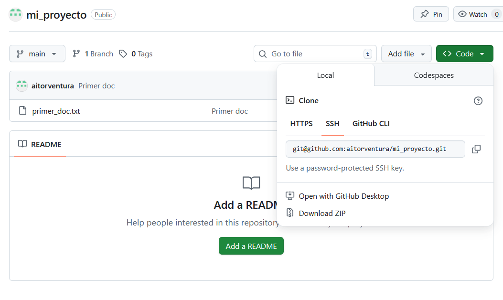
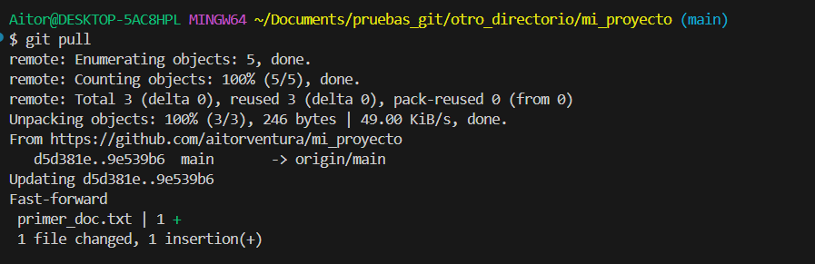
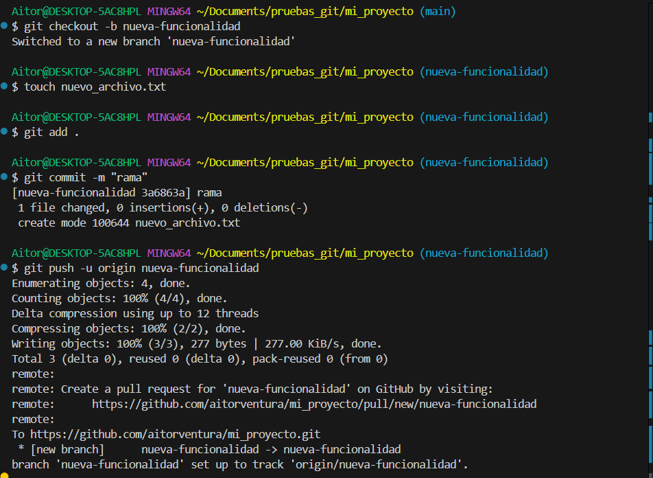
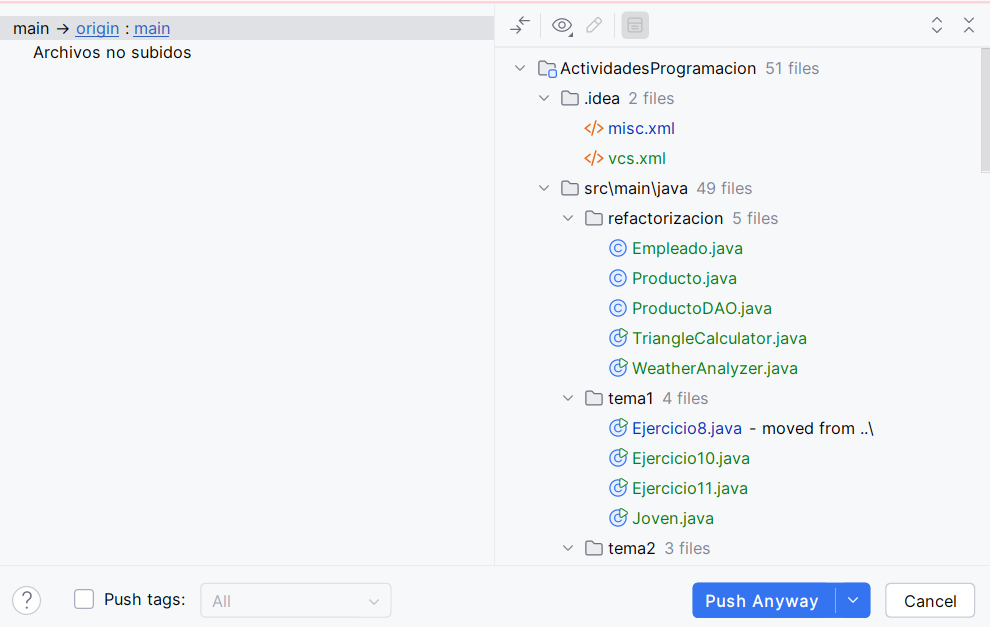

# 🌐 Introducción a GitHub y Repositorios Remotos

{ type=application/pdf style="width:100%;min-height:80vh" }

!!!info "Descarga de diapositivas"
    [Descarga las diapositivas](diapositivas/github.pdf){target="_blank" rel="noopener"}

---

En esta sección nos centraremos en los **repositorios remotos**: repositorios que se encuentran alojados en un servidor o en otro lugar fuera de nuestro propio sistema local, lo que permite el acceso a otros usuarios y facilita la colaboración en el desarrollo de proyectos. Utilizaremos **GitHub** como servidor principal para alojar estos repositorios durante el curso.

---

## ☁️ ¿Qué es un Repositorio Remoto?

Un repositorio remoto es una copia de tu repositorio de Git alojado en un servidor de internet. Contiene una réplica completa de la historia del proyecto (tus commits y tus ramas). Sus principales ventajas son:

- **Colaboración**: Varios desarrolladores pueden descargar un mismo proyecto, trabajar juntos y compartir sus modificaciones.
- **Copia de seguridad**: Sirve como un respaldo vital de tu proyecto por si tu ordenador se estropea.
- **Distribución**: Te permite exponer tu trabajo al mundo (portafolio) o integrarlo con servidores reales de despliegue.

!!! info "Alternativas a GitHub"
    Para el alojamiento de repositorios remotos, existen varios servicios famosos además de [GitHub](https://github.com/):
    
    - **[GitLab](https://gitlab.com/)**: Plataforma Open Source muy completa orientada al entorno DevOps y la Integración Continua.
    - **[Bitbucket](https://bitbucket.org/)**: Propiedad de Atlassian, ofrece una integración total con la suite de herramientas Jira y Trello.

---

## 📝 Registro en GitHub

Antes de poder crear repositorios remotos o colaborar en proyectos, necesitas tener una cuenta en la plataforma. El proceso es gratuito y sencillo:

1. Visita la página principal de [GitHub (https://github.com/)](https://github.com/).
2. Haz clic en el botón **"Sign up"** (Registrarse) en la esquina superior derecha.
3. Introduce tu dirección de correo electrónico, elige una contraseña segura y un nombre de usuario único.
4. Resuelve el pequeño puzzle de verificación para demostrar que eres humano.
5. GitHub te enviará un código numérico a tu correo electrónico. Cópialo y pégalo en la pantalla de confirmación.
6. ¡Listo! Ya tienes acceso a tu panel de control (*dashboard*) desde donde podrás empezar a crear y explorar repositorios.



**Qué estás viendo en la captura**

- La página inicial de GitHub donde se introduce el nombre de usuario, contraseña y correo electrónico para crear una nueva cuenta en la plataforma.


**Qué estás viendo en la captura**

- El panel de control principal (*dashboard*) de GitHub una vez has iniciado sesión con tu nueva cuenta de usuario.
- A la izquierda puedes ver el listado de repositorios (vacío en tu caso si te acabas de registrar) y el botón verde "New" o "Create repository" para crear uno nuevo.

---

## 🔐 Autenticación y Conexión en GitHub

Para poder subir tu código a GitHub o modificar proyectos privados de forma segura, el servidor necesita saber quién eres. **Antiguamente se usaba la contraseña de tu cuenta general, pero por seguridad ya no está permitido por terminal.** Hoy en día existen tres formas principales de conectarse:

1. **Token de acceso personal (PAT)**: Es el método más universal por línea de comandos. Generas una especie de "contraseña larga", segura y revocable desde GitHub que sirve de llave específica (solo para repositorios).
2. **Claves SSH**: Generas un par de claves criptográficas en tu ordenador (una pública y una privada). Es más profesional y cómodo a largo plazo para no escribir contraseñas.
3. **GitHub CLI (`gh`)**: La herramienta oficial de consola de GitHub, que permite iniciar sesión a través de una pestaña directa en tu navegador web.

!!! tip "Recomendación de seguridad: SSH vs PAT"
    Aunque para empezar a utilizarlo la opción más rápida por terminal a la que estarás habituado es el **Token de acceso personal (PAT)** clásico, el uso de **Claves SSH es mucho más seguro y profesional a largo plazo**. SSH evita que el token pueda ser interceptado o filtrado por accidente y no requiere que estés acordándote de contraseñas. 

A continuación, vamos a ver paso a paso cómo generar tu propio Token PAT (la vía más común al principio), y posteriormente veremos cómo configurar SSH para un entorno profesional.

### Generando un Token de Acceso Personal (PAT)

El proceso se hace enteramente dentro de tu sesión web de GitHub:

1. En GitHub, haz clic en tu foto de perfil redonda (arriba a la derecha) y entra en **Settings** (Ajustes).
2. Baja por el menú lateral izquierdo hasta el final del todo y haz clic en **`< >` Developer settings**.
3. En la nueva pantalla, ve al penúltimo menú **Personal access tokens** y elige **Tokens (classic)**.
4. Pulsa en el botón superior derecho **Generate new token** y selecciona de nuevo **Generate new token (classic)**.

Llegarás a un formulario de creación del token. Lo más importante aquí es darle acceso a tus repositorios.


**Qué estás viendo en la captura**

- El formulario para configurar un nuevo token clásico.
- Se le ha asignado un nombre descriptivo ("Note") para saber para qué se usa.
- Se ha marcado obligatoriamente la casilla principal **`repo`** (y automáticamente todas las que contiene dentro) para asegurar que la clave que vamos a generar tenga permisos para leer y escribir código en nuestros repositorios.

5\. Baja hasta el final de la página gigante y haz clic en el gran botón verde **Generate token**.

6\. GitHub te mostrará una pantalla con un recuadro verde avisándote del éxito y enseñándote tu nuevo token (una cadena larga de caracteres que suele empezar por `ghp_...`). 

**¡Cópialo ahora!** Esta es la única vez que GitHub te lo mostrará en pantalla por motivos de seguridad. Si cierras la pestaña y lo pierdes, tendrás que generar uno nuevo, ya que no se puede recuperar el anterior.


**Qué estás viendo en la captura**

- Un mensaje de éxito de fondo verde confirmando la creación.
- El token en sí (una cadena alfanumérica muy larga que suele empezar por `ghp_`). Parte de ella está censurada por motivos de seguridad; tú deberás copiar la tuya completa usando el icono de los dos recuadros.

Ese token largo que acabas de copiar será la *"contraseña"* que deberás "Pegar" (con clic derecho frecuentemente) en la terminal cuando Git te pida autenticarte al intentar descargar proyectos privados o al hacer subir el código la primera vez (`git push`).

---

### Configurando la Autenticación por SSH (Recomendado)

Si prefieres la opción más robusta y segura para que Git se autentique sin pedirte el token PAT cada dos por tres, necesitas configurar una llave criptográfica SSH entre tu equipo y GitHub.

#### 1. Generar la clave SSH local
Abre tu Git Bash (o terminal en Mac/Linux) e introduce el siguiente comando sustituyendo tu correo electrónico de GitHub:

```bash
ssh-keygen -t ed25519 -C "tu_correo@ejemplo.com"
```
*(Si tu sistema no soporta `ed25519`, puedes usar `ssh-keygen -t rsa -b 4096 -C "tu_correo..."`).*

La terminal te preguntará dónde guardar la clave y si quieres ponerle un *passphrase* (contraseña adicional). Puedes darle repetidamente a la tecla `Enter` para aceptar las opciones por defecto y dejarla sin passphrase por simplicidad.


**Qué estás viendo en la captura**

- La terminal de Git Bash (o similar) ejecutando el comando de creación de la clave.
- Las preguntas sobre dónde guardar el archivo y la *passphrase*, a las que se ha respondido pulsando la tecla *Intro* para dejar sus valores por defecto en blanco.
- Un dibujo en arte ASCII (el *Randomart image*) que certifica que la clave criptográfica se ha generado con éxito y ya reside en la carpeta oculta `.ssh` de tu ordenador.

#### 2. Copiar la Clave Pública
Esto ha generado dos llaves en tu ordenador, una privada (¡nunca la compartas!) y una **pública** (la que le damos a los servidores). Vamos a copiar el texto de la clave pública:

```bash
# Para Windows en Git Bash
clip < ~/.ssh/id_ed25519.pub

# Para Mac
pbcopy < ~/.ssh/id_ed25519.pub

# O simplemente muestra el archivo en pantalla para seleccionarlo y copiarlo:
cat ~/.ssh/id_ed25519.pub
```



**Qué estás viendo en la captura**

- El comando `cat` empleado para volcar el contenido de un archivo de texto por pantalla.
- La clave pública que se ha generado, que empieza siempre por el algoritmo que se utilizó, en este caso `ssh-ed25519`.

#### 3. Añadir la llave a GitHub
Ahora debes decirle a tu cuenta de GitHub cuál es tu llave "candado" para que reconozca a tu ordenador:

1. Ve a GitHub, pulsa en tu foto de perfil y selecciona **Settings**.
2. En el menú lateral, pincha en **SSH and GPG keys**.
3. Pulsa el botón verde **New SSH key**.
4. Escribe un título (ej. "Mi Portátil Clase") y **pega** toda la clave pública en el campo grande de texto.
5. Haz clic en **Add SSH key**.


**Qué estás viendo en la captura**

- **Primera imagen:** El formulario en proceso en la web de GitHub para pegar la llave SSH copiada anteriormente desde la terminal.
- **Segunda imagen:** La confirmación en el menú `SSH and GPG keys` de que la clave ha quedado vinculada y es reconocida por tu cuenta para dejarte acceder en remoto.

Con este proceso completado, la próxima vez que clones un proyecto, no deberás fijarte en el botón HTTPS verde, sino utilizar la ruta **SSH** (que acostumbra a empezar con `git@github.com:...`). Desde entonces, cualquier envío a remoto (`push` o `pull`) fluirá sin pedírtelo todo el rato.

---

## 🚀 Paso a Paso: Subiendo tu proyecto a la nube

Imagina que has estado trabajando en tu proyecto final localmente con `git init`, `git add` y `git commit`. Ahora ha llegado el momento de respaldarlo y subirlo a GitHub. Vamos a ver todo el ciclo vital.

### 1. Creando el espacio en GitHub

Lo primero es entrar en la página web de tu cuenta de GitHub y pulsar el botón **New** para crear un nuevo repositorio. Debes darle un nombre, una descripción y dejarlo como Público o Privado. 

Al crearlo, si ya tienes un repositorio local listo, es crucial **no** crear archivos `README`, `.gitignore` ni licencias auto-generadas desde la interfaz web; quieres que GitHub te dé un cajón completamente "vacío" para llenarlo con tu trabajo del ordenador.


**Qué estás viendo en la captura**

- El formulario "Create a new repository" rellenado con el nombre `mi_proyecto`.
- Las opciones para añadir `.gitignore` o `README` se han dejado desmarcadas a propósito para obtener un repositorio 100% puro y vacío.

### 2. Enlazando el local con el remoto (`git remote`)

Una vez creado tu repositorio vacío, GitHub te mostrará las instrucciones de subida en una caja verde en el centro de tu pantalla. Para conectar tu repositorio local con ese "cajón remoto" emplearemos el comando `git remote add`. El alias que se suele utilizar para el servidor principal es siempre `origin`.

Si te fijas, arriba de las instrucciones hay tres pequeños pestañas para elegir cómo vas a conectarte: **HTTPS**, **SSH** y **GitHub CLI**. Según cuál elijas tú o tu empresa en la vida real, el protocolo de transmisión a añadir cambia:

**Opción A: Por HTTPS (La más común al principio)**
Es la dirección web clásica. Si no configuras nada especial, Git te pedirá por fuerza el Token PAT (visto antes) cada vez que subas código, salvo que tu sistema operativo tenga el *Git Credential Manager* activado (lo habitual en Windows o si usas VSCode), lo cual hará que conecte automáticamente con cuentas web guardadas o te salte un pop-up en el navegador.

```bash
git remote add origin https://github.com/tu-usuario/tu-repositorio.git
```

**Opción B: Por SSH (La más recomendada y profesional)**
Usa en exclusiva las llaves criptográficas generadas por comandos `ssh-keygen` que has alojado en tu carpeta oculta `.ssh`. Este método es 100% invisible, seguro y transparente (nunca depende de gestores de credenciales externos de terceros ni abre navegadores molestos).

```bash
git remote add origin git@github.com:tu-usuario/tu-repositorio.git
```

!!! info "¿Qué ocurre si he elegido HTTPS y no me ha pedido contraseña al subir?"
    *(Caso de uso habitual en Windows).* Si has usado `HTTPS` en este paso, pero al ejecutar `git push` más adelante el sistema ni siquiera se ha inmutado ni te ha pedido la contraseña por terminal... ¡Es por culpa del gestor de credenciales de tu Sistema Operativo!

    En algún momento del pasado has iniciado sesión con el navegador al autorizar a *Visual Studio Code* o al usar *Git for Windows*, por lo que tu ordenador se ha quedado el Token guardado en su almacén secreto de contraseñas. Esto es comodísimo, pero si ese almacén falla o migras a otro ordenador, el método HTTPS te dejará colgado en medio de la terminal rogándote el **Token de Acceso Personal (PAT)**, y por ello es que la comunidad de desarrollo estandariza crear y configurar las llaves **SSH** siempre.

Independientemente del protocolo escogido que hayas enlazado, puedes comprobar que se han instalado correctamente los parámetros ejecutando:

```bash
git remote -v
```

Este último comando te confirmará dónde intentarán enviar (`push`) o recoger (`fetch`) los datos tus comandos remotos de Git.


**Qué estás viendo en la captura**

- El comando `git remote add origin ...` que no produce salida, pero engancha silenciosamente tu base de datos local a la dirección web que se ve (en este caso indicando la ruta `https://`).
- El comando `git remote -v` sirviendo de comprobación, donde Git enumera que el destino y origen de nombre "origin" para cualquier operación de subida (push) o descarga (fetch) están conectados.

### 3. El primer empuje de código (`git push`)

En este instante tu PC y GitHub están enlazados por cable, pero los datos siguen sin viajar. Debemos dar la orden explícita para subir tus etiquetas, ramas y commits usando `git push`. La primera vez añadiremos la opción `-u` para memorizar adónde se dirigen las actualizaciones de la rama principal por defecto en el futuro.

```bash
git push -u origin main
```

Con ese mandato, todo tu contenido de la rama `main` volará por internet hasta situarse en la base de datos de GitHub.

!!! info "¿Por qué me pide (o NO me pide) contraseña?"
    Al ejecutar `git push`, te enfrentas al guardia de seguridad de GitHub que necesita verificar quién eres para dejarte alterar el servidor remoto.
    
    1. **Si pide Usuario y Contraseña:** En la terminal te aparecerá un prompt estricto preguntándote por tu *Username* y luego tu *Password*. **NO pongas tu contraseña general de GitHub.** Debes pegar el **Token (PAT)** largo y extraño que creaste en los pasos iniciales. Con el Token PAT introducido (que se escribirá invisible en la terminal, pero está ahí), el servidor aceptará la subida.
    2. **Si NO pide nada (como en la captura inferior):** Puede ocurrir frecuentemente que Windows (con *Git Credential Manager*), macOS (*Keychain*) o la CLI de GitHub hayan memorizado y encadenado tu inicio de sesión a través del navegador la vez que usaste VSCode, guardando ya una credencial web. Otra razón es si en el paso anterior usaste la ruta `git@github.com...` de **SSH**, la cual verifica directamente el criptograma de tu sistema operativo con GitHub tras bambalinas, logrando un proceso transparente e instantáneo sin prompts.
    


**Qué estás viendo en la captura**

- Primero se ha ejecutado un comando `ls` a propósito para poder observar qué contenido habita actualmente en nuestro proyecto local (`primer_doc.txt`) antes de hacer el envío, de forma que sirva de comparativa en la captura siguiente.
- Abajo, la orden `git push -u origin main` ha empaquetado y mandado a volar a GitHub a lo largo de Internet el archivo completo local.
- Se muestran estadísticas finales ratificando el éxito como un `Writing objects: 100% (3/3)` y un aviso de seguimiento: la nueva y lejana rama en `origin` rastreará tus cambios a partir de ahora.

### 4. Visualizando el resultado web

Si ahora te vas a la pestaña del navegador de tu repositorio (donde antes mostraba las instrucciones iniciales) y refrescas la página, verás listados ahí todos tus ficheros exactamente con los nombres e historial que figuraban en local.


**Qué estás viendo en la captura**

- Al actualizar el navegador, las pantallas de ayuda se han ido, dejando sitio al entorno web de repositorios de GitHub.
- Mágicamente se pueden divisar tus archivos locales ahí (como nuestro documentado `primer_doc.txt` visualizado antes en el `ls`), junto con el historial de mensajes exacto y el tiempo transcurrido desde que hiciste localmente cada confirmación o commit. ¡Tu proyecto ya vive en la nube!

---

## 🔄 Descargando y sincronizando nuestro código

Hemos visto cómo subir todo, pero ¿qué ocurre si te mudas de ordenador o hay modificaciones aportadas desde otro lugar? 

### Clonar un repositorio desde cero (`git clone`)

Imagina que llegas a los ordenadores de clase y allí no tienes nada del proyecto. Necesitas una copia 100% igual y vinculada a la de GitHub. En lugar de hacer `git init`, el proceso empieza entrando a la página web de tu repositorio en GitHub, buscando el botón verde desplegable **"<> Code"** y copiando el enlace exacto del proyecto (que de nuevo te dará la opción de copiar en versión **HTTPS** o **SSH**).



**Qué estás viendo en la captura**

- La página principal del repositorio en GitHub.
- Hemos hecho clic en el botón verde **"<> Code"** que despliega el menú donde se encuentra el enlace de clonación.
- Se observa la URL (en la pestaña HTTPS por defecto, aunque podrías seleccionar SSH) y el botón de las dos hojas superpuestas para copiarlo directamente al portapapeles.

Con el enlace en el portapapeles, abres una terminal vacía (¡es esencial que no haya otro repositorio de Git sobreescribiendose encima!) y ejecutas `git clone` pegando la URL:

```bash
git clone https://github.com/tu-usuario/tu-repositorio.git
# ¡O recuerda utilizar la ruta de SSH si la tienes configurada!
```

Este comando:

1. Crea una carpeta idéntica al repo.
2. Descarga los históricos, la carpeta oculta `.git` y el código real al estado más reciente.
3. Se vincula al remoto (`git remote add origin` automático!).


**Qué estás viendo en la captura**

- El comando `git clone` seguido de la URL (en este caso, HTTPS) que copiamos en el paso anterior. 
- Git nos informa de que está clonando en un nuevo directorio llamado `mi_proyecto` y de que está recibiendo y resolviendo todos los objetos correctamente.
- A continuación usamos el comando `cd mi_proyecto` para entrar a esa nueva carpeta generada, y con un `ls` confirmamos que el contenido del repositorio (el archivo `primer_doc.txt` y demás) ya se encuentra descargado ahí dentro.

### Comprobar si hay cambios (`git fetch`)

Antes de descargar nuevos archivos "a ciegas", los desarrolladores a menudo utilizan un comando intermedio: `git fetch`.

```bash
git fetch
```

Lo que ha hecho este comando es conectarse a GitHub y traerse (descargar a un área oculta) un mapa actualizado del estado del repositorio remoto, pero **sin modificar ni tocar tu código local en absoluto**. Esto te permite observar si hay nuevas ramas de compañeros o commits lejanos, dándote la libertad de revisarlos primero.

### Descargar e integrar actualizaciones (`git pull`)

Imaginemos ahora que ya tienes tu entorno clonado, pero esta mañana has modificado el código vía web en GitHub u otro compañero ha subido funcionalidades a la rama `main`. Para recibir estas alteraciones reales en tu PC y aplicarlas a tus archivos empleas el comando recíproco al `push`, que es `git pull`.

```bash
git pull
```

El proceso es un "descarga e integra (mergea)": Git buscará (`fetch`) automáticamente qué ocurre de nuevo en la rama lejana, y directamente unificará su trayecto en tu rama local, haciéndote un fast-forward cuando sea posible.



**Qué estás viendo en la captura**

- La ejecución del comando `git pull` en la terminal.
- *(Nota: Para que este comando hiciese algo, previamente en este ejemplo habíamos añadido una pequeña modificación o línea nueva al archivo `primer_doc.txt` desde otro lugar, como por ejemplo desde la interfaz web de GitHub).*
- Al hacer `git pull`, tu Git local se conecta al remoto, comprueba que hay novedades, y procede a aplicarlas realizando un **"Fast-forward"**: avanza tu rama local de golpe hasta la misma posición que tiene en la nube.
- En las estadísticas finales te muestra el archivo que ha sido alterado (`primer_doc.txt`) y que ha recibido una línea extra de código (`1 insertion(+)`).

---

## 🌳 Las Ramas en el repositorio remoto

Hasta ahora hemos trabajado enviando nuestro código únicamente a la rama principal (`main`). Sin embargo, ¡todo el poder de las ramas y mundos paralelos que hemos aprendido en la teoría anterior también se aplica a GitHub!

Cuando has creado una nueva funcionalidad en local aislando tu código (usando `git checkout -b nueva-funcionalidad`), has realizado modificaciones y guardado todas ellas en una nueva foto o punto de control usando tus habituales comandos **`git add .`** y **`git commit -m "..."`**, todo avance de esta rama solo existe de forma privada en tu disco duro. 

Si quieres que tus compañeros de equipo la vean en la nube de GitHub, o simplemente quieres hacerle una copia de seguridad en internet, deberás empujarla al remoto de la misma manera que hacías en la sección anterior, usando:

```bash
git push -u origin nueva-funcionalidad
```

*(El sufijo `-u` es vital la primera vez para vincular la ruta, desde ese momento en adelante bastará con que teclees `git push` a secas cuando estés parado sobre esa rama).*



**Qué estás viendo en la captura**

- La terminal en la que creamos la nueva rama y cambiamos a ella mediante `git checkout -b nueva-funcionalidad`.
- La creación de contenido en la nueva rama y su consolidación local con los comandos rutinarios (un `touch` de ejemplo, un `git add .` y su `git commit -m "rama"`).
- El comando `git push -u origin nueva-funcionalidad`, el cual vincula por primera vez tu rama local al entorno remoto y envía todo el historial de esta nueva línea de tiempo a GitHub, como atestiguan las estadísticas del servidor al avisar de `[new branch]`.

Al entrar en la página web de tu repositorio en GitHub, notarás que arriba a la izquierda del código fuente hay un botón desplegable que dice **"main"**. Si haces clic ahí, verás un listado de **todas las ramas** que tú o tu equipo habéis ido subiendo. Puedes pulsar sobre ellas para navegar en la web a través de sus archivos, ver el historial exacto de commits que componen esa rama o incluso empezar a integrar (*mergear*) tus aportaciones mediante las llamadas **Pull Requests**.


**Qué estás viendo en la captura**

- La interfaz web del repositorio en GitHub confirmando que la rama enviada desde la terminal ha llegado sana y salva a la nube.
- Al pulsar en el selector que por defecto dice la rama principal en la que estás (`main`), se nos muestra el submenú de *Branches*, donde ahora también aparece tu `nueva-funcionalidad`. Puedes hacer clic para explorar el código base exacto en el estado que se encuentra en esa rama concreta sin alterar las demás.

### Borrar ramas en remoto

Si la rama ha cumplido su función, su código ya está integrado en `main` y ya la has borrado en local (`git branch -d nueva-funcionalidad`), es una buena práctica de higiene borrarla también del servidor remoto de GitHub para no acumular basura espacial. 

Tienes dos formas de hacerlo:
- **Desde la web de GitHub**: Yendo a la lista de ramas (*View all branches*) y pulsando el icono de la papelera al lado de la rama.
- **Desde la terminal**: Ejecutando un comando push especial que indica a GitHub explícitamente que proceda a su destrucción.
```bash
git push origin --delete nueva-funcionalidad
```

---

## 📋 Resumen del flujo de trabajo habitual 

Una dinámica clásica de trabajo unificado durante una jornada real será la siguiente:

1. **Mantenerse al día (pull)**: Antes de tocar código, baja lo más reciente para evitar conflictos.
   ```bash
   git pull
   ```
2. **Crear una rama nueva** para el cambio o ticket en el que trabajarás (aislando tu progreso de `main`):
   ```bash
   git checkout -b <nueva-rama>
   ```
3. Trabajar en el desarrollo, hacer tu `git add` y finalmente guardar consolidando una foto (commits frecuentes y claritos!):
   ```bash
   git commit -m "Añadida pantalla de login"
   ```
4. **Publicar tu rama** en el remoto, para servir de respaldo a prueba de bombas y mostrar la aportación (aún la `main` sigue limpia):
   ```bash
   git push -u origin <nueva-rama> 
   # o simplemente git push después de la primera subida
   ```
5. Cuando aprueban y testean la corrección, la envías integrándola (`merge`) en la línea base (`main`) con tu propio código o enviando petitorios (pull requests) en el visor web.

¡El ciclo de desarrollo colaborativo de software ha comenzado!

---

## 💻 Integración de Git y GitHub en IntelliJ IDEA

¡No todo pasa por la temida pantalla negra de la terminal! Hasta ahora hemos aprendido la manera más purista e independiente de operar. Sin embargo, en tu día a día como programador Java probablemente utilizarás un IDE potente como **IntelliJ IDEA**, que incorpora sus propios botones visuales y menús de Git preconfigurados para facilitarte drásticamente la vida.

### Enlazando tu cuenta

Para que IntelliJ funcione como intermediario sin errores, es aconsejable identificarse primero dentro del propio programa:

1. Abre los ajustes (File -> Settings o Edit -> Preferences).
2. Ve al menú **Version Control -> GitHub**.
3. Pulsa el botón `+` para añadir cuenta y puedes usar *"Log in via GitHub..."* (que abrirá una pestaña de autorización en tu navegador web) o introduciendo el Token PAT.


**Qué estás viendo en la captura**

- La ventana de Ajustes (Settings) de IntelliJ IDEA, dentro del submenú **Version Control -> GitHub**.
- Cómo hemos añadido y autorizado satisfactoriamente nuestra cuenta, logrando que el propio IDE pueda interactuar con nuestros repositorios remotos sin preguntarnos por contraseñas en cada momento prestado.

### El menú superior "Git" y control de versiones

Una vez que tengas un proyecto abierto —y siempre que le hayas declarado un `git init` o directamente lo hayas importado usando la opción `Get from VCS` al iniciar IntelliJ—, notarás que en la barra de menús principal de arriba (junto a *File, Edit, View, Navigate*, etc.) ha aparecido un espléndido menú nuevo llamado **Git**.

Desde ese menú superior desplegable tienes acceso directo y centralizado a todas las operaciones fundamentales que hemos ido viendo por terminal, literalmente a golpe de clic sin tener que teclear ningún mandato, entre las más destacadas:

A) **Git -> Commit** (o haciendo clic en su panel lateral respectivo): Te abre un entorno espectacular en el que es facilísimo marcar directamente las casillas de los archivos modificados (haciendo en secreto la labor del `git add`) y escribir en la caja inferio el mensaje para realizar el `git commit`. Además, al hacer clic sobre un archivo te colorea en verde y rojo las líneas exactas de código que has añadido o borrado sirviendo de `git diff` visual.


**Qué estás viendo en la captura**

- A la izquierda, el menú especial de la pestaña de **Commit**: vemos seleccionados qué archivos van directos a guardarse (haciendo en secreto un `git add`).
- Abajo de este menú, la cómoda caja de texto donde se ha rellenado en color claro el mensaje de este commit (haciendo de `git commit -m "..."`).
- En el panel derecho de la ventana del IDE se puede contemplar un completísimo visor de diferencias (`git diff`) que pone cara a cara la versión anterior y la versión recién modificada destacando sus adiciones sin tener que adivinarlas en consola.

B) **Git -> Push**: Equivale directamente a ejecutar `git push`. Al pulsarlo (o si aprietas `Ctrl+Shift+K`), se te abrirá un diálogo genial que lista los commits locales exactos y hacia qué rama de `origin` los estás mandando a la nube, confirmándolo antes de proceder y darle ok.



**Qué estás viendo en la captura**

- IntelliJ ha bloqueado la pantalla advirtiéndonos de lo que vamos a empujar al remoto.
- Se indica claramente el sentido: vamos a hacer push desde la rama `main` local hacia la rama `main` en `origin` (GitHub).
- En el lateral izquierdo puedes comprobar el o los commits empaquetados dispuestos a viajar por la red, previniendo así un envío accidental.

C) **Git -> Pull** (o *Fetch*): Te abre una sencilla ventana para descargar y actualizar el código de tu ordenador absorbiendo los cambios que hayan puesto en GitHub tus compañeros, haciendo las veces del `git pull`.

#### Controlando los mundos paralelos: Las ramas en IntelliJ

Por último, el control de las **ramas** en el IDE lo tienes de forma muy cómoda e integrada desde el propio menú superior (**Git -> Branches...**).

Al pulsar en esta opción, se abre un panel precioso centralizado listando un bloque con tus ramas **Local** (las tuyas) y las **Remote** (las que tienes compartidas por tu equipo en el servidor). Desde este panel puedes crear ramas nuevas de la nada seleccionando `New Branch`, traerte las que estén subidas por tus amigos a tu ordenador, o saltar a otra diferente (`Checkout`) de forma completamente visual. 


**Qué estás viendo en la captura**

- El widget del menú de control de ramas de IntelliJ IDEA.
- En primera posición la acción principal estelar `+ New Branch` que ejecuta instantáneamente un `git checkout -b` pidiéndote un nombre.
- El listado clarísimo agrupado por orígenes: Tus ramas residentes en el ordenador y en qué estado están (**Local**), seguido del repositorio externo principal de tu equipo (**Remote / origin**) y qué hay guardado ahí para descargar.

El uso del IDE ahorra una cantidad dramática de tiempo en el día a día y previene los temidos despistes que ocurren por olvidar introducir o vigilar bien el área temporal (Stage) en consola. Las terminales (para control maestro) y las UI visuales (para trabajar con eficiencia) son herramientas complementarias. ¡Aprovéchalas a tu favor en el ciclo del desarrollo profesional!

---

## ✅ Ideas clave (muy resumidas)

??? tip "Abrir resumen"
    - `git remote add origin <url>` vincula tu repositorio local con uno remoto en GitHub.
    - `git remote -v` comprueba a qué direcciones remotas está apuntando tu proyecto.
    - `git push -u origin <rama>` sube por primera vez tu rama local a internet para hacerle copia de seguridad y las vincula para el futuro.
    - `git push` manda tus confirmaciones guardadas (commits) hacia la nube en tu rama actual.
    - `git clone <url>` descarga en una carpeta nueva un repositorio entero que ya existía en GitHub.
    - `git fetch` se asoma al remoto y descarga el listado de novedades en la sombra, sin tocar tu código local.
    - `git pull` trae de internet los cambios de tus compañeros y los mezcla automáticamente (fast-forward o merge) en tu directorio de trabajo.
    - `git push origin --delete <rama>` elimina para siempre una rama que estaba subida en el repositorio remoto.
