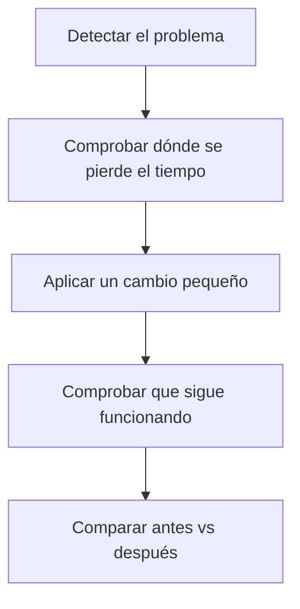
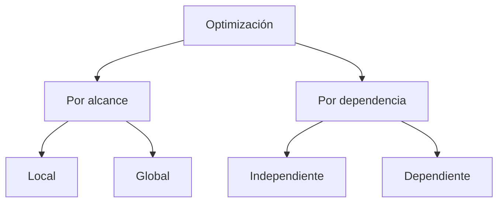

<a id="optimizacion"></a>

# ⚡ Optimización de código: concepto y tipos

{ type=application/pdf style="width:100%;min-height:80vh" }

!!!info "Descarga de diapositivas"
    [Descarga las diapositivas](diapositivas/optimizacion.pdf){target="_blank" rel="noopener"}

---

## 🎯 Idea clave

La **optimización de código** consiste en mejorar un programa para que:

- vaya **más rápido**, y/o
- consuma **menos recursos** (memoria, consultas, red),

**sin cambiar su comportamiento** (misma funcionalidad y mismos resultados).

> Optimizar no es “hacer el código más corto”: es **hacerlo más eficiente**.

---

## ✅ ¿Qué significa “sin cambiar el comportamiento”?

Si un programa:

- muestra una lista de productos,
- registra usuarios,
- calcula el total del carrito,

al optimizar **debe seguir haciendo lo mismo**. La diferencia está en el *cómo*: tarda menos, realiza menos trabajo innecesario o reduce consultas.

!!! warning "Ojo"
    Si al optimizar cambia el resultado (por ejemplo, cambia el total del carrito), no es una optimización: es un cambio de lógica.

---

## 🧠 ¿Qué se suele optimizar en aplicaciones web?

<div class="grid cards" markdown>
-   :material-timer-outline: **Tiempo de respuesta**
    - Páginas que cargan lento
    - APIs que tardan demasiado

-   :material-database: **Base de datos**
    - Demasiadas consultas
    - Consultas pesadas
    - Consultas repetidas

-   :material-memory: **Memoria**
    - Cargar datos enormes de golpe
    - Guardar información que no se usa

-   :material-cloud-download-outline: **Red**
    - Enviar/recibir datos innecesarios
    - Archivos demasiado grandes
</div>

!!! tip "Muy habitual"
    La mejora más rentable suele ser reducir consultas a base de datos y evitar trabajo repetido.

---

## 🧭 ¿Cuándo conviene optimizar?

Conviene optimizar cuando:

- hay **lentitud real** (usuarios esperando),
- se detectan **muchas consultas** a base de datos,
- el servidor empeora con varios usuarios,
- o una parte del código se ejecuta en cada petición.

No conviene obsesionarse si:

- el proyecto es pequeño y funciona con fluidez,
- o “optimizar” va a complicar demasiado el código.

---

## 🗺️ Proceso recomendado



> La optimización se hace con cambios **pequeños** y comprobando que no se rompe nada.

---

<a id="tipos-optimizacion"></a>

# ⚙️ Tipos de optimización: local, global y dependiente de la máquina

## 🎯 Idea clave

Podemos clasificar las optimizaciones según:

- **Alcance**: si afectan a un trozo pequeño (local) o a la aplicación como conjunto (global).
- **Dependencia**: si funcionan igual en cualquier entorno (independientes) o si dependen del servidor/entorno (dependientes).



---

## 📌 2.1 Optimización local

Una optimización **local** afecta a una parte pequeña: una función, un bucle o una operación concreta.

### ✅ Características

- Se aplica a un **fragmento concreto**.
- Suele ser **rápida** de implementar.
- Mantiene el mismo resultado, pero reduce trabajo.

---

### 🧪 Ejemplo local 1: cerrar recursos de I/O y evitar lecturas duplicadas

Leer un fichero de forma innecesaria o sin cerrar recursos puede ralentizar y dar problemas.

```java
import java.io.BufferedReader;
import java.io.FileReader;
import java.io.IOException;

public class LocalIO {

    public static int contarLineas(String ruta) throws IOException {
        int contador = 0;

        // ✅ try-with-resources: asegura el cierre y es la forma recomendada
        try (BufferedReader br = new BufferedReader(new FileReader(ruta))) {
            while (br.readLine() != null) {
                contador++;
            }
        }
        return contador;
    }
}
```

!!! info "Qué mejora"
    No cambia la funcionalidad, pero evita fugas de recursos y reduce problemas de rendimiento/estabilidad.

---

### 🧪 Ejemplo local 2: salir antes cuando ya no hace falta seguir

Si estás buscando algo y ya lo has encontrado, no necesitas seguir recorriendo.

```java
import java.util.List;

public class SalidaTemprana {

    public static boolean hayAdmin(List<String> roles) {
        for (String rol : roles) {
            if ("ADMIN".equals(rol)) {
                return true; // ✅ en cuanto lo encuentra, sale
            }
        }
        return false;
    }
}
```

!!! tip "Cuándo se nota"
    Cuando la lista es grande y el valor suele aparecer pronto.

---

## 🧩 2.2 Optimización global

Una optimización **global** mejora el sistema como conjunto. Normalmente afecta a:

- cómo se **accede a datos**,
- cómo se **cargan** listados,
- o cómo se **organiza** un flujo.

### ✅ Características

- Puede aportar mejoras grandes.
- Suele tocar varias partes del programa.
- Necesita más verificación, porque afecta a más puntos.

---

### 🧪 Ejemplo global 1: reducir datos enviados por red (DTO / campos necesarios)

**Situación:**
En una API devuelves objetos enormes con muchos campos, pero el frontend solo necesita 3.

**Mejora global:**

- devolver solo los campos necesarios (por ejemplo, un DTO `ProductoResumen` con `id`, `nombre`, `precio`),
- o seleccionar columnas concretas en la consulta.


**Beneficios:**

- menos datos por red,
- respuestas más rápidas,
- menos trabajo de serialización.

---

### 🧪 Ejemplo global 2: caché sencilla de resultados (cuando los datos cambian poco)

**Situación:**
Una página pide cada vez “categorías” o “provincias” que casi nunca cambian.

**Mejora global:**

- guardar ese resultado en caché durante un tiempo,
- y no recalcularlo/consultarlo en cada petición.

!!! warning "Cuidado"
    La caché necesita una estrategia: cuándo se actualiza y cuándo caduca. No se usa si los datos cambian constantemente.

---

## 🧱 2.3 Optimización independiente de la máquina

Son optimizaciones que funcionan igual en cualquier entorno porque dependen de:

- la lógica,
- el diseño de datos,
- o cómo organizas el acceso y la salida.

**Ejemplos:**

- reducir campos y tamaño de respuesta (DTO),
- paginar listados,
- evitar consultas repetidas,
- salir antes en búsquedas,
- evitar leer/escribir más de lo necesario.

---

## 🖥️ 2.4 Optimización dependiente de la máquina

Son mejoras que dependen del entorno:

- memoria disponible,
- configuración del servidor,
- límites del contenedor,
- disco/red del hosting,
- configuración de la JVM.

**Ejemplos:**

- aumentar memoria del proceso si está muy justa,
- mejorar configuración del servidor para servir recursos estáticos,
- ajustar límites de un contenedor.

!!! warning "Cuidado"
    El efecto puede variar según el equipo y la configuración. En proyectos sencillos, suele priorizarse primero la optimización independiente.

---

## ✅ Checklist rápida para elegir el tipo de optimización

??? tip "Abrir checklist"
    - [ ] ¿El problema está en un trozo concreto (local) o en el flujo completo (global)?
    - [ ] ¿La mejora depende del código (independiente) o del servidor (dependiente)?
    - [ ] ¿Se puede reducir consultas/red antes de tocar detalles pequeños?
    - [ ] ¿El cambio es pequeño y comprobable?
    - [ ] ¿He verificado que el resultado es el mismo?

---

## 🧪 Mini-prueba (no entregable0)

**Objetivo:** mejorar un recorrido evitando iteraciones innecesarias.

1) Ejecuta el siguiente código y anota el tiempo.  
2) Modifica el método para que **salga** en cuanto encuentre el valor buscado.  
3) Vuelve a medir y compara.

```java
import java.util.ArrayList;
import java.util.List;

public class MiniPracticaSalidaTemprana {

    public static void main(String[] args) {
        List<Integer> numeros = new ArrayList<>();
        for (int i = 0; i < 2_000_000; i++) {
            numeros.add(i);
        }

        int objetivo = 10; // está muy al principio

        long t1 = System.nanoTime();
        boolean encontrado = buscarSinSalir(numeros, objetivo);
        long t2 = System.nanoTime();

        System.out.println("Encontrado: " + encontrado);
        System.out.println("Tiempo: " + (t2 - t1) + " ns");
    }

    // ❌ Recorre toda la lista aunque ya lo haya encontrado
    public static boolean buscarSinSalir(List<Integer> numeros, int objetivo) {
        boolean encontrado = false;
        for (int n : numeros) {
            if (n == objetivo) {
                encontrado = true;
            }
        }
        return encontrado;
    }
}
```

