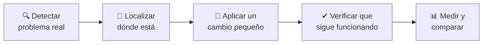
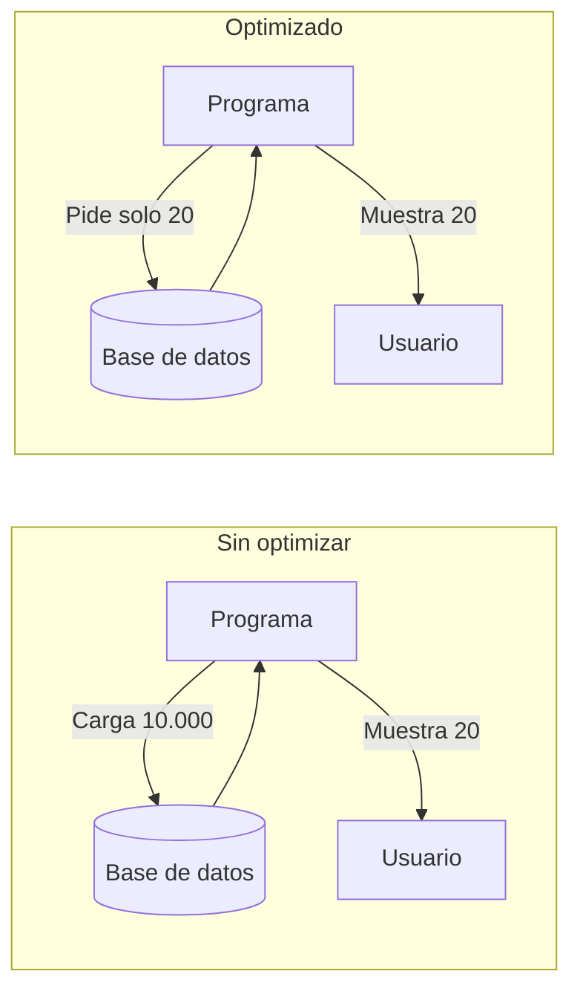
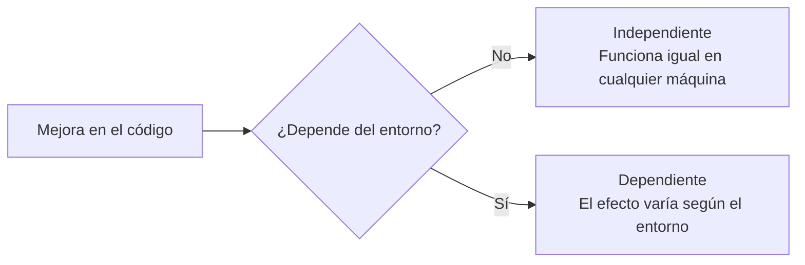

<a id="optimizacion"></a>

# ⚡ 1. Optimización de código: concepto y tipos

{ type=application/pdf style="width:100%;min-height:80vh" }

!!!info "Descarga de diapositivas"
    [Descarga las diapositivas](diapositivas/optimizacion.pptx){target="_blank" rel="noopener"}

---

## 🎯 Idea clave

La **optimización de código** consiste en mejorar un programa para que vaya más rápido o consuma menos recursos, **sin cambiar lo que hace**.

El programa hace exactamente lo mismo que antes — mismos resultados, misma funcionalidad — pero lo hace mejor: evita trabajo innecesario, repite menos operaciones o usa los recursos con más cuidado.

!!! warning "Optimizar ≠ cambiar la lógica"
    Si tras "optimizar" el programa devuelve resultados distintos, no has optimizado: has cambiado el comportamiento. Eso es un cambio de lógica, no una mejora de rendimiento.

---

## 🧭 ¿Cuándo vale la pena optimizar?

No todo código necesita optimización. Optimizar antes de tiempo puede hacer el código más difícil de leer sin ningún beneficio real. La pregunta clave es: **¿hay un problema real que los usuarios notan?**

<div class="tabs-colored" markdown>

=== "Vale la pena"
    - El programa tarda demasiado y los usuarios lo notan
    - Hay operaciones que se repiten miles de veces (bucles grandes, búsquedas frecuentes)
    - Se están usando más recursos de los necesarios (memoria, consultas)

=== "No vale la pena"
    - El programa ya va bien y los usuarios no se quejan
    - La "mejora" va a hacer el código mucho más difícil de entender
    - No has medido primero: sin medir, no sabes si hay problema

</div>

!!! tip "Mide antes de cambiar"
    Sin medición, optimizar es una suposición. Ejecuta el código, anota el tiempo, aplica el cambio y vuelve a medir. Así sabes si realmente has mejorado algo — y cuánto.

---

## 🗺️ Proceso recomendado


```mermaid
flowchart LR
  A["🔍 Detectar\nproblema real"] --> B["📍 Localizar\ndónde está"]
  B --> C["🔧 Aplicar un\ncambio pequeño"]
  C --> D["✔ Verificar que\nsigue funcionando"]
  D --> E["📊 Medir y\ncomparar"]
```

Cada paso importa:

- **Detectar y localizar** — el problema no siempre está donde parece. Un programa lento puede tener el cuello de botella en un único método.
- **Un cambio pequeño** — no varios a la vez. Si cambias tres cosas y mejora, no sabes cuál fue la responsable.
- **Verificar** — una optimización que rompe algo no vale nada.
- **Medir y comparar** — si no hay diferencia en los números, el cambio no ha servido.

Esto es exactamente lo que harás en la **Actividad 4.1**: mides, cambias una cosa, vuelves a medir.

---

<a id="tipos-optimizacion"></a>

# ⚙️ Tipos de optimización: local, global y dependiente de la máquina

## 🎯 Idea clave

Las optimizaciones se clasifican según dos preguntas:

| Pregunta | Respuesta A | Respuesta B |
|---|---|---|
| ¿Qué parte del código afecta? | Solo un fragmento → **Local** | El sistema como conjunto → **Global** |
| ¿Depende del entorno donde corre? | No → **Independiente de la máquina** | Sí → **Dependiente de la máquina** |

Estas dos clasificaciones son independientes entre sí. La mayoría de las optimizaciones de código son **independientes de la máquina**: el beneficio viene de cómo escribes el programa, no de cambiar la configuración del servidor.

---

## 📌 2.1 Optimización local

Una optimización local afecta a un fragmento concreto: un método, un bucle, una operación. No cambia la estructura general del programa, solo mejora ese trozo. Suelen ser rápidas de aplicar y fáciles de verificar.

### 🧪 Ejemplo: salida temprana en una búsqueda

Imagina que buscas si hay algún administrador en una lista de 50.000 roles. El administrador está en la posición 3.

<div class="tabs-colored" markdown>

=== "Sin optimizar"
    ```java
    public static boolean hayAdmin(List<String> roles) {
        boolean encontrado = false;
        for (String rol : roles) {
            if ("ADMIN".equals(rol)) {
                encontrado = true;
                // sigue recorriendo los 49.997 elementos restantes...
            }
        }
        return encontrado;
    }
    ```

=== "Optimizado"
    ```java
    public static boolean hayAdmin(List<String> roles) {
        for (String rol : roles) {
            if ("ADMIN".equals(rol)) {
                return true; // sale en cuanto lo encuentra
            }
        }
        return false;
    }
    ```

</div>

El resultado es idéntico. La diferencia: en la versión sin optimizar el bucle hace 50.000 iteraciones. En la optimizada, hace 3.

---

### 🧪 Ejemplo: cerrar recursos correctamente

Cuando abres un fichero o una conexión y no la cierras, el sistema sigue reservando memoria para ella aunque ya no la uses. Esto se acumula y acaba ralentizando o rompiendo el programa en ejecuciones largas.

```java
public static int contarLineas(String ruta) throws IOException {
    int contador = 0;
    // try-with-resources cierra el fichero automáticamente al salir del bloque,
    // aunque se produzca un error durante la lectura
    try (BufferedReader br = new BufferedReader(new FileReader(ruta))) {
        while (br.readLine() != null) {
            contador++;
        }
    }
    return contador;
}
```

El resultado no cambia. Lo que cambia es que el programa no acumula recursos abiertos que eventualmente provocarían un fallo.

---

## 🧩 2.2 Optimización global

Una optimización global no toca un método concreto: cambia el diseño de cómo el programa accede a los datos o estructura su flujo. El impacto puede ser mucho mayor que una optimización local, pero afecta a más partes y requiere más verificación.

La señal más habitual de que necesitas una optimización global es que el programa hace **mucho trabajo antes de mostrar cualquier resultado**: carga miles de registros para mostrar 20, o repite la misma consulta en cada vuelta de un bucle.

### 🧪 Ejemplo: cargar solo lo que se necesita

**Situación:** tienes una lista con 10.000 productos y el usuario solo ve 20 en pantalla.


```mermaid
flowchart LR
  subgraph Sin optimizar
    A1[Programa] -->|"Carga 10.000"| B1[(Base de datos)]
    B1 --> A1
    A1 -->|"Muestra 20"| C1[Usuario]
  end

  subgraph Optimizado
    A2[Programa] -->|"Pide solo 20"| B2[(Base de datos)]
    B2 --> A2
    A2 -->|"Muestra 20"| C2[Usuario]
  end
```

La mejora consiste en pedirle al origen de datos solo los elementos que se van a mostrar, en vez de traer todos y descartar el resto. El resultado que ve el usuario es el mismo; el trabajo del programa es radicalmente distinto.

---

### 🧪 Ejemplo: no repetir trabajo que ya has hecho (caché)

**Situación:** un método devuelve la lista de provincias de España. Esa lista no cambia nunca. Si la consultas a la base de datos cada vez que alguien abre la pantalla, estás repitiendo trabajo innecesario.

La mejora es guardar el resultado la primera vez y devolverlo directamente en las siguientes peticiones, sin volver a consultar. A esto se le llama **caché** — una copia temporal de un resultado ya calculado.

!!! warning "La caché tiene trampa"
    Funciona bien cuando los datos cambian poco o nunca. Si los datos cambian con frecuencia, necesitas decidir cuándo la copia queda obsoleta. Usarla sin pensar puede hacer que el programa muestre información desactualizada.

---

## 🧱 2.3 Optimización independiente de la máquina

Esta clasificación responde a una pregunta diferente: **¿el efecto de la mejora depende de la máquina donde corre el programa?**

Una optimización es independiente cuando la mejora está en el código: en la lógica, en los algoritmos, en cómo accedes a los datos. Ese cambio funciona igual en un portátil de clase que en un servidor de producción con 128 GB de RAM.

Todos los ejemplos anteriores son independientes de la máquina: el beneficio viene del código, no del hardware.


```mermaid
flowchart LR
  A[Mejora en el código] --> B{¿Depende del entorno?}
  B -->|No| C[Independiente\nFunciona igual en cualquier máquina]
  B -->|Sí| D[Dependiente\nEl efecto varía según el entorno]
```

---

## 🖥️ 2.4 Optimización dependiente de la máquina

Una optimización es dependiente cuando la mejora no está en el código sino en el **entorno donde corre**: más memoria, mejor configuración del servidor, ajustes del sistema operativo.

Dos ejemplos concretos en Java:

**Memoria de la JVM.** La JVM (Java Virtual Machine, el entorno donde se ejecutan los programas Java) tiene asignada una cantidad máxima de memoria. Cuando se acerca al límite, el recolector de basura — el proceso que libera memoria ya no usada — se activa con mucha frecuencia y ralentiza el programa. Aumentar esa memoria puede mejorar el rendimiento sin tocar una sola línea de código. Pero el efecto depende de cuánta memoria tenga la máquina.

**Compilador JIT.** La JVM incluye un compilador JIT (Just-In-Time) que no traduce todo el código al arrancar, sino que detecta qué métodos se usan más y los optimiza sobre la marcha durante la ejecución. Esto significa que las primeras ejecuciones de un programa suelen ser más lentas que las siguientes, porque el JIT todavía no ha optimizado nada. Si mides tiempos, las primeras mediciones pueden ser menos representativas.

!!! tip "Por dónde empezar"
    Antes de cambiar la configuración del servidor o pedir más hardware, agota primero las mejoras de código. Suelen tener más impacto, no cuestan dinero y funcionan en cualquier entorno.

---

## Resumen de los tipos

| Tipo | Alcance | Depende del entorno | Ejemplos |
|------|---------|---------------------|---------|
| **Local** | Un fragmento concreto | No | Salida temprana, cerrar recursos, evitar recálculo en bucle |
| **Global** | El sistema como conjunto | No | Paginación, caché, reducir datos cargados |
| **Independiente** | Local o global | No | Cualquier mejora que está en el código, no en el servidor |
| **Dependiente** | Infraestructura | Sí | Más memoria JVM, configurar servidor, ajustar contenedor |

!!! tip "Lo más habitual en la práctica"
    La mayor parte del tiempo trabajarás con optimizaciones **locales e independientes**: mejoras pequeñas en el código que funcionan en cualquier entorno. Las optimizaciones globales aparecen cuando el diseño del acceso a datos es el problema. Las dependientes de la máquina son territorio de administración de sistemas, no de desarrollo.
