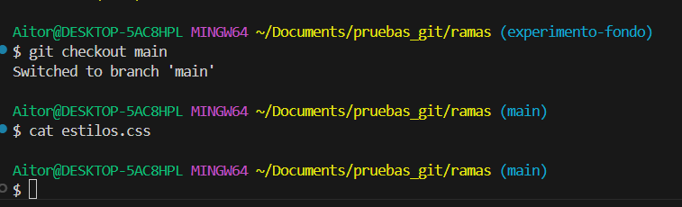
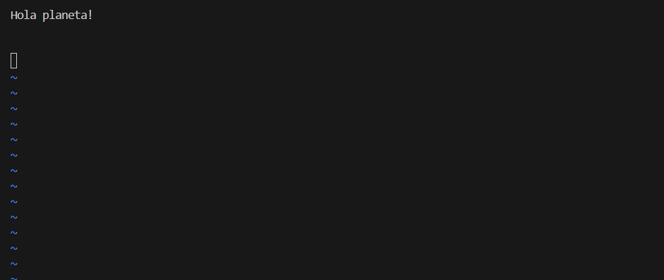
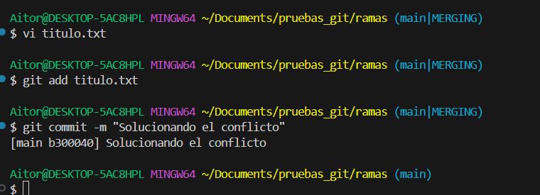

# 🌿 Ramas en Git

Las **ramas** (branches) son una de las características más potentes de Git. Permiten divergir de la línea principal de desarrollo para trabajar en **nuevas funcionalidades**, **arreglar errores** o **realizar experimentos** sin afectar al código estable.

---

## 🌳 ¿Qué es una rama?

Una rama es, en esencia, un puntero móvil a uno de los commits. La rama por defecto en Git suele llamarse `main` (o antiguamente `master`). 

Cuando creas una rama, simplemente creas un nuevo puntero para que puedas moverte independientemente.


---

## 🛠️ Comandos básicos

### 1. Ver ramas
Para ver qué ramas tienes en tu repositorio y en cuál estás situado (marcada con un `*`):

```bash
git branch
```

### 2. Crear una rama
Para crear una nueva rama (pero **sin** cambiar a ella):

```bash
git branch nombre-de-la-rama
```

### 3. Cambiar de rama
Para moverte a una rama existente y empezar a trabajar en ella:

```bash
git checkout nombre-de-la-rama
# O con la sintaxis más moderna:
git switch nombre-de-la-rama
```

También puedes crear y cambiar en un solo paso:

```bash
git checkout -b nueva-rama
```

### 4. Borrar una rama
Una vez que has terminado con una rama y la has fusionado, puedes borrarla:

```bash
git branch -d nombre-de-la-rama
```

---

## 👁️ Visualizando el historial (Alias `git lga`)

Para entender realmente qué está pasando con las ramas, es vital ver el "grafo" de commits. Git tiene un comando muy útil para esto, pero es largo de escribir:

```bash
git log --graph --oneline --all --decorate
```

Por eso, es muy común crear un **alias** (un atajo) llamado `lga` (Log Graph All). Ejecuta esto una sola vez en tu terminal:

```bash
git config --global alias.lga "log --graph --oneline --all --decorate"
```

A partir de ahora, solo tendrás que escribir `git lga` para ver un mapa colorido de tus ramas.

---

## 🚀 Historia de una Rama: El ciclo completo

Para entender cómo encajan todas las piezas, vamos a seguir una historia completa. Imagina que estás trabajando en una web y quieres cambiar el **color del fondo**, pero no quieres romper lo que ya funciona.

Sigue esta historia paso a paso.

### 1. El punto de partida
Estás en la rama `main`. Todo funciona bien. Verificas dónde estás con `git status` y ves el historial actual con nuestro alias `git lga`.


**Qué estás viendo en la captura**

- Estás en la rama `main` (`On branch main`).
- El historial (`git lga`) muestra el flujo de los commits actuales y `HEAD -> main` indica que te encuentras en ella.

### 2. Creando el universo paralelo (`git branch`)
Decides crear una rama para tus experimentos. La llamaremos `experimento-fondo`.
Al ejecutar este comando, Git crea una nueva etiqueta apuntando exactamente al mismo commit donde estás ahora.

```bash
git branch experimento-fondo
```

Si miras ahora el historial, verás que ambas ramas (`main` y `experimento-fondo`) están en el mismo sitio. El asterisco `*` o el color diferente te indica que **aún sigues en main**.


**Qué estás viendo en la captura**

- Al ejecutar `git lga`, ves que ahora la etiqueta `experimento-fondo` se ha añadido junto a `main`.
- Ambas apuntan al mismo commit, pero `HEAD -> main` indica que **todavía sigues** en la rama principal.

### 3. Viajando a la nueva rama (`git checkout`)
De momento solo la has creada, pero sigues en `main`. Tienes que "mudarte" a la nueva rama para que tus cambios no afecten a la principal.

```bash
git checkout experimento-fondo
```

Git te confirmará el cambio con un mensaje "Switched to branch...".


**Qué estás viendo en la captura**

- Git te confirma el movimiento con `Switched to branch 'experimento-fondo'`.
- El comando `git status` certifica que has cambiado de rama mostrando `On branch experimento-fondo`.

### 4. Trabajando seguro (Commit)
Ahora estás en tu zona segura. Modificas el archivo `estilos.css` para poner el fondo rojo. Guardas los cambios y haces un commit.

```bash
git add estilos.css
git commit -m "Fondo cambiado a rojo"
```

En este momento clave, tu rama `experimento-fondo` ha avanzado un paso y tiene un commit nuevo. Sin embargo, `main` se ha quedado "congelada" en el commit anterior.


**Qué estás viendo en la captura**

- Al utilizar `git lga`, la rama `experimento-fondo` (donde ahora está tu `HEAD`) aparece un nivel por encima.
- Tiene el nuevo commit que acabas de realizar, mientras que la etiqueta de `main` se ha quedado en el commit anterior sin verse alterada.

### 5. Volviendo a la realidad
El experimento ha sido un éxito. Quieres llevártelo a la web real. Pero no puedes fusionar *desde* la rama experimental, tienes que ir al destino. Volvemos a `main`.

```bash
git checkout main
```

¡Magia! Si abres ahora el archivo `estilos.css`, verás que el fondo rojo ha desaparecido. Ha vuelto a ser como era antes. No te asustes, tus cambios están seguros en la otra rama.



**Qué estás viendo en la captura**

- Usando de nuevo `git checkout` o `git switch`, regresas satisfactoriamente a `main`.
- Si revisaras el código de tus archivos, los verías exactamente igual que antes del experimento; la rama principal está intacta.

### 6. La Fusión (`git merge`)
Estando ya en `main` (el destino), ordenamos a Git que traiga los cambios de la otra rama.

```bash
git merge experimento-fondo
```

Como `main` no se había movido (nadie más ha trabajado en ella), Git hace un **Fast-Forward** (avance rápido). Simplemente coge la etiqueta `main` y la mueve hacia adelante hasta alcanzar a `experimento-fondo`.


**Qué estás viendo en la captura**

- Al fusionar (`git merge`), Git usa la estrategia de **Fast-forward** al no haber commits competitivos en `main`.
- Se listan los cambios incorporados a los archivos resultantes de esta acción.
- Finalmente, con `git lga` observarás que `main` y `experimento-fondo` vuelven a señalar el mismo y último commit.

### 7. Limpieza (`git branch -d`)
Ya no necesitamos la rama `experimento-fondo`. Su trabajo ha terminado y su código ya es parte de `main`. La borramos para mantener el repositorio ordenado.

```bash
git branch -d experimento-fondo
```


**Qué estás viendo en la captura**

- Git indica que ha eliminado exitosamente la rama local con `Deleted branch experimento-fondo...`.
- Al realizar `git lga`, el árbol está totalmente limpio, con un solo flujo final en `main` que ya contiene todo tu trabajo integrado.

---

## 🔗 Fusiones (Merges)

Una vez has completado el trabajo en una rama, querrás incorporar los cambios a la rama principal. Esto se hace con el comando `merge`.

1. Primero, sitúate en la rama destino (normalmente `main`):
   ```bash
   git checkout main
   ```
2. Ejecuta la fusión:
   ```bash
   git merge mi-nueva-funcionalidad
   ```

Existen principalmente dos tipos de fusión:

### Fast-forward
Ocurre cuando la rama principal no ha avanzado desde que creaste tu rama. Git simplemente "mueve el puntero" hacia adelante. Es lineal y limpio.

**👉 Este es el caso que hemos visto en la "Historia de una Rama" anterior.**

### Recursive (o 3-way merge)
Ocurre cuando la rama principal **sí** ha avanzado (tiene nuevos commits) mientras tú trabajabas en tu rama.

**Ejemplo Práctico Detallado:**

1. Tú creas la rama `funcionalidad-X` y haces un commit (ej. añades un botón).
2. Mientras tanto, tu compañero sube un cambio a `main` (ej. cambia el logo).
3. Ahora `main` y `funcionalidad-X` han divergido. Tienen historias diferentes.
4. Te sitúas en `main` e intentas fusionar:
   ```bash
   git merge funcionalidad-X
   ```
5. Git se da cuenta de que no puede hacer Fast-Forward. Automáticamente:

      - Coge el último commit de `main`.
      - Coge el último commit de `funcionalidad-X`.
      - Busca el ancestro común de ambos.
      - Crea un **nuevo commit** (Merge Commit) que une los tres puntos.

   

   **Qué estás viendo en la captura**

   - El historial (`git lga`) antes de fusionar muestra cómo la rama `main` y la rama `funcionalidad-X` se han separado.

   - Cada rama tiene al menos un commit propio que no está en la otra, formando visualmente un camino divergente en forma de "Y".

6\. Como es un "Merge Commit", Git necesita un mensaje. Automáticamente **abrirá tu editor de terminal por defecto** (suele ser Vim o Nano) para que confirmes el mensaje de merge sugerido: `Merge branch 'funcionalidad-X'`.

   

   **Qué estás viendo en la captura**

   - Un editor de texto pidiéndote confirmar o modificar el mensaje automático del "Merge Commit".
   - Las líneas que empiezan por `#` son comentarios que Git ignorará.

!!! question "¿Cómo salgo de aquí?"
    - **Si es Vim (lo más común):** Escribe `:wq` (es decir, pulsas la tecla `Esc` por si acaso, luego los dos puntos `:`, la `w` de *write*, la `q` de *quit*) y pulsas `Enter`.
    - **Si es Nano:** Pulsa `Ctrl + O` para guardar, `Enter` para confirmar, y `Ctrl + X` para salir.

7\. Una vez cerrado el editor, Git completará la fusión satisfactoriamente.

   

   **Qué estás viendo en la captura**

   - Git ha creado un nuevo "Merge Commit" para unir ambas historias porque no podía hacer *Fast-forward*.
   - El árbol visual de `git lga` muestra cómo el camino de `funcionalidad-X` se une de nuevo al tronco principal `main`, cerrando el bucle del desarrollo de la funcionalidad.

---

## ⚔️ Conflictos

A veces, Git no puede fusionar automáticamente porque **se han modificado las mismas líneas** de un archivo en ambas ramas de forma diferente. Esto es un **conflicto**.

Cuando ocurre:

1. Git detiene la operación y te avisa.
2. Debes abrir los archivos en conflicto. Verás marcas como:
   ```text
   <<<<<<< HEAD
   Cambios en mi rama actual (main)
   =======
   Cambios en la rama que viene (nueva-rama)
   >>>>>>> nueva-rama
   ```
3. Edita el archivo para dejar la versión final deseada y borra las marcas (`<<<`, `===`, `>>>`).
4. Añade el archivo al área de preparación: `git add archivo.txt`.
5. Finaliza la fusión con un commit: `git commit`.

**Ejemplo Práctico de Conflicto:**

!!! warning "Aviso Importante"
    En estas capturas nos centraremos exclusivamente en el proceso de resolución de conflictos. Algunos pasos o comandos básicos (como `git branch`, `git checkout` o `git status`) ya se han detallado en apartados anteriores y podrían omitirse visualmente aquí para ir directos al grano.

1. En `main`, creamos un archivo `titulo.txt` que contiene la línea: `Hola Mundo` y hacemos commit.

    

    **Qué estás viendo en la captura**

    - La creación inicial del archivo y el primer commit en la rama `main`.

2. Creamos una rama `cambio-titulo` y cambiamos esa línea por: `Hola Universo`. Hacemos commit.

    

    **Qué estás viendo en la captura**

    - La modificación del archivo y su posterior commit en la nueva rama.
   
    !!! note "Nota"
        Aunque en la imagen no se muestre explícitamente el comando de cambio (`git checkout / switch`), podemos saber que estamos allí porque la terminal suele indicarlo entre paréntesis `(cambio-titulo)`. 

    !!! info "Nota sobre editores"
        En la captura se ve que se ha usado `vi titulo.txt`. Recuerda que **`vi` (o `vim`) es un editor de texto integrado en la propia terminal**. Sin embargo, **puedes usar cualquier otro editor de texto** (como Visual Studio Code o incluso el Bloc de Notas) para modificar el archivo; no es obligatorio hacerlo por consola.

3. Volvemos a `main` y cambiamos la **misma línea** por: `Hola Planeta`. Hacemos commit.

    

    **Qué estás viendo en la captura**

    - El cambio del archivo en la rama principal y un `git lga` que muestra que ambas ramas han avanzado por separado, modificando el mismo archivo.

4. Intentamos fusionar:
    ```bash
    git merge cambio-titulo
    ```

5. **¡BOOM!** Git lanza un error de "Merge conflict".

    

    **Qué estás viendo en la captura**

    - Al intentar ejecutar `git merge cambio-titulo`, Git detiene el proceso de fusión al detectar que las mismas líneas se han modificado de manera distinta en ambas historias.

6. Si abres el archivo en tu editor, verás las marcas del conflicto.

    

    **Qué estás viendo en la captura**

    - El editor resalta los cambios actuales de `main` (`<<<<<<< HEAD`) frente a los cambios entrantes de `cambio-titulo` (`>>>>>>> cambio-titulo`).

7. **Solución**: Editas el archivo, borras las marcas `<<<`, `===`, `>>>` y dejas solo la versión final deseada o una mezcla de ambas (ej. `Hola planeta!`).

    

    **Qué estás viendo en la captura**

    - El archivo limpio, con el código tal y como queremos que quede definitivamente. Ya no hay rastro de las marcas de Git.

8. Guardas el archivo y lo añades al *staging area* para resolver el conflicto, seguido de un commit para cerrar la fusión.
    ```bash
    git add titulo.txt
    git commit -m "Solucionando el conflicto"
    ```

    

    **Qué estás viendo en la captura**

    - La confirmación en la terminal de que hemos resuelto el conflicto añadiendo el archivo al índice de Git y consolidando el "Merge Commit".

9. El historial vuelve a unirse tras resolver la colisión.

    

    **Qué estás viendo en la captura**

    - El comando `git lga` ilustra la esperada unión ("Merge Commit") de las ramas `cambio-titulo` y `main`, pero esta vez originada por la resolución manual de un conflicto.

10. Resultado final:

    

    **Qué estás viendo en la captura**

    - El contenido del archivo al volver a la terminal comprueba la correcta resolución del conflicto con el resultado deseado.

---

## 📚 Recursos adicionales

- [Documentación oficial de Git sobre ramas](https://git-scm.com/book/es/v2/Ramificaciones-en-Git-¿Qué-es-una-rama%3F)
- [Learn Git Branching (Interactivo)](https://learngitbranching.js.org/?locale=es_ES)

