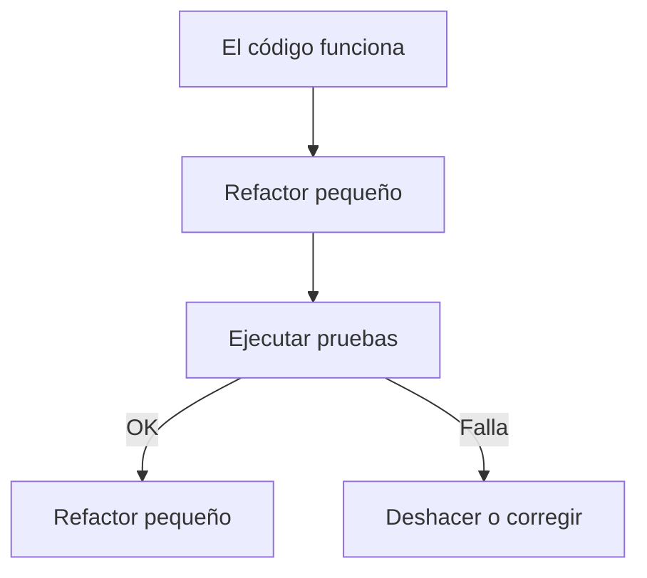

<a id="refactorizacion"></a>

# 🧼 2. Refactorización: principios, patrones y limitaciones

{ type=application/pdf style="width:100%;min-height:80vh" }

!!!info "Descarga de diapositivas"
    [Descarga las diapositivas](diapositivas/refactorizacion.pdf){target="_blank" rel="noopener"}

---

## 🎯 Idea clave

La **refactorización** es mejorar el **diseño interno** del código para que sea:

- más **claro**,
- más **mantenible**,
- más **fácil de probar**,

**sin cambiar lo que hace** (misma funcionalidad y mismos resultados).

> Si el programa hace lo mismo pero el código queda mejor organizado, eso es refactorizar.

---

## 🧭 Refactorización vs optimización

- **Optimización**: mejorar rendimiento o recursos (tiempo, memoria, consultas, red).
- **Refactorización**: mejorar estructura y legibilidad del código (sin cambiar comportamiento).

!!! tip "Relación habitual"
    Muchas veces se refactoriza **antes** de optimizar, porque un código más claro facilita detectar dónde mejorar y reduce riesgos.

---

## ✅ Principios básicos de refactorización

<div class="grid cards" markdown>
-   :material-eye-outline: **Código legible**
    - Nombres claros
    - Métodos cortos
    - Estructura fácil de seguir

-   :material-layers-outline: **Responsabilidad única**
    - Cada método/clase hace “una cosa”
    - Evitar “métodos monstruo”

-   :material-content-copy: **Evitar duplicación**
    - Si copias y pegas mucho, suele ser mala señal
    - Extraer método o reutilizar

-   :material-shield-check-outline: **Cambios pequeños y seguros**
    - Refactoriza en pasos pequeños
    - Verifica que todo sigue funcionando
</div>

---

## 🧪 Regla de oro: refactorizar con pruebas

Refactorizar implica tocar código y, por tanto, hay riesgo de romper algo.  
La forma de hacerlo seguro es:

- tener **pruebas** (unitarias o de integración),
- o al menos casos manuales claros y repetibles.



!!! warning "Si no hay pruebas"
    Refactoriza todavía más pequeño y verifica con casos manuales mínimos.  
    Lo ideal es añadir pruebas antes de refactorizar zonas críticas.

---

## 🧩 Patrones de refactorización más usuales

A continuación tienes patrones muy comunes (los que suelen aparecer en clase y en proyectos reales).

---

### 1) Renombrar variable / método (Rename)

**Objetivo:** que el nombre explique claramente la intención.

```java
// ❌ Antes
int d = 0;
double f(double p) { return p * 1.21; }

// ✅ Después
int totalPedidos = 0;
double calcularPrecioConIVA(double precio) { return precio * 1.21; }
```

!!! tip "Idea"
    Un buen nombre reduce la necesidad de comentarios.

---

### 2) Extraer método (Extract Method)

**Objetivo:** dividir un método largo en partes más pequeñas con nombres claros.

```java
// ❌ Antes
public void registrarUsuario(String email, String pass) {
    if (email == null || !email.contains("@")) throw new IllegalArgumentException();
    if (pass == null || pass.length() < 8) throw new IllegalArgumentException();
    // guardar en BD...
    // enviar email de bienvenida...
}

// ✅ Después
public void registrarUsuario(String email, String pass) {
    validarEmail(email);
    validarPassword(pass);
    guardarUsuario(email, pass);
    enviarBienvenida(email);
}

private void validarEmail(String email) { /* ... */ }
private void validarPassword(String pass) { /* ... */ }
private void guardarUsuario(String email, String pass) { /* ... */ }
private void enviarBienvenida(String email) { /* ... */ }
```

---

### 3) Extraer constante (Extract Constant)

**Objetivo:** evitar “números mágicos” y dar significado.

```java
// ❌ Antes
if (password.length() < 8) { /* ... */ }

// ✅ Después
private static final int MIN_PASSWORD_LENGTH = 8;
if (password.length() < MIN_PASSWORD_LENGTH) { /* ... */ }
```

---

### 4) Reemplazar condicional complejo por método (Introduce Explaining Variable / Extract Method)

**Objetivo:** hacer legible una condición larga.

```java
// ❌ Antes
if (user != null && user.isActive() && user.getRole() != null && user.getRole().equals("ADMIN")) {
    // ...
}

// ✅ Después
if (esAdminActivo(user)) {
    // ...
}

private boolean esAdminActivo(User user) {
    return user != null
        && user.isActive()
        && "ADMIN".equals(user.getRole());
}
```

---

### 5) Sustituir duplicación (DRY): “mismo código en varios sitios”

**Objetivo:** centralizar lógica repetida en un método/clase.

```java
// ❌ Antes: validación copiada en varios controladores
if (email == null || !email.contains("@")) { /* ... */ }

// ✅ Después: una función reutilizable
public static void validarEmail(String email) { /* ... */ }
```

!!! tip "Beneficio"
    Si mañana cambia la regla, se cambia en un solo sitio.

---

### 6) Mover método / campo (Move Method / Move Field)

**Objetivo:** colocar cada cosa donde tiene sentido.

Ejemplo típico: lógica de negocio metida en el controlador web.

- ❌ Controlador hace validación, cálculos y acceso a BD
- ✅ Controlador delega a un **servicio** (`UserService`, `PedidoService`)

!!! info "En DAW"
    Es habitual separar en capas: **controller → service → repository**.  
    Mover métodos ayuda a que el controlador no sea un “cajón de sastre”.

---

## 🧱 Limitaciones y riesgos al refactorizar

!!! warning "No todo es refactorizable “sin coste”"
    Hay refactorizaciones que parecen simples pero pueden romper cosas si no se controlan.

### Riesgos típicos

- Cambiar firmas (parámetros) y no actualizar todos los usos.
- Refactorizar sin tests y romper casos límite.
- Cambiar “código que funciona” en una entrega con prisa.
- Mezclar refactor con cambio de funcionalidad (se pierde control).

### Limitaciones prácticas

- Tiempo y presupuesto: no se puede reescribir todo.
- Código heredado sin pruebas: hay que ir con pasos muy pequeños.
- Dependencias externas: APIs, BD, frameworks.

---

## 🧰 Herramientas de ayuda a la refactorización (IDE)

En IntelliJ (y otros IDEs) hay refactorizaciones automáticas que reducen errores humanos:

- Rename
- Extract Method
- Extract Variable / Constant
- Inline
- Move
- Change Signature

!!! tip "Recomendación"
    Usa las refactorizaciones del IDE siempre que puedas, porque actualizan referencias y reducen fallos.

---

## ✅ Checklist de refactorización segura

??? tip "Abrir checklist"
    - [ ] ¿Tengo pruebas o un caso manual repetible?
    - [ ] ¿El cambio es pequeño y comprensible?
    - [ ] ¿No estoy cambiando funcionalidad sin querer?
    - [ ] ¿He pasado el formateador y revisado nombres?
    - [ ] ¿He ejecutado el proyecto y/o tests al terminar?

---

## 🧩 Ejemplo completo de refactorización (antes y después)

A continuación tienes un ejemplo “largo” típico: un método que mezcla validación, lógica de negocio y mensajes.  
Primero verás la versión **antes** (más difícil de mantener) y después una versión **refactorizada** (más clara), sin cambiar el comportamiento.

!!! info "Qué técnicas se aplican"
    - **Rename** (nombres más claros)
    - **Extract Constant** (valores con significado)
    - **Extract Method** (dividir en métodos pequeños)
    - **Early return** (salir pronto si hay error)
    - **Reducir duplicación** (validaciones reutilizables)

---

### 🧱 Antes (código difícil de mantener)

```java
import java.util.ArrayList;
import java.util.List;

public class CheckoutService {

    public static String checkout(String email, String direccion, List<Double> precios, String codigoDescuento) {
        String msg = "";
        double total = 0;

        // Validación (mezclada con todo)
        if (email == null || email.trim().isEmpty()) {
            msg += "Email obligatorio. ";
        } else {
            if (!email.contains("@") || email.startsWith("@") || email.endsWith("@")) {
                msg += "Email no válido. ";
            }
        }

        if (direccion == null || direccion.trim().isEmpty()) {
            msg += "Dirección obligatoria. ";
        } else {
            if (direccion.length() < 5) {
                msg += "Dirección demasiado corta. ";
            }
        }

        if (precios == null) {
            msg += "Lista de precios obligatoria. ";
        } else {
            if (precios.size() == 0) {
                msg += "Carrito vacío. ";
            } else {
                for (int i = 0; i < precios.size(); i++) {
                    Double p = precios.get(i);
                    if (p == null) {
                        msg += "Hay un precio nulo. ";
                    } else {
                        if (p < 0) {
                            msg += "Hay un precio negativo. ";
                        } else {
                            total = total + p;
                        }
                    }
                }
            }
        }

        // Descuento (mezclado también)
        if (codigoDescuento != null && !codigoDescuento.trim().isEmpty()) {
            if (codigoDescuento.equalsIgnoreCase("DAW10")) {
                total = total * 0.90;
                msg += "Descuento aplicado. ";
            } else if (codigoDescuento.equalsIgnoreCase("ENVIOGRATIS")) {
                // No cambia el total, solo informativo
                msg += "Envío gratis aplicado. ";
            } else {
                msg += "Cupón no válido. ";
            }
        }

        // Salida final (mezcla de todo)
        if (!msg.isEmpty()) {
            return "ERROR: " + msg.trim();
        } else {
            return "OK: Pedido confirmado. Total=" + total;
        }
    }

    // Demo rápida
    public static void main(String[] args) {
        List<Double> precios = new ArrayList<>();
        precios.add(10.0);
        precios.add(5.5);
        precios.add(2.0);

        System.out.println(checkout("alumno@mail.com", "Calle Sol 12", precios, "DAW10"));
    }
}
```

**Problemas típicos del “antes”:**

- Mezcla validación + cálculo + descuentos + mensajes.
- Mucha anidación (`if` dentro de `if`).
- Duplicación de lógica (validaciones repetidas).
- Difícil de ampliar (más cupones, nuevas reglas, etc.).

---

### ✅ Después (mismo comportamiento, código más claro)

```java
import java.util.ArrayList;
import java.util.List;

public class CheckoutServiceRefactor {

    private static final int MIN_DIR_LENGTH = 5;
    private static final String CUPON_DAW10 = "DAW10";
    private static final String CUPON_ENVIO_GRATIS = "ENVIOGRATIS";
    private static final double DESCUENTO_DAW10 = 0.90;

    public static String confirmarPedido(String email, String direccion, List<Double> precios, String cupon) {

        List<String> errores = validarEntrada(email, direccion, precios);
        if (!errores.isEmpty()) {
            return "ERROR: " + String.join(" ", errores).trim();
        }

        double total = calcularTotal(precios);

        List<String> avisos = new ArrayList<>();
        total = aplicarCuponSiProcede(total, cupon, avisos);

        String mensajeAvisos = avisos.isEmpty() ? "" : (" " + String.join(" ", avisos).trim());
        return "OK: Pedido confirmado. Total=" + total + mensajeAvisos;
    }

    private static List<String> validarEntrada(String email, String direccion, List<Double> precios) {
        List<String> errores = new ArrayList<>();

        if (!esEmailValido(email)) {
            errores.add("Email no válido.");
        }
        if (!esDireccionValida(direccion)) {
            errores.add("Dirección no válida.");
        }
        String errorCarrito = validarCarrito(precios);
        if (errorCarrito != null) {
            errores.add(errorCarrito);
        }
        return errores;
    }

    private static boolean esEmailValido(String email) {
        if (email == null || email.trim().isEmpty()) return false;
        String e = email.trim();
        return e.contains("@") && !e.startsWith("@") && !e.endsWith("@");
    }

    private static boolean esDireccionValida(String direccion) {
        if (direccion == null || direccion.trim().isEmpty()) return false;
        return direccion.trim().length() >= MIN_DIR_LENGTH;
    }

    private static String validarCarrito(List<Double> precios) {
        if (precios == null) return "Lista de precios obligatoria.";
        if (precios.isEmpty()) return "Carrito vacío.";

        for (Double p : precios) {
            if (p == null) return "Hay un precio nulo.";
            if (p < 0) return "Hay un precio negativo.";
        }
        return null;
    }

    private static double calcularTotal(List<Double> precios) {
        double total = 0;
        for (Double p : precios) {
            total += p; // aquí ya sabemos que no son nulos ni negativos
        }
        return total;
    }

    private static double aplicarCuponSiProcede(double total, String cupon, List<String> avisos) {
        if (cupon == null || cupon.trim().isEmpty()) return total;

        String c = cupon.trim().toUpperCase();

        if (CUPON_DAW10.equals(c)) {
            avisos.add("Descuento aplicado.");
            return total * DESCUENTO_DAW10;
        }

        if (CUPON_ENVIO_GRATIS.equals(c)) {
            avisos.add("Envío gratis aplicado.");
            return total;
        }

        avisos.add("Cupón no válido.");
        return total;
    }

    // Demo rápida
    public static void main(String[] args) {
        List<Double> precios = new ArrayList<>();
        precios.add(10.0);
        precios.add(5.5);
        precios.add(2.0);

        System.out.println(confirmarPedido("alumno@mail.com", "Calle Sol 12", precios, "DAW10"));
    }
}
```

**Qué mejora la versión “después”:**

- Cada método tiene una responsabilidad clara (validar / calcular / aplicar cupón).
- Nombres más claros (`confirmarPedido`, `calcularTotal`, `aplicarCuponSiProcede`).
- Menos `if` anidados (más legible).
- Constantes con significado (evita “números mágicos”).
- Es más fácil añadir reglas (por ejemplo, un nuevo cupón) sin tocar todo el método.

---

## 🧪 Mini-práctica (no entregable)

**Objetivo:** aplicar 2–3 refactors sencillos sin cambiar el comportamiento.

1) Coge un método largo de tu proyecto o de un ejercicio.

2) Aplica:
   
   - `Rename` (nombres claros)
   - `Extract Method` (divide en 2–4 métodos)
   - `Extract Constant` (quita números mágicos)

3) Ejecuta el programa o tests y comprueba que se comporta igual.

!!! example "Entrega mínima"
    - Captura o descripción de los refactors aplicados
    - Breve explicación de por qué el código queda más claro
    - Confirmación de que funciona igual


