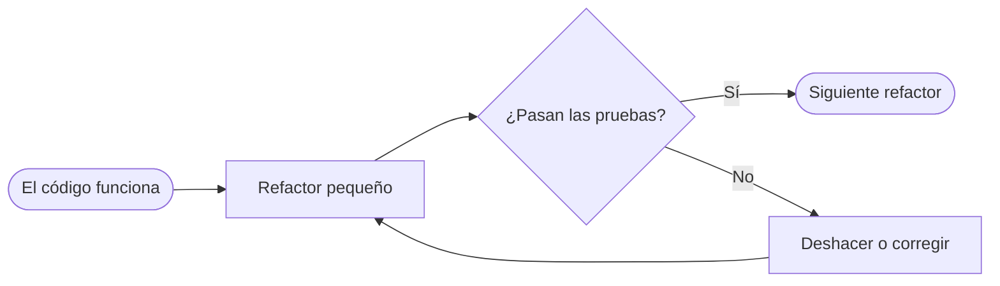
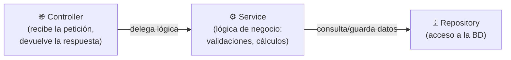
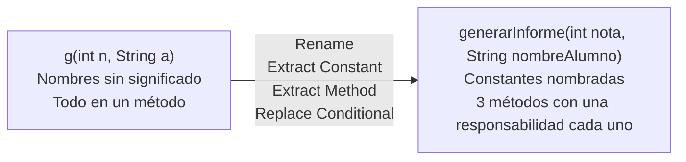

<a id="refactorizacion"></a>

# 🧼 2. Refactorización: principios, patrones y limitaciones

{ type=application/pdf style="width:100%;min-height:80vh" }

!!!info "Descarga de diapositivas"
    [Descarga las diapositivas](diapositivas/refactorizacion.pptx){target="_blank" rel="noopener"}

---

## 🎯 Idea clave

!!! info "Definición"
    **Refactorizar** es mejorar el diseño interno del código —cómo está escrito y organizado— **sin cambiar lo que hace**: misma funcionalidad, mismos resultados.

La diferencia con otras mejoras es precisamente esa: el programa sigue haciendo exactamente lo mismo, pero el código queda más claro, más fácil de leer y más fácil de mantener en el futuro.

---

## 🧭 Refactorización vs optimización

Confundir los dos términos es habitual porque ambos "mejoran" el código. La diferencia está en el objetivo:

| | Optimización | Refactorización |
|---|---|---|
| **Qué mejora** | Rendimiento o uso de recursos | Estructura y legibilidad |
| **¿Cambia el resultado?** | No | No |
| **¿Cuándo se hace?** | Cuando hay un problema medido de rendimiento | Cuando el código es difícil de leer o mantener |
| **Ejemplo** | Sustituir `List` por `HashSet` para búsquedas rápidas | Renombrar `f()` por `calcularPrecioConIVA()` |

!!! tip "Orden habitual en proyectos reales"
    Primero se refactoriza para que el código sea legible, y solo entonces se optimiza donde haga falta. Un código claro hace más fácil detectar dónde está el problema real de rendimiento.

---

## ✅ Principios básicos de refactorización

Estos cuatro principios están detrás de casi todas las refactorizaciones. No hace falta aplicarlos todos a la vez: basta con identificar el más evidente y trabajar en pasos pequeños.

<div class="grid cards" markdown>
-   :material-eye-outline: **Código legible**

    Nombres que describen la intención. Si tienes que comentar qué hace una variable, es señal de que el nombre no es bueno.

-   :material-layers-outline: **Responsabilidad única**

    Cada método o clase hace una sola cosa. Un método que valida, calcula y envía emails es difícil de entender y de probar.

-   :material-content-copy: **Evitar duplicación (DRY)**

    Si copias y pegas lógica, aparecerán bugs en varios sitios a la vez. Una regla que cambia debería cambiarse en un único lugar.

-   :material-shield-check-outline: **Cambios pequeños y verificados**

    Refactorizar en pasos pequeños y comprobar que todo sigue funcionando después de cada uno. Un refactor enorme es difícil de revertir si algo falla.
</div>

---

## 🧪 Regla de oro: refactorizar con pruebas

Refactorizar implica tocar código que funciona, y eso siempre tiene riesgo. La manera de hacerlo con seguridad es tener algún tipo de verificación —pruebas automatizadas o casos manuales claros— para detectar si algo ha dejado de funcionar.


```mermaid
flowchart LR
  A([El código funciona]) --> B[Refactor pequeño]
  B --> C{¿Pasan las pruebas?}
  C -->|Sí| D([Siguiente refactor])
  C -->|No| E[Deshacer o corregir]
  E --> B
```

!!! warning "Si no tienes pruebas"
    Trabaja en pasos todavía más pequeños y prueba manualmente después de cada cambio. Lo ideal es añadir pruebas básicas **antes** de refactorizar zonas críticas.

---

## 🧩 Patrones de refactorización más usuales

Los patrones son formas concretas de refactorizar que tienen nombre propio. Conocer el nombre te permite comunicarte con otros programadores («esto necesita un Extract Method») y encontrar documentación si tienes dudas.

---

### 1) Rename — Renombrar variable o método

**El problema:** nombres cortos o crípticos (`d`, `f`, `tmp`) son rápidos de escribir pero imposibles de entender cuando vuelves al código tres días después.

<div class="tabs-colored" markdown>
=== "❌ Antes"
    ```java
    int d = 0;
    double f(double p) {
        return p * 1.21;
    }
    ```
    ¿Qué es `d`? ¿Qué hace `f`? Sin leer el resto del código, imposible saberlo.

=== "✅ Después"
    ```java
    int totalPedidos = 0;
    double calcularPrecioConIVA(double precio) {
        return precio * 1.21;
    }
    ```
    El nombre ya explica la intención. El comentario es innecesario.
</div>

!!! tip "Atajo en IntelliJ"
    Selecciona el nombre → `Shift + F6`. El IDE actualiza automáticamente todas las referencias.

---

### 2) Extract Method — Extraer método

**El problema:** un método largo obliga a leer decenas de líneas para entender qué hace. Si el método tiene más de 10-15 líneas, suele ser señal de que hace demasiadas cosas.

<div class="tabs-colored" markdown>
=== "❌ Antes"
    ```java
    public void registrarUsuario(String email, String pass) {
        // validar email
        if (email == null || !email.contains("@"))
            throw new IllegalArgumentException("Email no válido");
        // validar contraseña
        if (pass == null || pass.length() < 8)
            throw new IllegalArgumentException("Contraseña demasiado corta");
        // guardar en BD
        bd.insert("usuarios", email, pass);
        // enviar correo de bienvenida
        correo.enviar(email, "Bienvenido", "Tu cuenta ha sido creada.");
    }
    ```
    Un único método hace cuatro cosas distintas. Para entender una, tienes que leerlas todas.

=== "✅ Después"
    ```java
    public void registrarUsuario(String email, String pass) {
        validarEmail(email);
        validarPassword(pass);
        guardarUsuario(email, pass);
        enviarBienvenida(email);
    }

    private void validarEmail(String email) {
        if (email == null || !email.contains("@"))
            throw new IllegalArgumentException("Email no válido");
    }

    private void validarPassword(String pass) {
        if (pass == null || pass.length() < 8)
            throw new IllegalArgumentException("Contraseña demasiado corta");
    }

    private void guardarUsuario(String email, String pass) {
        bd.insert("usuarios", email, pass);
    }

    private void enviarBienvenida(String email) {
        correo.enviar(email, "Bienvenido", "Tu cuenta ha sido creada.");
    }
    ```
    `registrarUsuario` se lee como una lista de pasos. Cada paso se puede leer, probar y modificar por separado.
</div>

!!! tip "Atajo en IntelliJ"
    Selecciona el bloque de código → `Ctrl + Alt + M` (Windows) / `Cmd + Alt + M` (Mac).

---

### 3) Extract Constant — Extraer constante

**El problema:** los «números mágicos» son valores literales repartidos por el código sin explicación. Si el mismo `8` aparece en cinco sitios y cambia la regla, hay que buscarlo en todos ellos —y es fácil olvidarse de uno.

<div class="tabs-colored" markdown>
=== "❌ Antes"
    ```java
    if (password.length() < 8) {
        throw new IllegalArgumentException("Contraseña demasiado corta");
    }

    // ... más abajo, en otro método:
    if (nuevaPassword.length() < 8) {
        errores.add("La nueva contraseña es demasiado corta");
    }
    ```
    ¿Por qué 8? ¿Y si mañana el requisito pasa a 10? Hay que cambiarlo en dos sitios (o más).

=== "✅ Después"
    ```java
    private static final int MIN_PASSWORD_LENGTH = 8;

    if (password.length() < MIN_PASSWORD_LENGTH) {
        throw new IllegalArgumentException("Contraseña demasiado corta");
    }

    // ... más abajo:
    if (nuevaPassword.length() < MIN_PASSWORD_LENGTH) {
        errores.add("La nueva contraseña es demasiado corta");
    }
    ```
    Si cambia el requisito, se cambia en un único lugar. Además, `MIN_PASSWORD_LENGTH` explica qué significa el número.
</div>

---

### 4) Replace Conditional — Simplificar una condición compleja

**El problema:** una condición con cuatro o cinco partes unidas con `&&` y `||` es difícil de leer de un vistazo y muy fácil de romper al modificarla.

<div class="tabs-colored" markdown>
=== "❌ Antes"
    ```java
    if (user != null
            && user.isActive()
            && user.getRole() != null
            && user.getRole().equals("ADMIN")
            && !user.isSuspended()) {
        mostrarPanelAdmin();
    }
    ```
    Para entender qué condición se está comprobando hay que leer las cinco líneas enteras.

=== "✅ Después"
    ```java
    if (esAdminActivo(user)) {
        mostrarPanelAdmin();
    }

    private boolean esAdminActivo(User user) {
        return user != null
            && user.isActive()
            && !user.isSuspended()
            && "ADMIN".equals(user.getRole());
    }
    ```
    `esAdminActivo` dice exactamente qué se comprueba. Además, la condición ahora tiene nombre y se puede probar por separado con un test unitario.
</div>

---

### 5) DRY — Eliminar código duplicado

**El problema:** copiar y pegar lógica parece rápido, pero cuando hay que corregir un error o cambiar una regla, hay que hacerlo en todos los sitios donde se copió. Y siempre se olvida alguno.

<div class="tabs-colored" markdown>
=== "❌ Antes"
    ```java
    // En RegistroController.java
    if (email == null || email.isBlank() || !email.contains("@")) {
        throw new IllegalArgumentException("Email no válido");
    }

    // En ActualizarPerfilController.java (copiado y pegado)
    if (email == null || email.isBlank() || !email.contains("@")) {
        throw new IllegalArgumentException("Email no válido");
    }

    // En RecuperarPasswordController.java (copiado otra vez)
    if (email == null || email.isBlank() || !email.contains("@")) {
        errores.add("Email no válido");  // <-- ni siquiera el mensaje es igual
    }
    ```

=== "✅ Después"
    ```java
    // EmailValidator.java — un único lugar con la regla
    public class EmailValidator {
        public static void validar(String email) {
            if (email == null || email.isBlank() || !email.contains("@"))
                throw new IllegalArgumentException("Email no válido");
        }
    }

    // En cualquier controlador que lo necesite:
    EmailValidator.validar(email);
    ```
    Si mañana la regla cambia (por ejemplo, comprobar el dominio), se cambia en `EmailValidator` y se aplica en todos los sitios automáticamente.
</div>

!!! warning "Señales de duplicación"
    Si has usado Ctrl+C / Ctrl+V para copiar un bloque de lógica, es el momento de plantearse un Extract Method o una clase de utilidad.

---

### 6) Move Method — Mover la lógica donde corresponde

**El problema:** en proyectos web es muy común que el controlador acabe haciendo de todo: validar datos, calcular totales, acceder a la base de datos, formatear respuestas... Se convierte en un «cajón de sastre» imposible de mantener.

La solución es separar en capas y mover cada responsabilidad a la capa que le corresponde:


```mermaid
graph LR
  A["🌐 Controller\n(recibe la petición,\ndevuelve la respuesta)"]
  B["⚙️ Service\n(lógica de negocio:\nvalidaciones, cálculos)"]
  C["🗄️ Repository\n(acceso a la BD)"]
  A -->|"delega lógica"| B
  B -->|"consulta/guarda datos"| C
```

<div class="tabs-colored" markdown>
=== "❌ Antes (todo en el Controller)"
    ```java
    @PostMapping("/pedido")
    public String crearPedido(String email, List<Double> precios) {
        // validación aquí
        if (email == null || !email.contains("@")) return "error";
        // cálculo aquí
        double total = 0;
        for (Double p : precios) total += p;
        total *= 1.21; // IVA hardcodeado
        // acceso a BD aquí
        bd.save(new Pedido(email, total));
        return "ok: " + total;
    }
    ```

=== "✅ Después (responsabilidades separadas)"
    ```java
    // PedidoController.java — solo recibe y responde
    @PostMapping("/pedido")
    public String crearPedido(String email, List<Double> precios) {
        return pedidoService.crearPedido(email, precios);
    }

    // PedidoService.java — lógica de negocio
    public String crearPedido(String email, List<Double> precios) {
        validarEmail(email);
        double total = calcularTotalConIVA(precios);
        pedidoRepository.save(new Pedido(email, total));
        return "ok: " + total;
    }

    // PedidoRepository.java — acceso a datos
    public void save(Pedido pedido) {
        bd.insert(pedido);
    }
    ```
</div>

!!! info "Por qué importa la separación en capas"
    Cuando el controlador solo recibe y responde, puedes cambiar la lógica de negocio sin tocar el controlador, y puedes cambiar la base de datos sin tocar la lógica. Cada capa se puede probar por separado.

---

## 🧱 Limitaciones y riesgos al refactorizar

Refactorizar no es gratis. En proyectos reales hay que valorar si el esfuerzo merece la pena: un código que funciona —aunque no sea perfecto— puede no necesitar refactorización urgente.

### ¿Cuándo refactorizar y cuándo no?

| ✅ Buen momento | ❌ Mal momento |
|---|---|
| Antes de añadir una nueva funcionalidad | Justo antes de una entrega con fecha fija |
| Cuando los tests pasan y hay tiempo | Sin ningún tipo de prueba que te proteja |
| En pasos pequeños con margen para verificar | Mezclado con un cambio de funcionalidad |
| Cuando el código va a crecer o a ser mantenido | En código que nadie va a tocar más |

### Riesgos que hay que controlar

!!! warning "Los riesgos más habituales"
    - **Cambiar la firma de un método** (sus parámetros) y no actualizar todos los sitios que lo llaman.
    - **Refactorizar sin pruebas** y romper casos límite sin darse cuenta.
    - **Mezclar refactor con cambio de funcionalidad**: si algo falla, ya no sabes qué lo ha causado.
    - **Hacer un refactor enorme de golpe**: si algo deja de funcionar, es muy difícil saber qué paso lo ha roto.

---

## 🧰 Herramientas del IDE para refactorizar

Los IDEs modernos incluyen refactorizaciones automáticas. En lugar de cambiar el nombre de un método a mano en todos los archivos, el IDE lo hace en un paso y actualiza todas las referencias. Esto elimina una fuente habitual de errores.

| Acción | Qué hace | Windows / Linux | Mac |
|--------|----------|----------------|-----|
| **Rename** | Renombra y actualiza todas las referencias | `Shift + F6` | `Shift + F6` |
| **Extract Method** | Convierte un bloque seleccionado en un método nuevo | `Ctrl + Alt + M` | `Cmd + Alt + M` |
| **Extract Variable** | Da nombre a una expresión inline | `Ctrl + Alt + V` | `Cmd + Alt + V` |
| **Extract Constant** | Igual que Variable, pero como constante de clase | `Ctrl + Alt + C` | `Cmd + Alt + C` |
| **Inline** | Operación inversa: integra de vuelta en el sitio de uso | `Ctrl + Alt + N` | `Cmd + Alt + N` |
| **Move** | Mueve una clase o método a otro paquete o clase | `F6` | `F6` |

!!! tip "Usa siempre las herramientas del IDE"
    Un buscar-y-reemplazar manual falla en seguida: no distingue entre el nombre de un método y la misma cadena en un comentario o en un String. El IDE sí.

---

## 🧩 Ejemplo completo: calificación de un alumno

Un método que recibe la nota de un alumno y devuelve un mensaje con su resultado. Sencillo, pero con varios problemas típicos que se resuelven aplicando varias técnicas a la vez.

!!! info "Técnicas aplicadas"
    **Rename** · **Extract Constant** · **Extract Method** · **Replace Conditional**

### 🧱 Antes

```java
public class N {

    public static String g(int n, String a) {
        if (n < 0 || n > 10) return "Nota fuera de rango";
        String r;
        if (n >= 9) r = "Sobresaliente";
        else if (n >= 7) r = "Notable";
        else if (n >= 5) r = "Aprobado";
        else r = "Suspenso";
        String apt = (n >= 5) ? "APTO" : "NO APTO";
        return a + " | " + n + "/10 | " + r + " | " + apt;
    }
}
```

¿Qué hace `g`? ¿Qué es `n`? ¿Qué es `a`? ¿Por qué `5`, `7` y `9`? Sin leer cada línea con atención, es imposible saberlo.

### ✅ Después

El resultado es exactamente el mismo. Lo que ha cambiado es que el código se puede leer y entender sin esfuerzo.

```java
public class InformeNota {

    // Extract Constant: los umbrales tienen nombre y se cambian en un único sitio
    private static final int MINIMO_APROBADO      = 5;
    private static final int MINIMO_NOTABLE        = 7;
    private static final int MINIMO_SOBRESALIENTE  = 9;

    // Rename: g → generarInforme, n → nota, a → nombreAlumno
    public static String generarInforme(int nota, String nombreAlumno) {
        if (!esNotaValida(nota)) return "Nota fuera de rango";   // Extract Method

        String calificacion = obtenerCalificacion(nota);          // Extract Method + Replace Conditional
        String aptitud      = nota >= MINIMO_APROBADO ? "APTO" : "NO APTO";

        return nombreAlumno + " | " + nota + "/10 | " + calificacion + " | " + aptitud;
    }

    // Extract Method: la validación tiene su propio método con nombre claro
    private static boolean esNotaValida(int nota) {
        return nota >= 0 && nota <= 10;
    }

    // Replace Conditional: el bloque if-else largo se traslada a un método descriptivo
    private static String obtenerCalificacion(int nota) {
        if (nota >= MINIMO_SOBRESALIENTE) return "Sobresaliente";
        if (nota >= MINIMO_NOTABLE)       return "Notable";
        if (nota >= MINIMO_APROBADO)      return "Aprobado";
        return "Suspenso";
    }
}
```

### ¿Qué ha cambiado y por qué?


```mermaid
flowchart LR
  A["g(int n, String a)\nNombres sin significado\nTodo en un método"]
  B["generarInforme(int nota, String nombreAlumno)\nConstantes nombradas\n3 métodos con una responsabilidad cada uno"]
  A -->|"Rename\nExtract Constant\nExtract Method\nReplace Conditional"| B
```

| Antes | Después |
|---|---|
| `g`, `n`, `a` | `generarInforme`, `nota`, `nombreAlumno` |
| `5`, `7`, `9` literales | `MINIMO_APROBADO`, `MINIMO_NOTABLE`, `MINIMO_SOBRESALIENTE` |
| Todo mezclado en un método | Validación, calificación e informe separados |
| Si cambia un umbral, hay que buscarlo | Se cambia la constante y se aplica en todos los sitios |

---
