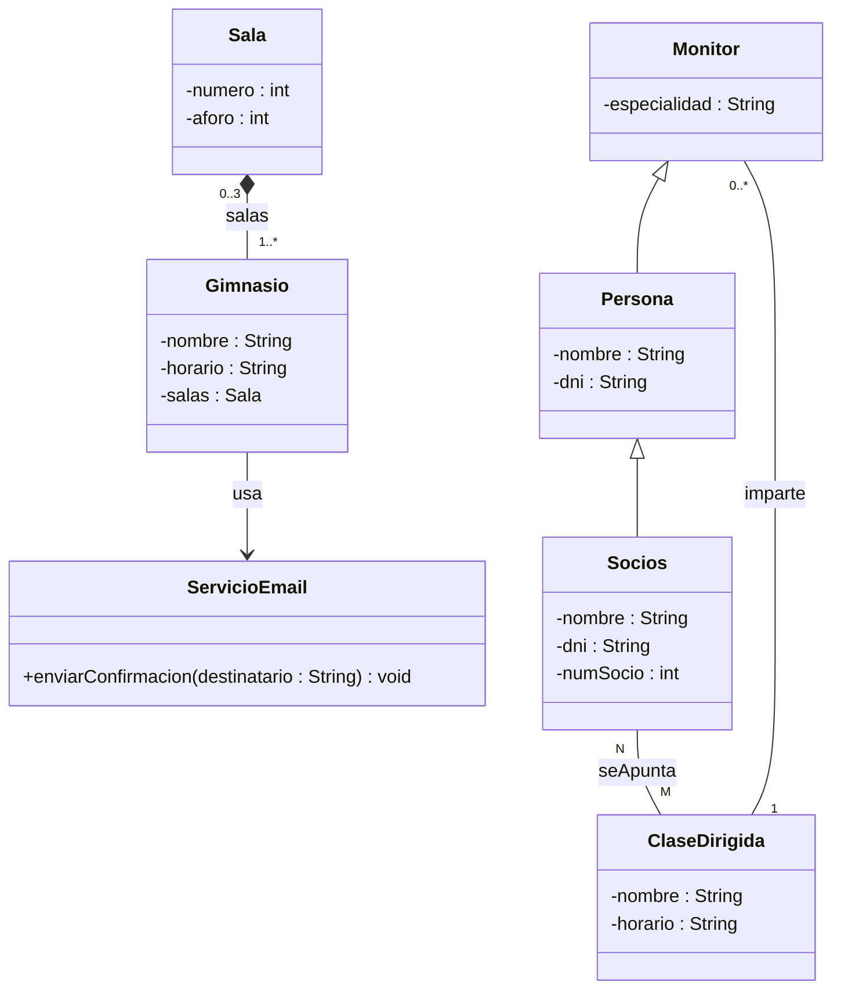

# Actividad 5.3: Caza de errores

!!! warning "Descarga la plantilla"
    📄 [Plantilla 5.3 — Caza de errores](plantillas/Actividad_5_3_Plantilla.docx){target="_blank" rel="noopener"}

## Qué vas a practicar

Revisar el diagrama de otra persona es tan habitual como dibujar el tuyo: en un equipo real, los diseños se revisan antes de escribir una línea de código. Aquí tienes un enunciado y el diagrama que ha entregado un compañero ficticio. El diagrama **contiene errores deliberados**, algunos de notación y otros conceptuales. Tu trabajo es encontrarlos todos, explicar por qué son errores y corregirlos.

---

## El enunciado que recibió tu compañero

Un gimnasio quiere informatizar su gestión:

- El **gimnasio** tiene un nombre y un horario. Está formado por **salas** (con número y aforo); si el gimnasio cierra definitivamente, sus salas desaparecen con él.
- **Socios** y **monitores** son personas: de todas ellas se guarda el nombre y el DNI. De los socios interesa además su número de socio, y de los monitores su especialidad.
- El gimnasio ofrece **clases dirigidas** (con nombre y horario). Cada clase dirigida la imparte **exactamente un monitor**, y un monitor puede impartir **varias clases** o ninguna.
- Un socio puede apuntarse a **muchas clases dirigidas**, y una clase dirigida puede tener **muchos socios** apuntados.
- Cuando un socio se apunta a una clase, el sistema envía un correo de confirmación usando brevemente un **servicio de email** que recibe el destinatario como parámetro. Ninguna clase guarda ese servicio como atributo.

## El diagrama entregado

!!! note "Hay al menos 8 errores"
    Algunos saltan a la vista y otros exigen comparar el diagrama con el enunciado frase a frase. Cuenta como error tanto lo que está mal dibujado como lo que contradice el enunciado.

---

## Lo que tienes que hacer

**Paso 1.** Localiza los errores. Para cada uno rellena una fila de la tabla de la plantilla: **dónde está** (clases implicadas), **por qué es un error** (cita la regla de notación o la frase del enunciado que incumple) y **cómo se corrige**.

**Paso 2.** Clasifica cada error como **de notación** (algo mal escrito o mal dibujado) o **conceptual** (una relación o decisión de diseño equivocada).

**Paso 3.** Dibuja en DIA el diagrama corregido completo y exporta la imagen.

**Pregunta 1.** Uno de los errores conceptuales, si se trasladara a Java tal cual, produciría un programa que **compila sin problemas** pero que guarda información duplicada. ¿Cuál es y qué duplicaría?

**Pregunta 2.** La herencia de este diagrama tiene un error que un compilador de Java detectaría inmediatamente al escribir `extends`. ¿Cuál es y qué mensaje conceptual daría?

---

## 📤 Entregable

Rellena la plantilla y entrégala en **PDF**:

1. La tabla de errores completa (dónde, por qué, corrección, tipo).
2. Captura del diagrama corregido hecho en DIA.
3. Respuestas a las preguntas 1 y 2.

!!! warning "Corrección oral"
    El profesor puede señalarte cualquier elemento del diagrama (correcto o incorrecto) y pedirte que expliques por qué lo has dejado, cambiado o eliminado. Si no puedes justificarlo, la actividad no se supera.

## ✅ Criterios de corrección

- Se han localizado todos los errores, sin marcar como error cosas que están bien.
- Cada justificación cita la regla o la frase del enunciado incumplida, no un "porque queda mejor".
- La clasificación notación/conceptual es correcta.
- El diagrama corregido en DIA es completo y no introduce errores nuevos.
