# 🏗️ UML, herramientas y conceptos básicos de la POO

{ type=application/pdf style="width:100%;min-height:80vh" }

!!!info "Descarga de diapositivas"
    [Descarga las diapositivas](diapositivas/conceptos-basicos.pdf){target="_blank" rel="noopener"}

---

Para dibujar un diagrama de clases hacen falta dos cosas: conocer los conceptos de la programación orientada a objetos (clase, atributo, método, objeto...) y saber en qué notación se representan. Ese lenguaje de notación es **UML**, así que empezamos por ahí antes de entrar en clases, atributos y objetos.

## UML

**UML (Unified Modeling Language)** es el estándar para diseñar y documentar sistemas de software orientados a objetos. Se creó en 1997 y define un conjunto de diagramas gráficos que permiten visualizar la estructura y el comportamiento de una aplicación antes de programarla.

UML no tiene un único tipo de diagrama: agrupa varios, según si describen la **estructura** de un sistema (qué piezas tiene) o su **comportamiento** (qué hace en cada momento). El diagrama de clases —el que ocupa este tema— es el más usado de los de estructura.

<figure markdown="span">
  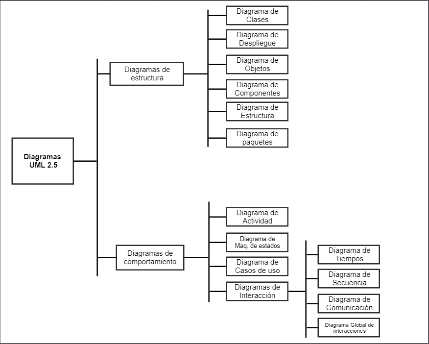{ width="480" }
  <figcaption>Los diagramas UML 2.5 se dividen en dos grandes familias. En este tema trabajamos el diagrama de clases; los diagramas de comportamiento (casos de uso, secuencia, actividades, estados...) se ven en el tema siguiente.</figcaption>
</figure>

!!! tip "Recuerda"
    UML es una herramienta de comunicación, no un fin en sí mismo. En metodologías ágiles se usa de forma ligera; en proyectos más formales se documenta más. Adapta el nivel de detalle al proyecto.

---

## Herramientas para la elaboración de diagramas

Diseñar diagramas UML puede hacerse de diversas maneras: desde bocetos hechos a mano hasta integraciones dentro del IDE. A partir de aquí vas a ver capturas de una de ellas en concreto, así que antes de seguir conviene saber cuál es y qué otras opciones existen.

### DIA (herramienta principal del curso)

**DIA** es la herramienta que usaremos en clase para crear los diagramas UML. Es de código abierto, gratuita y ligera.

- Descarga: [dia-installer.de](http://dia-installer.de/download/index.html)
- Manual: [dia-installer.de/doc/en/dia-manual.pdf](http://dia-installer.de/doc/en/dia-manual.pdf)

Tiene paletas específicas para UML, bases de datos y diagramas de flujo. No es tan completa como herramientas profesionales, pero cubre todo lo que necesitamos en el módulo.

<figure markdown="span">
  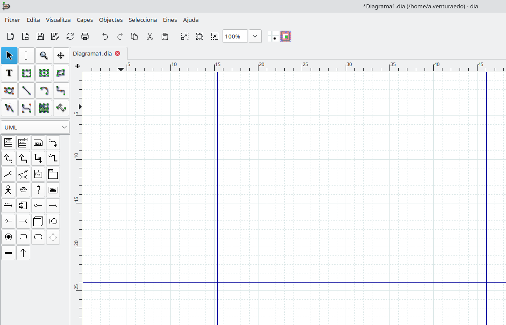{ width="560" }
  <figcaption>La interfaz de DIA: el lienzo a la derecha y las paletas de herramientas a la izquierda, con la paleta UML seleccionada.</figcaption>
</figure>

!!! warning "Configuración importante"
    Para poder generar código a partir de un archivo DIA, hay que **desactivar la compresión** antes de guardar. Ve a **Archivo → Preferencias → Diagrama por defecto** y desmarca la casilla **"Comprimir archivos guardados"**. Sin esto, dia2code no puede leer el archivo.

    <figure markdown="span">
      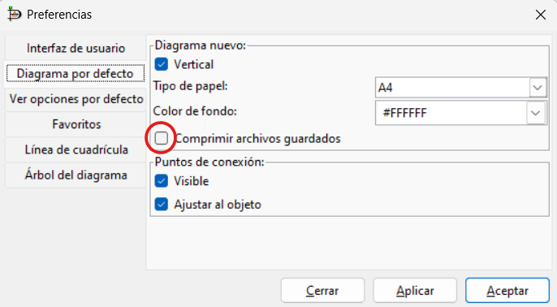{ width="380" }
      <figcaption>Archivo → Preferencias → Diagrama por defecto: desmarcar "Comprimir archivos guardados"</figcaption>
    </figure>

### Herramientas visuales (drag & drop)

Estas aplicaciones ofrecen paletas de componentes UML pre-dibujados que se pueden arrastrar al lienzo para trazar las líneas interactivamente con el ratón, sin escribir ninguna sintaxis. Es el enfoque más cómodo para diseñar en colaboración con otras personas en tiempo real.

| Herramienta | Cómo se usa | Ventajas | A tener en cuenta |
|---|---|---|---|
| **Draw.io** (Diagrams.net) | Navegador web o app de escritorio | Gratuito, se integra bien con Drive y GitHub, interfaz familiar | — |
| **Lucidchart** | Aplicación web | Excelente entorno colaborativo en tiempo real | La versión gratuita limita a un par de documentos simultáneos |
| **StarUML** | Software de escritorio | Ingeniería inversa y generación de código integradas, muy completo para UML estricto | Curva de aprendizaje algo mayor que las anteriores |

### Herramientas de "diagramación como código"

Aquí el diagrama no se dibuja con el ratón: se escribe como texto plano y una herramienta lo convierte en imagen. Es la forma preferida de documentar en proyectos que usan Git, precisamente porque un fichero de texto admite "diffs" (se puede ver línea a línea qué ha cambiado de una versión a otra de un diagrama, algo imposible con una imagen).

Mermaid y PlantUML son las dos opciones más usadas, y el mismo diagrama sencillo se escribe de forma parecida en ambas:

<div class="tabs-colored" markdown>
=== "Mermaid"
    Funciona con sentencias simples de Markdown; el diseño se renderiza donde haya intérprete (GitHub lo soporta de forma nativa, y es lo que hemos usado en algunos diagramas sencillos de este tema, como complemento a las capturas hechas con DIA).

    ~~~markdown
    ```mermaid
    classDiagram
      ClaseA -- ClaseB
    ```
    ~~~

=== "PlantUML"
    El pionero de este enfoque, con una sintaxis algo más detallada y un soporte de plugins en los IDE mucho más amplio que Mermaid.

    ```plantuml
    @startuml
    ClaseA -- ClaseB
    @enduml
    ```
</div>

!!! tip "¿Cuál elegir?"
    Para diagramas rápidos dentro de Markdown (como los de estos apuntes), Mermaid es más ligero. Para proyectos grandes con muchos tipos de diagrama distintos, PlantUML tiene más opciones de personalización.

### Plugins de entornos de desarrollo

Puedes integrar diagramas de clases dentro de tus proyectos añadiendo "Extensiones" (NetBeans) o "Plugins" (IntelliJ, Eclipse, VS Code). La ventaja frente a las herramientas anteriores es que el diagrama se genera **a partir del código que ya tienes**, sin dibujar nada a mano: es la misma idea que la ingeniería inversa que vas a ver más adelante en el tema.

Por ejemplo, con IntelliJ IDEA (versión Ultimate y con algunos plugins de la Community) puedes hacer **"click derecho → Diagrams → Show Diagram"** desde cualquier base de código Java y que te lo trace solo.

!!! tip "¿Dibujar el diagrama o generarlo del código?"
    Con DIA, Draw.io o Mermaid dibujas tú el diagrama: te sirve para diseñar *antes* de escribir el código, cuando todavía estás decidiendo cómo van a encajar las clases. Con un plugin del IDE el diagrama sale *después*, a partir de código que ya existe: te sirve para entender o documentar un proyecto que ya está escrito. Ambos enfoques son UML, pero resuelven momentos distintos del trabajo.

Con la herramienta ya elegida —DIA, en nuestro caso—, toca aprender el vocabulario que vas a dibujar con ella. Empezamos por la pieza más básica de todas: la clase.

---

## ¿Qué es una clase?

Una **clase** es un molde o plantilla a partir de la cual se crean los objetos. Define un tipo de dato personalizado que agrupa datos (atributos) y comportamientos (métodos) que van a tener los objetos creados a partir de ella.

En un diagrama UML, una clase se representa como un rectángulo dividido en tres partes:

1. **Nombre de la clase**: en la parte superior, típicamente en singular y con la primera letra en mayúscula (ej. `Vehiculo`).
2. **Atributos**: en medio, las características que definen el estado del objeto.
3. **Métodos (operaciones)**: en la parte inferior, indicando qué acciones puede realizar el objeto.

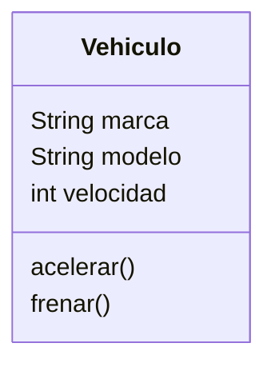

!!! tip "En DIA — crear una clase"
    Selecciona la paleta **UML** en el panel lateral y elige el icono de clase (rectángulo con tres compartimentos).

<figure markdown="span">
  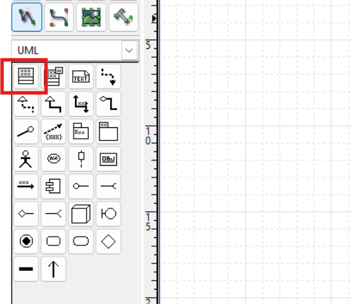{ width="260" }
  <figcaption>El icono de clase es el primero de la paleta UML: un rectángulo dividido en compartimentos.</figcaption>
</figure>

---

## Visibilidad (encapsulamiento)

El **encapsulamiento** es el principio de ocultar los detalles internos de una clase y exponer solo lo necesario. Antes de ver atributos y métodos en detalle conviene fijar esto, porque vas a ver estos símbolos delante de cada uno de ellos a partir de ahora. La visibilidad se denota con símbolos en UML:

- `+` **Público (Public)**: accesible desde cualquier otra clase o parte del programa.
- `-` **Privado (Private)**: accesible únicamente desde dentro de la misma clase (lo recomendado para la mayoría de atributos).
- `#` **Protegido (Protected)**: accesible desde la propia clase y desde sus clases hijas (subclases) a través de herencia.
- `~` **Paquete (Package)**: accesible para las clases que se encuentran dentro del mismo paquete (predeterminado en Java si no se pone nada).

!!! tip "En DIA — selector de visibilidad"
    Al editar un atributo u operación, el campo de visibilidad es un desplegable con cuatro valores, etiquetados en español: Público (`+`), Privado (`-`), Protegido (`#`) e Implementación (`~`). Este último es como DIA llama a lo que en UML se conoce como Package.

<figure markdown="span">
  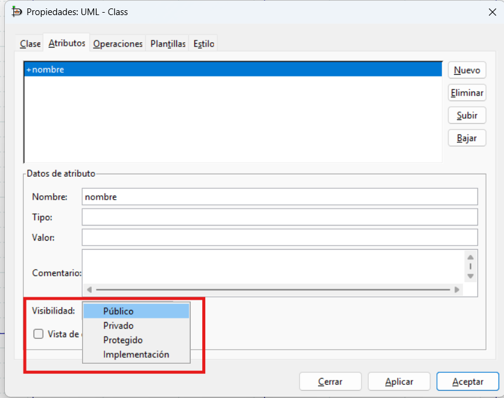{ width="380" }
  <figcaption>Pestaña Atributos del diálogo de propiedades, con el desplegable de visibilidad abierto: Público, Privado, Protegido e Implementación.</figcaption>
</figure>

---

## Atributos

Los **atributos** son las propiedades o características de una clase. Cada objeto instanciado a partir de esta clase va a tener sus propios valores para estos atributos.

En UML, los atributos se especifican con este formato, empezando siempre por el símbolo de visibilidad que acabas de ver:

```
visibilidad nombre : tipo = valorPorDefecto
```

El valor por defecto es opcional. Por ejemplo:

- `- marca : String` — atributo privado sin valor por defecto
- `- saldo : double = 0` — atributo privado que empieza en 0
- `+ activo : boolean = true` — atributo público que empieza en verdadero

!!! tip "En DIA — añadir un atributo"
    Haz doble clic sobre la clase → pestaña **Atributos**. Cada fila tiene campo de nombre, tipo y visibilidad.

<figure markdown="span">
  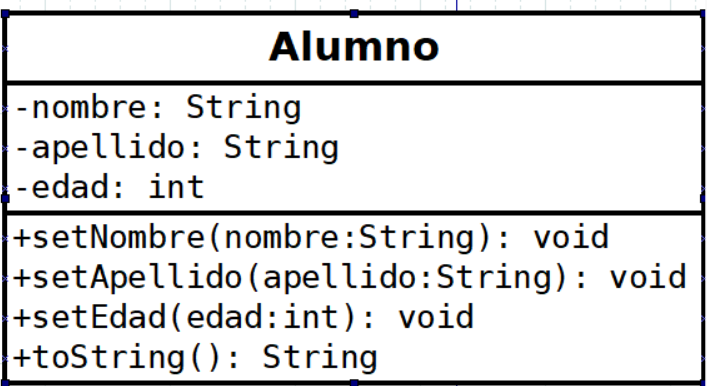{ width="320" }
  <figcaption>Así queda una clase con sus atributos ya escritos: nombre, apellido y edad son privados (−), mientras que los métodos que los leen o modifican son públicos (+).</figcaption>
</figure>

---

## Métodos (operaciones)

Los **métodos** determinan el comportamiento o las acciones que puede realizar un objeto. Son, en esencia, funciones definidas dentro de la clase.

Su formato general en UML es:

```
visibilidad nombre(dirección param : tipo, ...) : tipoRetorno
```

La **dirección** del parámetro es opcional y puede ser:

| Dirección | Significado |
|---|---|
| `in` | Parámetro de entrada (lo más habitual, equivale a omitirlo) |
| `out` | Parámetro de salida (el método escribe en él) |
| `inout` | Entrada y salida |

Por ejemplo:

- `+ acelerar(in incremento : int) : void`
- `+ transferir(in cantidad : double, in destino : CuentaCorriente) : boolean`

!!! tip "En DIA — añadir un método"
    En el mismo diálogo de propiedades, pestaña **Operaciones**. Puedes especificar nombre, parámetros y tipo de retorno.

<figure markdown="span">
  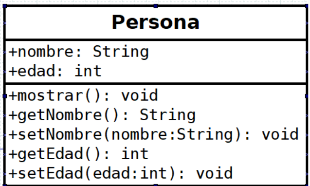{ width="320" }
  <figcaption>Una clase con varios métodos: mostrar() no tiene parámetros ni retorno, mientras que getNombre() devuelve un String y setNombre(nombre:String) recibe un parámetro.</figcaption>
</figure>

---

## Modificador `static`

Un atributo o método `static` pertenece a la **clase en sí**, no a cada objeto. Es decir, todos los objetos comparten el mismo valor.

- **Atributo static**: existe uno solo para toda la clase, independientemente de cuántos objetos se creen.
- **Método static**: se puede llamar directamente sobre la clase (`Clase.metodo()`) sin necesidad de crear un objeto.

```java
public class Matematicas {
    public static final double PI = 3.1416;

    public static double seno(double a) {
        return Math.sin(Math.toRadians(a));
    }
}

// Se usa sin crear ningún objeto:
System.out.println(Matematicas.PI);
System.out.println(Matematicas.seno(30));
```

En UML, los miembros estáticos se representan **subrayados**. En DIA no hay soporte directo, así que se usa la convención de poner el nombre entre guiones bajos: `_PI_`, `_seno_`.

<figure markdown="span">
  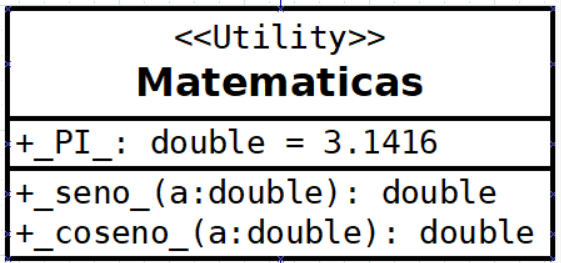{ width="320" }
  <figcaption>La clase Matematicas marcada con el estereotipo «Utility»: sus miembros son estáticos, así que se subrayan con la convención de guiones bajos («_PI_», «_seno_»).</figcaption>
</figure>

---

## Estereotipos

Los estereotipos añaden información extra a cualquier elemento del diagrama. Se escriben entre comillas angulares (`«nombre»`) encima o cerca del elemento al que aplican.

UML define varios estereotipos estándar para diagramas de clases:

| Estereotipo | Se aplica a | Significado |
|---|---|---|
| `«interface»` | Clase | Indica que la clase es una interfaz |
| `«abstract»` | Clase | Indica que la clase es abstracta y no se puede instanciar |
| `«utility»` | Clase | Clase con solo métodos y atributos estáticos (ejemplo: `Math` en Java) |
| `«entity»` | Clase | Representa una entidad de negocio en el modelo de datos |
| `«boundary»` | Clase | Representa una interfaz de usuario o un punto de interacción |
| `«control»` | Clase | Representa una clase de control que gestiona la lógica de negocio |
| `«enumeration»` | Clase | Indica que la clase es un tipo enumerado (`enum`) |
| `«exception»` | Clase | Indica que la clase representa una excepción (`Exception` en Java) |
| `«Create»` | Operación | La operación es un constructor de la clase |
| `«Destroy»` | Operación | La operación es un destructor |

También puedes inventar tus propios estereotipos para el proyecto: `«Controller»`, `«Repository»`, `«DTO»`, etc. De hecho ya has visto uno en la clase `Matematicas` de arriba: el estereotipo `«Utility»`.

Así se ve en la práctica el estereotipo `«interface»` de la tabla anterior, aplicado a una clase real:

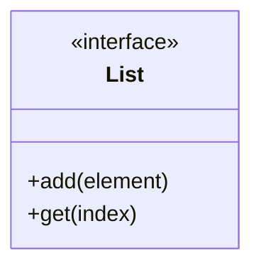

---

## Objetos e instanciación

Si una clase es el "molde", un **objeto** es lo que construimos con ese molde. El proceso de crear un objeto a partir de una clase se conoce como **instanciación**. Por tanto, un objeto es una *instancia* de una clase.

Un objeto es una entidad que existe en tiempo de ejecución. Tiene tres características esenciales:

1. **Identidad**: cada objeto es único. Incluso si dos objetos tienen exactamente los mismos datos, siguen siendo dos entidades diferentes en la memoria.
2. **Estado**: viene determinado por los valores que tienen sus *atributos* en un momento dado.
3. **Comportamiento**: definido por los *métodos* de su clase, dictando cómo el objeto puede actuar o reaccionar.

Cuando se instancia una clase, el sistema reserva un espacio en memoria para ese objeto y establece sus atributos con unos valores iniciales, normalmente a través de un método especial llamado **constructor**: un método con el mismo nombre que la clase que se ejecuta automáticamente al crear el objeto.

```java
public class Coche {
    private String marca;
    private String modelo;
    private String color;

    // Constructor: se ejecuta al crear el objeto con "new"
    public Coche(String marca, String modelo, String color) {
        this.marca = marca;
        this.modelo = modelo;
        this.color = color;
    }

    public String describir() {
        return marca + " " + modelo + " (" + color + ")";
    }
}
```

```java
Coche miCoche = new Coche("Toyota", "Corolla", "Rojo");
Coche tuCoche = new Coche("Ford", "Focus", "Azul");

System.out.println(miCoche.describir());  // Toyota Corolla (Rojo)
System.out.println(tuCoche.describir());  // Ford Focus (Azul)
```

`miCoche` y `tuCoche` son dos objetos distintos (identidad), construidos a partir de la misma clase `Coche`, pero con estados diferentes porque cada `new` ha guardado valores distintos en sus atributos.

El diagrama de clases dibuja el molde, no las piezas fabricadas con él. Pero a veces ayuda fijar un momento concreto y dibujar los objetos que existen en ese instante: es el llamado diagrama de objetos, donde cada objeto se representa como un rectángulo con el nombre subrayado: `nombreObjeto:NombreClase`.

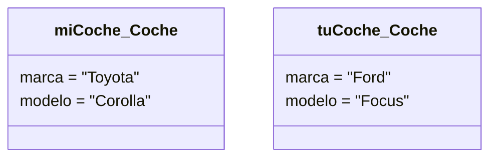

!!! note "Sobre el diagrama anterior"
    Mermaid no tiene una notación propia para diagramas de objetos, así que dibuja cada instancia como si fuera una clase. Conceptualmente, cada bloque representa un objeto concreto (`miCoche`, `tuCoche`) con sus valores ya fijados, no la clase genérica `Coche`.

---

## Los pilares de la POO

Todo lo visto hasta ahora —clases, atributos, métodos, visibilidad— son piezas sueltas. Lo que las convierte en **programación orientada a objetos** son cuatro ideas que aparecen una y otra vez en cualquier lenguaje orientado a objetos:

| Pilar | En una frase | Dónde se ve en este tema |
|---|---|---|
| **Encapsulamiento** | Ocultar los datos internos y exponer solo lo necesario | Visibilidad `+ - # ~`, más arriba en esta misma página |
| **Herencia** | Una clase hija reutiliza atributos y métodos de una clase padre | Generalización, en [relaciones.md](relaciones.md) |
| **Polimorfismo** | El mismo método se comporta distinto según el objeto real que lo ejecuta | Ejemplo más abajo, y clases abstractas en [relaciones.md](relaciones.md) |
| **Abstracción** | Definir *qué* hace algo sin fijar *cómo* lo hace | Clases abstractas e interfaces, en [relaciones.md](relaciones.md) |

Los dos primeros ya has visto cómo se representan. Los otros dos merecen un ejemplo aquí porque son los que más cuesta distinguir al principio.

### Polimorfismo

**Polimorfismo** significa que una misma llamada a un método puede ejecutar código distinto según el tipo real del objeto que la recibe, aunque la variable que lo contiene tenga un tipo más genérico.

```java
interface Hablador {
    public void habla();
}

class Gato implements Hablador {
    public void habla() { System.out.println("Miau"); }
}

class Cuco implements Hablador {
    public void habla() { System.out.println("Cu cu"); }
}
```

```java
Hablador animal1 = new Gato();
Hablador animal2 = new Cuco();

animal1.habla();  // Miau
animal2.habla();  // Cu cu
```

`animal1` y `animal2` están declarados como `Hablador`, y sobre ambas variables se llama exactamente al mismo método: `habla()`. Pero cada una ejecuta una versión distinta porque el objeto real detrás de la variable es un `Gato` o un `Cuco`. Java decide en tiempo de ejecución qué versión del método se llama, no en tiempo de compilación.

!!! tip "Ejemplo completo y diagrama"
    En la sección de realización de [relaciones.md](relaciones.md) tienes este mismo ejemplo ampliado: el diagrama de clases, y un `main()` que recorre una lista de `Hablador` y llama a `habla()` sobre cada uno sin saber si es un `Gato` o un `Cuco`.

    El ejemplo de `FiguraGeometrica`, `Circulo` y `Rectangulo` de la sección de clases abstractas en el mismo fichero es exactamente el mismo principio: cada figura sobrescribe `dibujar()` a su manera, y da igual si en el código la tienes guardada como `FiguraGeometrica` — se dibuja de la forma correcta según el objeto que realmente sea.

### Abstracción

**Abstracción** es quedarte con lo esencial de un concepto e ignorar los detalles que no importan para el problema que estás resolviendo. En UML se traduce en decidir qué atributos y métodos forman parte de una clase y cuáles no.

Por ejemplo, una clase `Empleado` en un sistema de nóminas necesita `salario` y `numeroSS`, pero no necesita saber el color de ojos de la persona: ese dato es real, pero irrelevante para el problema que resuelve el programa.

```java
public class Empleado {
    private double salario;    // relevante para nóminas
    private String numeroSS;   // relevante para nóminas
    // colorDeOjos NO aparece: es un dato real, pero irrelevante aquí
}
```

Las **clases abstractas** y las **interfaces** llevan la abstracción un paso más allá: permiten declarar que un método existe (el *qué*) sin todavía escribir su implementación (el *cómo*), dejando esa parte para las clases hijas. Tienes el detalle completo, con ejemplos de código, en la sección de generalización y realización de [relaciones.md](relaciones.md).
