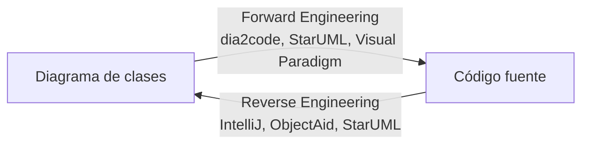

# 🔄 Generación de código e ingeniería inversa

{ type=application/pdf style="width:100%;min-height:80vh" }

!!!info "Descarga de diapositivas"
    [Descarga las diapositivas](diapositivas/generacion-y-ingenieria-inversa.pptx){target="_blank" rel="noopener"}

---

Uno de los puntos fuertes de UML es lo cerca que está del código: un diagrama de clases bien hecho se parece mucho a las clases que acabará teniendo el proyecto. Esa cercanía se puede aprovechar en las dos direcciones: partir del diagrama para generar el código, o partir del código para generar el diagrama.

## Generación de código (Forward Engineering)

La **generación de código** (también conocida como *Forward Engineering* o ingeniería directa) es el proceso mediante el cual se crea automáticamente el código fuente a partir de un diagrama de clases estructurado en una herramienta UML.

### Ventajas de la generación de código

1. **Ahorro de tiempo**: generar la estructura de decenas de clases con sus atributos y cabeceras de métodos vacíos ahorra horas de copiar y pegar, y reduce la posibilidad de cometer errores tipográficos.
2. **El código de partida coincide con el diseño**: nadie tiene que copiar el diagrama a mano a la hora de crear las clases, así que no se cuela ningún despiste entre lo que se ha diseñado y lo que arranca el proyecto.
3. **Plantillas a medida**: algunas herramientas avanzadas admiten scripts para generar automáticamente, por ejemplo, un *getter* y un *setter* para cada atributo.

### ¿Qué genera exactamente?

La mayoría de las herramientas (como StarUML o plugins de NetBeans/IntelliJ) generan **el esqueleto** del programa, incluyendo:

- Las definiciones y declaraciones de las clases (incluyendo su paquete).
- Las herencias e implementaciones de interfaces.
- La declaración de los atributos, respetando su tipo de datos y modificadores de visibilidad (`private`, `public`, etc).
- La cabecera o firma de los métodos, pero por regla general **vacíos** en su interior. La lógica del cuerpo del método te corresponde a ti programarla.

```java
// Ejemplo de Java generado automáticamente a partir de una clase UML "Coche"
public class Coche extends Vehiculo {

    private String marca;
    private String modelo;

    public void acelerar() {
        // Todo: Implement logic here
    }
}
```

## Generación de código desde DIA con dia2code

Para generar código Java directamente desde un archivo `.dia`, se usa la herramienta **dia2code**.

1. Descarga desde [dia2code.sourceforge.net](https://dia2code.sourceforge.net/)
2. Añade el directorio `bin` de instalación a la variable de entorno `PATH`
3. Ejecuta el comando:

```
dia2code -t java -d directorio_salida archivo.dia
```

| Parámetro | Significado |
|---|---|
| `-t java` | Lenguaje de destino |
| `-d directorio_salida` | Dónde se crearán los ficheros `.java` |
| `archivo.dia` | El diagrama fuente |

!!! warning "Importante: desactivar la compresión en DIA"
    dia2code necesita que el archivo `.dia` **no esté comprimido**.

    Ve a **Archivo → Preferencias → Diagrama por defecto** y **desmarca** la casilla **"Comprimir archivos guardados"**. Si no lo haces, dia2code no podrá leer el archivo.

    <figure markdown="span">
      { width="380" }
      <figcaption>Archivo → Preferencias → Diagrama por defecto: desmarcar "Comprimir archivos guardados" para que dia2code pueda leer el .dia</figcaption>
    </figure>

dia2code genera código por línea de comandos, pero no es la única forma de hacer *forward engineering*. Es la opción que usamos en clase porque encaja con DIA, la herramienta principal del curso, pero en un entorno profesional es más habitual generar el código con un botón dentro del propio programa, sin tocar la terminal:

| Herramienta | Cómo genera el código | Cuándo la vas a encontrar |
|---|---|---|
| **dia2code** | Comando de terminal sobre un archivo `.dia` sin comprimir | En este curso, junto con DIA |
| **StarUML** | Menú *Tools → Generate Code*, directamente sobre el diagrama abierto | Proyectos personales o de empresas pequeñas |
| **Plugins de IntelliJ / NetBeans** | Botón de generación integrado en el propio IDE | Cuando ya trabajas dentro de un IDE y no quieres salir de él |
| **Visual Paradigm** | *Code Engineering*, con plantillas configurables (getters, setters, patrones) | Empresas y consultoras que usan herramientas CASE profesionales |

!!! tip "Visual Paradigm: un CASE completo"
    Visual Paradigm es una herramienta profesional de pago (con versión Community gratuita) que aparece mucho en el mundo laboral. Cubre generación de código y también ingeniería inversa, y no se limita al diagrama de clases: puede generar diagramas de secuencia a partir del código, algo que verás con más detalle en el tema siguiente.

---

## Ingeniería inversa (Reverse Engineering)

La **ingeniería inversa** (*Reverse Engineering*) es el proceso opuesto a la generación de código. Consiste en analizar de manera automatizada el código fuente de un programa existente para extraer y generar el diagrama de clases correspondiente a esa estructura.

### ¿Por qué es útil?

1. **Comprensión de sistemas "legacy" (heredados)**: en el mundo laboral te vas a enfrentar a programas de cientos o miles de archivos, desarrollados por otras personas en el pasado, que carecen de documentación. La ingeniería inversa te permite ver cómo encaja todo de un vistazo.
2. **Actualizar la documentación**: cuando el código avanza rápido, es habitual que los diagramas iniciales se queden desactualizados. Pedirle a la herramienta que analice el código actual y lo pase a diagrama es más rápido que rehacer el diagrama a mano.
3. **Auditoría visual**: revisar de forma gráfica la jerarquía de herencia o los lazos entre clases ayuda a detectar rápidamente problemas de diseño.

### ¿Cómo funciona en la práctica?

Las herramientas de modelado (IDE o utilidades UML) recorren los ficheros fuente igual que haría un compilador: identifican cada clase, su paquete, sus atributos con su tipo y visibilidad, la firma de cada método, y las relaciones que hay entre clases (herencia, uso de otras clases como tipo de atributo, implementación de interfaces). Con esa información arman el diagrama solas, sin que tengas que dibujar ni una línea.

## Ingeniería inversa con IntelliJ IDEA

IntelliJ IDEA Ultimate genera diagramas de clases directamente desde el código. El proceso es:

1. En el panel de proyecto, haz **clic derecho sobre el paquete** que quieras analizar.
2. En el menú contextual ve a **Diagrams → Show Diagram** (atajo: `Ctrl+Alt+Mayús+U`).
3. IntelliJ genera automáticamente el diagrama con todas las clases, atributos, métodos y relaciones del paquete.

El resultado es un diagrama interactivo donde puedes navegar al código fuente haciendo clic en cada clase. Puedes exportarlo como imagen para incluirlo en la documentación del proyecto.

<figure markdown="span">
  { width="380" }
  <figcaption>Clic derecho sobre el paquete en IntelliJ IDEA Ultimate → Diagrams → Show Diagram (Ctrl+Alt+Mayús+U)</figcaption>
</figure>

<figure markdown="span">
  { width="480" }
  <figcaption>Diagrama de clases generado por IntelliJ a partir del código fuente: muestra clases, atributos, métodos y relaciones del paquete.</figcaption>
</figure>

!!! tip "StarUML también hace ingeniería inversa"
    IntelliJ no es la única opción. **StarUML** incluye ingeniería inversa integrada (o mediante extensiones), y es una de las pocas herramientas que la combina con generación de código en las dos direcciones dentro del mismo programa.

## Otras herramientas de ingeniería inversa

Cada entorno de desarrollo suele tener su propia forma de hacerlo, y todas parten de la misma idea que ya has visto con IntelliJ: apuntar a un código existente y dejar que la herramienta dibuje.

| Herramienta | Entorno | Qué la diferencia |
|---|---|---|
| **IntelliJ IDEA** (Diagrams) | IDE | Ya viene integrada, sin instalar nada extra |
| **ObjectAid UML Explorer** | Plugin de Eclipse | Gratuita para diagramas de clases; el diagrama se actualiza solo en cuanto guardas el código |
| **Visual Paradigm** (Instant Reverse) | Herramienta CASE independiente | Además de clases, reconstruye diagramas de secuencia leyendo las llamadas entre métodos |
| **StarUML** | Herramienta CASE independiente | Ingeniería inversa y generación de código en el mismo programa |

!!! note "Un mismo patrón, muchas herramientas"
    No hace falta memorizar todas: lo importante para el examen y para el día a día es entender el patrón común (código → análisis automático → diagrama) y saber usar con soltura la herramienta que tengas a mano, sea cual sea.

---

## Ida y vuelta: diagrama ⇄ código

Generación de código e ingeniería inversa son las dos caras de la misma moneda: la primera va del diagrama al código, la segunda del código al diagrama. En un proyecto real no se usan de forma aislada, sino que se combinan a lo largo de las distintas fases del desarrollo.



| | Generación de código | Ingeniería inversa |
|---|---|---|
| **Dirección** | Diagrama → código | Código → diagrama |
| **Cuándo se usa** | Al empezar un proyecto o un módulo nuevo, partiendo del diseño | Al incorporarte a un proyecto existente, o para actualizar documentación desfasada |
| **Qué obtienes** | Esqueleto de clases con atributos y firmas de métodos vacías | Diagrama con clases, atributos, métodos y relaciones ya existentes |
| **Riesgo si abusas de ello** | El código generado queda vacío si no programas la lógica después | El diagrama puede quedar obsoleto en cuanto el código vuelve a cambiar |

!!! tip "Buena práctica"
    Ninguno de los dos procesos sustituye al otro de forma permanente: lo habitual es generar código al principio del proyecto y, más adelante, usar ingeniería inversa puntualmente para comprobar que la documentación sigue reflejando lo que el código hace de verdad.
