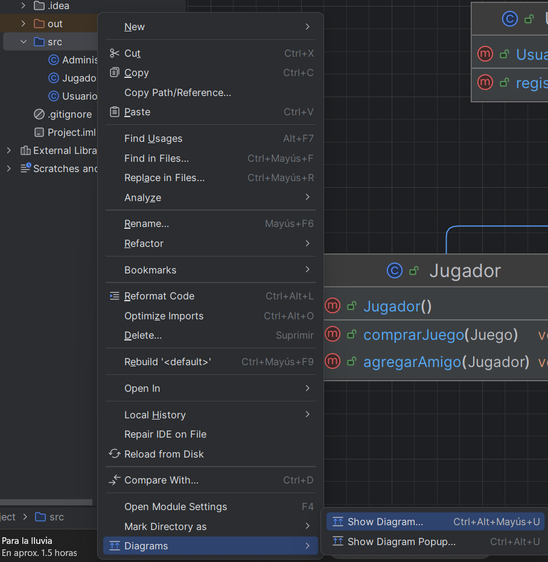
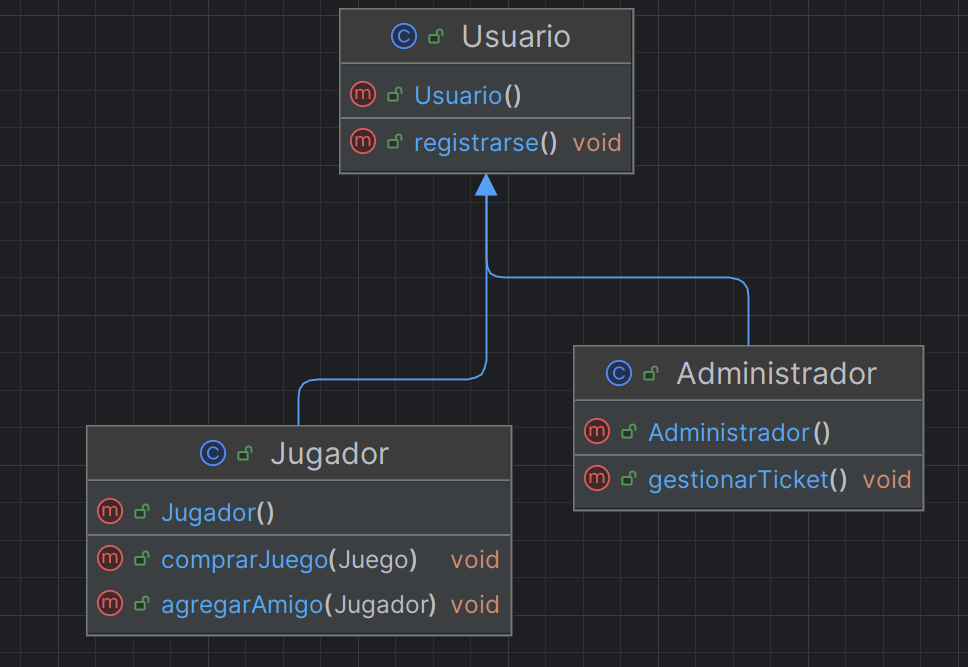

# 🔄 Ingeniería inversa: de código a diagrama

La **Ingeniería Inversa** (Reverse Engineering) es el proceso opuesto a la generación de código. Consiste en analizar de manera automatizada el código fuente de un programa existente para generar y extraer internamente el diagrama de clases correspondiente a esa infraestructura.

## 🔍 ¿Por qué es útil?

1. **Comprensión de sistemas "Legacy" (Heredados)**: En el mundo laboral, muy frecuentemente te enfrentarás a programas gigantescos de cientos o miles de archivos (desarrollados por otros en el pasado) que carecen de documentación. La ingeniería inversa te permite "ver cómo encaja todo" rápidamente a vista de pájaro.
2. **Actualizar la Documentación**: Cuando escribimos código rápido asiduamente abandonamos los diagramas iniciales. Una vez que terminamos, si pedimos a la herramienta que nos analice nuestro código actual para pasárnoslo a diagrama, tendremos la documentación de arquitectura actualizada gratis en unos segundos.
3. **Auditoría visual**: Revisar de forma gráfica la jerarquía de herencia o los lazos de acoplamiento de variables te puede ayudar a divisar rápidamente problemas de diseño (arquitectura). 

## ⚙️ ¿Cómo funciona en la práctica?

Las herramientas de modelado de software (IDE o utilidades UML) analizan las definiciones de clases, tipos de métodos y variables de entorno del código y traducen esto en cajas, líneas y rombos.

### Ejemplo con IntelliJ IDEA

IntelliJ IDEA Ultimate genera diagramas de clases directamente desde el código. El proceso es:

1. En el panel de proyecto, haz **clic derecho sobre el paquete** que quieras analizar.
2. En el menú contextual ve a **Diagrams → Show Diagram** (atajo: `Ctrl+Alt+Mayús+U`).
3. IntelliJ genera automáticamente el diagrama con todas las clases, atributos, métodos y relaciones del paquete.

El resultado es un diagrama interactivo donde puedes navegar al código fuente haciendo clic en cada clase. Puedes exportarlo como imagen para incluirlo en la documentación del proyecto.

<figure markdown="span">
  
  <figcaption>Clic derecho sobre el paquete en IntelliJ IDEA Ultimate → Diagrams → Show Diagram (Ctrl+Alt+Mayús+U)</figcaption>
</figure>

<figure markdown="span">
  
  <figcaption>Diagrama de clases generado por IntelliJ a partir del código fuente: muestra clases, atributos, métodos y relaciones del paquete.</figcaption>
</figure>
