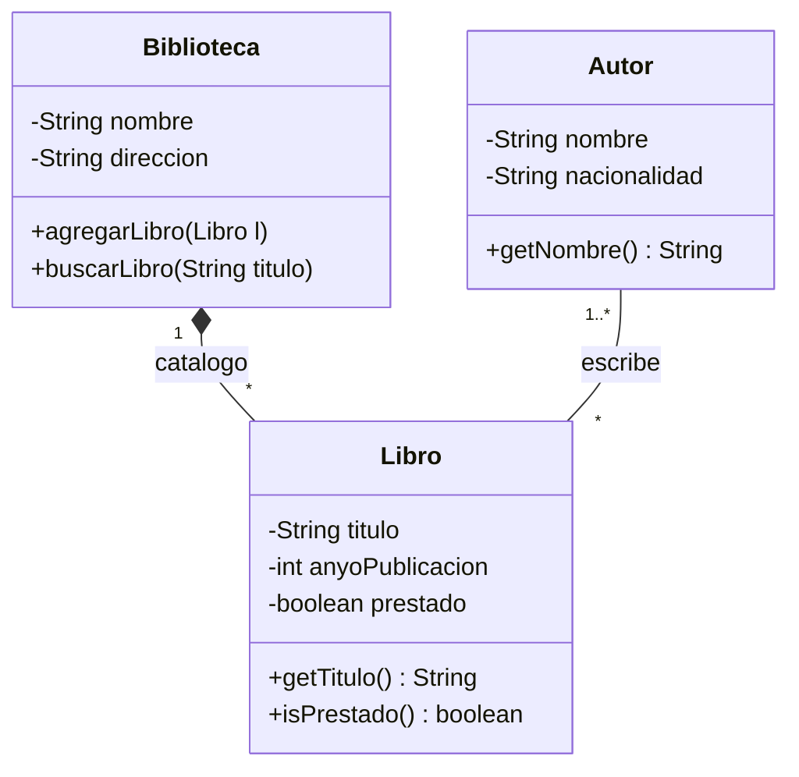
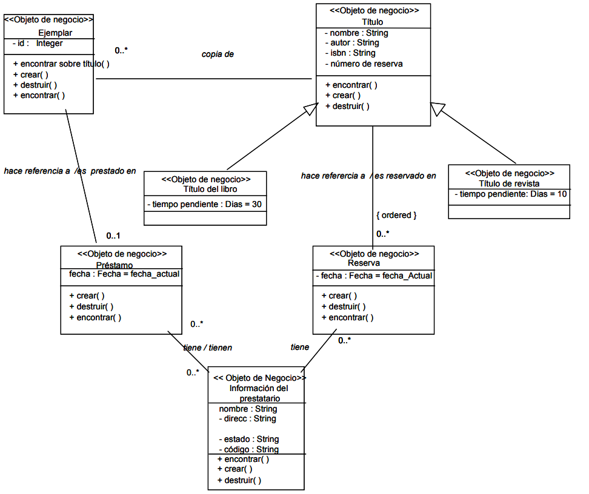
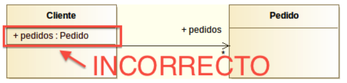

# 📝 Notación y especificaciones: de un enunciado a un diagrama

{ type=application/pdf style="width:100%;min-height:80vh" }

!!!info "Descarga de diapositivas"
    [Descarga las diapositivas](diapositivas/notacion-y-especificaciones.pptx){target="_blank" rel="noopener"}

---

UML fija una forma concreta de representar el software gráficamente, y el diagrama de clases es el que tiene las reglas más definidas de todos.

## Sintaxis básica de la clase

Cada atributo y cada método sigue siempre el mismo patrón, así que una vez que lo memorizas puedes leer cualquier diagrama sin tener que consultar nada: primero la visibilidad (`+`/`-`/`#`/`~`), luego el nombre, y por último el tipo.

<div class="tabs-colored" markdown>
=== "Plantilla"
    ```mermaid
    classDiagram
        class NombreDeLaClase {
            -tipoDeAtributo nombreDelAtributo
            +tipoDeRetorno nombreDelMetodo(tipoDeParametro parametro)
        }
    ```

=== "Ejemplo real"
    ```mermaid
    classDiagram
        class CuentaBancaria {
            -double saldo
            +retirar(in cantidad : double) boolean
        }
    ```
    `saldo` es privado (nadie fuera de la clase debería tocarlo directamente) y `retirar` es un método público que recibe una cantidad y devuelve si la operación se ha podido hacer.
</div>

## Ejemplo completo

Veamos cómo se aplica todo lo aprendido (clases, atributos, instanciación, relaciones y multiplicidad):



### Desglose de este ejemplo:
1. **La clase Biblioteca**: Tiene dos atributos privados (`nombre` y `direccion`) y dos métodos públicos (`agregarLibro` y `buscarLibro`).
2. **Relación de composición**: Entre `Biblioteca` y `Libro`. La biblioteca *contiene* los libros (un rombo relleno del lado de la Biblioteca, por lo que si se elimina la biblioteca, su catálogo de libros físicos desaparece con ella). La multiplicidad indica que `1` biblioteca puede albergar `0..*` libros.
3. **Relación de asociación**: Entre `Autor` y `Libro`. `1..*` (uno o más) autores pueden escribir `*` (cero o más) libros asociados entre sí.

??? example "Para profundizar: así se ve en un sistema de negocio real"
    El ejemplo de la Biblioteca es deliberadamente sencillo. En un proyecto real, el mismo tipo de sistema (gestión de préstamos de una biblioteca) suele necesitar más matices: estereotipos que marcan qué es cada clase, clases asociativas para relaciones con datos propios, y varias jerarquías conviviendo a la vez.

    <figure markdown="span">
      { width="560" }
      <figcaption>Un diagrama más cercano a un caso real: cada clase lleva el estereotipo «Objeto de negocio», hay dos subtipos de Título (de libro y de revista) y dos clases (Préstamo y Reserva) que conectan Título con la información del prestatario.</figcaption>
    </figure>

    No hace falta que entiendas cada detalle de este diagrama ahora mismo: el objetivo es que veas que las mismas piezas que ya conoces (clases, atributos, asociaciones, herencia, multiplicidad) son las que sostienen un diagrama mucho más grande.

---

## De la especificación en texto al diagrama

En clase casi siempre partes de un diagrama ya hecho para interpretarlo. Pero en un proyecto real ocurre lo contrario: alguien te da una descripción en lenguaje natural (un cliente, un analista, un enunciado de examen) y tienes que convertirla tú en un diagrama. Es la misma habilidad que necesitas para las actividades de este tema.

La técnica es simple de enunciar, aunque requiere práctica para afinarla:

| En el texto busca... | Se convierte en... |
|---|---|
| Un sustantivo que representa un concepto del sistema (`cliente`, `pedido`, `producto`) | Una **clase** |
| Un dato que describe ese concepto (`nombre`, `precio`, `fecha`) | Un **atributo** |
| Una acción que ese concepto puede hacer (`calcular total`, `enviar email`) | Un **método** |
| "Tiene un/una", "está compuesto de", "pertenece a" | Una **relación** (asociación, agregación o composición según el caso) |
| "Uno o varios", "cero o muchos", "exactamente uno" | La **multiplicidad** de esa relación |
| "Es un tipo de", "hereda las características de" | Una **generalización** (herencia) |

!!! example "Aplicándolo a un enunciado corto"
    Enunciado: *"Un pedido pertenece a un único cliente. Cada pedido contiene una o varias líneas de pedido, y cada línea de pedido hace referencia a exactamente un producto e indica la cantidad pedida. Si se elimina un pedido, sus líneas de pedido desaparecen con él."*

    Aplicando la técnica:

    - Sustantivos → clases: `Cliente`, `Pedido`, `LineaPedido`, `Producto`.
    - "Pertenece a un único cliente" → asociación `Pedido` – `Cliente` con multiplicidad `1` en el lado de `Cliente`.
    - "Contiene una o varias líneas de pedido" + "si se elimina un pedido, sus líneas desaparecen" → **composición**, no asociación simple: las líneas no tienen sentido sin el pedido. Multiplicidad `1..*` en el lado de `LineaPedido`.
    - "Hace referencia a exactamente un producto" → asociación `LineaPedido` – `Producto` con multiplicidad `1`.
    - "Indica la cantidad pedida" → atributo `cantidad` en `LineaPedido` (no en `Producto`, porque la cantidad depende de cada línea, no del producto en general).

    ```mermaid
    classDiagram
        Cliente "1" -- "0..*" Pedido
        Pedido "1" *-- "1..*" LineaPedido
        LineaPedido "*" -- "1" Producto
        class LineaPedido {
          -int cantidad
        }
    ```

!!! warning "El error más habitual"
    Convertir *todos* los sustantivos en clases sin pensar. No todo sustantivo del enunciado es una clase: "cantidad pedida" es un atributo, no una clase `Cantidad`. Pregúntate si el concepto tiene sentido por sí solo (necesita sus propios atributos y métodos) o si solo describe a otra clase.

---

## Errores comunes

Estos son los fallos que aparecen con más frecuencia al hacer diagramas de clases por primera vez. Unos son de notación (cómo se escribe algo) y otros son conceptuales (confundir un tipo de relación con otro); conviene distinguirlos porque no se corrigen de la misma manera.

| Error | Incorrecto | Correcto |
|---|---|---|
| Nombres de clase en plural | `Alumnos`, `Temporadas` | `Alumno`, `Temporada` (singular) |
| Repetir el atributo de una relación dentro de la clase | `Cliente` con la asociación a `Pedido` **y además** un atributo `pedidos : Pedido` dentro de la clase | Solo la asociación con su rol; el atributo ya está implícito |
| Rol en singular con multiplicidad `1..*` | Rol `capítulo` con multiplicidad `1..*` | Rol `capítulos` (plural, porque hay varios) |
| Flecha en una asociación bidireccional | Línea con flecha en un extremo aunque ambas clases se conozcan | Línea sin flecha en ningún extremo |
| Rombo en el lado de la "parte" | Rombo junto a `Rueda` en `Coche o-- Rueda` | Rombo junto a `Coche`, que es el "todo" |
| Confundir agregación con composición | Marcar como agregación algo que no puede existir sin el todo (un `Capitulo` sin su `Temporada`) | Composición: rombo relleno, porque la parte no sobrevive sin el todo |
| Atributos con mayúsculas o espacios | `Fecha Nacimiento`, `fecha_nacimiento` | `fechaNacimiento` (camelCase, como en Java) |
| Cardinalidad `N` o `M` | `Cliente "N" -- "M" Pedido` | `Cliente "*" -- "*" Pedido` (`N`/`M` son del modelo Entidad-Relación, no de UML) |
| Repetir atributos heredados en las subclases | `nombre` y `edad` en `Persona`, y otra vez en `Empleado` y en `Cliente` | Solo en `Persona`; las subclases los heredan automáticamente |

El más frecuente de todos —repetir como atributo algo que ya está en la relación— es también el más fácil de detectar a simple vista una vez que sabes qué buscar:

<figure markdown="span">
  { width="420" }
  <figcaption>El rol "pedidos" ya está en la línea de asociación (fuera de esta imagen); repetirlo dentro de Cliente es el error de la segunda fila de la tabla.</figcaption>
</figure>

!!! tip "El hilo común de los errores conceptuales"
    La repetición de atributos y la confusión entre agregación y composición comparten la misma raíz: duplicar información que el diagrama ya representa de otra forma. Antes de añadir un atributo, pregúntate si ya está implícito en una relación, una herencia o una multiplicidad.
