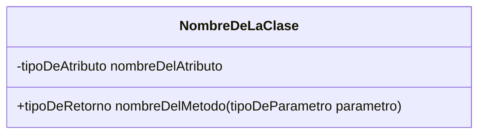
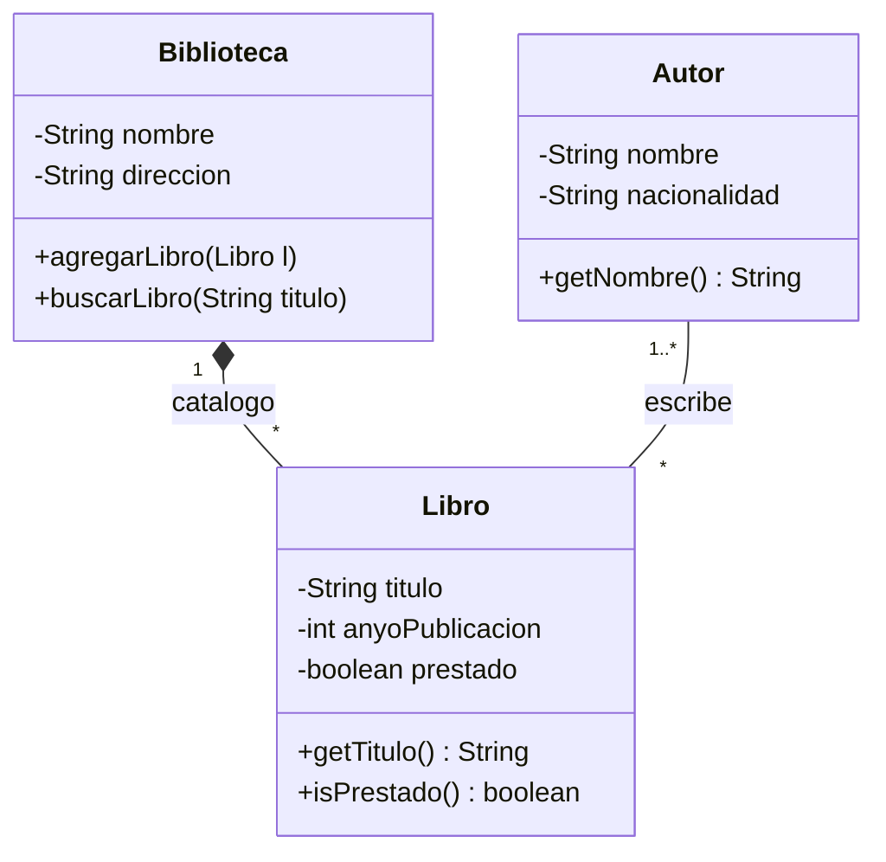

# 📝 Notación de los diagramas de clases

UML (Unified Modeling Language) ha estandarizado la forma de representar gráficamente el software y, en particular, el diagrama de clases tiene unas reglas muy definidas.

## 🏗️ Sintaxis básica de la clase

## 📌 Ejemplo Completo

Veamos cómo se aplica todo lo aprendido (clases, atributos, instanciación, relaciones y multiplicidad):

### Desglose de este ejemplo:
1. **La clase Biblioteca**: Tiene dos atributos privados (`nombre` y `direccion`) y dos métodos públicos (`agregarLibro` y `buscarLibro`).
2. **Relación de composición**: Entre `Biblioteca` y `Libro`. La biblioteca *contiene* los libros (un rombo relleno del lado de la Biblioteca, por lo que si se elimina la biblioteca, su catálogo de libros físicos desaparece con ella). La multiplicidad indica que `1` biblioteca puede albergar `0..*` libros.
3. **Relación de asociación**: Entre `Autor` y `Libro`. `1..*` (uno o más) autores pueden escribir `*` (cero o más) libros asociados entre sí.

---

## ⚠️ Errores comunes

Estos son los fallos que aparecen con más frecuencia al hacer diagramas de clases por primera vez.

### Los nombres de clase van en singular

`Alumno`, no `Alumnos`. `Temporada`, no `Temporadas`.

### Los atributos de las relaciones no se repiten dentro de la clase

Si ya has dibujado una asociación con su rol, ese atributo está implícito. Añadirlo también dentro de la clase es redundante e incorrecto.

### Los roles van en minúscula y respetan el número

El rol equivale al nombre del atributo en Java. Si la multiplicidad es `1..*`, el nombre del rol debe ir en plural: `capítulos`, no `capítulo`. Si es `1`, en singular: `cliente`.

### Asociaciones bidireccionales sin flechas

Si las dos clases se conocen mutuamente, la línea **no lleva flecha** en ningún extremo. Las flechas solo aparecen en las asociaciones unidireccionales.

### El rombo va en el lado del TODO

Tanto en la agregación (rombo hueco) como en la composición (rombo relleno), el rombo siempre está en la clase que actúa como "todo", no en la "parte".

### Composición vs. agregación

Si las partes **no pueden existir sin el todo**, es composición (rombo relleno). Un capítulo no existe sin su temporada → composición. Una rueda puede existir sin el coche → agregación.

### Atributos en minúscula y sin espacios

Los atributos siguen la convención camelCase de Java: `fechaNacimiento`, no `Fecha Nacimiento` ni `fecha_nacimiento`.

### La cardinalidad N o M no existe en UML

Eso es del modelo Entidad-Relación. En UML se usa `*` para representar "muchos".

### Los atributos de la superclase no se repiten en las subclases

Si `nombre` y `edad` están en `Persona`, no los pongas también en `Empleado` ni en `Cliente`. Las subclases los heredan.
