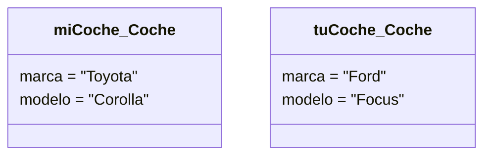

# 🪄 Objetos e instanciación

Si una clase es el "molde", un **objeto** es lo que construimos con ese molde. El proceso de crear un objeto a partir de una clase se conoce como **instanciación**. Por tanto, decimos que un objeto es una *instancia* de una clase.

## 🧱 Objetos

Un objeto es una entidad que existe en tiempo de ejecución. Tiene tres características esenciales:

1. **Identidad**: Cada objeto es único. Incluso si dos objetos tienen exactamente los mismos datos, siguen siendo dos entidades diferentes en la memoria.
2. **Estado**: Viene determinado por los valores que tienen sus *atributos* en un momento dado.
3. **Comportamiento**: Definido por los *métodos* de su clase, dictando cómo el objeto puede actuar o reaccionar.

## 🏗️ Instanciación

Cuando instanciamos una clase, el sistema reserva un espacio en memoria para albergar ese objeto y establecer sus atributos con unos valores iniciales (frecuentemente usando un método especial llamado **constructor**).

Por ejemplo, si tenemos la clase `Coche`, podemos instanciarla para crear dos objetos diferentes:
- `miCoche`: de marca "Toyota", modelo "Corolla", color "Rojo".
- `tuCoche`: de marca "Ford", modelo "Focus", color "Azul".

En un diagrama UML, aunque el diagrama de clases modela la estructura estática (las clases), a veces resulta útil dibujar diagramas de objetos para mostrar ejemplos en un momento específico. 

En ese caso, el objeto se representa como un rectángulo con el nombre subrayado:
`nombreObjeto:NombreClase`

*(Nota en la sintaxis de Mermaid de arriba: Mermaid trata los objetos como clases en este tipo de diagrama básico, pero conceptualmente representan instancias específicas).*
