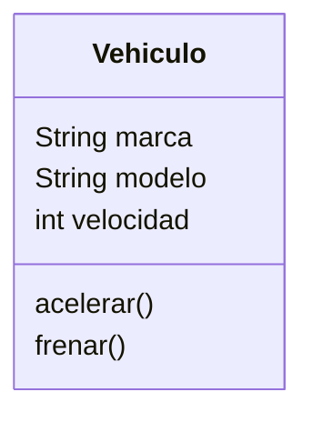
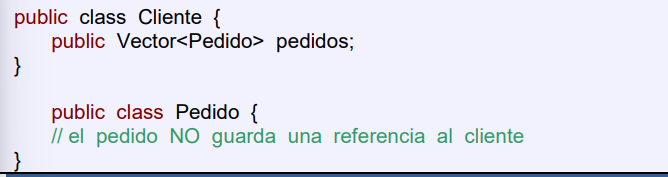
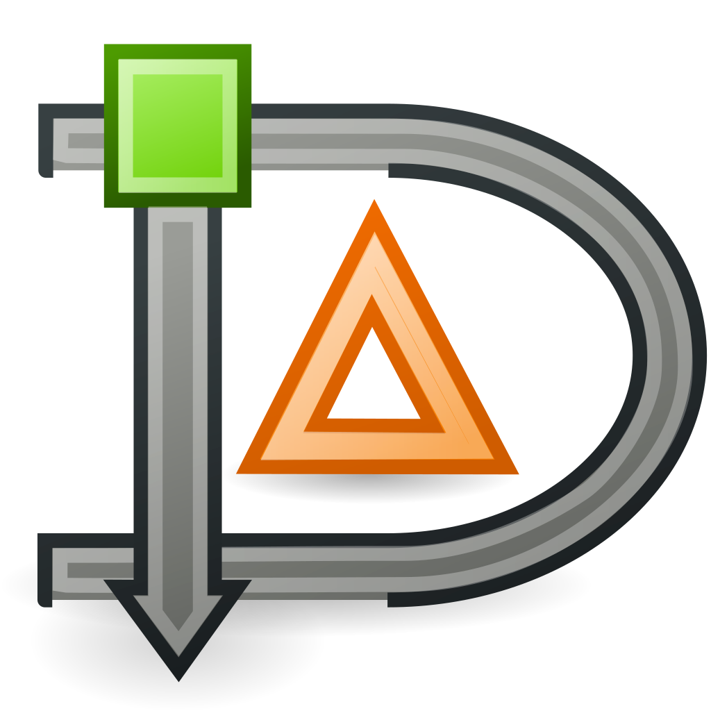
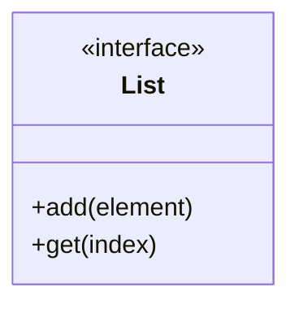

# 🏗️ Conceptos básicos de la POO: clases, atributos y métodos

El **diagrama de clases** es el diagrama UML más habitual. Sirve para representar las clases de un programa orientado a objetos: qué datos guarda cada clase y qué operaciones puede hacer.

## 📦 ¿Qué es una Clase?

Una **clase** es un molde o plantilla a partir de la cual se crean los objetos. Define un tipo de dato personalizado que agrupa datos (atributos) y comportamientos (métodos) que tendrán los objetos creados a partir de ella. 

En un diagrama UML, una clase se representa como un rectángulo dividido en tres partes:

1. **Nombre de la clase**: En la parte superior, típicamente en singular y con la primera letra en mayúscula (ej. `Vehiculo`).
2. **Atributos**: En medio, las características que definen el estado del objeto.
3. **Métodos (Operaciones)**: En la parte inferior, indicando qué acciones puede realizar el objeto.



## 🏷️ Atributos

Los **atributos** son las propiedades o características de una clase. Cada objeto instanciado a partir de esta clase tendrá sus propios valores para estos atributos.

En UML, los atributos se especifican con este formato:

```
visibilidad nombre : tipo = valorPorDefecto
```

El valor por defecto es opcional. Por ejemplo:

- `- marca : String` — atributo privado sin valor por defecto
- `- saldo : double = 0` — atributo privado que empieza en 0
- `+ activo : boolean = true` — atributo público que empieza en verdadero

!!! tip "En DIA — añadir un atributo"
    Haz doble clic sobre la clase → pestaña **Atributos**. Cada fila tiene campo de nombre, tipo y visibilidad.

    <figure markdown="span">
      
      <figcaption>Propiedades de una clase en DIA: pestaña de atributos con campos de nombre, tipo y visibilidad</figcaption>
    </figure>

## ⚙️ Métodos (Operaciones)

Los **métodos** determinan el comportamiento o las acciones que puede realizar un objeto. Son, en esencia, funciones definidas dentro de la clase.

Su formato general en UML es:

```
visibilidad nombre(dirección param : tipo, ...) : tipoRetorno
```

La **dirección** del parámetro es opcional y puede ser:

| Dirección | Significado |
|---|---|
| `in` | Parámetro de entrada (lo más habitual, equivale a omitirlo) |
| `out` | Parámetro de salida (el método escribe en él) |
| `inout` | Entrada y salida |

Por ejemplo:
- `+ acelerar(in incremento : int) : void`
- `+ transferir(in cantidad : double, in destino : CuentaCorriente) : boolean`

!!! tip "En DIA — añadir un método"
    En el mismo diálogo de propiedades, pestaña **Operaciones**. Puedes especificar nombre, parámetros y tipo de retorno.

    <figure markdown="span">
      
      <figcaption>Propiedades de una clase en DIA: pestaña de operaciones con campos de nombre, parámetros y tipo de retorno</figcaption>
    </figure>

## 🔵 UML

**UML (Unified Modeling Language)** es el estándar para diseñar y documentar sistemas de software orientados a objetos.

!!! tip "En DIA — crear una clase"
    Selecciona la paleta **UML** en el panel lateral y elige el icono de clase (rectángulo con tres compartimentos).

    <figure markdown="span">
      
      <figcaption>Icono de clase en la paleta UML de DIA: rectángulo con tres secciones (nombre, atributos, métodos)</figcaption>
    </figure> Fue creado en 1997 y define un conjunto de diagramas gráficos que permiten visualizar la estructura y el comportamiento de una aplicación antes de programarla.

!!! tip "Recuerda"
    UML es una herramienta de comunicación, no un fin en sí mismo. En metodologías ágiles se usa de forma ligera; en proyectos más formales se documenta más. Adapta el nivel de detalle al proyecto.

---

## 👁️ Visibilidad (Encapsulamiento)

El encapsulamiento es el principio de ocultar los detalles internos de una clase y exponer solo lo necesario. La visibilidad de atributos y métodos se denota con símbolos en UML:

- `+` **Público (Public)**: Accesible desde cualquier otra clase o parte del programa.
- `-` **Privado (Private)**: Accesible únicamente desde dentro de la misma clase. (Lo recomendado para la mayoría de atributos).
- `#` **Protegido (Protected)**: Accesible desde la propia clase y desde sus clases hijas (subclases) a través de herencia.
- `~` **Paquete (Package)**: Accesible para las clases que se encuentran dentro del mismo paquete (predeterminado en Java si no se pone nada).

!!! tip "En DIA — selector de visibilidad"
    Al editar un atributo u operación, el campo de visibilidad es un desplegable con los cuatro valores: Public, Private, Protected y Package.

    <figure markdown="span">
      
      <figcaption>Selector de visibilidad en DIA: Public (+), Private (−), Protected (#) o Package (~)</figcaption>
    </figure>

---

## ⚡ Modificador `static`

Un atributo o método `static` pertenece a la **clase en sí**, no a cada objeto. Es decir, todos los objetos comparten el mismo valor.

- **Atributo static**: existe uno solo para toda la clase, independientemente de cuántos objetos se creen.
- **Método static**: se puede llamar directamente sobre la clase (`Clase.metodo()`) sin necesidad de crear un objeto.

```java
public class Matematicas {
    public static final double PI = 3.1416;

    public static double seno(double a) {
        return Math.sin(Math.toRadians(a));
    }
}

// Se usa sin crear ningún objeto:
System.out.println(Matematicas.PI);
System.out.println(Matematicas.seno(30));
```

En UML, los miembros estáticos se representan **subrayados**. En DIA no hay soporte directo, así que se usa la convención de poner el nombre entre guiones bajos: `_PI_`, `_seno_`.

---

## 🏷️ Estereotipos

Los estereotipos añaden información extra a cualquier elemento del diagrama. Se escriben entre comillas angulares (`«nombre»`) encima o cerca del elemento al que aplican.

UML define varios estereotipos estándar para diagramas de clases:

| Estereotipo | Se aplica a | Significado |
|---|---|---|
| `«interface»` | Clase | La clase es en realidad una interfaz |
| `«Create»` | Operación | La operación es un constructor |
| `«Destroy»` | Operación | La operación es un destructor |
| `«Utility»` | Clase | La clase agrupa métodos estáticos; no hace falta instanciarla |

También puedes inventar tus propios estereotipos para el proyecto: `«Controller»`, `«Repository»`, `«DTO»`, etc.


