# 🔗 Relaciones en diagramas de clases

En cualquier programa orientado a objetos hay varias clases que se relacionan entre sí. En UML, esas relaciones tienen nombre y notación propia.

---

## 1. Asociación

Es la relación más común: se da cuando una clase **tiene un atributo de tipo otra clase**. En Java se traduce en que una clase guarda una referencia a la otra.

### Unidireccional

Solo una clase conoce a la otra. Se representa con una **línea con flecha** que apunta desde la clase que "conoce" hacia la que "es conocida".

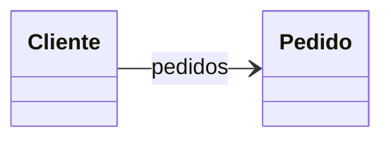

*Un `Cliente` tiene una lista de `Pedido`, pero `Pedido` no sabe nada de `Cliente`.*

### Bidireccional

Ambas clases se conocen mutuamente. Se representa con una **línea sin flechas**.

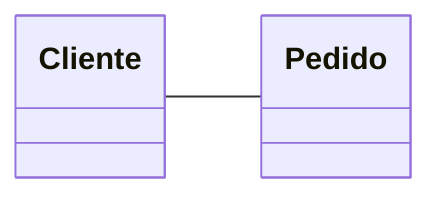

!!! warning "Cuidado"
    Las asociaciones bidireccionales **no llevan flecha** en ninguno de los dos extremos.

### Roles

El **rol** es el nombre que toma una clase dentro de la relación; equivale al nombre del atributo en Java. Se escribe en el extremo **opuesto** a la clase que lo contiene.

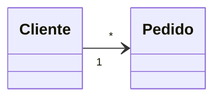

*El rol de `Pedido` en `Cliente` sería `pedidos` (en plural, porque hay varios). El rol de `Cliente` en `Pedido` sería `cliente`.*

!!! warning "Error frecuente"
    Si ya has dibujado la relación con su rol, **no vuelvas a añadir ese atributo dentro de la clase**. La relación ya lo representa.

!!! tip "En DIA — configurar roles y multiplicidad"
    Haz **doble clic sobre la línea de asociación** para abrir sus propiedades. Verás dos columnas, **Side A** y **Side B**, donde puedes escribir el rol y la multiplicidad de cada extremo. También puedes controlar si se muestra la flecha en cada lado con el campo *Mostrar flecha*.

    <figure markdown="span">
      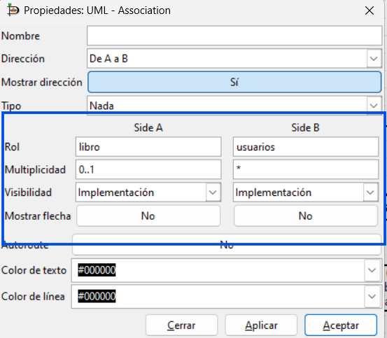
      <figcaption>Propiedades de la asociación en DIA: los campos "Side A" y "Side B" permiten configurar rol, multiplicidad y si se muestra la flecha.</figcaption>
    </figure>

### Multiplicidad

Indica cuántos objetos de una clase pueden relacionarse con los de la otra. Se escribe en cada extremo de la línea.

| Notación | Significado |
|---|---|
| `1` | Exactamente uno |
| `0..1` | Cero o uno |
| `1..*` | Uno o más |
| `*` o `0..*` | Cero o más |
| `0..3` | Entre cero y tres |
| `2..3` | Entre dos y tres |

!!! warning "Error frecuente"
    La cardinalidad `N` o `M` **no existe en UML** — eso es del modelo Entidad-Relación. En UML siempre se usa `*` para "muchos".

---

## 2. Generalización (Herencia)

Permite crear una clase hija que hereda los atributos y métodos de la clase padre. Se lee como *"ClaseB es un tipo de ClaseA"*.

Se representa con una **línea sólida y una flecha triangular hueca** apuntando desde la hija hacia el padre.

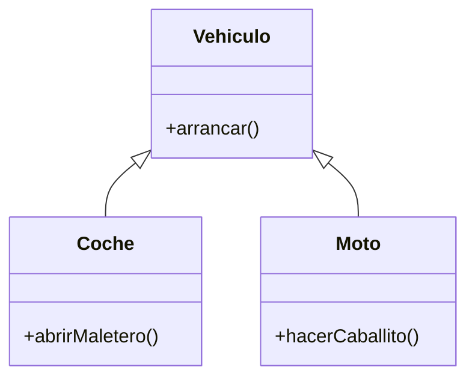

!!! warning "Error frecuente"
    Si un atributo está en la clase padre, **no lo repitas en las hijas**. Lo heredan automáticamente.

### Clases y métodos abstractos

Una clase abstracta tiene al menos un método sin implementar. No se puede instanciar directamente. En UML, tanto la clase como sus métodos abstractos se escriben **en cursiva**.

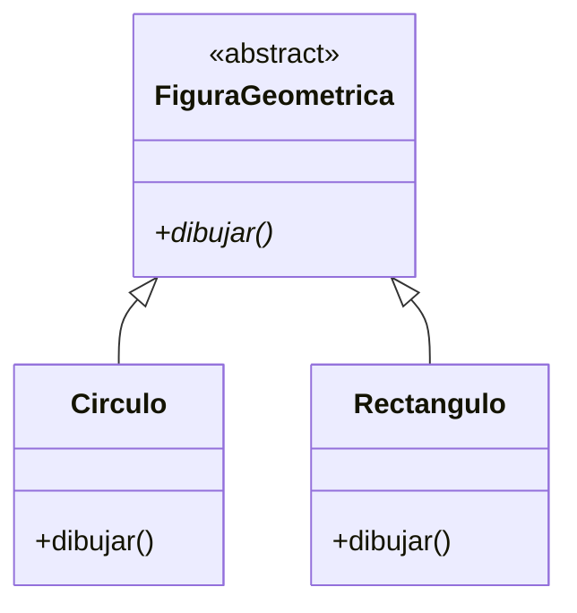

---

!!! tip "En DIA — generalización"
    El icono de generalización en la paleta UML es una **flecha con punta triangular hueca**.

    <figure markdown="span">
      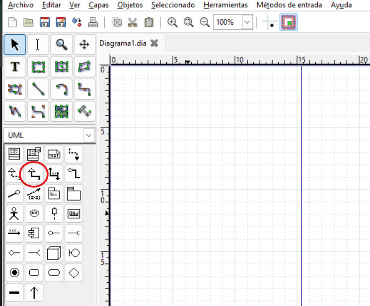
      <figcaption>Icono de generalización en la paleta UML de DIA: flecha con punta triangular hueca</figcaption>
    </figure>

---

## 3. Realización (Interfaces)

Una **interfaz** es como una clase abstracta pura: define qué métodos debe tener una clase, pero no los implementa. En Java, se usa `implements`.

La realización se representa con una **línea discontinua y una flecha triangular hueca** que va desde las clases que implementan hacia la interfaz.

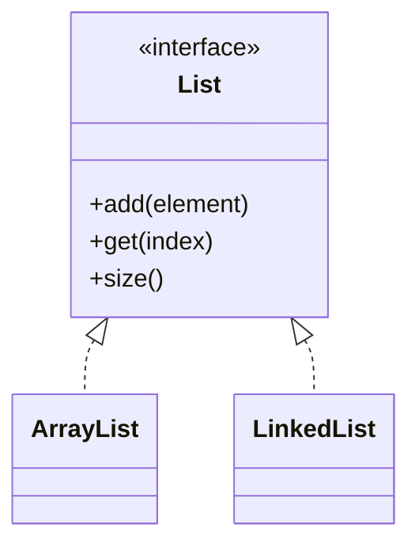

*`ArrayList` y `LinkedList` implementan (realizan) la interfaz `List`.*

---

!!! tip "En DIA — realización"
    El icono de realización en la paleta UML es una **línea discontinua con triángulo**.

    <figure markdown="span">
      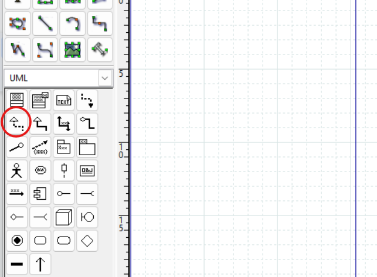
      <figcaption>Icono de realización en la paleta UML de DIA: línea discontinua con triángulo hueco</figcaption>
    </figure>

---

## 4. Agregación

Relación "todo–parte" donde las partes **pueden existir sin el todo**. El rombo va siempre en el lado del **todo**.

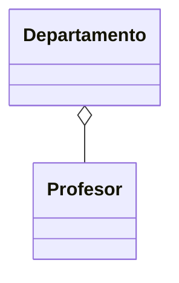

*Si un departamento desaparece, los profesores siguen existiendo.*

---

## 5. Composición

Igual que la agregación pero las partes **no pueden existir sin el todo**. Rombo relleno en el lado del **todo**.

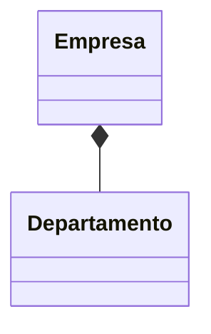

*Si se elimina la empresa, los departamentos desaparecen con ella.*

!!! warning "Error frecuente"
    Tanto el rombo de agregación como el de composición van **en el lado del todo**, no en el de la parte.

---

!!! tip "En DIA — composición"
    En DIA solo existe el icono de **Agregación** (rombo hueco). Para convertirla en composición, crea la agregación primero y después haz **doble clic sobre la línea** → campo *Tipo* → selecciona **Composición** en el desplegable.

    <figure markdown="span">
      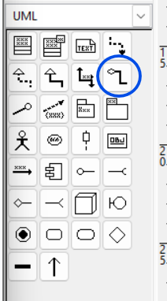
      <figcaption>Icono de agregación (rombo hueco) en la paleta UML de DIA</figcaption>
    </figure>

    <figure markdown="span">
      
      <figcaption>Para convertir una agregación en composición, haz doble clic sobre la línea → campo "Tipo" → selecciona "Composición"</figcaption>
    </figure>

---

## 6. Dependencia

Una clase usa a otra **de forma temporal** (como parámetro, variable local o tipo de retorno de un método), pero sin guardar una referencia permanente. Si la clase B cambia, puede afectar a A.

Se representa con una **línea discontinua con una flecha en "V"**.

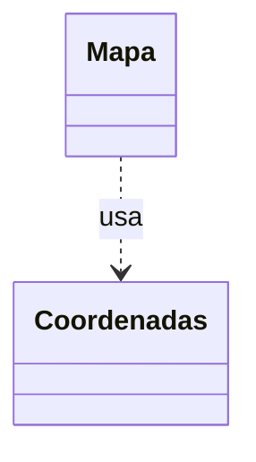

*`Mapa` tiene métodos que reciben o devuelven `Coordenadas`, pero no la guarda como atributo.*

!!! tip "Recuerda"
    Si la clase **guarda** la referencia en un atributo, es una asociación (o agregación/composición). Si solo la usa puntualmente, es una dependencia.

!!! tip "En DIA — dependencia"
    El icono de dependencia en la paleta UML es una **línea punteada con flecha en "V"**.

    <figure markdown="span">
      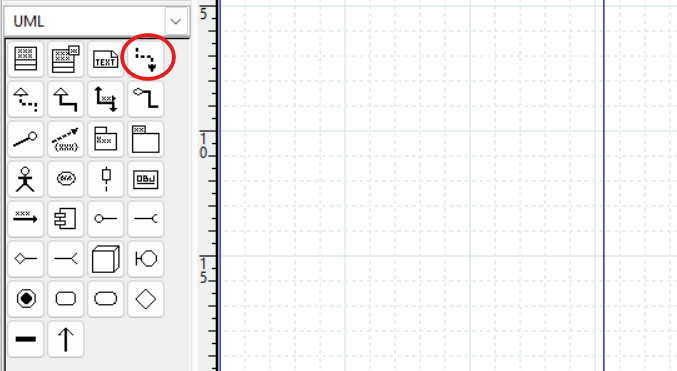
      <figcaption>Icono de dependencia en la paleta UML de DIA: línea punteada con flecha en "V"</figcaption>
    </figure>

---

## 7. Clase asociativa

Cuando una relación tiene sus propios atributos o métodos, se representa como una clase unida a la línea de asociación con una línea discontinua.

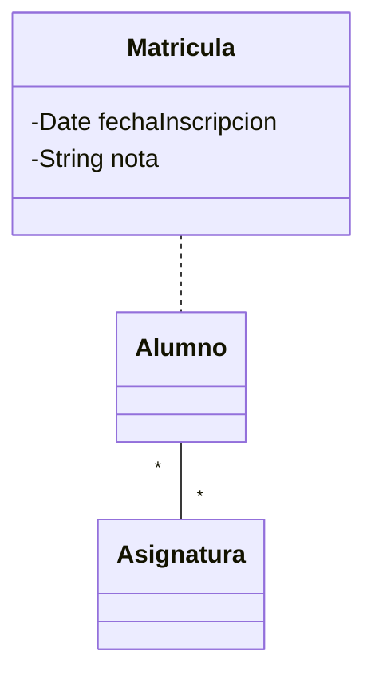

*La matrícula no pertenece ni solo al alumno ni solo a la asignatura: pertenece a la relación entre ambos.*

!!! tip "En DIA — clase asociativa"
    DIA no tiene un elemento específico para esto. El procedimiento es:

    1. Dibuja las dos clases con su asociación normal.
    2. Crea la clase adicional (la que representa la relación).
    3. Usa la herramienta de **línea estándar** (paleta de herramientas generales, no la paleta UML) para unir esa clase a la línea de asociación.
    4. Haz doble clic sobre esa línea → cambia el *Estilo de la línea* a **discontinuo** (punteado).

    <figure markdown="span">
      
      <figcaption>Herramienta de línea estándar (paleta general, no la UML) para unir la clase asociativa a la línea de relación</figcaption>
    </figure>

    <figure markdown="span">
      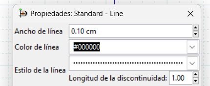
      <figcaption>Cambiar el estilo de la línea a "discontinuo" en sus propiedades para completar la clase asociativa</figcaption>
    </figure>

---

## 8. ¿Generalización o realización?

Ambas representan relaciones entre clases, pero tienen un uso diferente:

| | Generalización (herencia) | Realización (interfaz) |
|---|---|---|
| Palabra clave Java | `extends` | `implements` |
| ¿Cuántas puede tener una clase? | **Solo una** clase padre | **Múltiples** interfaces |
| La clase padre tiene implementación | Sí (puede tener métodos con código) | No (la interfaz solo declara la firma) |
| Cuándo usarla | La clase hija **es un tipo de** la padre | La clase **promete comportarse** según el contrato |

!!! warning "Regla práctica"
    Si necesitas que una clase tenga comportamiento de varios tipos distintos, usa interfaces (realización). Java solo permite heredar de **una** clase padre, pero puedes implementar **tantas interfaces como quieras**.

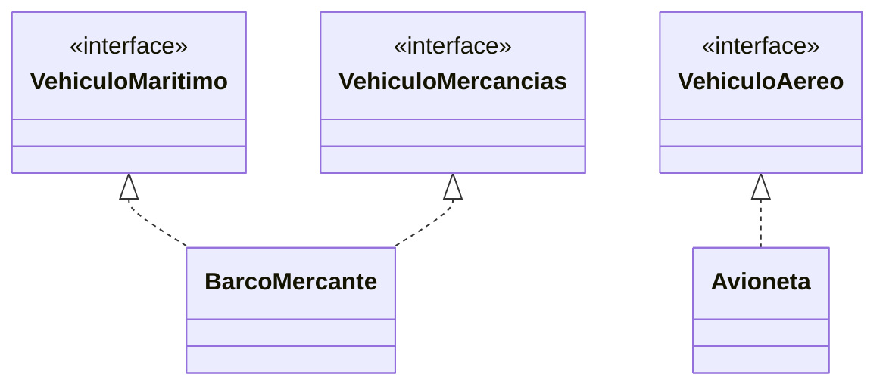

*Un `BarcoMercante` puede realizar dos interfaces a la vez. Eso sería imposible con herencia.*

---

## 9. ¿Clase abstracta o interfaz?

Tanto las clases abstractas como las interfaces definen métodos que deben implementar las subclases. La diferencia principal es:

| | Clase abstracta | Interfaz |
|---|---|---|
| Puede tener atributos de instancia | ✅ Sí | ❌ No (solo `static final`) |
| Puede tener métodos con implementación | ✅ Sí | ❌ No (en Java < 8) |
| Una clase puede extender / implementar | Solo **una** | **Varias** |
| Relación UML | Generalización (línea sólida) | Realización (línea discontinua) |

Elige clase abstracta cuando las subclases **comparten código** (atributos y métodos ya implementados). Elige interfaz cuando solo quieras **garantizar que un comportamiento existe**, sin importar cómo se implementa.
