# 🔗 Relaciones en diagramas de clases

{ type=application/pdf style="width:100%;min-height:80vh" }

!!!info "Descarga de diapositivas"
    [Descarga las diapositivas](diapositivas/relaciones.pptx){target="_blank" rel="noopener"}

---

En cualquier programa orientado a objetos hay varias clases que se relacionan entre sí. En UML, esas relaciones tienen nombre y notación propia.

---

## 1. Asociación

Es la relación más común: se da cuando una clase **tiene un atributo de tipo otra clase**. En Java se traduce en que una clase guarda una referencia a la otra.

### Unidireccional

Solo una clase conoce a la otra. A la dirección en la que se puede "viajar" por una asociación se le llama **navegabilidad**, y es lo que indica la flecha: una **línea con flecha** que apunta desde la clase que "conoce" hacia la que "es conocida" es una asociación de navegabilidad unidireccional. Un `Cliente` puede tener una lista de `Pedido`, pero `Pedido` no sabe nada de `Cliente`.

La misma relación se puede modelar en cualquiera de las dos direcciones, y el código cambia según quién guarda la referencia a quién:

<div class="tabs-colored" markdown>
=== "Cliente conoce a Pedido"
    ```java
    public class Cliente {
        public Vector<Pedido> pedidos;
    }

    public class Pedido {
        // el pedido NO guarda una referencia al cliente
    }
    ```
    Aquí el diagrama dibuja la flecha desde `Cliente` hacia `Pedido`, con el rol `pedidos` en el extremo de `Pedido`.

    <figure markdown="span">
      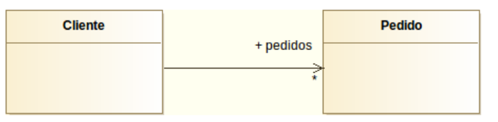{ width="420" }
      <figcaption>La flecha sale de Cliente y apunta a Pedido: Cliente conoce a sus pedidos.</figcaption>
    </figure>

=== "Pedido conoce a Cliente"
    ```java
    public class Cliente {
        // esta vez el cliente NO guarda los pedidos
    }

    public class Pedido {
        public Cliente cliente;
    }
    ```
    Aquí la flecha va al revés: desde `Pedido` hacia `Cliente`, con el rol `cliente` en el extremo de `Cliente`.

    <figure markdown="span">
      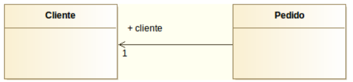{ width="420" }
      <figcaption>La flecha sale de Pedido y apunta a Cliente: cada Pedido conoce a su Cliente.</figcaption>
    </figure>
</div>

!!! tip "Regla práctica"
    Mira quién declara el atributo del tipo de la otra clase: esa es la clase "de la que sale la flecha". Si tienes dudas sobre el sentido de una asociación, piensa en qué objeto necesitas tener en la mano para poder llamar al otro.

### Bidireccional

Ambas clases se conocen mutuamente: la navegabilidad es **bidireccional**. Se representa con una **línea sin flechas**. Compárala con las dos anteriores: aquí aparecen los roles `cliente` y `pedidos` a la vez, en los dos extremos, y ninguna punta de flecha:

<figure markdown="span">
  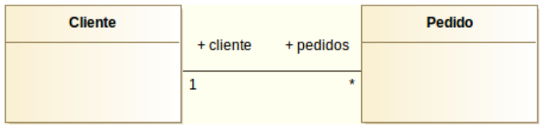{ width="420" }
  <figcaption>Sin flecha en ningún extremo: Cliente conoce sus Pedidos y cada Pedido conoce a su Cliente.</figcaption>
</figure>

!!! warning "Cuidado"
    Las asociaciones bidireccionales **no llevan flecha** en ninguno de los dos extremos.

### Roles

El **rol** es el nombre que toma una clase dentro de la relación; equivale al nombre del atributo en Java. Se escribe en el extremo **opuesto** a la clase que lo contiene: el rol de `Pedido` en `Cliente` sería `pedidos` (en plural, porque hay varios), y el rol de `Cliente` en `Pedido` sería `cliente`.

Ver la misma asociación construida paso a paso en DIA ayuda a entender qué añade cada elemento (rol, flecha, multiplicidad):

<div class="tabs-colored" markdown>
=== "1. Sin roles ni multiplicidad"
    <figure markdown="span">
      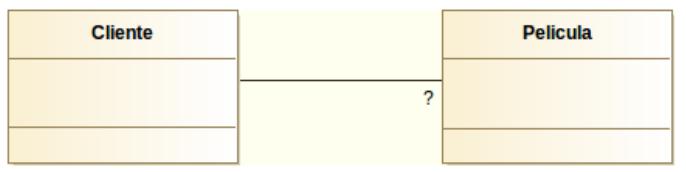{ width="420" }
      <figcaption>Punto de partida: una línea de asociación sin ningún dato todavía. No dice nada sobre cuántos objetos ni qué papel juega cada clase.</figcaption>
    </figure>

=== "2. Rol en un extremo"
    <figure markdown="span">
      { width="420" }
      <figcaption>Se ha añadido el rol "cliente" con multiplicidad 1: cada Pedido conoce a exactamente un Cliente.</figcaption>
    </figure>

=== "3. Unidireccional completa"
    <figure markdown="span">
      { width="420" }
      <figcaption>Con la flecha añadida y el rol "pedidos" (multiplicidad *): Cliente conoce a sus Pedidos, la relación ya es unidireccional.</figcaption>
    </figure>

=== "4. Bidireccional con ambos roles"
    <figure markdown="span">
      { width="420" }
      <figcaption>Con rol y multiplicidad en los dos extremos y sin flecha: ambas clases se conocen mutuamente.</figcaption>
    </figure>
</div>

!!! warning "Error frecuente"
    Si ya has dibujado la relación con su rol, **no vuelvas a añadir ese atributo dentro de la clase**. La relación ya lo representa.

    <figure markdown="span">
      { width="420" }
      <figcaption>Incorrecto: el rol "pedidos" ya está en la línea de asociación, así que no debe repetirse como atributo dentro de Cliente.</figcaption>
    </figure>

!!! tip "En DIA — configurar roles y multiplicidad"
    Haz **doble clic sobre la línea de asociación** para abrir sus propiedades. Verás dos columnas, **Side A** y **Side B**, donde puedes escribir el rol y la multiplicidad de cada extremo. También puedes controlar si se muestra la flecha en cada lado con el campo *Mostrar flecha*.

    <figure markdown="span">
      { width="360" }
      <figcaption>Propiedades de la asociación en DIA: los campos "Side A" y "Side B" permiten configurar rol, multiplicidad y si se muestra la flecha.</figcaption>
    </figure>

### Multiplicidad

Indica cuántos objetos de una clase pueden relacionarse con los de la otra. Se escribe en cada extremo de la línea, y se traduce directamente en cómo declaras el atributo en Java: si el máximo es 1 guardas una referencia simple, si es "muchos" guardas una colección.

| Notación | Significado | Cómo se traduce en Java |
|---|---|---|
| `1` / `1..1` | Exactamente uno | `private Pelicula pelicula;` |
| `0..1` | Cero o uno | `private Pelicula pelicula;` (puede quedar a `null`) |
| `*` / `0..*` | Cero o más, sin límite | `private List<Pelicula> peliculas;` |
| `0..3` | Entre cero y tres | `private List<Pelicula> peliculas;` // validar máximo 3 |
| `2..3` | Entre dos y tres | `private List<Pelicula> peliculas;` // validar mínimo 2, máximo 3 |

!!! warning "Error frecuente"
    La cardinalidad `N` o `M` **no existe en UML** — eso es del modelo Entidad-Relación. En UML siempre se usa `*` para "muchos".

---

## 2. Generalización (Herencia)

Permite crear una clase hija que hereda los atributos y métodos de la clase padre. Se lee como *"ClaseB es un tipo de ClaseA"*.

Se representa con una **línea sólida y una flecha triangular hueca** apuntando desde la hija hacia el padre. Un ejemplo con una jerarquía de personas en un centro educativo, renderizado en DIA:

<figure markdown="span">
  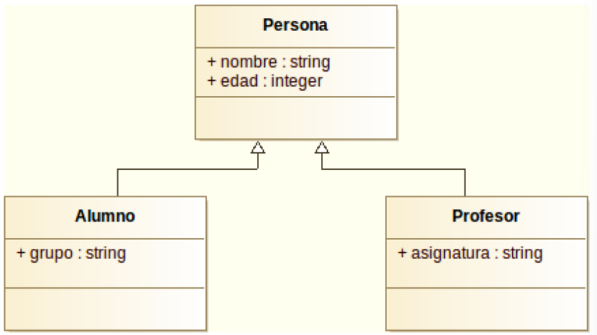{ width="480" }
  <figcaption>Alumno y Profesor heredan nombre y edad de Persona, y añaden solo lo que les es propio.</figcaption>
</figure>

El código Java es una traducción casi directa del diagrama:

```java
public class Persona {
    public String nombre;
    public int edad;
}

public class Alumno extends Persona {
    public String grupo;
}

public class Profesor extends Persona {
    public String asignatura;
}
```

!!! warning "Error frecuente"
    Si un atributo está en la clase padre, **no lo repitas en las hijas**. Lo heredan automáticamente.

!!! note "Herencia con varios niveles"
    La herencia se puede encadenar en más de un nivel: una clase hija puede a su vez tener sus propias clases hijas. Por ejemplo, `Persona` → `Empleado` → `Directivo`, donde `Directivo` hereda de `Empleado` lo que `Empleado` ya heredó de `Persona`.

    <figure markdown="span">
      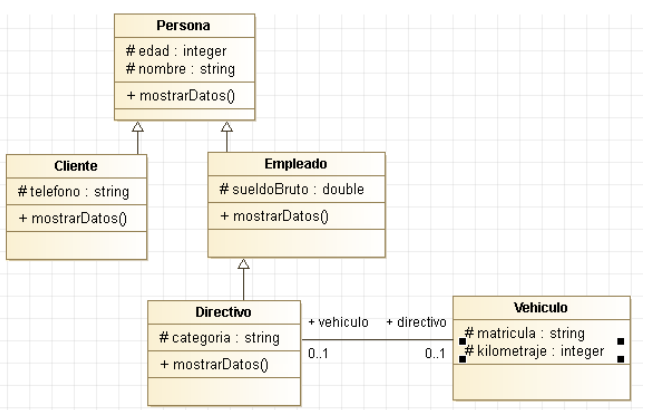{ width="480" }
      <figcaption>Persona es padre de Cliente y Empleado; Empleado es a su vez padre de Directivo. Directivo, además, tiene una asociación con Vehiculo (un directivo puede tener asignado un coche de empresa).</figcaption>
    </figure>

### Clases y métodos abstractos

Una clase abstracta tiene al menos un método sin implementar. No se puede instanciar directamente. En UML, tanto la clase como sus métodos abstractos se escriben **en cursiva**, como en este ejemplo con `FiguraGeometrica`, `Circulo` y `Rectangulo`:

<figure markdown="span">
  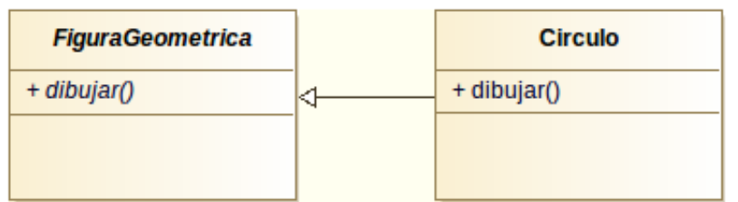{ width="420" }
  <figcaption>FiguraGeometrica y su método dibujar() aparecen en cursiva porque son abstractos. Circulo hereda de ella y sí implementa dibujar().</figcaption>
</figure>

El código de una clase abstracta declara el método sin cuerpo, dejando su implementación a las clases hijas:

```java
// FiguraGeometrica.java
abstract class FiguraGeometrica {
    abstract void dibujar();
}
```

```java
// Circulo.java
class Circulo extends FiguraGeometrica {
    void dibujar() {
        // código para dibujar Circulo
    }
}
```

!!! tip "Recuerda"
    No puedes escribir `new FiguraGeometrica()` porque tiene un método sin implementar. Solo puedes instanciar `Circulo`, `Rectangulo` o cualquier otra clase hija que sí implemente `dibujar()`.

---

!!! tip "En DIA — generalización"
    El icono de generalización en la paleta UML es una **flecha con punta triangular hueca**.

    <figure markdown="span">
      { width="340" }
      <figcaption>Icono de generalización en la paleta UML de DIA: flecha con punta triangular hueca</figcaption>
    </figure>

---

## 3. Realización (Interfaces)

Una **interfaz** es como una clase abstracta pura: define qué métodos debe tener una clase, pero no los implementa. En Java, se usa `implements`.

La realización se representa con una **línea discontinua y una flecha triangular hueca** que va desde las clases que implementan hacia la interfaz. Así se ve con la interfaz `List` y tres de sus implementaciones habituales:

<figure markdown="span">
  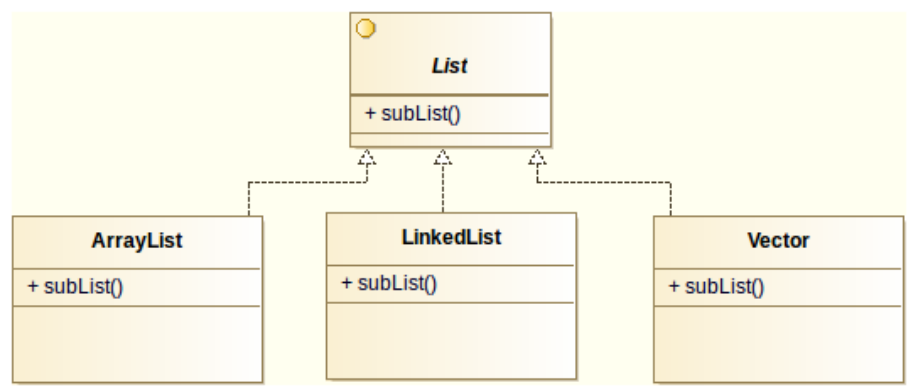{ width="480" }
  <figcaption>Las tres clases realizan (implementan) la interfaz List, cada una con su propia versión interna de los mismos métodos.</figcaption>
</figure>

Un ejemplo más pequeño y fácil de seguir entero, con interfaz propia en vez de una de la librería estándar: una interfaz `Hablador` con dos clases que la implementan cada una a su manera.

<figure markdown="span">
  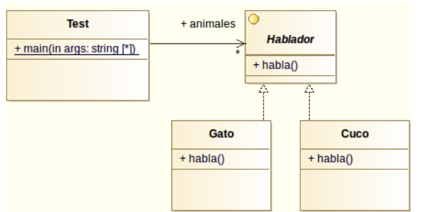{ width="480" }
  <figcaption>Test guarda una lista de Hablador. Gato y Cuco realizan la interfaz, cada uno con su propia versión de habla().</figcaption>
</figure>

El código completo, con un `main()` que recorre la lista y llama a `habla()` sobre cada animal sin saber de qué tipo concreto es:

```java
interface Hablador {
    public void habla();
}

class Gato implements Hablador {
    public void habla() {
        System.out.println("Miau");
    }
}

class Cuco implements Hablador {
    public void habla() {
        System.out.println("Cu cu");
    }
}

public class Test {
    public static List<Hablador> animales = new ArrayList<Hablador>();
    public static void main(String[] args) {
        animales.add(new Gato());
        animales.add(new Cuco());

        Iterator<Hablador> i = animales.iterator();
        while (i.hasNext()) {
            Hablador animal = i.next();
            animal.habla();
        }
    }
}
```

`Test` nunca pregunta si el animal es un `Gato` o un `Cuco`: solo sabe que es un `Hablador` y le llama a `habla()`. Cada objeto responde con su propia versión del método ("Miau" o "Cu cu") sin que `Test` tenga que distinguirlos. Esto es **polimorfismo**: mismo mensaje, comportamiento distinto según el objeto real.

---

!!! tip "En DIA — realización"
    El icono de realización en la paleta UML es una **línea discontinua con triángulo**.

    <figure markdown="span">
      { width="340" }
      <figcaption>Icono de realización en la paleta UML de DIA: línea discontinua con triángulo hueco</figcaption>
    </figure>

---

## 4. Agregación

Relación "todo–parte" donde las partes **pueden existir sin el todo**. El rombo va siempre en el lado del **todo**, como en este ejemplo entre un coche y sus ruedas:

<figure markdown="span">
  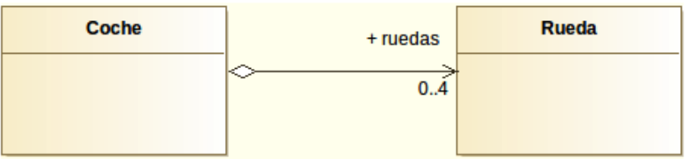{ width="420" }
  <figcaption>Coche agrega Ruedas (rombo hueco en el lado de Coche, que es el "todo"). Si desmontas las ruedas, siguen existiendo como piezas sueltas.</figcaption>
</figure>

---

## 5. Composición

Igual que la agregación pero las partes **no pueden existir sin el todo**. Rombo relleno en el lado del **todo**, como en esta relación entre una empresa y sus departamentos:

<figure markdown="span">
  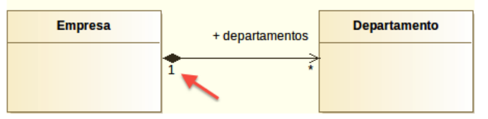{ width="420" }
  <figcaption>El rombo relleno está en el lado de Empresa (el "todo"): si la empresa desaparece, sus departamentos desaparecen con ella.</figcaption>
</figure>

!!! warning "Error frecuente"
    Tanto el rombo de agregación como el de composición van **en el lado del todo**, no en el de la parte.

---

!!! tip "En DIA — composición"
    En DIA solo existe el icono de **Agregación** (rombo hueco). Para convertirla en composición, crea la agregación primero y después haz **doble clic sobre la línea** → campo *Tipo* → selecciona **Composición** en el desplegable.

    <figure markdown="span">
      { width="260" }
      <figcaption>Icono de agregación (rombo hueco) en la paleta UML de DIA</figcaption>
    </figure>

    Una vez dibujada la línea de agregación, cambia su tipo desde sus propiedades:

    <figure markdown="span">
      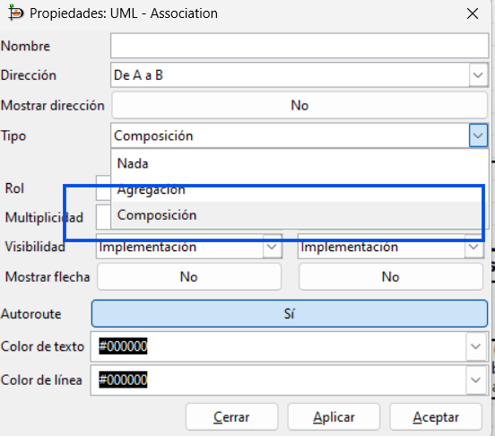{ width="360" }
      <figcaption>Para convertir una agregación en composición, haz doble clic sobre la línea → campo "Tipo" → selecciona "Composición"</figcaption>
    </figure>

---

## 6. Dependencia

Una clase usa a otra **de forma temporal** (como parámetro, variable local o tipo de retorno de un método), pero sin guardar una referencia permanente. Si la clase B cambia, puede afectar a A.

Se representa con una **línea discontinua con una flecha en "V"**. `Mapa` tiene métodos que reciben o devuelven `Coordenadas`, pero no la guarda como atributo:

<figure markdown="span">
  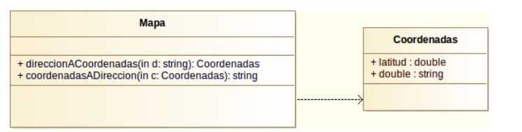{ width="420" }
  <figcaption>Mapa depende de Coordenadas porque la usa como parámetro y como tipo de retorno, pero no la guarda en ningún atributo.</figcaption>
</figure>

```java
public class Coordenadas {
    public double latitud;
    public double longitud;
}
```

```java
public class Mapa {
    /**
     * Devuelve coordenadas a partir de dirección postal
     * @param d dirección postal
     * @return coordenadas
     */
    public Coordenadas direccionACoordenadas(String d) {
        // ...
    }

    /**
     * Devuelve dirección postal a partir de coordenadas
     * @param c coordenadas
     * @return dirección postal
     */
    public String coordenadasADireccion(Coordenadas c) {
        // ...
    }
}
```

Fíjate en que ni `direccionACoordenadas` ni `coordenadasADireccion` guardan la `Coordenadas` recibida o devuelta en ningún campo de `Mapa`: la usan de paso, y con eso ya basta para que exista dependencia.

!!! tip "Recuerda"
    Si la clase **guarda** la referencia en un atributo, es una asociación (o agregación/composición). Si solo la usa puntualmente, es una dependencia.

!!! tip "En DIA — dependencia"
    El icono de dependencia en la paleta UML es una **línea punteada con flecha en "V"**.

<figure markdown="span">
  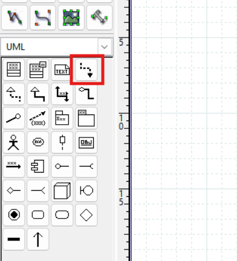{ width="260" }
  <figcaption>Icono de dependencia en la paleta UML de DIA: línea punteada con flecha en "V".</figcaption>
</figure>

---

## 7. Clase asociativa

Cuando una relación tiene sus propios atributos o métodos, se representa como una clase unida a la línea de asociación con una línea discontinua. La matrícula no pertenece ni solo al alumno ni solo a la asignatura: pertenece a la relación entre ambos.

<figure markdown="span">
  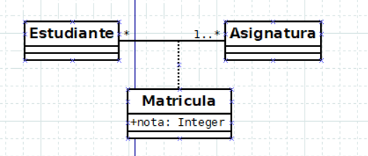{ width="420" }
  <figcaption>Matricula cuelga con línea discontinua de la asociación entre Estudiante y Asignatura, y guarda el atributo "nota" que no pertenece a ninguna de las dos clases por separado.</figcaption>
</figure>

!!! tip "En DIA — clase asociativa"
    DIA no tiene un elemento específico para esto. El procedimiento es:

    1. Dibuja las dos clases con su asociación normal.
    2. Crea la clase adicional (la que representa la relación).
    3. Usa la herramienta de **línea estándar** (paleta de herramientas generales, no la paleta UML) para unir esa clase a la línea de asociación.
    4. Haz doble clic sobre esa línea → cambia el *Estilo de la línea* a **discontinuo** (punteado).

    <figure markdown="span">
      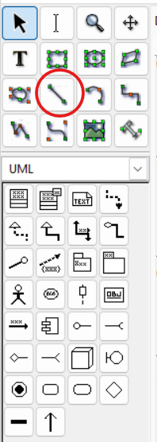{ width="260" }
      <figcaption>Herramienta de línea estándar (paleta general, no la UML) para unir la clase asociativa a la línea de relación</figcaption>
    </figure>

    Después, cambia el estilo de esa línea a discontinuo desde sus propiedades:

    <figure markdown="span">
      { width="320" }
      <figcaption>Cambiar el estilo de la línea a "discontinuo" en sus propiedades para completar la clase asociativa</figcaption>
    </figure>

---

## 8. ¿Generalización o realización?

Ambas representan relaciones entre clases, pero tienen un uso diferente:

| | Generalización (herencia) | Realización (interfaz) |
|---|---|---|
| Palabra clave Java | `extends` | `implements` |
| ¿Cuántas puede tener una clase? | **Solo una** clase padre | **Múltiples** interfaces |
| La clase padre tiene implementación | Sí (puede tener métodos con código) | No (la interfaz solo declara la firma) |
| Cuándo usarla | La clase hija **es un tipo de** la padre | La clase **promete comportarse** según el contrato |

!!! warning "Regla práctica"
    Si necesitas que una clase tenga comportamiento de varios tipos distintos, usa interfaces (realización). Java solo permite heredar de **una** clase padre, pero puedes implementar **tantas interfaces como quieras**: un `BarcoMercante` podría realizar a la vez `VehiculoMaritimo` y `VehiculoMercancias`, algo imposible con herencia.

---

## 9. ¿Clase abstracta o interfaz?

Tanto las clases abstractas como las interfaces definen métodos que deben implementar las subclases. La diferencia principal es:

| | Clase abstracta | Interfaz |
|---|---|---|
| Puede tener atributos de instancia | ✅ Sí | ❌ No (solo `static final`) |
| Puede tener métodos con implementación | ✅ Sí | ❌ No (en Java < 8) |
| Una clase puede extender / implementar | Solo **una** | **Varias** |
| Relación UML | Generalización (línea sólida) | Realización (línea discontinua) |

Elige clase abstracta cuando las subclases **comparten código** (atributos y métodos ya implementados). Elige interfaz cuando solo quieras **garantizar que un comportamiento existe**, sin importar cómo se implementa.
