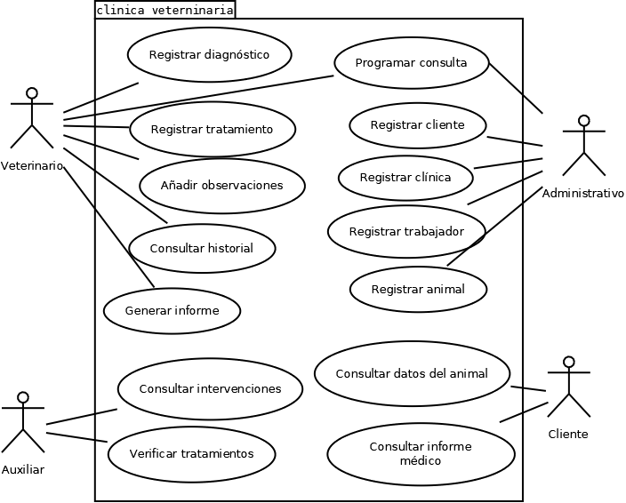

# Actividad 6.2: Leer un diagrama de casos de uso

!!! warning "Descarga la plantilla"
    📄 [Plantilla 6.2 — Leer un diagrama de casos de uso](plantillas/Actividad_6_2_Plantilla.docx){target="_blank" rel="noopener"}

## Qué vas a practicar

Antes de dibujar tus propios casos de uso, tienes que saber leerlos: es lo que harás cuando te incorpores a un proyecto donde el análisis ya está hecho. Aquí tienes el diagrama de casos de uso del sistema de la clínica veterinaria que modelaste en la actividad 5.7 — el mismo sistema, visto ahora desde el comportamiento.

## El diagrama

<figure markdown="span">
  
  <figcaption>Diagrama de casos de uso del sistema de la clínica veterinaria.</figcaption>
</figure>

---

## Lo que tienes que hacer

**Paso 1.** Rellena la tabla de la plantilla: para cada actor, lista **todos los casos de uso** con los que tiene relación de comunicación.

**Pregunta 1.** ¿Hay algún caso de uso compartido por más de un actor? ¿Cuál(es)? ¿Qué significa en la práctica que dos actores se comuniquen con el mismo caso de uso?

**Pregunta 2.** El actor `Cliente` solo puede hacer dos cosas. ¿Cuáles? ¿Te parece razonable que no pueda, por ejemplo, programar una consulta directamente? Argumenta pensando en cómo funciona una clínica real.

**Pregunta 3.** Escribe la **descripción narrativa** del caso de uso "Programar consulta": quién lo inicia, cuál es su **escenario principal** (pasos del camino donde todo va bien) y al menos **dos escenarios alternativos** (qué puede torcerse y qué hace el sistema).

**Pregunta 4.** Este diagrama no usa `«include»` ni `«extend»`. Propón una mejora de cada tipo:

- Un `«include»` que tenga sentido (piensa en algo que varios casos de uso necesiten siempre).
- Un `«extend»` que tenga sentido (algo que ocurra solo a veces, bajo una condición).

Indica entre qué casos de uso irían y hacia dónde apuntaría cada flecha.

**Pregunta 5.** El rectángulo que encierra los casos de uso deja fuera a los cuatro actores. ¿Qué representa ese rectángulo y por qué los actores quedan siempre fuera?

---

## 📤 Entregable

Rellena la plantilla y entrégala en **PDF**:

1. La tabla actor → casos de uso completa.
2. Las respuestas a las preguntas 1-5.

!!! warning "Corrección oral"
    El profesor puede señalar cualquier elemento del diagrama y pedirte que lo interpretes en voz alta. Si no puedes explicarlo, la actividad no se supera.

## ✅ Criterios de corrección

- La tabla refleja exactamente las relaciones de comunicación del diagrama, sin inventar ni omitir.
- La descripción narrativa distingue con claridad el escenario principal de los alternativos.
- El `«include»` y el `«extend»` propuestos respetan el significado de cada relación y la dirección correcta de la flecha.
- Las respuestas razonan sobre este sistema concreto, no con definiciones genéricas.
