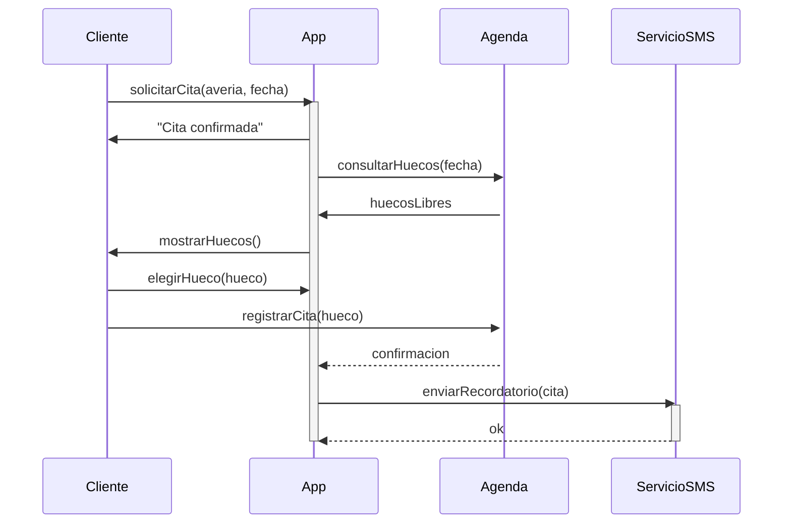

# Actividad 6.4: Caza de errores en un diagrama de secuencia

!!! warning "Descarga la plantilla"
    📄 [Plantilla 6.4 — Caza de errores en secuencia](plantillas/Actividad_6_4_Plantilla.docx){target="_blank" rel="noopener"}

## Qué vas a practicar

Interpretar un diagrama de secuencia con lupa: comparar lo que dice el enunciado con lo que el diagrama realmente cuenta. El diagrama que ha entregado tu compañero ficticio **contiene errores deliberados**, algunos de notación y otros de lógica del proceso.

---

## El enunciado que recibió tu compañero

Una app de taller mecánico permite reservar cita:

1. El cliente solicita una cita desde la **App**, indicando avería y fecha deseada.
2. La App **consulta los huecos disponibles a la Agenda** y espera su respuesta para continuar.
3. La Agenda devuelve los huecos libres.
4. La App muestra los huecos al cliente, que elige uno.
5. La App **registra la cita en la Agenda** (necesita la confirmación antes de seguir).
6. Una vez confirmada, la App **encarga al ServicioSMS el envío del recordatorio** y no espera a que termine: el SMS sale cuando salga.
7. La App muestra al cliente el mensaje "Cita confirmada".

## El diagrama entregado

!!! note "Hay al menos 6 errores"
    Compara el diagrama con el enunciado paso a paso. Cuenta como error tanto la notación mal usada como los mensajes que contradicen el proceso descrito.

---

## Lo que tienes que hacer

**Paso 1.** Localiza los errores. Para cada uno rellena una fila de la tabla de la plantilla: **dónde está** (mensaje u objeto implicado), **por qué es un error** (cita la regla de notación o el paso del enunciado que incumple) y **cómo se corrige**.

**Paso 2.** Clasifica cada error como **de notación** (mal dibujado) o **de lógica** (contradice el proceso).

**Paso 3.** Dibuja en DIA el diagrama de secuencia correcto completo y exporta la imagen.

**Pregunta 1.** El paso 6 del enunciado dice que la App "no espera" al ServicioSMS. ¿Qué tipo de mensaje corresponde y cómo se dibuja de forma distinta al del paso 2, donde la App sí espera?

**Pregunta 2.** La activación de la `Agenda` se abre pero no se cierra nunca. ¿Qué significaría eso literalmente si fuera cierto, y por qué es un error aquí?

---

## 📤 Entregable

Rellena la plantilla y entrégala en **PDF**:

1. La tabla de errores completa (dónde, por qué, corrección, tipo).
2. Captura del diagrama corregido hecho en DIA.
3. Respuestas a las preguntas 1 y 2.

!!! warning "Corrección oral"
    El profesor puede señalarte cualquier mensaje del diagrama (correcto o incorrecto) y pedirte que expliques por qué lo has dejado o cambiado. Si no puedes justificarlo, la actividad no se supera.

## ✅ Criterios de corrección

- Se han localizado todos los errores, sin marcar como error cosas que están bien.
- Cada justificación cita el paso del enunciado o la regla de notación incumplida.
- El diagrama corregido respeta el orden cronológico, los tipos de mensaje y las activaciones.
