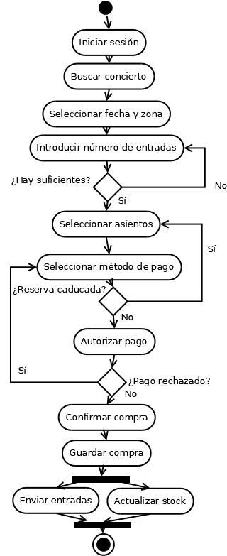

# Actividad 6.7: Diagramas de actividad — leer y construir

!!! warning "Descarga la plantilla"
    📄 [Plantilla 6.7 — Diagramas de actividad](plantillas/Actividad_6_7_Plantilla.docx){target="_blank" rel="noopener"}

## Qué vas a practicar

Las dos caras del diagrama de actividad: primero interpretar uno ya hecho (seguir el flujo con casos concretos, como haría un depurador) y después construir los tuyos con decisiones y procesos en paralelo.

---

## Parte A — Interpretar: compra de entradas para un concierto

Este diagrama modela el proceso de compra de entradas en una plataforma online:

<figure markdown="span">
  
  <figcaption>Diagrama de actividad: compra de entradas para un concierto.</figcaption>
</figure>

**Paso 1.** Recorre el diagrama con el dedo y responde en la plantilla:

**Pregunta A.1.** Un usuario pide 6 entradas y solo quedan 4. ¿Qué camino sigue el flujo exactamente? ¿En qué actividad acaba de nuevo?

**Pregunta A.2.** Un usuario llega a "Seleccionar método de pago" pero tarda tanto que su reserva caduca. ¿A qué actividad vuelve? ¿Y si en vez de caducar la reserva, lo que ocurre es que el pago es rechazado?

**Pregunta A.3.** Después de "Guardar compra" hay una barra gruesa de la que salen dos actividades. ¿Qué significa esa barra? ¿"Enviar entradas" y "Actualizar stock" ocurren en algún orden concreto? ¿Qué exige la segunda barra antes de llegar al nodo final?

**Pregunta A.4.** ¿Cuántos nodos de decisión tiene el diagrama y cuántos caminos de "vuelta atrás" (bucles) existen en total? Enuméralos.

---

## Parte B — Construir: registro en una app móvil

Modela en DIA el proceso que sigue un usuario para registrarse en una aplicación móvil. El flujo debe contemplar la verificación por correo, el registro en base de datos y las tareas que pueden realizarse de forma simultánea:

1. El usuario abre la app y selecciona "Registrarse".
2. Rellena el formulario de datos y lo envía.
3. El sistema valida los datos. Si hay errores, notifica al usuario y vuelve al formulario.
4. Si los datos son válidos, se activan **dos procesos concurrentes**: enviar el correo de verificación y guardar los datos del usuario en la base de datos.
5. Cuando ambos procesos terminan, el sistema espera a que el usuario verifique el correo.
6. Si el correo no se verifica, se cancela el registro; si se verifica, se crea la sesión y el usuario entra en la app.

!!! warning "Predicción antes de dibujar"
    Antes de abrir DIA, anota: ¿cuántos nodos de fin tendrá tu diagrama y a qué situación corresponde cada uno? ¿Cuántas barras de sincronización necesitas?

**Pregunta B.1.** ¿Qué elemento has usado para los dos procesos en paralelo del paso 4 y qué garantiza la barra de cierre antes del paso 5?

**Pregunta B.2.** ¿Cuántos nodos de fin tiene tu diagrama? ¿Ha coincidido con tu predicción?

---

## Parte C — Construir: compra en una tienda online

Modela el flujo de actividades que realiza un cliente al hacer una compra en una tienda online, desde que entra a la web hasta que finaliza el pedido:

1. El cliente accede a la tienda.
2. Visualiza productos y puede agregarlos o no al carrito. Si no agrega ninguno, el proceso termina.
3. Si agrega productos, pasa a la pantalla de pago.
4. Puede elegir entre pagar con tarjeta o con PayPal.
5. Si el pago es exitoso, se confirma el pedido y el proceso termina.
6. Si el pago falla, se muestra un mensaje de error y el cliente puede intentarlo de nuevo o cancelar.

**Pregunta C.1.** El paso 4 tiene dos opciones de pago. ¿Has usado un nodo de decisión o dos actividades separadas? ¿Por qué?

**Pregunta C.2.** ¿El nodo de fin del camino de cancelación es el mismo que el del pedido confirmado? Justifica tu elección.

**Pregunta C.3.** Si el pago fallara tres veces seguidas y hubiera que bloquear la cuenta automáticamente, ¿qué necesitarías añadir al diagrama? Descríbelo (no hace falta redibujar).

---

## 📤 Entregable

Rellena la plantilla y entrégala en **PDF**:

1. Respuestas A.1 a A.4 (interpretación del diagrama dado).
2. Predicción de la Parte B escrita **antes** de dibujar.
3. Capturas de los diagramas de las Partes B y C hechos en DIA.
4. Respuestas B.1, B.2, C.1, C.2 y C.3.

!!! warning "Corrección oral"
    El profesor puede darte una entrada concreta ("5 entradas, pago rechazado dos veces") y pedirte que recorras el diagrama en voz alta, o que justifiques cualquier elemento de los tuyos. Si no puedes hacerlo, la actividad no se supera.

## ✅ Criterios de corrección

- Las respuestas de la Parte A describen el camino exacto del flujo, actividad por actividad.
- En B y C: inicio, actividades, decisiones con guardas `[condición]`, concurrencia bien abierta y cerrada, y nodos de fin correctos.
- El flujo es coherente: sin flechas sueltas ni caminos sin salida.
