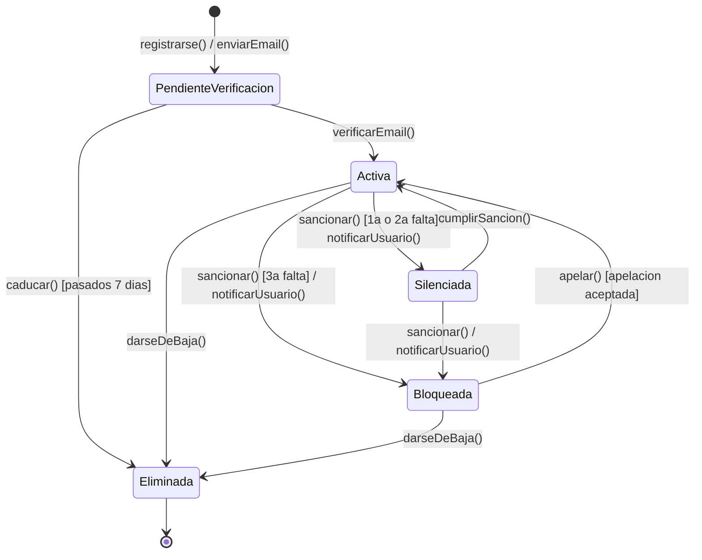

# Actividad 6.8: Diagramas de estados — leer y plantear

!!! warning "Descarga la plantilla"
    📄 [Plantilla 6.8 — Diagramas de estados](plantillas/Actividad_6_8_Plantilla.docx){target="_blank" rel="noopener"}

## Qué vas a practicar

El último diagrama del tema, con sus dos destrezas: interpretar un diagrama de estados ya hecho (decidir qué secuencias de eventos son posibles y cuáles no) y plantear los tuyos, incluida la sintaxis completa de las transiciones: `evento [condición] / acción`.

---

## Parte A — Interpretar: cuenta de usuario en un foro

Este diagrama modela el ciclo de vida de una cuenta de usuario en un foro:

**Paso 1.** Responde en la plantilla:

**Pregunta A.1.** Para cada una de estas secuencias de eventos, indica si es **posible o imposible** según el diagrama, y en qué estado acaba la cuenta si es posible:

- a) `registrarse() → verificarEmail() → sancionar() → cumplirSancion() → darseDeBaja()`
- b) `registrarse() → sancionar()`
- c) `registrarse() → verificarEmail() → sancionar() → sancionar() → apelar()`
- d) `registrarse() → caducar() → verificarEmail()`

**Pregunta A.2.** ¿Puede una cuenta `Silenciada` darse de baja directamente? ¿Qué tendría que añadirse al diagrama para permitirlo?

**Pregunta A.3.** La transición de `Activa` a `Bloqueada` y la de `Activa` a `Silenciada` se disparan con el mismo evento (`sancionar()`). ¿Qué elemento de la transición decide cuál de las dos se toma? Escribe la sintaxis completa de una de ellas identificando sus tres partes.

**Pregunta A.4.** ¿Qué acción se ejecuta cada vez que la cuenta es sancionada, independientemente del estado al que vaya? ¿En qué parte de la etiqueta de transición se indica?

---

## Parte B — Plantear: documento en un gestor de contenidos

Modela en DIA el ciclo de vida de un documento en un gestor de contenidos:

- Al crearse, el documento está en **Borrador**.
- Desde Borrador, el autor puede **enviarlo a revisión** (pasa a *En revisión*) o **descartarlo** (fin del ciclo de vida).
- En revisión, el revisor puede **aprobarlo** (pasa a *Publicado*, y al publicarse se notifica al autor) o **rechazarlo** (vuelve a Borrador, con la acción de adjuntar comentarios).
- Un documento Publicado puede ser **archivado**, pero solo si lleva publicado más de 30 días.
- Desde Archivado se puede **restaurar** (vuelve a Publicado) o **eliminar definitivamente** (fin del ciclo de vida).

Usa la sintaxis completa `evento [condición] / acción` donde el enunciado lo pida.

**Pregunta B.1.** ¿Cuántos caminos llevan al estado final en tu diagrama? ¿Desde qué estados?

**Pregunta B.2.** ¿Dónde has usado una condición de guarda y dónde una acción? Escribe las etiquetas completas de esas transiciones.

---

## Parte C — Plantear: un objeto de tu entorno

**Paso final.** Elige un objeto real de tu día a día cuyo comportamiento cambie según su situación (tus auriculares inalámbricos, la lavadora de tu casa, tu cuenta de una app concreta, la puerta del garaje...). No vale ninguno de los ejemplos de los apuntes ni de esta actividad.

Modela su diagrama de estados en DIA con:

- Al menos **4 estados** con nombres que sean situaciones (sustantivos/adjetivos), no acciones.
- Al menos **una condición de guarda** y **una acción** en las transiciones.
- Estado inicial y al menos un estado final (si tu objeto lo tiene; si no lo tiene, explica por qué su ciclo no termina).

**Pregunta C.1.** Explica en 3-4 frases por qué has elegido esos estados y qué evento real dispara cada transición.

---

## 📤 Entregable

Rellena la plantilla y entrégala en **PDF**:

1. Respuestas A.1 a A.4 (interpretación).
2. Captura del diagrama de la Parte B hecho en DIA y respuestas B.1 y B.2.
3. Captura del diagrama de tu objeto (Parte C) y respuesta C.1.

!!! warning "Corrección oral"
    El profesor puede proponerte una secuencia de eventos sobre cualquiera de los tres diagramas y pedirte que digas en qué estado acaba, o si es imposible y por qué. Si no puedes hacerlo, la actividad no se supera.

## ✅ Criterios de corrección

- Las respuestas de la Parte A siguen el diagrama transición a transición, sin inventar caminos.
- En B y C: los estados son situaciones (no acciones), las transiciones llevan evento y, donde toca, `[condición]` y `/ acción` con la sintaxis correcta.
- El diagrama de la Parte C es personal y sus decisiones están justificadas.
