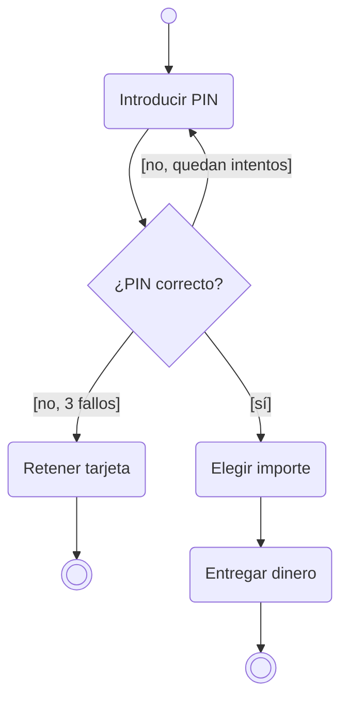

# 4. Diagrama de actividades

{ type=application/pdf style="width:100%;min-height:80vh" }

!!!info "Descarga de diapositivas"
    [Descarga las diapositivas](diapositivas/actividades.pptx){target="_blank" rel="noopener"}

---

## ¿Para qué sirve?

!!! info "Idea clave"
    Es el diagrama de flujo de toda la vida, con uniforme UML: un proceso de principio a fin, con sus decisiones, sus bucles y sus tareas en paralelo.

Un diagrama de actividad describe el **flujo de un proceso o algoritmo** paso a paso. Si ya has hecho diagramas de flujo en Programación, este te resultará familiar: cambia la notación, no la idea.

Se usa principalmente para modelar:

- **Procesos de negocio**: el flujo de una compra, una reserva, una tramitación
- **Lógica de algoritmos**: los pasos de un método complejo
- **Flujos de casos de uso**: cómo se desarrolla un caso de uso en detalle
- **Comportamiento de métodos**: cuando la lógica es difícil de entender solo con el código

Uno pequeño para empezar — sacar dinero de un cajero — con decisión, bucle y dos finales distintos:

Fíjate en que las condiciones van entre corchetes en las flechas de salida del rombo, y en que un camino puede volver atrás (el bucle del PIN) o terminar en un final propio. Ahora sí, pieza a pieza.

---

## Elementos del diagrama

### Inicio

Círculo negro sólido. Indica el comienzo del flujo. Solo puede haber uno.

!!! tip "En DIA — icono de inicio"
    <figure markdown="span">
      
      <figcaption>Icono de nodo inicial (círculo negro) en la paleta UML de DIA</figcaption>
    </figure>

### Actividad

Rectángulo con esquinas redondeadas. Representa una **tarea o acción** concreta. El nombre suele ser un verbo en infinitivo: "Verificar stock", "Enviar notificación".

!!! tip "En DIA — icono de actividad"
    <figure markdown="span">
      
      <figcaption>Icono de actividad (rectángulo redondeado) en la paleta UML de DIA</figcaption>
    </figure>

### Decisión

Rombo. Indica un **punto de bifurcación** donde el flujo toma un camino u otro según una condición. Cada condición se escribe entre corchetes en su flecha de salida —`[sí]`, `[no]`, `[stock > 0]`— y se llama **condición de guarda**: "guarda" el camino y solo deja pasar el flujo si es verdadera. Volverás a ver este término en el diagrama de estados.

!!! tip "En DIA — icono de decisión"
    <figure markdown="span">
      
      <figcaption>Icono de decisión (rombo hueco) en la paleta UML de DIA</figcaption>
    </figure>

### Flujo

Flechas que conectan los elementos e indican la **dirección del proceso**.

!!! tip "En DIA — icono de transición"
    <figure markdown="span">
      
      <figcaption>Herramienta de transición (flecha) para conectar elementos en DIA</figcaption>
    </figure>

### Concurrencia

Barras horizontales gruesas. Indican el **inicio o final de procesos paralelos**. Cuando el flujo pasa por una barra de inicio, se divide en varias ramas que se ejecutan a la vez; cuando llega a la barra de fin, se espera a que todas las ramas terminen para continuar.

!!! tip "En DIA — barra de sincronización"
    <figure markdown="span">
      
      <figcaption>Barra de sincronización (fork/join) en la paleta UML de DIA</figcaption>
    </figure>

### Fin

Círculo con borde grueso (círculo dentro de otro). Indica la **finalización del flujo**. Puede haber varios nodos de fin en un mismo diagrama.

!!! tip "En DIA — nodo final"
    El nodo de fin se crea con el mismo icono que el de inicio. Para convertirlo en final, haz **doble clic** sobre él → campo **"Es final"** → **Sí**.

    <figure markdown="span">
      
      <figcaption>Propiedades del nodo de estado final en DIA: activar "Es final: Sí"</figcaption>
    </figure>

---

??? note "Para saber más — no entra en examen ni actividades"

    **Particiones (swimlanes)**

    Cuando intervienen varios responsables, se divide el diagrama en particiones con líneas verticales u horizontales. Cada partición corresponde a un actor (cliente, almacén, contabilidad…). Cada actividad se coloca en la calle del responsable que la ejecuta.

    **Objetos en el diagrama**

    Se pueden representar datos que pasan de una actividad a otra como **objetos** (rectángulos sin redondear). Flecha actividad → objeto: la actividad produce ese dato. Flecha objeto → actividad: la actividad lo consume.

---

## Resumen visual

| Elemento | Forma |
|---|---|
| Inicio | ● (círculo negro) |
| Actividad | Rectángulo redondeado |
| Decisión | ◇ (rombo) |
| Flujo | → (flecha) |
| Concurrencia | ═══ (barra gruesa horizontal) |
| Fin | ⊙ (círculo con borde) |

---

## Ejemplo leído paso a paso: máquina de café

Este diagrama reúne todos los elementos del apartado. Antes de mirar la explicación, intenta seguirlo tú con el dedo desde el círculo negro:

<figure markdown="span">
  
  <figcaption>Diagrama de actividad de una máquina de café: decisión con guardas, concurrencia y barras de sincronización.</figcaption>
</figure>

Lectura del flujo:

1. Tras el inicio, el usuario **elige bebida** e **introduce monedas**: dos actividades en secuencia normal.
2. La primera **barra de sincronización** abre tres ramas que ocurren **a la vez**: se visualiza el mensaje "Sirviendo café", se prepara la bebida y se devuelve el cambio.
3. La rama central pasa por una **ramificación** (rombo) con tres condiciones de guarda: `[café]`, `[capuchino]` o `[cortado]` deciden cuál de las tres actividades de servir se ejecuta. Solo una de ellas, porque las guardas son excluyentes.
4. Un segundo rombo **reagrupa** los tres caminos en uno.
5. La segunda barra de sincronización es el **join**: espera a que las tres ramas paralelas (mensaje, bebida y cambio) hayan terminado. Solo entonces se muestra "Recoja su café" y el flujo llega al nodo final.

!!! tip "Recuerda"
    Rombo y barra se parecen pero no se mezclan: el rombo elige **un** camino entre varios (con guardas); la barra los ejecuta **todos** a la vez (sin guardas). Si te descubres poniendo condiciones en una barra de sincronización, en realidad querías un rombo.
