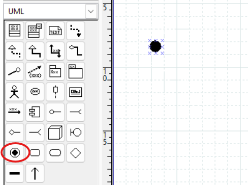
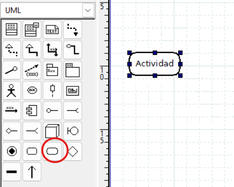
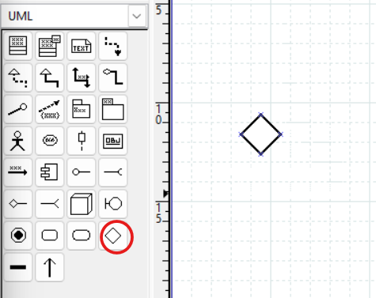
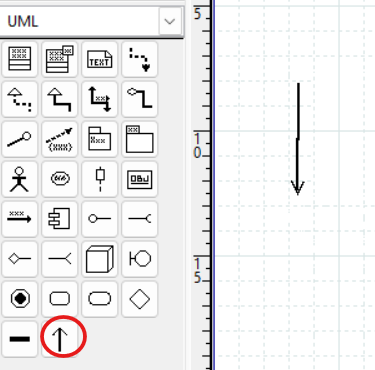
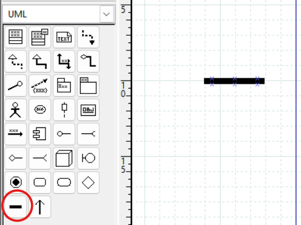
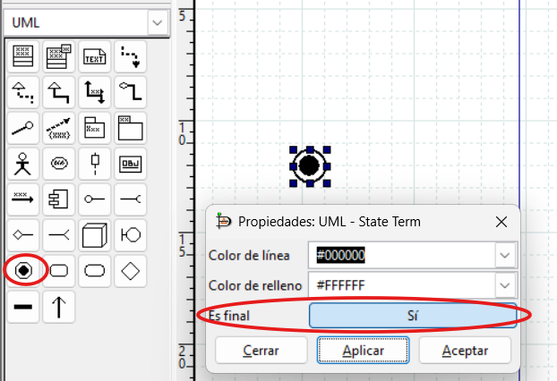
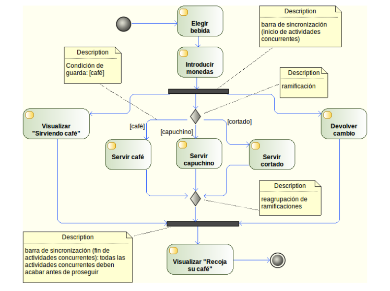

# 4. Diagrama de actividades

{ type=application/pdf style="width:100%;min-height:80vh" }

!!!info "Descarga de diapositivas"
    [Descarga las diapositivas](diapositivas/actividades.pdf){target="_blank" rel="noopener"}

---

## ¿Para qué sirve?

Un diagrama de actividad describe el **flujo de un proceso o algoritmo** paso a paso. Es similar a un diagrama de flujo, pero con notación UML.

Se usa principalmente para modelar:

- **Procesos de negocio**: el flujo de una compra, una reserva, una tramitación
- **Lógica de algoritmos**: los pasos de un método complejo
- **Flujos de casos de uso**: cómo se desarrolla un caso de uso en detalle
- **Comportamiento de métodos**: cuando la lógica es difícil de entender solo con el código

---

## Elementos del diagrama

### Inicio

Círculo negro sólido. Indica el comienzo del flujo. Solo puede haber uno.

!!! tip "En DIA — icono de inicio"
    <figure markdown="span">
      
      <figcaption>Icono de nodo inicial (círculo negro) en la paleta UML de DIA</figcaption>
    </figure>

### Actividad

Rectángulo con esquinas redondeadas. Representa una **tarea o acción** concreta. El nombre suele ser un verbo en infinitivo: "Verificar stock", "Enviar notificación".

!!! tip "En DIA — icono de actividad"
    <figure markdown="span">
      
      <figcaption>Icono de actividad (rectángulo redondeado) en la paleta UML de DIA</figcaption>
    </figure>

### Decisión

Rombo. Indica un **punto de bifurcación** donde el flujo toma un camino u otro según una condición. Las condiciones se escriben entre corchetes en cada flecha de salida: `[sí]`, `[no]`, `[stock > 0]`.

!!! tip "En DIA — icono de decisión"
    <figure markdown="span">
      
      <figcaption>Icono de decisión (rombo hueco) en la paleta UML de DIA</figcaption>
    </figure>

### Flujo

Flechas que conectan los elementos e indican la **dirección del proceso**.

!!! tip "En DIA — icono de transición"
    <figure markdown="span">
      
      <figcaption>Herramienta de transición (flecha) para conectar elementos en DIA</figcaption>
    </figure>

### Concurrencia

Barras horizontales gruesas. Indican el **inicio o final de procesos paralelos**. Cuando el flujo pasa por una barra de inicio, se divide en varias ramas que se ejecutan a la vez; cuando llega a la barra de fin, se espera a que todas las ramas terminen para continuar.

!!! tip "En DIA — barra de sincronización"
    <figure markdown="span">
      
      <figcaption>Barra de sincronización (fork/join) en la paleta UML de DIA</figcaption>
    </figure>

### Fin

Círculo con borde grueso (círculo dentro de otro). Indica la **finalización del flujo**. Puede haber varios nodos de fin en un mismo diagrama.

!!! tip "En DIA — nodo final"
    El nodo de fin se crea con el mismo icono que el de inicio. Para convertirlo en final, haz **doble clic** sobre él → campo **"Es final"** → **Sí**.

    <figure markdown="span">
      
      <figcaption>Propiedades del nodo de estado final en DIA: activar "Es final: Sí"</figcaption>
    </figure>

---

??? note "Para saber más — no entra en examen ni actividades"

    **Particiones (swimlanes)**

    Cuando intervienen varios responsables, se divide el diagrama en particiones con líneas verticales u horizontales. Cada partición corresponde a un actor (cliente, almacén, contabilidad…). Cada actividad se coloca en la calle del responsable que la ejecuta.

    **Objetos en el diagrama**

    Se pueden representar datos que pasan de una actividad a otra como **objetos** (rectángulos sin redondear). Flecha actividad → objeto: la actividad produce ese dato. Flecha objeto → actividad: la actividad lo consume.

---

## Resumen visual

| Elemento | Forma |
|---|---|
| Inicio | ● (círculo negro) |
| Actividad | Rectángulo redondeado |
| Decisión | ◇ (rombo) |
| Flujo | → (flecha) |
| Concurrencia | ═══ (barra gruesa horizontal) |
| Fin | ⊙ (círculo con borde) |

---

## Ejemplo: máquina de café

<figure markdown="span">
  
  <figcaption>Diagrama de actividad de una máquina de café: muestra decisión (qué bebida), concurrencia (ramas paralelas para cada tipo) y la barra de sincronización antes de entregar el resultado.</figcaption>
</figure>
