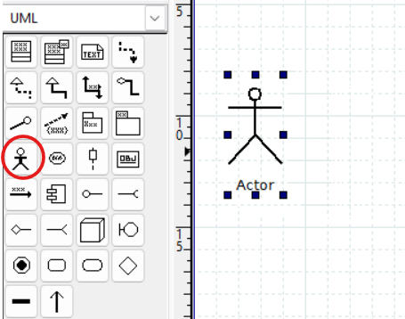
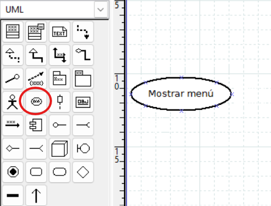
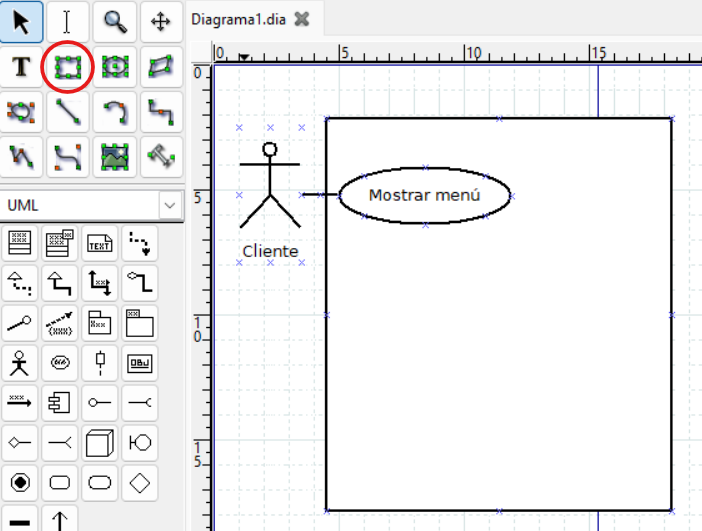
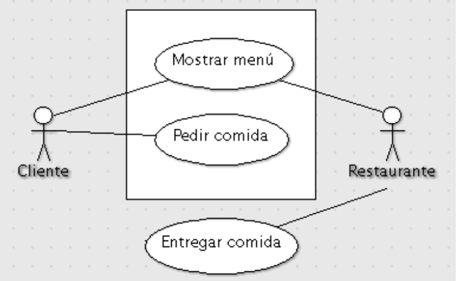
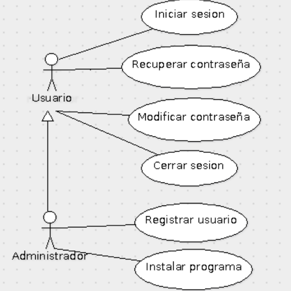
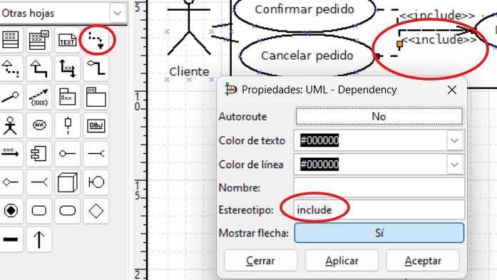
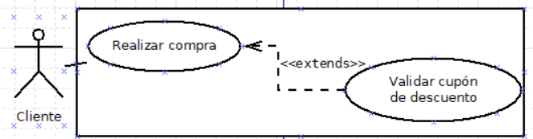
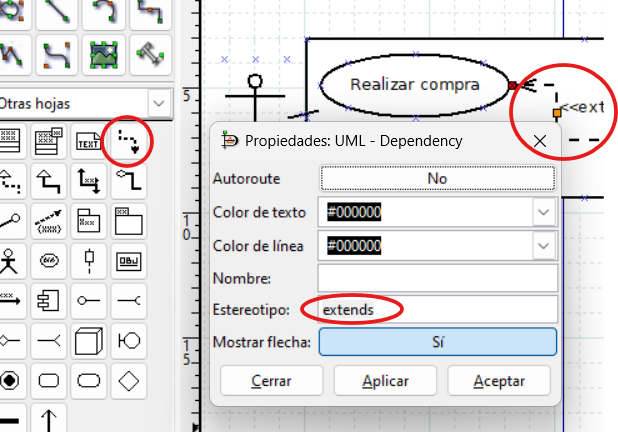
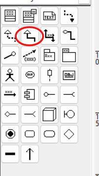

# 2. Diagrama de casos de uso

{ type=application/pdf style="width:100%;min-height:80vh" }

!!!info "Descarga de diapositivas"
    [Descarga las diapositivas](diapositivas/casos-uso.pdf){target="_blank" rel="noopener"}

---

## ¿Para qué sirve?

!!! info "Idea clave"
    El diagrama de casos de uso es el **contrato visual** entre el cliente y el equipo de desarrollo: qué podrá hacer cada tipo de usuario con el sistema. Nada de cómo funciona por dentro.

El diagrama de casos de uso describe **qué debe hacer un sistema desde el punto de vista de quien lo va a utilizar**. No explica cómo lo hace por dentro, solo qué funcionalidades ofrece.

Se construye junto con el cliente o el usuario en las primeras reuniones, para acordar qué debe hacer el sistema antes de empezar a programar. Por eso su notación es deliberadamente simple —muñecos, elipses y líneas—: tiene que entenderla alguien que no ha programado nunca.

!!! example "Ejemplo"
    Una máquina de café tiene tres actores posibles (cliente, técnico de mantenimiento, proveedor) y casos de uso como "Seleccionar bebida", "Rellenar depósito" o "Cobrar".

---

## Elementos del diagrama

### Actor

Representa a una **persona o proceso externo** que interactúa con el sistema. Se identifica por el papel que desempeña, no por su nombre concreto.

!!! tip "En DIA — icono de actor"
    El actor se dibuja con la figura de palo de la paleta UML.

    <figure markdown="span">
      
      <figcaption>Icono de actor en la paleta UML de DIA</figcaption>
    </figure>

### Caso de uso

Representa una **acción del sistema**. Una forma de reconocerlos es que en la descripción del problema suelen ser verbos: "Iniciar sesión", "Realizar pedido", "Generar informe".

Se representa con una **elipse** con el nombre dentro.

!!! tip "En DIA — icono de caso de uso"
    El caso de uso es la elipse de la paleta UML.

    <figure markdown="span">
      
      <figcaption>Icono de caso de uso (elipse) en la paleta UML de DIA</figcaption>
    </figure>

### Asociación (relación de comunicación)

La interacción entre un actor y un caso de uso se representa con una **línea recta** que los une. A esta línea se le llama **relación de comunicación**, porque indica que el actor "se comunica" con esa funcionalidad del sistema. No lleva flecha.

### Escenario

Cada camino concreto que puede seguir un caso de uso al ejecutarse es un **escenario**. Todo caso de uso tiene un **escenario principal** (el camino donde todo va bien) y puede tener **escenarios alternativos** (el usuario se equivoca de contraseña, no hay stock, el pago falla...). El diagrama muestra el caso de uso como una sola elipse; los escenarios se detallan en la descripción narrativa que lo acompaña.

!!! example "Ejemplo"
    Caso de uso "Retirar dinero" de un cajero. Escenario principal: el cliente introduce el PIN correcto, elige importe, hay saldo y recibe el dinero. Escenarios alternativos: PIN incorrecto tres veces (se retiene la tarjeta), saldo insuficiente (se muestra un aviso).

### Sistema

El software que se va a desarrollar. Se dibuja como un **rectángulo** que contiene todos los casos de uso. Los actores quedan fuera.

!!! warning "Cuidado con DIA"
    Si añades el rectángulo del sistema después que los casos de uso, aparecerá por encima tapándolos. Para solucionarlo: selecciónalo, ve a **Objeto** y usa "Echar atrás".

    <figure markdown="span">
      
      <figcaption>Rectángulo de límite de sistema en DIA con un actor y un caso de uso dentro</figcaption>
    </figure>

---

## Ejemplo completo

<figure markdown="span">
  
  <figcaption>Diagrama de casos de uso de un restaurante. "Entregar comida" queda fuera del sistema porque la realiza el restaurante, no el software.</figcaption>
</figure>

<figure markdown="span">
  
  <figcaption>Generalización entre actores: Administrador hereda los casos de uso de Usuario y añade los suyos propios.</figcaption>
</figure>

---

## De la descripción al diagrama

En las actividades partirás de un enunciado en lenguaje natural, como en el tema 5. La técnica para convertirlo en diagrama tiene tres pasos:

| En el texto busca... | Se convierte en... |
|---|---|
| Roles o perfiles que usan el sistema ("el secretario", "cualquier persona que...") | Un **actor** (por el papel, no por el nombre propio) |
| Verbos que el usuario consigue del sistema ("generar recibos", "consultar el estado") | Un **caso de uso** |
| "Para X primero hay que Y", "siempre requiere..." | Un **«include»** |
| "Opcionalmente", "solo si...", "en algunos casos" | Un **«extend»** |

!!! warning "Cuidado"
    No todo verbo del enunciado es un caso de uso. "Conectar con la base de datos" o "validar el token" son pasos internos que el usuario no ve: si los pones, el diagrama deja de ser un contrato con el cliente y se convierte en diseño técnico.

---

## Relaciones avanzadas

### Inclusión (`«include»`)

Un caso de uso **siempre** necesita ejecutar otro. Se usa cuando un comportamiento se repite en varios casos de uso y quieres evitar duplicarlo.

Se representa con una **línea discontinua con flecha** apuntando al caso incluido, etiquetada con `«include»`.

!!! example "Ejemplo"
    "Realizar pedido" y "Consultar historial" incluyen "Iniciar sesión", porque ambos requieren que el usuario esté autenticado.

!!! tip "En DIA — configurar «include»"
    Usa la herramienta **UML - Dependency** de la paleta (línea punteada con flecha). Haz doble clic sobre la línea → en el campo **Estereotipo** escribe `include`.

    <figure markdown="span">
      
      <figcaption>Propiedades de la relación «include» en DIA: estereotipo "include" y flecha activada</figcaption>
    </figure>

### Extensión (`«extend»`)

Un caso de uso **añade comportamiento opcional** a otro cuando se cumple cierta condición. Es como un `if` en el flujo normal.

Se representa igual que include pero con `«extend»`, y la flecha apunta al caso de uso **base** (el que se extiende).

!!! example "Ejemplo"
    "Pagar pedido" puede extenderse con "Aplicar cupón de descuento" solo si el usuario tiene un cupón válido.

<figure markdown="span">
  
  <figcaption>Ejemplo de «extend»: "Validar cupón de descuento" solo se ejecuta cuando el usuario introduce un cupón.</figcaption>
</figure>

!!! tip "En DIA — configurar «extend»"
    Igual que con include: herramienta **UML - Dependency**, doble clic → Estereotipo: `extends`.

    <figure markdown="span">
      
      <figcaption>Propiedades de la relación «extend» en DIA: estereotipo "extends"</figcaption>
    </figure>

!!! tip "La regla de las flechas (cae en examen)"
    Las dos relaciones se dibujan igual (línea discontinua con flecha), pero la flecha apunta a sitios distintos:

    - `«include»` apunta al caso **incluido** (el "trozo" reutilizado): *Realizar pedido* ──▶ *Iniciar sesión*.
    - `«extend»` apunta al caso **base** (el que se amplía): *Aplicar cupón* ──▶ *Pagar pedido*.

    Truco para recordarlo: la flecha siempre sale del caso que "manda ejecutar" hacia el que completa la historia. En include manda el grande; en extend, el opcional se ofrece al grande.

### Generalización

Un caso de uso hijo hereda el comportamiento del padre pero puede modificarlo. Funciona igual que la herencia en clases.

!!! tip "En DIA — icono de generalización"
    Es la misma flecha de punta triangular hueca que se usa en los diagramas de clases.

    <figure markdown="span">
      
      <figcaption>Icono de generalización en la paleta UML de DIA (misma flecha que en diagramas de clases)</figcaption>
    </figure>

---

## Recomendaciones

- Los casos de uso describen **las interacciones más importantes con el sistema**, no su funcionamiento interno.
- Mantén el diagrama **lo más simple posible**. Todo el mundo en el proyecto (incluidos clientes sin perfil técnico) debe poder entenderlo. Si se complica, pierde su utilidad.
- No abuses de `«include»` para descomponer cada caso en sub-casos. El diagrama se elabora en la fase de análisis de requisitos, y éstos cambian continuamente: cada descomposición que hagas hoy puede quedarse obsoleta mañana.
- Acompaña siempre el diagrama con una **descripción narrativa** de cada caso de uso: quién lo inicia, cuál es el flujo normal, qué alternativas hay, qué puede salir mal.

!!! warning "Error frecuente"
    Incluir en el diagrama de casos de uso pasos del flujo interno del sistema (como "Conectar a la base de datos" o "Validar token"). Esos detalles no los ve el usuario y no pertenecen aquí.

---

## Resumen de relaciones

| Relación | Cómo se dibuja | Cuándo usarla |
|---|---|---|
| Relación de comunicación | Línea continua sin flecha | Une un actor con un caso de uso que puede iniciar |
| `«include»` | Línea discontinua con flecha al caso **incluido** | El caso incluido **siempre** se ejecuta |
| `«extend»` | Línea discontinua con flecha al caso **base** | El caso extendido se ejecuta **solo a veces** (condición) |
| Generalización | Flecha de triángulo hueco al padre | Varios casos (o actores) comparten comportamiento base |
