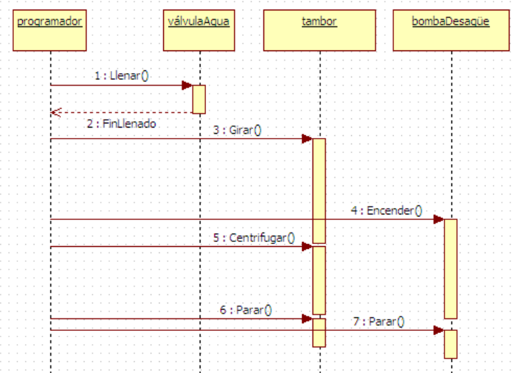
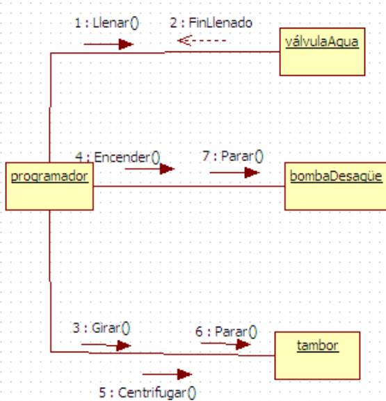

<a id="comunicacion"></a>

# 3.2. Diagrama de comunicación

{ type=application/pdf style="width:100%;min-height:80vh" }

!!!info "Descarga de diapositivas"
    [Descarga las diapositivas](diapositivas/comunicacion.pdf){target="_blank" rel="noopener"}

---

## ¿Para qué sirve?

El diagrama de comunicación (llamado "de colaboración" en versiones anteriores de UML) representa **la comunicación entre objetos**, poniendo el acento en las relaciones y el flujo de control, no en el tiempo.

!!! info "Idea clave"
    Los diagramas de secuencia y de comunicación muestran lo mismo: quién habla con quién. La diferencia es el enfoque:
    
    - **Secuencia**: énfasis en el **orden cronológico** (eje temporal vertical)
    - **Comunicación**: énfasis en las **relaciones entre objetos** (quién está conectado con quién)

---

## Elementos del diagrama

### Objetos (nodos de comunicación)

Representan las entidades del sistema, igual que en el diagrama de secuencia. En UML 2 se denominan **nodos de comunicación**.

### Canal de comunicación

Cuando dos objetos se envían mensajes, se unen con una **línea recta**. Es el canal por el que fluyen los mensajes.

### Mensajes

Se representan sobre el canal como flechas con una etiqueta. La etiqueta incluye:

- Un **número de secuencia** para indicar el orden: `1:`, `2:`, `2.1:` (subnivel)
- El **nombre del mensaje** (nombre del método o acción)
- La **dirección** mediante una flecha

!!! example "Ejemplo"
    ```
    Cliente ——— Pedido
         1: realizarPedido() →
         2: ← confirmarPedido()
    ```

---

## Diferencia visual con el diagrama de secuencia

El mismo escenario (la lavadora) se puede representar de las dos formas:

- **Secuencia**: se ven las líneas de vida verticales, las activaciones y el orden de arriba abajo.
- **Comunicación**: se ven los objetos conectados por líneas y los mensajes numerados encima.

Para modelar el mismo sistema, cualquiera de los dos es válido. En la práctica, el de secuencia es más habitual porque el orden cronológico suele ser lo que más interesa comunicar.

<figure markdown="span">
  
  <figcaption>El mismo escenario de la lavadora representado como diagrama de comunicación: los objetos aparecen conectados por canales y los mensajes se numeran para indicar el orden.</figcaption>
</figure>

!!! tip "En DIA — mensajes en comunicación"
    Usa la misma herramienta de mensajes que en secuencia (**UML - Message**). Haz doble clic → elige "Llamada" u otro tipo según corresponda.

    <figure markdown="span">
      
      <figcaption>Diagrama de comunicación en DIA: objetos conectados con canal y mensaje tipo "Llamada"</figcaption>
    </figure>
