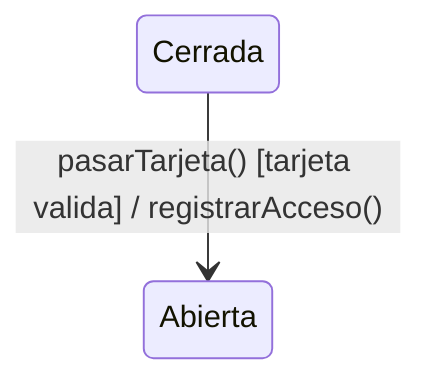
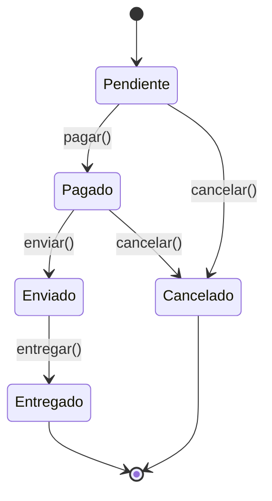
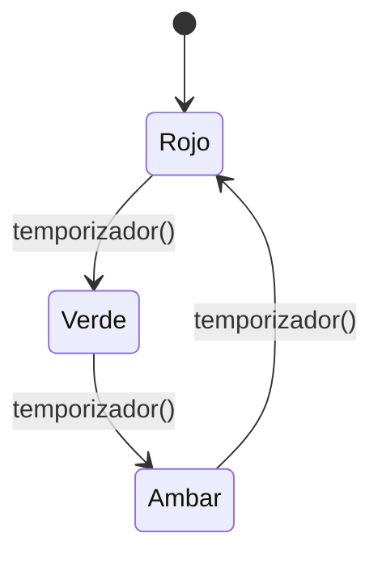

<a id="estados"></a>

# 5. Diagrama de estados

{ type=application/pdf style="width:100%;min-height:80vh" }

!!!info "Descarga de diapositivas"
    [Descarga las diapositivas](diapositivas/estados.pptx){target="_blank" rel="noopener"}

---

## ¿Para qué sirve?

Un diagrama de estados muestra los **distintos estados por los que puede pasar un objeto** a lo largo de su vida y qué eventos provocan el cambio de un estado a otro. Piensa en tu móvil: bloqueado, desbloqueado, en llamada, apagado... cada uno es una situación estable en la que el aparato se comporta distinto, y algo concreto (pulsar un botón, quedarse sin batería) lo hace saltar de una a otra.

Es útil cuando un objeto tiene un comportamiento que varía según en qué situación se encuentre. Por ejemplo, un pedido no se comporta igual si está "pendiente" que si está "enviado" o "cancelado".

!!! info "Idea clave"
    No todos los objetos necesitan un diagrama de estados, solo aquellos cuyo comportamiento cambia significativamente según su estado interno.

---

## Elementos del diagrama

### Estado inicial

Círculo negro sólido, igual que en el diagrama de actividades. Marca el punto de partida.

### Estado

Rectángulo con esquinas redondeadas que contiene el **nombre del estado**. Opcionalmente puede incluir acciones internas con las etiquetas `entry` (al entrar), `do` (mientras dura) y `exit` (al salir).

### Transición

Flecha que une dos estados. Indica el **cambio de estado**. Se etiqueta con:

- El **evento** que la dispara
- Una **condición de guarda** opcional entre corchetes: `[saldo > 0]`
- Una **acción** opcional tras la barra: `/ cobrar()`

Formato: `evento [condición] / acción`

Un ejemplo con las tres partes, en la puerta de un garaje comunitario:



Léelo así: cuando alguien **pasa la tarjeta** (evento), y **solo si la tarjeta es válida** (condición de guarda), la puerta pasa de Cerrada a Abierta y por el camino **se registra el acceso** (acción). Si la tarjeta no es válida, la condición es falsa y la puerta se queda como está: no hay transición.

??? note "Para saber más — no entra en examen ni actividades"

    **Acciones internas de un estado**

    Dentro de un estado puedes describir qué hace el sistema mientras está en él:

    | Etiqueta | Cuándo se ejecuta |
    |---|---|
    | `entry` | Al **entrar** en el estado |
    | `do` | **Mientras** el sistema permanece en el estado |
    | `exit` | Al **salir** del estado |

    **Detalle del formato de transición**

    | Parte | Obligatorio | Descripción |
    |---|---|---|
    | `estímulo` | Sí | El evento que dispara el cambio |
    | `[condición]` | No | Expresión booleana; si es falsa, no se cambia de estado |
    | `/ efecto` | No | Acción que se ejecuta antes de cambiar de estado |

    Las **transiciones reflexivas** apuntan al mismo estado de origen: sirven para ejecutar un efecto sin cambiar de estado.

    **Submáquinas de estado**

    Un estado puede contener una máquina de estados completa. Sirve para reutilizar un patrón que aparece en varios sitios del diagrama (p.ej. "introducir PIN" en apertura de puerta y en cambio de configuración).

    **Pseudo-estado de elección**

    Un rombo al que llega una sola transición y del que salen dos o más con condiciones de guarda:

    ```
    [Estado A] → ◇ → [condición verdadera] → [Estado B]
                  └→ [condición falsa]    → [Estado C]
    ```

### Estado final

Círculo con borde grueso. Marca el fin del ciclo de vida del objeto.

---

## Ejemplo: pedido en una tienda online

Un pedido pasa por distintas situaciones desde que se crea hasta que llega (o se anula). Fíjate en que los nombres de los estados son adjetivos o participios, no acciones:



Estados posibles de un pedido:

- **Pendiente**: el pedido existe pero aún no se ha pagado
- **Pagado**: se ha confirmado el pago
- **Enviado**: el paquete está en camino
- **Entregado**: el cliente ha recibido el pedido
- **Cancelado**: el pedido se ha anulado (fíjate: solo se puede cancelar desde Pendiente o Pagado; una vez enviado, ya no)

---

## Ejemplo: semáforo

El semáforo solo tiene tres estados y siempre sigue el mismo ciclo. No hay condiciones de guarda: lo único que dispara cada transición es el temporizador. Tampoco hay estado final, porque su ciclo no termina nunca:



---

## Dibujarlo en DIA

Los elementos son casi los mismos que en el diagrama de actividades, así que ya conoces los iconos:

!!! tip "En DIA — elementos del diagrama de estados"
    - **Estado inicial y final**: el mismo círculo que en actividades; para el final, doble clic → **"Es final" → Sí**.
    - **Estado**: el rectángulo redondeado (el mismo elemento que la actividad); escribe dentro el nombre del estado.
    - **Transición**: la flecha de transición de la paleta UML. Haz **doble clic sobre ella** para escribir el disparador (evento), la guarda (condición) y la acción; DIA los compone con el formato `evento [condición] / acción`.

---

## Diferencia con el diagrama de actividades

| Diagrama de actividades | Diagrama de estados |
|---|---|
| Describe el flujo de **un proceso** | Describe el ciclo de vida de **un objeto** |
| Las cajas son acciones (verbos) | Las cajas son estados (sustantivos o adjetivos) |
| Las flechas son el orden de pasos | Las flechas son eventos que cambian el estado |
