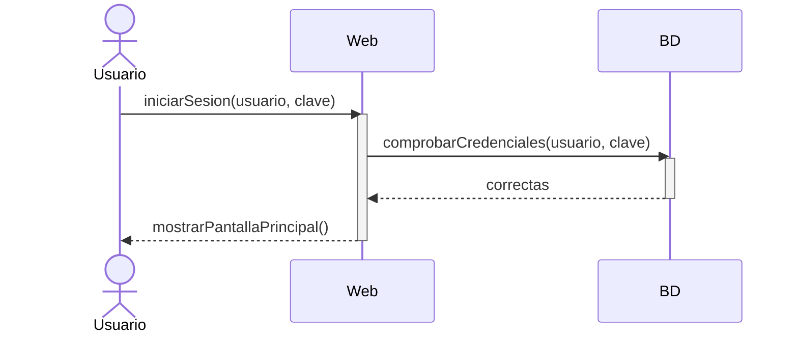
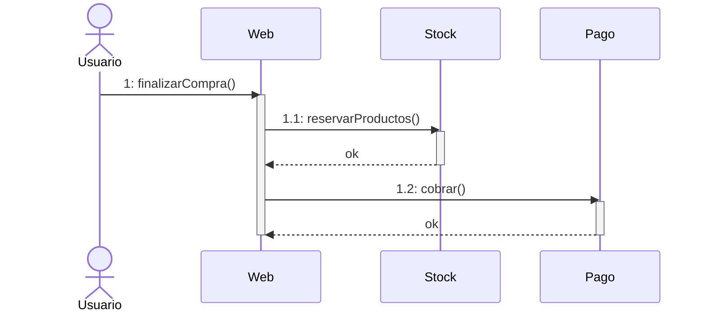
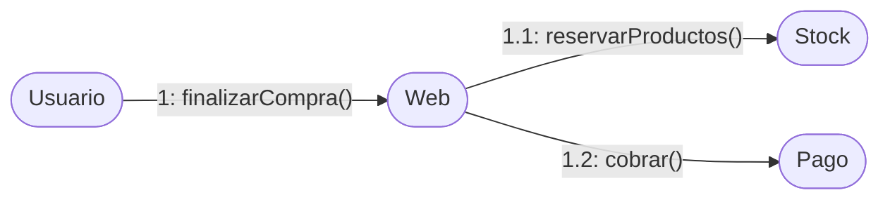

<a id="interaccion"></a>

# 3. Diagramas de interacción

{ type=application/pdf style="width:100%;min-height:80vh" }

!!!info "Descarga de diapositivas"
    [Descarga las diapositivas](diapositivas/interaccion.pptx){target="_blank" rel="noopener"}

---

Los diagramas de interacción muestran **cómo se comunican los objetos de un sistema** al ejecutar una operación o proceso. Dentro de esta familia hay dos tipos principales, y los dos representan lo mismo pero desde ángulos diferentes:

| Diagrama | Énfasis |
|---|---|
| **Secuencia** | El **orden cronológico** de los mensajes (quién llama a quién y cuándo) |
| **Comunicación** | Las **relaciones entre los objetos** y el flujo de control |

!!! tip "Recuerda"
    Si lo que más importa es ver el orden exacto de los pasos, usa el de secuencia. Si lo que interesa es ver qué objetos están relacionados y cuántos mensajes hay entre ellos, usa el de comunicación. Como contienen la misma información, al final de esta página verás cómo pasar de uno a otro de forma mecánica.

---

<a id="secuencia"></a>

## 3.1 Diagrama de secuencia

### ¿Para qué sirve?

Un diagrama de secuencia representa visualmente **la interacción entre objetos a lo largo del tiempo**. El eje vertical es el tiempo (de arriba abajo) y el eje horizontal muestra los objetos que participan.

Es útil para diseñar cómo deben comunicarse los objetos de un sistema al ejecutar un caso de uso concreto. Antes de despiezar la notación, mira uno entero — un inicio de sesión — para hacerte la idea general:



Se lee de arriba abajo: el usuario llama a la web, la web pregunta a la base de datos y **espera** (su barra sigue abierta), la base de datos responde (flecha discontinua) y, solo entonces, la web responde al usuario. Cada pieza de este dibujo tiene nombre propio; vamos con ellas.

### Elementos del diagrama

#### Objetos

Representan las entidades que interactúan: pueden ser instancias de clases, actores externos o el propio sistema. Se colocan en la parte superior, alineados horizontalmente.

!!! tip "En DIA — añadir un objeto"
    Usa el elemento **UML - Object** de la paleta UML (el rectángulo con el nombre subrayado).

    <figure markdown="span">
      
      <figcaption>Icono de línea de vida (objeto) en la paleta UML de DIA</figcaption>
    </figure>

#### Línea de vida

Línea vertical discontinua que desciende desde cada objeto. Representa su **existencia a lo largo del tiempo**.

#### Activación

Barra rectangular sobre la línea de vida. Indica que el objeto está **activo procesando** una acción en ese momento.

!!! tip "En DIA — añadir activación"
    Usa el elemento de **activación** de la paleta UML (barra rectangular).

    <figure markdown="span">
      
      <figcaption>Barra de activación sobre la línea de vida en DIA</figcaption>
    </figure>

!!! tip "En DIA — desactivar la activación"
    Si quieres que la línea de vida aparezca sin la barra de activación, haz **doble clic sobre la línea de vida** → cambia **"Dibujar foco de control"** a **No**.

    Si la línea de vida queda con los puntos de conexión muy separados, haz **clic derecho sobre ella** → **"Reducir la distancia entre los puntos de conexión"**.

    <figure markdown="span">
      
      <figcaption>Desactivar "Dibujar foco de control" en las propiedades de la línea de vida</figcaption>
    </figure>

    <figure markdown="span">
      
      <figcaption>Menú contextual para reducir la distancia entre puntos de conexión de la línea de vida</figcaption>
    </figure>

#### Mensajes

Flechas horizontales que van de un objeto a otro. Representan llamadas a métodos o envío de información. Hay varios tipos:

| Tipo | En DIA | Descripción |
|---|---|---|
| **Síncrono** | Llamada | El objeto que llama se detiene hasta recibir respuesta |
| **Asíncrono** | Simple | El objeto que llama continúa sin esperar respuesta |
| **Respuesta** | Volver | Respuesta a un mensaje (normalmente se omite en síncronos) |
| **Creación** | Crear | Instancia un nuevo objeto (equivale a un constructor) |
| **Destrucción** | Destruir | Elimina un objeto; aparece con una ✕ al final de su línea de vida |
| **Automensaje** | Recursiva | Una llamada recursiva o a otro método del mismo objeto |

!!! warning "Cuidado"
    Un mensaje de **creación** siempre apunta a un **objeto**, nunca a una clase.

!!! tip "En DIA — cambiar el tipo de mensaje"
    Dibuja la flecha entre dos objetos con la herramienta de mensajes de la paleta UML y luego haz **doble clic sobre ella**. En el diálogo **Propiedades: UML - Message**, cambia el campo **"Tipo de mensaje"** al que necesites.

    <figure markdown="span">
      
      <figcaption>Herramienta de mensaje en la paleta UML de DIA. El tipo por defecto es "Llamada" (síncrono).</figcaption>
    </figure>

    <figure markdown="span">
      
      <figcaption>Mensaje tipo "Simple": el objeto emisor no espera respuesta (asíncrono)</figcaption>
    </figure>

    <figure markdown="span">
      
      <figcaption>Mensaje tipo "Volver": línea discontinua con flecha, representa la respuesta</figcaption>
    </figure>

    <figure markdown="span">
      
      <figcaption>Mensaje tipo "Crear": instancia un nuevo objeto, que aparece al lado del extremo receptor</figcaption>
    </figure>

    <figure markdown="span">
      
      <figcaption>Mensaje tipo "Recursiva": la flecha sale y vuelve al mismo objeto</figcaption>
    </figure>

!!! tip "En DIA — añadir la marca de destrucción (✕)"
    Para que aparezca la ✕ al final de la línea de vida de un objeto que se destruye, haz **doble clic sobre su línea de vida** → activa **"Dibujar marca de destrucción"** → **Sí**. El tipo del mensaje que lo destruye debe ser **Destruir**.

    <figure markdown="span">
      
      <figcaption>Activar "Dibujar marca de destrucción" en las propiedades de la línea de vida</figcaption>
    </figure>

    <figure markdown="span">
      
      <figcaption>Mensaje tipo "Destruir": la flecha apunta al objeto que va a desaparecer</figcaption>
    </figure>

??? note "Para saber más — no entra en examen ni actividades"

    **Fragmentos combinados**

    Permiten expresar lógica de control encerrando mensajes en un marco con una etiqueta en la esquina.

    | Etiqueta | Equivalente | Uso |
    |---|---|---|
    | `loop` | `while` / `for` | Repite los mensajes del interior |
    | `alt` | `if/else` | Alternativa: las ramas se separan con línea horizontal |
    | `opt` | `if` sin `else` | Los mensajes se ejecutan solo si se cumple la condición |
    | `break` | `break` | El fragmento se ejecuta y la secuencia principal se interrumpe |
    | `par` | hilos | Los mensajes del interior se ejecutan en paralelo |

    En general, si el diagrama necesita muchos fragmentos anidados es mejor separarlo en varios diagramas más simples.

### Resumen de tipos de mensaje

<figure markdown="span">
  
  <figcaption>Resumen de los tipos de mensaje en un diagrama de secuencia: llamada síncrona, retorno, autollamada, creación y destrucción</figcaption>
</figure>

### Ejemplo leído paso a paso: llamada telefónica

Saber dibujar no basta: hay que saber **leer** un diagrama de secuencia como si fuera una historia. Este representa a un vendedor que llama a un abonado a través de la empresa de telefonía:

<figure markdown="span">
  
  <figcaption>Diagrama de secuencia de una llamada telefónica con los mensajes numerados del 1 al 7.</figcaption>
</figure>

Léelo de arriba abajo, que es como avanza el tiempo:

1. `Marcar Número()`: el vendedor llama a la empresa de telefonía. La activación de la centralita se abre: está procesando.
2. `Dar Tonos()`: la empresa responde al vendedor con los tonos de espera. Fíjate en que el vendedor los recibe mientras la centralita sigue activa.
3. `Sonar Timbre()`: a la vez, la empresa hace sonar el teléfono del abonado: se abre la activación del abonado.
4. `Descolgar()`: el abonado responde descolgando; el mensaje viaja de vuelta hacia la empresa.
5. `Llamada Aceptada()`: la empresa avisa al vendedor de que ya hay línea.
6. `Vender Producto()`: ahora sí, el vendedor habla **directamente** con el abonado: es el único mensaje que no pasa por la empresa.
7. `Colgar()`: el vendedor termina la llamada avisando a la empresa.

!!! tip "Recuerda"
    Al interpretar un diagrama de secuencia, pregúntate en cada mensaje: ¿quién lo envía?, ¿el emisor espera respuesta o continúa?, ¿qué activaciones están abiertas en ese momento? Es exactamente lo que se pide en las actividades de este tema.

### Ejemplo: lavadora

<figure markdown="span">
  
  <figcaption>Diagrama de secuencia de una lavadora: el programador coordina la válvula de agua, el tambor y la bomba de desagüe.</figcaption>
</figure>

---

<a id="comunicacion"></a>

## 3.2 Diagrama de comunicación

### ¿Para qué sirve?

El diagrama de comunicación (llamado "de colaboración" en versiones anteriores de UML) representa **la comunicación entre objetos**, poniendo el acento en las relaciones y el flujo de control, no en el tiempo.

!!! info "Idea clave"
    Los diagramas de secuencia y de comunicación muestran lo mismo: quién habla con quién. La diferencia es el enfoque:

    - **Secuencia**: énfasis en el **orden cronológico** (eje temporal vertical)
    - **Comunicación**: énfasis en las **relaciones entre objetos** (quién está conectado con quién)

### Elementos del diagrama

#### Objetos (nodos de comunicación)

Representan las entidades del sistema, igual que en el diagrama de secuencia. En UML 2 se denominan **nodos de comunicación**.

#### Canal de comunicación

Cuando dos objetos se envían mensajes, se unen con una **línea recta**. Es el canal por el que fluyen los mensajes. El canal es único por pareja de objetos: si dos objetos se envían cinco mensajes, hay un solo canal con cinco etiquetas encima.

#### Mensajes

Se representan sobre el canal como flechas con una etiqueta: un **número de secuencia** que indica el orden, el **nombre del mensaje** (el método o acción) y la **dirección** mediante la punta de la flecha.

Como aquí no existe el eje vertical del tiempo, el orden se expresa **solo con la numeración**, y por eso importa tanto. Hay dos convenciones:

- **Numeración plana**: `1:`, `2:`, `3:`... en el orden global de los mensajes. Es la más sencilla y suficiente en diagramas pequeños.
- **Numeración jerárquica**: los mensajes que ocurren *dentro* de la operación desencadenada por otro llevan su número como prefijo: el mensaje `2:` que provoca dos llamadas internas genera `2.1:` y `2.2:`.

!!! example "Ejemplo de numeración jerárquica"
    Un usuario pulsa "Finalizar compra" en una web. El objeto `Web` recibe la orden y, para completarla, necesita hablar con `Stock` y con `Pago`:

    ```mermaid
    flowchart LR
        Usuario([Usuario]) -->|"1: finalizarCompra()"| Web([Web])
        Web -->|"1.1: reservarProductos()"| Stock([Stock])
        Web -->|"1.2: cobrar()"| Pago([Pago])
    ```

    `1.1` y `1.2` cuelgan del `1` porque ambas llamadas ocurren **dentro** de la operación `finalizarCompra()`: sin el mensaje 1 no existirían. Si después el usuario pidiera la factura, ese nuevo mensaje sería el `2:`.

!!! tip "En DIA — mensajes en comunicación"
    Usa la misma herramienta de mensajes que en secuencia (**UML - Message**). Haz doble clic → elige "Llamada" u otro tipo según corresponda.

    <figure markdown="span">
      
      <figcaption>Diagrama de comunicación en DIA: objetos conectados con canal y mensaje tipo "Llamada"</figcaption>
    </figure>

---

## 3.3 De secuencia a comunicación (y vuelta)

Como los dos diagramas contienen la misma información, pasar de uno a otro es mecánico:

1. **Coloca los objetos** del diagrama de secuencia donde quieras en el lienzo (ya no importa el eje del tiempo) y une con una línea cada pareja que se envíe al menos un mensaje: esos son los canales.
2. **Copia cada mensaje** sobre su canal, como flecha etiquetada con el nombre de la operación.
3. **Numera los mensajes** en el orden en que ocurrían en el diagrama de secuencia, con numeración plana o jerárquica.

El paso inverso (de comunicación a secuencia) también funciona: la numeración te da el orden vertical de los mensajes.

El mismo escenario de la lavadora que has visto arriba, traducido a comunicación:

<figure markdown="span">
  
  <figcaption>La lavadora como diagrama de comunicación: los objetos aparecen conectados por canales y los mensajes se numeran para indicar el orden.</figcaption>
</figure>

Para modelar un sistema, cualquiera de los dos es válido. En la práctica el de secuencia es más habitual, porque el orden cronológico suele ser lo que más interesa comunicar; el de comunicación gana cuando hay muchos objetos y lo que preocupa es la estructura de conexiones (por ejemplo, detectar que un objeto habla con demasiados).

---

## 3.4 Un mismo diagrama, dos vistas

Para terminar, compara el mismo escenario dibujado de las dos formas: el `finalizarCompra()` de más arriba, con sus tres mensajes numerados `1`, `1.1` y `1.2`.

**Como secuencia** — el tiempo avanza hacia abajo; se ve claramente que `Web` espera la respuesta de `Stock` antes de hablar con `Pago`:



**Como comunicación** — ya no hay eje temporal: lo que se ve son los objetos y sus canales; el orden queda solo en la numeración:



!!! tip "La diferencia, de un vistazo"
    Mismos tres mensajes, misma numeración. En **secuencia** ves el ORDEN temporal (eje vertical) y cuánto tiempo está cada objeto activo. En **comunicación** ves las RELACIONES (quién está conectado con quién) y el orden se lee solo en las etiquetas `1`, `1.1`, `1.2`.
