

# 3.1. Diagrama de secuencia

{ type=application/pdf style="width:100%;min-height:80vh" }

!!!info "Descarga de diapositivas"
    [Descarga las diapositivas](diapositivas/secuencia.pdf){target="_blank" rel="noopener"}

---

## ¿Para qué sirve?

Un diagrama de secuencia representa visualmente **la interacción entre objetos a lo largo del tiempo**. El eje vertical es el tiempo (de arriba abajo) y el eje horizontal muestra los objetos que participan.

Es útil para diseñar cómo deben comunicarse los objetos de un sistema al ejecutar un caso de uso concreto.

---

## Elementos del diagrama

### Objetos

Representan las entidades que interactúan: pueden ser instancias de clases, actores externos o el propio sistema. Se colocan en la parte superior, alineados horizontalmente.

!!! tip "En DIA — añadir un objeto"
    Usa el elemento **UML - Object** de la paleta UML (el rectángulo con el nombre subrayado).

    <figure markdown="span">
      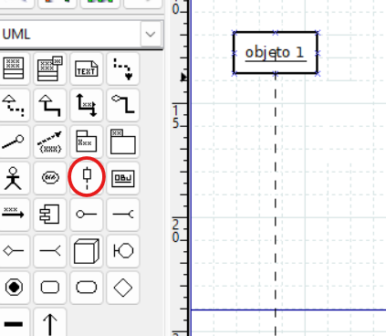
      <figcaption>Icono de línea de vida (objeto) en la paleta UML de DIA</figcaption>
    </figure>

### Línea de vida

Línea vertical discontinua que desciende desde cada objeto. Representa su **existencia a lo largo del tiempo**.

### Activación

Barra rectangular sobre la línea de vida. Indica que el objeto está **activo procesando** una acción en ese momento.

!!! tip "En DIA — añadir activación"
    Usa el elemento de **activación** de la paleta UML (barra rectangular).

    <figure markdown="span">
      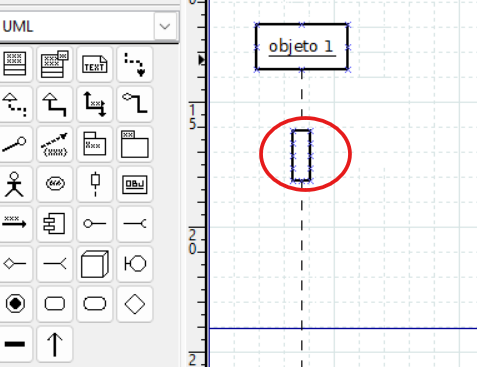
      <figcaption>Barra de activación sobre la línea de vida en DIA</figcaption>
    </figure>

!!! tip "En DIA — desactivar la activación"
    Si quieres que la línea de vida aparezca sin la barra de activación, haz **doble clic sobre la línea de vida** → cambia **"Dibujar foco de control"** a **No**.

    Si la línea de vida queda con los puntos de conexión muy separados, haz **clic derecho sobre ella** → **"Reducir la distancia entre los puntos de conexión"**.

    <figure markdown="span">
      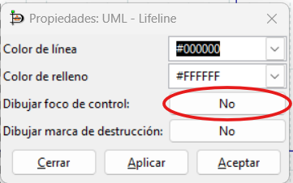
      <figcaption>Desactivar "Dibujar foco de control" en las propiedades de la línea de vida</figcaption>
    </figure>

    <figure markdown="span">
      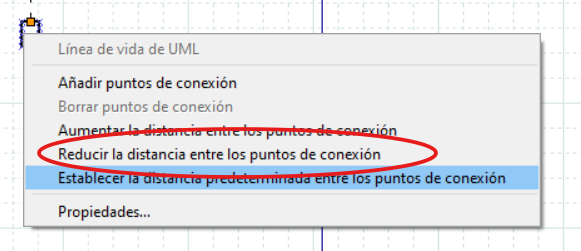
      <figcaption>Menú contextual para reducir la distancia entre puntos de conexión de la línea de vida</figcaption>
    </figure>

### Mensajes

Flechas horizontales que van de un objeto a otro. Representan llamadas a métodos o envío de información. Hay varios tipos:

| Tipo | En DIA | Descripción |
|---|---|---|
| **Síncrono** | Llamada | El objeto que llama se detiene hasta recibir respuesta |
| **Asíncrono** | Simple | El objeto que llama continúa sin esperar respuesta |
| **Respuesta** | Volver | Respuesta a un mensaje (normalmente se omite en síncronos) |
| **Creación** | Crear | Instancia un nuevo objeto (equivale a un constructor) |
| **Destrucción** | Destruir | Elimina un objeto; aparece con una ✕ al final de su línea de vida |
| **Automensaje** | Recursiva | Una llamada recursiva o a otro método del mismo objeto |

!!! warning "Cuidado"
    Un mensaje de **creación** siempre apunta a un **objeto**, nunca a una clase.

!!! tip "En DIA — cambiar el tipo de mensaje"
    Dibuja la flecha entre dos objetos con la herramienta de mensajes de la paleta UML y luego haz **doble clic sobre ella**. En el diálogo **Propiedades: UML - Message**, cambia el campo **"Tipo de mensaje"** al que necesites.

    <figure markdown="span">
      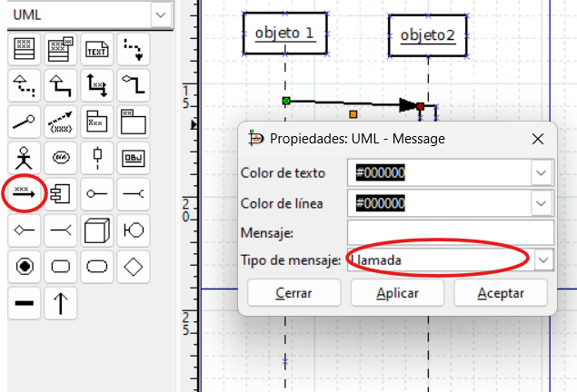
      <figcaption>Herramienta de mensaje en la paleta UML de DIA. El tipo por defecto es "Llamada" (síncrono).</figcaption>
    </figure>

    <figure markdown="span">
      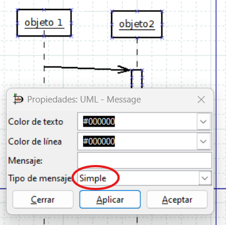
      <figcaption>Mensaje tipo "Simple": el objeto emisor no espera respuesta (asíncrono)</figcaption>
    </figure>

    <figure markdown="span">
      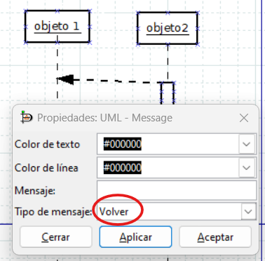
      <figcaption>Mensaje tipo "Volver": línea discontinua con flecha, representa la respuesta</figcaption>
    </figure>

    <figure markdown="span">
      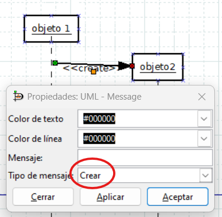
      <figcaption>Mensaje tipo "Crear": instancia un nuevo objeto, que aparece al lado del extremo receptor</figcaption>
    </figure>

    <figure markdown="span">
      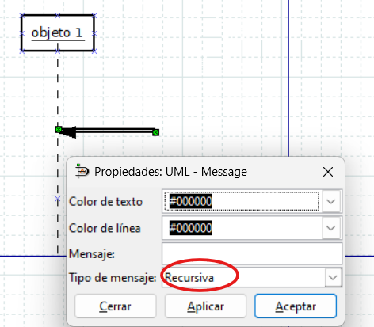
      <figcaption>Mensaje tipo "Recursiva": la flecha sale y vuelve al mismo objeto</figcaption>
    </figure>

!!! tip "En DIA — añadir la marca de destrucción (✕)"
    Para que aparezca la ✕ al final de la línea de vida de un objeto que se destruye, haz **doble clic sobre su línea de vida** → activa **"Dibujar marca de destrucción"** → **Sí**. El tipo del mensaje que lo destruye debe ser **Destruir**.

    <figure markdown="span">
      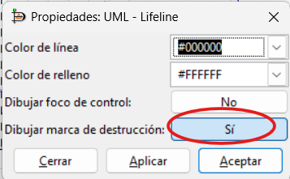
      <figcaption>Activar "Dibujar marca de destrucción" en las propiedades de la línea de vida</figcaption>
    </figure>

    <figure markdown="span">
      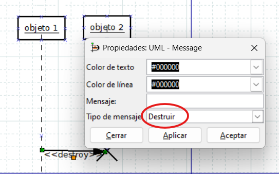
      <figcaption>Mensaje tipo "Destruir": la flecha apunta al objeto que va a desaparecer</figcaption>
    </figure>

---

??? note "Para saber más — no entra en examen ni actividades"

    **Fragmentos combinados**

    Permiten expresar lógica de control encerrando mensajes en un marco con una etiqueta en la esquina.

    | Etiqueta | Equivalente | Uso |
    |---|---|---|
    | `loop` | `while` / `for` | Repite los mensajes del interior |
    | `alt` | `if/else` | Alternativa: las ramas se separan con línea horizontal |
    | `opt` | `if` sin `else` | Los mensajes se ejecutan solo si se cumple la condición |
    | `break` | `break` | El fragmento se ejecuta y la secuencia principal se interrumpe |
    | `par` | hilos | Los mensajes del interior se ejecutan en paralelo |

    En general, si el diagrama necesita muchos fragmentos anidados es mejor separarlo en varios diagramas más simples.

---

## Resumen de tipos de mensaje

<figure markdown="span">
  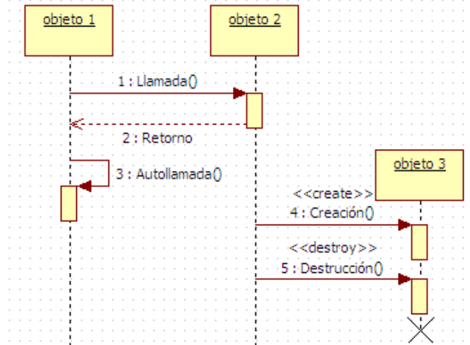
  <figcaption>Resumen de los tipos de mensaje en un diagrama de secuencia: llamada síncrona, retorno, autollamada, creación y destrucción</figcaption>
</figure>

---

## Ejemplo: llamada telefónica

<figure markdown="span">
  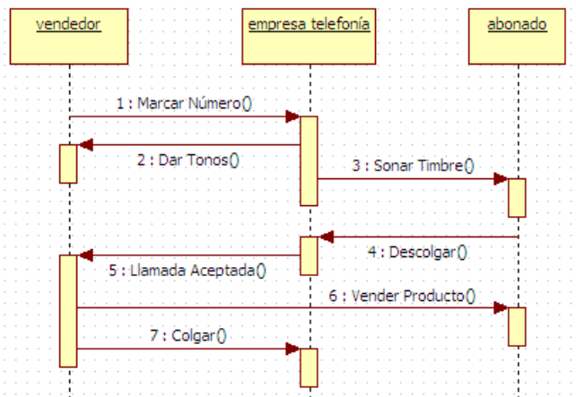
  <figcaption>Diagrama de secuencia de una llamada telefónica: el vendedor marca un número, la empresa de telefonía gestiona la conexión y el abonado descuelga.</figcaption>
</figure>

---

## Ejemplo: lavadora

<figure markdown="span">
  
  <figcaption>Diagrama de secuencia de una lavadora: el programador coordina la válvula de agua, el tambor y la bomba de desagüe.</figcaption>
</figure>
