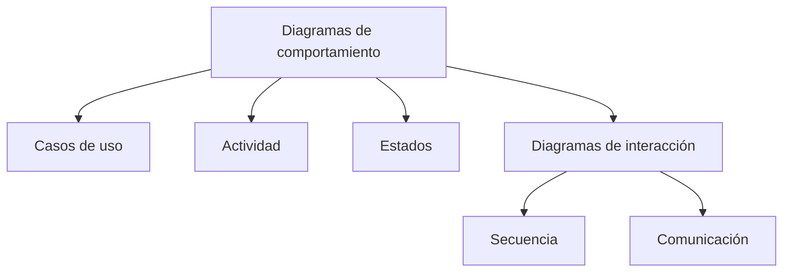

# 1. Tipos de diagramas de comportamiento

{ type=application/pdf style="width:100%;min-height:80vh" }

!!!info "Descarga de diapositivas"
    [Descarga las diapositivas](diapositivas/tipos.pdf){target="_blank" rel="noopener"}

---

## ¿Qué son los diagramas de comportamiento?

En UML los diagramas se dividen en dos grandes grupos:

- **Estructurales**: muestran cómo está organizado el sistema (clases, objetos, componentes…). El diagrama de clases del tema anterior es uno de ellos.
- **De comportamiento**: muestran **qué hace el sistema** y **cómo lo hace**. Describen flujos, interacciones y estados.

!!! info "Idea clave"
    El diagrama de clases del tema 5 es la **foto** del sistema: qué piezas tiene y cómo encajan. Los diagramas de comportamiento son el **vídeo**: qué pasa cuando el sistema se pone en marcha.

Los diagramas de comportamiento son especialmente útiles al principio del proyecto, cuando hay que entender cómo debe funcionar el sistema antes de empezar a programar. Este mapa muestra la familia completa y cómo se organiza:

---

## Tipos de diagramas de comportamiento

Trabajaremos cinco diagramas. Dos de ellos —secuencia y comunicación— forman una subfamilia propia, los **diagramas de interacción**: contienen la misma información (qué objetos se envían qué mensajes) y solo cambia el énfasis, así que los estudiaremos juntos en el apartado 3.

### Casos de uso

Es la **foto de las funcionalidades** del sistema: qué puede hacer cada tipo de usuario (actor), sin entrar en cómo se hace por dentro. Se dibuja en las primeras reuniones con el cliente, precisamente porque cualquiera lo entiende sin saber programar: muñecos de palo, elipses y líneas.

Responde a la pregunta: **"¿qué ofrece el sistema y a quién?"**

### Secuencia (interacción)

Muestra una operación concreta como una **conversación entre objetos ordenada en el tiempo**: el eje vertical es el tiempo, y las flechas dicen quién llama a quién, quién espera respuesta y quién continúa sin esperar.

Responde a: **"¿en qué orden se hablan los objetos, y quién espera a quién?"**

### Comunicación (interacción)

La misma conversación que el de secuencia, pero enseñando la **red de conexiones**: los objetos aparecen unidos por canales y los mensajes van numerados encima. El tiempo no se ve en el dibujo, se lee en los números.

Responde a: **"¿qué objetos están conectados entre sí y cuánto tráfico soporta cada conexión?"**

### Actividad

Es el diagrama de flujo de UML: representa **un proceso de principio a fin**, con sus decisiones (rombos con condiciones), sus bucles y sus tareas en paralelo (barras de sincronización). Las cajas son acciones: cosas que se *hacen*.

Responde a: **"¿qué pasos sigue este proceso, qué caminos alternativos tiene y qué se hace a la vez?"**

### Estados

Sigue la **vida de un solo objeto**: las situaciones estables por las que pasa (las cajas son estados: cosas que se *son*, como "Pendiente" o "Bloqueada") y los eventos que lo hacen saltar de una a otra.

Responde a: **"¿en qué situaciones puede estar este objeto y qué le hace cambiar de una a otra?"**

!!! example "El mismo sistema, cinco miradas"
    Imagina la app de una pizzería a domicilio. Cada diagrama la mira desde un sitio distinto:

    - **Casos de uso**: el cliente puede *hacer pedido* y *seguir el reparto*; el cocinero puede *ver comandas*; el administrador puede *cambiar la carta*.
    - **Secuencia**: cuando el cliente pulsa "Pedir", la `App` llama a `Pago`, espera su respuesta y después avisa a `Cocina`.
    - **Comunicación**: la `App` está conectada con `Pago`, `Cocina` y `Reparto`; es el objeto con más canales.
    - **Actividad**: el proceso de preparar el pedido, con la decisión `[¿ingredientes disponibles?]` y el horneado y el cobro en paralelo.
    - **Estados**: la vida de UN pedido: `Recibido → EnPreparacion → EnReparto → Entregado` (o `Cancelado`).

---

## ¿Cómo reconocer cuál toca?

Cuando te describan un problema, busca la frase señal. Es la decisión que tendrás que tomar en la primera actividad del tema:

| Si el enunciado dice... | El diagrama es... |
|---|---|
| "qué puede hacer cada tipo de usuario", "validar los requisitos con el cliente" | **Casos de uso** |
| "en qué orden se llaman", "quién espera a quién", "qué mensaje llega primero" | **Secuencia** |
| "qué objetos están conectados", "cuántos mensajes cruzan cada conexión" | **Comunicación** |
| "el proceso de...", "con decisiones", "pasos en paralelo", "flujo de trabajo" | **Actividad** |
| "el ciclo de vida de...", "pasa por las situaciones...", "cambia según su estado" | **Estados** |

!!! warning "Cuidado: las dos confusiones clásicas"
    **Actividad vs estados**: si las cajas serían verbos ("Validar datos", "Enviar correo") es un proceso → actividad; si serían sustantivos o adjetivos ("Pendiente", "Enviado") es la vida de un objeto → estados.

    **Secuencia vs comunicación**: contienen lo mismo. Elige por lo que quieras destacar: el *orden* (secuencia) o las *conexiones* (comunicación).

!!! info "Idea clave"
    Ningún diagrama lo explica todo. En la práctica se combinan: un diagrama de casos de uso para entender los requisitos, uno de secuencia para diseñar cómo se comunican los objetos, y uno de actividad para aclarar un flujo complejo.

---

## Campo de aplicación

- **Análisis de requisitos**: los casos de uso ayudan a definir qué debe hacer el sistema con los clientes o usuarios finales.
- **Diseño**: los diagramas de secuencia y comunicación detallan cómo interactúan los objetos.
- **Documentación de lógica**: los diagramas de actividad y de estados explican procesos internos complejos.

UML define algún tipo más dentro de esta familia (como el diagrama de **temporización**, que muestra los cambios de estado sobre una escala de tiempo exacta), pero los cinco de arriba son los que se usan en la práctica y los que trabajaremos en este tema.

---

## Herramientas

Las mismas herramientas del tema anterior sirven para los diagramas de comportamiento, y seguiremos usando **DIA** como herramienta principal: su paleta UML incluye actores, casos de uso, líneas de vida, mensajes, nodos de actividad y estados. En cada apartado encontrarás el detalle de cómo se dibuja cada elemento en DIA.

| Herramienta | Qué aporta para estos diagramas |
|---|---|
| **DIA** | Todos los elementos de este tema en la paleta UML; es la que usamos en clase |
| **Draw.io / Lucidchart** | Plantillas visuales rápidas para casos de uso y actividad |
| **PlantUML / Mermaid** | Diagramas de secuencia y de estados escritos como texto, ideales para documentación que cambia a menudo |
| **Visual Paradigm** | Puede generar diagramas de secuencia automáticamente a partir del código (lo viste en el tema 5) |
